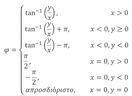
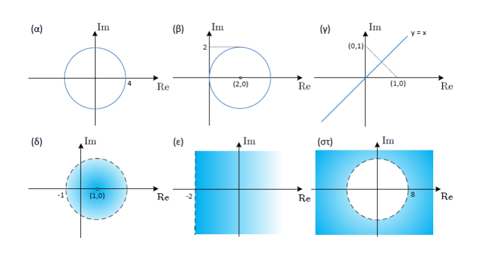

## HY215 - Εφαρμοσμένα Μαθηματικά για Μηχανικούς
### 18-02-2025 | Διάλεξη 2

#### Εισαγωγή στους μιγαδικούς Αριθμούς
Οι πραγματικόι αριθμοί είναι αυτοί που χρησιμοποιούμε συνήθως και με τους οποίους μπορόυμε να λύσουμε πολλές εξισώσεις. Ωστόσο υπάρχουν εξισώσεις όπως $x^2 + 1 = 0$, που δεν έχουν λύση στους πραγματικούς αριθμούς, καθώς το αποτέλεσμα απαιτεί την ύπαρξη της ρίζας του $-1$, κάτι που δεν υπάρχει στο σύνολο $\mathbb{R}$.
Για να καλυφθεί αυτό το κενό, ορίζουμε έναν ευρύτερο χώρο, αυτός των **μιγαδικών αριθμών $\mathbb{C}$**. Σε αυτό το σύνολο, η λύση της εξίσωσης $x^2 + 1 = 0$ είναι $x = \pm j$, όπου $j = \pm \sqrt{-1}$ και ονομάζεται **φανταστική μονάδα**.

#### Μιγαδικό Επίπεδο και Αναπαράσταση Μιγαδικών Αριθμών
Οι μιγαδικοί αριθμοί αναπραριστάνται στο **μιγαδικό επίπεδο**, το οποίο έχει δύο άξονες:
- **Πραγματικός Άξονας ℜ**: Περιλαμβάνει το πραγματικό μέρος των μιγαδικών αριθμών.
- **Φανταστικός Άξονας ℑ**: Περιλαμβάνει το φανταστικό μέρος των μιγαδικών αριθμών.

Κάθε μιγαδικός αριθμός γράφεται στη μορφή $z = x + j y$, όπου το $x$ είναι το πραγματικό μέρος και το $y$ το φανταστικό μέρος του αριθμού.

#### Λύση Δευτεροβάθμιας Εξίσωσης στο Σύνολο $\mathbb{C}$
Μία δευτεροβάθμια εξίσωση της μορφής:
$$ ax^2 + bx + c = 0 $$
έχει διακρίνουσα $\Delta = b^2 - 4ac$, απο την οποία εξαρτώνται οι λύσεις:
- Αν $\Delta = b^2 - 4ac > 0$: η λύση είναι δύο διαφορετικές πραγματικές ρίζες.
- Αν $\Delta = b^2 - 4ac = 0$: η λύση είναι μια διπλή ρίζα.
- Αν $\Delta = b^2 - 4ac > 0$: Δεν υπάρχουν πραγματικές ρίζες (στο $\mathbb{R}$) αλλά υπάρχουν δύο μιγαδικές λύσεις που δίνονται απο τον τύπο:
$$x_{1,2} = \frac{-b \pm j \sqrt{|\Delta|}}{2a}$$

#### Συζυγής και Μέτρο Μιγαδικού Αριθμού
Ο **συζυγής** ενός μιγαδικού αριθμόυ $z = x + jy$ είναι ο αριθμός $z* = x - jy$, δηλαδή έχει το ίδιο πραγματικό μέρος αλλά αντίθετο φανταστικό μέρος.
Το **μέτρο** ενός μιγαδικού αριθμού είναι το μήκος του διανύσματος που τον αναπαριστά στομιγαδικό επίπεδο και υπολογίζεται με τον τύπο:
$$ |z| = \sqrt{x^2 + y^2} $$
Η **φάση** μιγαδικού αριθμού $z = x + jy$ ονομάζεται η γωνία $\phi$ που σχηματίζει με τον οριζόντιο άξονα (των πραγματικών αριθμων) κατά την ορθή πραγματική φορά.

  
  

#### Πολική Μορφή Μιγαδικόυ Αριθμού
Εκτός από την καρτεσιανή μορφή $z = x + jy$, ένας μιγαδικός αριθμός μπορεί να γραφτεί και σε **πολική μορφή** ώς εξής:
$$ z = ρe^{j\phi} $$
όπου:
    - $ρ = |z| = \sqrt{x^2+y^2}$ είναι το μέτρο του μιγαδικόυ αριθμόυ
    - $\phi = tan^{-1}(\frac{y}{x})$ είναι η φάση του μιγαδικόυ αριθμόυ
Η πολική μορφή βασίζεται στη *σχέση του Euler*, η οποία εκφράζει τον εκθετικό όρο ώς:
$$ e^{j\phi} = \cos(\phi) + j \sin(\phi) $$
έτσι μπορούμε να γράψουμε την σχέση:
$$ z = ρ(\cos(\phi) + j\sin(\phi)) $$

#### Δυνάμεις και Ρίζες Μιγαδικών Αριθμών
Η πολική μορφή είναι ιδιαίτερα χρήσιμη για τον υπολογισμό δυνάμεων και ριζών μιγαδικών αριθμών.
Για τον υπολογισμό δυνάμεων, χρησιμοποιούμε τη γενική σχέση:
$$ z^n = ρ^ne^{jn\phi} = ρ^n(\cos(n\phi) + j \sin(n\phi)) $$
Με το παραπάνω μπορούμε έυκολα να υπολογίσουμε λύσεις εξισώσεων της μορφής
$$ z^N - a = 0,~~~ a = |a|e^{j\theta} \in \mathbb{C}, ~~~ Z \in \mathbb{N} $$
Συγκεκριμμένα μπορύμε να το κάνουμε με:
$$ z^N = a \iff |z|^Ne^{jN\phi} = |a|e^{j(\theta+2 \pi k)} \iff \\
|z| = |a|^{\frac{1}{N}} \\
\phi = \frac{\theta + 2 \pi k}{N}, k=0,1,...,N-1
$$
Μπορούμε να βρούμε μέχρι $N$ ρίζες αφού το πολυώνυνο είναι $Ν$ βαθμού

##### Παράδειγμα Υπολογισμού Ριζών
Έστω ότι θέλουμε να βρούμε τις ρίζες της εξίσωσης $z^3-8=0$
Είναι: $z^3=8$
$z^3 = |z|^3e^{j3\phi} ~~~~~~~~~~~(1)$
$8 = 8e^{0j} = 8 e^{j2\pi k}~~~(2)$

$$(1,2) \iff |z|^3e^{j3\phi} = 8 e^{j2\pi k}, k = 0,1,2 \iff \\ 
|z|^3 = 8 \iff |z| = \sqrt[3]{8} \iff |z| = 2 \\
3\phi = 2\pi k \iff \phi = \frac{2\pi k}{3}, k = 0,1,2$$

Άρα: $z_1 = 2e^{j0} = 2,~ z_2 = 2e^{j\frac{2\pi}{3}},~ z_3 = 2e^{j\frac{4\pi}{3}}$

#### Γεωμετρικοί Τόποι
Στο μιγαδικό επίπεδο μπορούμε να ορίσουμε περιοχές που ικανοποιούν συγκεκριμμένες συνθήκες. Αυτές οι περιοχές ονομάζονται **γεωμετρικοί τόποι**. Για παράδειγμα το σύνολο των μιγαδικών αριθμών που έχουν το ίδιο μέτρο σχηματίζει έναν κύκλο ενώ το σύνολο των αριθμών με την ίδια φάση σχηματίζει μία ιμιευθεία που ξεκινάει από την αρχή των αξόνων.

  

