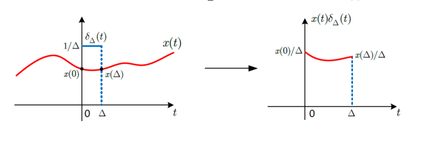
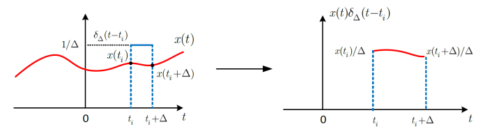
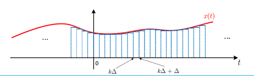

## HY215 - Εφαρμοσμένα Μαθηματικά για Μηχανικούς Κεφάλαιο 2ο

### Σύστημα:
Το περιγράφουμε στο πεδίο του χρόνου απο μια γραμμική διαφορική εξίσωση της μορφής:
$$ 
\sum^N_{k=0} \frac{d^k}{dt^k} a_k y(t) = \sum^M_{k=0} \frac{d^k}{dt^k} b_k x(t) \tag{3.1} 
$$

### Παράδειγμα:
Η διαφορική εξίσωση $f(x) = f'(x)$, έχει λύση τις εξισώσεις της μορφής: $f(x) = ce^x$, αφού όμως $e \in R$ οι λύσεις θα είναι άπειρες. Συνήθως για αυτό μας δίνεται μία βοηθητική συνθήκη όπως $f(0) = 2$ για να βρούμε την μοναδική λυση.

Ας ξαναγράψουμε την διαφορική εξίσωση αυτή όπως παραπάνω: $y'(t) - y(t) = 0$, η γενική λύση θα είναι η $y(t) = xe^t$ που περιγράφει άπειρες λύσεις καθώς $cin R$. Πώς θα βρούμε λοιπόν την μοναδική; Θα χρειαστούμε βοηθητικές συνθήκες της μορφής $y'(0) = k$, όπως:
$$ 
y(0^-) = 4 \to ce^0 = 4 \to c = 4 \to y(t) = 4e^t 
$$

Επιθυμούμε λοιπόν να βρούμε έναν τρόπο για να υπολογίζουμε την έξοδο απο τέτοια συστήματα δεδομένου μίας εισόδου. Έστω ότι εφαρμόζουμε μία είσοδο $x(t)$ την χρονική στιγμή $t=0$, η έξοδος του συστήματος $y(t)$ είναι το αποτέλεσμα δύο ανεξαρτήτων αιτιών:

1. Η κατάσταση του συστήματος για $t=0$, Θεωρώντας την είσοδο $x(t)$ (απόκριση μηδενικής εισόδου $y_{zi}(t)$)
2. Η κατάσταση της εισόδου για $t>0$ (απόκριση μηδενικής κατάστασης $y_{zs}(t)$)

Μπορούμς έτσι να εκφράσουμε την συνολική έξοδο $y(t)$ του συστήματος ως το άθροισμα των παραπάνω δύο αποκρίσεων ως:

$$ 
y(t) = y_{zi}(t) + y_{zs}(t) \tag {3.2}
$$
**
### Συνολική Απόκριση
#### Απόκριση Μηδενικής Εισόδου
Όπως αναφέραμε ήδη η *απόκριση μηδενικής εισόδου* ορίζεται ως η είσοδος του συστήματος για $t=0$ άρα η έξοδος καθορίζεται αποκλειστικά απο τις αρχικές συνθήκες του συστήματος.

Η μηδενική είσοδος θα μετατρέψεις λοιπόν την σχέση $3.1$ σε:

$$ \sum^N_{k=0} \frac{d^k}{dt^k} a_k y_{zi}(t) = 0 \tag{3.3} $$

Μπορείς κανείς να δείξει αναλυτικά οτι η λύση της παραπάνω εξίσωσης είναι της μορφής:

$$ y_{zi}(t) = c e^{λt} $$

Με $λ$, $c$ σταθερές τιμές. Έχοντας αυτό ως δεδομένο, αντικαθιστούμε στη Σχέση $3.3$ και έχουμε:

$$ \sum^N_{k=0} \frac{d^k}{dt^k} a_k ce^{λt} ⇔ ce^{λt} \biggl( \sum^N_{k=0} a_k λ^k \biggl) = 0 $$

Η μη τετριμένη λύση της παραπάνω σχέσης δίνεται για:

$$ \sum^N_{k=0} a_k λ^k = 0 ⇔ λ^N + a_{Ν-1}λ^{N-1} + ... + a_1λ + a_0 = 0 $$

Άρα η $y_{zi}(t) = ce^{λt}$ είναι λύση της διαφορικής εξίσωσης της σχέσης $3.3$ μόνο αν:

$$ λ^N + a_{Ν-1}λ^{N-1} + ... + a_1 λ + a_0 = 0 $$

Η παραπάνω εξίσωση λέγεται **χαρακτηριστική εξίσωση** και έχει το ανάλογο **χαρακτηριστικό πολυώνυμο** του συστήματος:

$$ (λ - λ _1 )(λ - λ_2)...(λ - λ_Ν) = 0 $$ 

Όπου $λ_i$ είναι οι ρίζες η ρίζες του πολυωνύμου και ονομάζονται **χαρακτηριστικές ρίζες**. Άρα υπάρχουν $N$ το πλήθος διαφορετικά $λ$ που ικανοποιούν την $3.3$:

$$ c_1e^{λ_1t},c_2e^{λ_2t},...,c_Ne^{λ_Nt} $$

Με $c_i$ να είναι σταθερές που εξαρτόνται απο τις αρχικές συνθήκες του συστήματος. Άρα τελικά μπορεί να δειχθεί ότι:

$$ y_{zi}(t) = c_1e^{λ_1t} + c_2e^{λ_2t} + ... + c_Ne^{λ_Nt} = \sum^N_{k=1}c_ke^{λ_kt} \tag{3.4} $$

Άλλα αφού είμαστε για $t>0$ η $3.4$ μπορεί να γίνει:

$$ \sum^N_{k=1}c_ke^{λ_kt} u(t) $$

Η παραπάνω σχέση ισχύει αν οι χαρακτηριστικές ρίζες είναι **απλές**, άρα διαφορικές μεταξύ τους, αν υπάρχουν ρίζες πολλαπλότητας $r \ge 2$ τότε το χαρακτηριστικό πολυώνυμο μπορεί να γραφτεί ώς:

$$ (λ - λ _1 )^r(λ - λ_2)...(λ - λ_Ν) = 0 $$

και η απόκριση μηδενικής εισόδου γράφεται ως:

$ε$ y_{zi}(t) = \sum^r_{l=1} c_lt^le^{λ_1t} + \sum^N_{k=r+1}c_ke^{λ_kt} $$

Σε κάθε περίπτωση όμως τα $c_i$ υπολογίζονται απο τις αρχικές συνθήκες

#### Κρουστική απόκριση $h(t)$
Θα θέλαμε να γνωρίζουμε την έξοδο του συστήματος όταν εμφανίζουμε ως είσοδο ένα σήμα "ακαριαίας" μορφής, ένα σήμα που υπάρχει σε απειροστά μικρό χρονικό διάστημα. Η είσοδος αυτή αυτή θα διεγείρει το σύστημα και θα το αναγκάσει να παράξει κάποια έξοδο. Η έξοδο αυτή πρέπει να μοιάζει με την απόκριση μηδενικής εισόδου αφού η ύπαρξει της οφείλεται σε μία είσοδος που υπάρχει μόνο για μια συγκεκριμένη χρονική στιγμή.
Θα μπορούσε κανείς να πει οτι η διέγερση αυτή δημιουργεί νέες αρχικές συνθήκεςστο σύστημα, και η λύση της ομογενούς εξίσωσης για αυτές τις αρχικές συνθήκες θα μας δώσει μια έξοδο, μια απόκριση σε ένα "κρουστικό" σήμα - δε θα ήταν λοιπόν παράλογο να ονομάσουμε αυτή την έξοδο σαν **κρουστική απόκριση**.
Με βάση τα παραπάνω ένα τέτοιο σήμα ακαριάιας εισόδου μπορεί να μοντελοποιηθεί πολύ καλά με την ήδη γνωστή σε εμάς συνάρτηση Δέλτα ($δ(t)$). Αν ορίσουμε λοιπόν την κρουστική απόκριση $h(t)$ ενός σήματος ως την έξοδο του συστήματος όταν στην είσοδο του παρουσιάζεται η συνάρτηση Δελτα, και θεωρώντας μηδενικές τις αρχικές συνθήκες ($t=0^-$). Αν χρησιμοποιήσουμε το συμβολισμό του τελεστή $T[\cdot]$ για το σύστημα θα είναι:

$$ h(t) = T[δ(t)] $$

Ή εναλλακτικά

$$ δ(t) \to h(t) $$

Στο παρακάτω κείμενο υποθέτουμε ότι η διαφορική εξίσωση που περιγράφει ένα σύστημα θα είναι της μορφής:

$$ \sum^N_{k=0} \frac{d^k}{dt^k} a_k y(t) = \sum^M_{k=0} \frac{d^k}{dt^k} b_k x(t) \tag{3.5} $$

Όπου $N > M$

##### Σύστημα εξόδου Ν-οστής τάξης
Για διαφορικές εξισώσεις Ν-οστής τάξης εξόδου της μορφής:

$$ \sum^N_{k=0} \frac{d^k}{dt^k} a_k y(t) =  x(t) $$

Με $N>0$ μπορούμε να μελέτήσουμε την απόκριση του συστήματος σε είσοδο τύπου δέλτα, δηλαδή $x(t) = δ(t)$. Η δέλτα ως ακαριαίο σήμα, λειτουργεί σαν στιγμιαία διέγερση και μπορεί να θεωρηθεί ότι δημιουργεί νέες αρχικές συνθήκες στο σύστημα για $t=0^+$. Μετά το $t=0$, το σύστημα εξελίσεται σαν να έχει μηδενιή είσοδο.
Η έξοδος του συστήματος $h(t)$, γνωστή και σαν **κρουστική απόκρουση**, είναι τότε η λύση της ομογενούς εξίσωσης με αρχικές συνθήκες της μορφής;

$$ h(0^+),h'(0^+),...,h^{(N-1)}(0^+)   $$

Μπορεί κανείς να δείξει ότι οι τιμές των αρχικών αυτών συνθήκων θα είναι:

$$ h(0^+) = 0 \\ h'(0^+) = 0 \\ ... \\ h^{(N-1)}(0^+) = \frac{1}{a_N} $$

Όπου $a_N$ είναι ο συντελεστής της Ν-οστής παραγώγου της εξόδου στη διαφορική εξίσωση

Έτσι η κρουστική απόκρουση $h(t)$ ενός τέτοιου συστήματος δίνεται απο την λύση της ομογενούς διαφορικής εξίσωσης:

$$ \sum^N_{k=0} a_k \frac{d^k}{dt^k} h(t) = 0 \tag{3.6} $$

##### ΓΧΑ συστήματα σε διαφορικές εξισώσεις
Για να είναι γραμμικό ένα σύστημα που περιγράφεται απο διαφορική εξίσωση πρέπει η απόκριση μηδενικής εισόδου να είναι μηδενική, ή με άλλα λόγια: **οι αρχικές συνθήκες του συστήματος να είναι μηδενικές**. Μπορούμε επίσης να δείξουμε ότι θα έιναι και χρονικά αμμετάβλητο.
Έτσι ένα σύστημα που περιράφεται απο διαφορικές εξισώσεις είναι γραμμικό και χρονικά ανεξάρτητο (ΓΧΑ) αν και μόνο αν οι αρχικές του συνθήκες είναι μηδενικές

##### Συστήματα Οποιασδήποτε Τάξης Εισόδου-Εξόδου
Η παραπάνω λύση $(3.6)$ βέβαια είναι πολύ περιορισμένη αφού αφορά μόνο συστήματα όπου $M = 0$ και $b_0 = 1$. Πώς θα μπορόυσαμε να την γενικέυσουμε για συστήματα όπου: $0<M<N$ και $b_k \neq 1$.
Η απάντηση σε αυτό είναι πολύ απλή, αφού το σύστημα που περιγράφεται απο τηνε διαφορική εξλισωση έχει την ιδιότητα της γραμμικότητας.
Οπότε αν η κρουστική απόκρουση στο σύστημα
$$ S : \sum^N_{k=0} \frac{d^k}{dt^k}a_ky(t) = x(t) $$
Έίναι $h(t)$ τότε η κρουστική απόκριση στο σύστημα 
$$ S_0 : \sum^N_{k=0} \frac{d^k}{dt^k}a_ky(t) = b_0x(t) $$
θα είναι $h_0(t) = b_0h(t)$. Επίσης,  κρουστική ααπόκριση του συστήματος 
$$ S_K : \sum^N_{k=0} \frac{d^k}{dt^k}a_ky(t) = \sum^M_{k=0} b_kx_k(t) $$
θα είναι:
$$ h_K(t) = \sum^M_{k=0}b_kh_k(t) $$
με $h_k(t)$ τις κρουστικές αποκρίσεις του συστήματος στις εισόδους $x_k(t)$. Στην περίπτωση που:
$$ x_k(t) = \frac{d^k}{dt^k}x(t) $$
τότε μπορεί να δειχθεί ότι η κρουστική απόκριση του συστήματος
$$ S_g : \sum^N_{k=0} \frac{d^k}{dt^k} a_ky(t) = \sum^M_{k=0} b_k \frac{d^k}{dt^k} x(t) $$
είναι:
$$ h_g(t) = \sum^M_{k=0} b_k \frac{d^k}{dt^k} h(t) $$
με $h(t)$ να είναι η λύση της ομογενούς διαφορικής εξίσωσης 
$$ \sum^N_{k=0} \frac{d^k}{dt^k} a_ky(t) $$

#### Απόκρηση Μηδενικής Κατάστασης
Ας δούμε τώρα πώς μπορούμε να χρησιμοποιήσουμε την κρουστική απόκριση για να βρούμε την έξοδο μηδενικής κατάστασης. Αφού γνωρίζουμε την απόκριση του συστήματος για είσοδο μια συνάρτηση δελτά θα ήταν πολύ χρήσιμο αν μπορούσαμε να γράψουμε κάθε είσοδο ως άθροισμα συναρτήσεων δέλτα:
##### Αναπαράσταση Σημάτων με Συναρτήσεις Δελτα
Ας ξεκινήσουμε με μία αναπαράσταση της συνάρτησης Δελτα:

$$ δ_Δ(t) = \begin{cases} \frac{1}{Δ} & 0 \le t \le Δ \\ 0 & αλλού  \end{cases} $$

  

Θεωρόντας τώρα το Δ ως πολύ μιρκό, τέτοιο ώστε το τμήμα του σήματος που αποκόπτεται να θεωρείτε σχεδόν σταθερό, μπορούμε να γράψουμε ότι:

$$ Δχ(t)δ_Δ(t) \approx Δx(0)δ_Δ(t) $$

Ας συνχίσουμε με το γινόμενο $x(t)δ_Δ(t-t_i)$

  

Όμοια 

$$ Δx(t)δ_Δ(t-t_i) \approx Δx(t_i)δ_Δ(t-t_i) $$

Και συνεχίζοντας για όλο το σχήμα:

  

$$ \hat{x}_Δ(t) = \sum^{+\infty}_{k=-\infty} Δx(kΔ)δ_Δ(t-kΔ) $$

με $\hat{x}_Δ(t)$ μια προσέγγιση του αρχικού σήματος $x(t)$ η οποία εξαρτάται από την τιμή του $Δ$

Για $Δ \to 0$:

$$ \lim_{Δ \to 0} \hat{x}_Δ(t) = \lim_{Δ \to 0} \sum^{+\infty}_{k = -\infty} Δx(kΔ) δ_Δ(t - kΔ) = x(t) $$

Το παραπάνω όριο αποτελεί το **άθροισμα Riemann** και μπορεί να γραφεί ως 

$$ x(t) = \int^{+\infty}_{-\infty} x(τ)δ(t-τ)dτ $$

Πετύχαμε να γράψουμε ένα οποιοδήποτε σήμα ως άθροισμα μετατοπισμένων κατα $τ$ συναρτήσεων Δέλτα με κάθεμιά να έχει εμαβδόν $x(τ)$

##### Συνέλιξη
Το ολοκλήρωμα 

$$ x(t) = \int^{+\infty}_{-\infty} x(τ)δ(t-τ)dτ $$

είναι πολύ σημαντικό και η πράξη που εκτελεί ονομάζεται **συνέλιξη** μεταξύ του $x(t)$ και του $δ(t)$.
Συγκεκριμμένα περιγράφει ένα σημα συνεχούς χρόνου ως άπειρο, συνεχές άθροισμα μετατοπισμένων συναρτήσεων Δελτα $δ(t-τ)$ με βάρη $x(τ)$. 
Συμβολίζεται με $*$, δηλαδή:

$$ x(t) * δ(t) = \int^{+\infty}_{-\infty} x(τ)δ(t-τ)dτ $$

Ορίζεται γενικότερα μεταξύ δύο οποιονδήποτε σημάτων $x(t)$ και $y(t)$

Δείτε την παρακάτω ακολουθία:
1. κρουστική απόκριση: $$ δ(t) \to h(t) $$
2. χρονική αμεταβλητότητα: $$ δ(t-τ) \to h(t-τ) $$
3. ομογένεια: $$ χ(τ)δ(t-τ) \to x(τ)h(t-τ) $$
4. αθροιστικότητα: $$ \int^{+\infty}_{-\infty} x(τ)δ(t-τ)dτ \to \int^{+\infty}_{-\infty} x(τ)h(t-τ)dτ $$
5. απόκριση μηδενικής κατάστασης: $$ χ(t) = \int^{+\infty}_{-\infty} x(τ)δ(t-τ)dτ \to y_{zs}(t) = \int^{+\infty}_{-\infty} x(τ)δ(t-τ)dτ = χ(t) * h(t) $$

