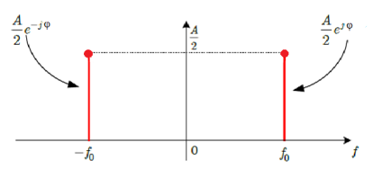
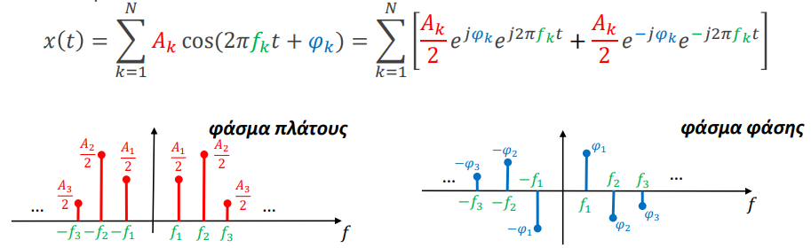
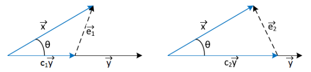
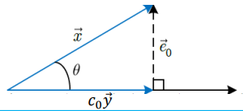

## HY215 - Εφαρμοσμένα Μαθηματικά για Μηχανικούς
### Κεφάλαιο 4 - Σειρές Fourier

#### Ο χώρος της συχνότητας
Έχουμε ήδη μια αρκετά καλή εικόνα για το πώς λειτουργούν τα συστήματα στο περδίο του χρόνου, παρ' όλα αυτά δεν μας επαρκούν οι τωρινές μας γώνσεις. Δεν ξέρουμε **γιατί** τα συστήματα συμπεριφέρονται έτσι
- πώς δηλαδή μία είσοδο επηρεάζεται απο το σύστημα 
- πώς να φτιάξουμε συστήματα που συμπεριφέρονται όπως θέλουμε εμείς

Για να το κάνουμε αυτό θα αρχίσουμε μελετόντας *περιοδικά* σήματα, δηλαδή σήματα άπειρα σε διάρκεια που επεναλαμβάνουν ένα τμήμα τους, την βασική τους περίοδο ανα τακτά χρονικά διαστήματα.
Με τον τρόπο αυτό μπορούμε να δούμε ένα περιοδικό σήμα σε έναν διαφορετικό χώρο, τον **χώρο των συχνοτήτων**. Θα ξεφύγουμε λοιπόν απο τις αναπαραστάσεις πλάτους-χρόνου που είχαμε δει μέχρι τώρα και θα περάσουμε σε αναπαραστάσεις **πλάτους-συχνότητας**

Ας ξεκινήσουμε θέτοντας το ερώτημα: *Γιατί ο χώρος των συχνοτήτων είναι τόσο σημαντικός;*
Παρατηρήστε ότι αν η είσοδος σε ένα ΓΧΑ σύστημα με κρουστική απόκριση $h(t)$ είναι της μορφής:
$$ x(t) = Ae^{j(2πf_0t+φ_0)}, ~ Α > 0, ~ φ_0 \in (-π,π] $$
τότε το ολοκλήρωμα της συνέλιξης θα είναι:

$$ \begin{align*}
    y(t) = x(t) * h(t) &= \int^{+\infty}_{-\infty} h(t) x(t-τ)dτ = A \int^{+\infty}_{-\infty} h(τ)e^{j2πf_0t}e^{-j2πf_0t}e^{jφ_0}dτ \\
    &= Αe^{j2πf_0t}e^{jφ_0} \int^{+\infty}_{-\infty} h(t) e^{-j2πf_0t} dτ = AH(f_0)e^{j(2πf_0t + φ_0)} \\
    &= H(f_0)x(t)
\end{align*} $$

με 
$$ H(f_0) = \int^{+\infty}_{-\infty} h(t) e^{-j2πf_0t} hτ $$
ένα **σταθερό μιγαδικό αριθμό που εξαρτάται απο το $f_0$**, δηλαδή απο τη συχνότητα εισόδου

Το αποτέλεσμα αυτό είναι πολύ σημαντικό, μας λέει ότι ένα μιγαδικό σήματ της μορφής $x(t) = Ae^{j(2πf_0t + φ)}$ περνάει όπως έιναι στην έξοδο του συστήματος και απλά πολλαπλασιάζεται με μία μιγαδική σταθερά $H(f_0)$! Η οποία μπορεί να λλάξει το πλάτος και την φάση της εισόδου
Για παράδειγμα αν $H(f_0) = 1 + j$ τότε 
$$ y(t) = (1+j)Ae^{j(2πf_0t + φ)} = \sqrt{2}e^{j\frac{π}{4}}Ae^{j(2πf_0t+φ)} = \sqrt{2}Ae^{j(2πf_0t + φ + \frac{π}{4})} $$
όπου $\sqrt{2}A$ είναι το νέο πλάτος και $φ + \frac{π}{4}$ είναι η νέα φάση
Αυτά τα σήματα ξέρουμε και έχουμε δεί ήδη πώς σχετίζονται στενά με ημιτονοειδή σήματα μέσο της σχέσης του *Euler*:
- $ \cos(θ) = \frac{1}{2} e^{jθ} + \frac{1}{2} e^{-jθ} $
- $ \sin(θ) = \frac{1}{2j} e^{jθ} - \frac{1}{2j} e^{-jθ} $

Ένα σοβάρό ερώτημα που μπορεί να τεθεί τώρα είναι: *Τί θα κάνουμε όταν το σήμα δεν είναι ημιτονοειδές;*. 
Η γρήγορη απάντηση σε αυτό είναι μετατρέποντας το σήμα σε άθροισμα ημιτονοειδών συναρτήσεων με την χρήση των σχέσεων Euler, πιο εις βάθους όμως θα το δούμε αργότερα, προς το παρών θα ασχοληθούμε μόνο με περιοδικά σήματα.
Ένα σήμα λέγεται **περιοδικό** αν ικανοποιεί τη σχέση:
$$ x(t) = x(t \pm T_0) $$
Η μικρότερη διάρκεια $T_0$ που ικανοποιεί την παραπάνω σχέση ονομάζεται **περίοδος** του περιοδικού σήματος, προσοχή να μήν μπερδέυεται την **διάρκεια** $T$ ενός απεριόδικου σήματος με την **περίοδο* $T_0$ ενός περιοδικού σήματος.
Η περίοδος σχετίζεται με τη θεμελιώδη συχνότητα του $f_0$, με τη σχέση:
$$ f_0 = \frac{1}{T_0} $$

Ας δούμε ένα παράδειγμα με το σήμα:
$$ x(t) = A \cos(2πf_0t + φ), ~ A > 0, ~ φ \in (-π,π] $$
Το οποίο μπορούμε να γράψουμε με σχέσεις *Euler* ώς εξής:
$$ x(t) = A \cos(2πf_0t + φ) = \frac{A}{2}e^{jφ}e^{j2πf_0t} + \frac{A}{2}e^{-jφ}e^{-j2πf_0t} $$
Όπότε η αναπαράσταση του στον χώρο της συχνότητας θα είναι ώς εξής:

  

Ένας άλλος τρόπος να αναπραστήσουμε την παραπάνω σχέση είναι με την χρήση μίας αναπαράστασης που ονομάζεται **φάσμα (spectrum)**:
$$ x(t) = X_1e^{j2π(1f_0)t} + X_{-1}e^{j2π(-1f_0)t} $$
με τους συντελεστές $X_1 = \frac{A}{2}e^{jφ}, Χ_{-1} = Χ_1^* = \frac{A}{2}e^{-jφ}, ~ A>0$ να ονομάζονται **phasors** οι οποία είναι συζυγείς μιγαδικοί αριθμοί για πραγματικά σήματα. Είναι προτιμότερο το μέτρο του φασόρα να σχεδιάζεται σε μια γραφική παράσταση ενώ η φάση του σε μία άλλη.
- Στο **φάσμα πλάτους** σχεδιάζουμε το μέτρο του φασόρα
- Στο **φάσμα φάσης** σχεδιάζουμε την φάση του φασόρα

Γενικά το φάσμα πλάτους και το φάσμα φάσης το σχεδιάζουμε ώς εξής:

  

Το να εντοπίσει κανένας τις συχνότητες των επιμέρους ημιτονοειδών είναι έυκολο, ποιά όμως θα είναι η θεμελιώδης συχνότητας $f_0$ όλου του περιδοδικού σήματος; Μπορούμε να δείξουμε ότι άν
$$ x(t) = \sum^N_{k=1}A_k\cos(2πf_kt + φ_k) = \sum^N_{k=1}A_k\cos(2π\frac{1}{T_k}t + φ_k) $$
τότε αυτό είναι περιδοδικό με περίοδο $T_0$, δηλαδή ικανοποιεί την $x(t) = x(t+T_0)$, αν 
$$ f_kT_0 = \frac{T_0}{T_k} \in \mathbb{Z}, ~ \forall ~ k \in \mathbb{Z} $$
Αυτό σημαίνει ότι η περίοδος θα πρέπει να είναι ένα κοινό πολλαπλάσια των επιμέρους περίοδων, το ελάχιστο κοινό πολλαπλάσιο των επιμέρους περιόδων αποτελεί την περίοδο του συνολικού σύματος:
$$ T_0 = ΕΚΠ(T_1,T_2,...,T_n) \\ f_0 = ΜΚΔ(f_1,f_2,...,f_n) $$

Κάθε πραγματικό σήμα που αναλύεται φασματικά έχει τις ακόλουθες συμμετρίες:
1. Άρτια συμμετρία στο φάσμα πράτους του
2. Περιττή συμμετρία στο φάσμα φάσης του

Οι συμμετρίες αυτές προκύπτουν απο την συζυγία των φασόρων.
Επίσης παρατηρήστε ότι οι συχνότητες των ημιτόνων του απο το παράδειγμα που λύσαμε (*βλέπε διαφάνεις 9-10 από διάλεξη 7 2024-25*) ήταν ακέραιες πολλαπλάσιες της θεμειώδους συχνότητας, $f_0 = ΜΚΔ(10,15) = 5 Hz$. Έτσι οι φασόρες μπορούν να γραφτούν ώς $X_k$ με $k$ το αντίστοιχο ακέραιο πολλαπλάσιο της θεμελιώδους συχνότητας. Στο προηγούμενο παράδειγμα οι φασόρες μπορούσαν να γραφτούν και σαν:
$$ X_2,~ X_{-2} = X_2^*,~ X_3,~ X_{-3} = X_3^* $$
και οι $X_1,X_{-1} = X_1^*$ ήταν μηδενικοί, αφού δεν υπήρχε φασματικό περιεχόμενο στη συχνότητα $f = 5Hz$, παρόλο που αυτή είναι η θεμελιώδης συχνότητα του σήματος!
Η ανάλυση περιοδικών σημάτων που γράφονται ώς άθροισμα ημιτόνων είναι σχετικά απλή καθώς ακολουθούμε των προηγούμενη διαδικασία, όσα ημιτονοειδή και αν υπάρχουν, ό,τι πρόσημα κι αν έχουν.

Άς επιστρέψουμε τώρα στο ερώτηα που θέσαμε προηγουμένος:
*Μπορούμε να γράψουμε ένα (σχεδόν) οποιοδήποτε περιοδικό και πραγματικό σήμα ώς άθροισμα συζυγών εκθετικών μιγαδικών συναρτήσεων;*
Άν μπορούμε τότε τα προηγούμενα μπορούν να γενικευτούν για κάθε περίοδικό σήμα.

Ας κάνουμε μία εναλλακτική διατύπωση του ερωτήματος:
*Μπορούμε να προσεγγίσουμε όσο καλά θέλουμε ένα (σχεδόν) οποιοδήποτε περιοδικό και πραγματικό σήμα από ένα άθροισμα ημιτόνων (και μέσω της σχέσης του Euler, συζυγών μιγαδικών εκθετικών συναρτήσεων);*

##### Προσεγγίσεις σημάτων απο σήματα
Για να απαντήσουμε στο προηγούμενο ερώτημα θα ήταν ωραίο να εμπνευστούμε απο μερικές ιδιότητες των διανυσμάτων, 
Έστω διανύσματα $\vec{x}$, $\vec{y}$ όπως στο σχήμα που ακολουθεί
Τα διανύσματα $c_i\vec{y}$ αποτελούν προσεγγίσεις του διανύσματος $\vec{x}$ απο το διάνυσμα $\vec{y}$

  

και $\vec{e_i}$ τα διανύσματα σφάλματος, με την έννοια ότι το $\vec{e_i} = \vec{x} - c_i\vec{y}$ είναι το διάνυσμα που πρέπει να προσθέσουμε στο $c_i\vec{y}$ για να πάρουμε το διάνυσμα $\vec{x}$ δηλαδή:
$$ \vec{x} = c_i\vec{y} + \vec{e_i} $$
Γνωρίζουμε επίσως ότι το μικρότερο διάνυσμα σφάλματος είναι αυτό που είναι **κάθετο** στο διάνυσμα $\vec y$

  

Πώς όμως μπορόυμε να υπολογίσουμε την καλύτερη σταθερά $c_o$ ώστε το διάνυσμα σφάλματος να είναι κάθετο στο αρχικό διάνυσμα $\vec x$; 
Στο ορθογώνιο τρίγωνο έχουμε:
$$ \cos θ = \frac{c_0 |\vec y|}{|\vec x|} \Rightarrow c_0 = \frac{1}{|\vec y|^2}|\vec x||\vec y| \cos θ = \frac{1}{|\vec y|^2}\vec x \cdot \vec y $$
όπου $\vec x \cdot \vec y$ το εσωτερικό γινόμενο των δύο διανυσμάτων

Την ίδια τακτική μπορούμε να εφαρμόσουμε και σε σήματα:
Έστω ένα σήμα $x(t)$ που θέλουμε να προσεγγίσουμε με ένα σήματ $y(t)$, σε ένα διάστημα $t_1 < t < t_2$. Με όμοι σκεπτικό με πρίν, πίο είναι το **βέλτιστο c** για το οποίο $x(t) ≈ c ~ y(t)$
Άν κάνουμε το ίδιο με πρίν: $x(t) = c ~ y(t) + e(t)$, ορίζουμε την συνάρτηση σφάλματος ώς:
$$ e(t) = x(t) - c~y(t) $$
Θα θέλαμε η συνάρτηση σφάλματος να είναι όσο πιο μικρή γίνεται, ένας βολικός τρόπος είναι να υπολογίσουμε πού η συνάρτηση αυτή έχει την **ελάχιστη ενέργεια**
$$ E_e(c) = \int^{t_2}_{t_1} e^2(t) dt = \int^{t_2}_{t_1} \bigl(x(t) - xy(t)\bigl)^2 dt $$
Αρκεί λοιπόν να βρούμε μια σταθερά $c$ για την οποία η τιμή της $E_e$ είναι ελάχιστη στο διάστημα $[t_1,t_2]$, δεδομένων των $x(t)$,$y(t)$. Θέτοντας την παράγωγο της $E_e$ ίση με $0$ έχουμε:
$$ \begin{align*}
  \frac{dE_e}{dc} &= 0 \\
  \frac{d}{dc} \biggl( \int^{t_2}_{t_1} \bigl( x(t) - cy(t) \bigl)^2dt \biggl) &= 0 \\
  \frac{d}{dc} \int^{t_2}_{t_1} x^2(t) dt - \frac{d}{dc} \int^{t_2}_{t_1} 2cx(t)y(t)dt + \frac{d}{dc}c^2 \int^{t_2}_{t_1} y^2(t) &= 0 \\
  0 - 2c\frac{d}{dc} \int^{t_2}_{t_1} x(t)y(t)dt + \frac{d}{dc}c^2 \underbrace{\int^{t_2}_{t_1} y^2(t)}_{E_y} &= 0 \\
  2cE_y &= 2 \int^{t_2}_{t_1} x(t)y(t)dt \\
  c &= \frac{1}{E_y} \int^{t_2}_{t_1} x(t)y(t)dt
\end{align*} $$

