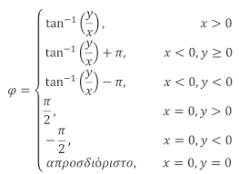
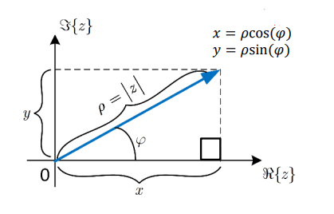
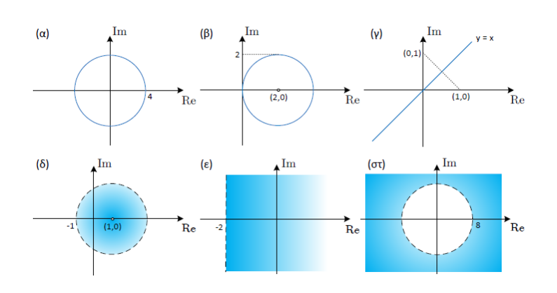
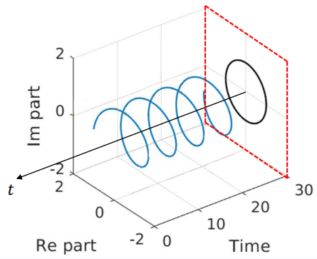

# HY215 - Εφαρμοσμένα Μαθηματικά για Μηχανικούς
## Κεφάλαιο 1 - Μιγαδικοί Αριθμοί

## Εισαγωγή στους μιγαδικούς Αριθμούς
Οι πραγματικόι αριθμοί είναι αυτοί που χρησιμοποιούμε συνήθως και με τους οποίους μπορόυμε να λύσουμε πολλές εξισώσεις. Ωστόσο υπάρχουν εξισώσεις όπως $x^2 + 1 = 0$, που δεν έχουν λύση στους πραγματικούς αριθμούς, καθώς το αποτέλεσμα απαιτεί την ύπαρξη της ρίζας του $-1$, κάτι που δεν υπάρχει στο σύνολο $\mathbb{R}$.
Για να καλυφθεί αυτό το κενό, ορίζουμε έναν ευρύτερο χώρο, αυτός των **μιγαδικών αριθμών $\mathbb{C}$**. Σε αυτό το σύνολο, η λύση της εξίσωσης $x^2 + 1 = 0$ είναι $x = \pm j$, όπου $j = \pm \sqrt{-1}$ και ονομάζεται **φανταστική μονάδα**.

## Μιγαδικό Επίπεδο και Αναπαράσταση Μιγαδικών Αριθμών
Οι μιγαδικοί αριθμοί αναπραριστάνται στο **μιγαδικό επίπεδο**, το οποίο έχει δύο άξονες:
- **Πραγματικός Άξονας ℜ**: Περιλαμβάνει το πραγματικό μέρος των μιγαδικών αριθμών.
- **Φανταστικός Άξονας ℑ**: Περιλαμβάνει το φανταστικό μέρος των μιγαδικών αριθμών.

Κάθε μιγαδικός αριθμός γράφεται στη μορφή $z = x + j y$, όπου το $x$ είναι το πραγματικό μέρος και το $y$ το φανταστικό μέρος του αριθμού.

## Λύση Δευτεροβάθμιας Εξίσωσης στο Σύνολο $\mathbb{C}$
Μία δευτεροβάθμια εξίσωση της μορφής:
$$ ax^2 + bx + c = 0 $$
έχει διακρίνουσα $\Delta = b^2 - 4ac$, απο την οποία εξαρτώνται οι λύσεις:
- Αν $\Delta = b^2 - 4ac > 0$: η λύση είναι δύο διαφορετικές πραγματικές ρίζες.
- Αν $\Delta = b^2 - 4ac = 0$: η λύση είναι μια διπλή ρίζα.
- Αν $\Delta = b^2 - 4ac > 0$: Δεν υπάρχουν πραγματικές ρίζες (στο $\mathbb{R}$) αλλά υπάρχουν δύο μιγαδικές λύσεις που δίνονται απο τον τύπο:
$$x_{1,2} = \frac{-b \pm j \sqrt{|\Delta|}}{2a}$$

## Συζυγής/Μέτρο και Φάση Μιγαδικών Αριθμών
- Ο **συζυγής** ενός μιγαδικού αριθμόυ $z = x + jy$ είναι ο αριθμός $z* = x - jy$, δηλαδή έχει το ίδιο πραγματικό μέρος αλλά αντίθετο φανταστικό μέρος.
- Το **μέτρο** ενός μιγαδικού αριθμού είναι το μήκος του διανύσματος που τον αναπαριστά στομιγαδικό επίπεδο και υπολογίζεται με τον τύπο:
$$ |z| = \sqrt{x^2 + y^2} $$
- Η **φάση** μιγαδικού αριθμού $z = x + jy$ ονομάζεται η γωνία $π$ που σχηματίζει με τον οριζόντιο άξονα (των πραγματικών αριθμων) κατά την ορθή πραγματική φορά.

  
  

## Ιδιότητες Μιγαδικών Αριθμών:
Έχουμε: $z_1 = x_1 + \mathbf{i}y_1$ και $z_2 = x_2 + \mathbf{i}y_2$
- Πρόσθεση: $az_1 + bz_2 = (ax_1 + bx_2) + \mathbf{i}(ay_1 + by_2)$
- Αφαίρεση: $az_1 - bz_2 = (ax_1 - bx_2) + \mathbf{i}(ay_1 - by_2)$
- Πολλαπλασιασμός: $z_1z_2 = (x_1x_2 - y_1y_1) + \mathbf{i}(y_1x_2 - x_1y_2)$
- Διαίρεση:  $ \frac{z_1}{z_2} = \frac{z_1z_2^* }{z_2z_2^* } = (\frac{x_1x_2 + y_1y_1}{x_2^2 + y_2^2}) + \mathbf{i}(
\frac{x_1x_2 - y_1y_1}{x_2^2 + y_2^2}) $

**Για Συζυγούς**:
- Πρόσθεση Συζυγών: $z_1 + z_1^* = 2 ℜ\{z_1\} $
- Αφαίρεση Συζυγών: $z_1 - z_1^* = 2 \mathbf{i}ℑ\{z_1\}$
- Πολλαπλασιασμός Ζυζυγών: $z_1z_1^* = x_1^2+y_1^2$
- Πηλίκο συζυγών: $\frac{z_1}{z_1^*} = \frac{x_1^2 - y_1^2}{x_1^2 + y_1^2} + 
\mathbf{i} \frac{2x_1y_1}{x_1^2+y_1^2}$
- Ιδιότητες Συζυγίας:
    - $(z_1 + z_2)^* = z_1^* + z_2^*$
    - $(z_1 - z_2)^* = z_1^* - z_2^*$
    - $(z_1z_2)^* = z_1^* z_2^*$
    - $(\frac{z_1}{z_2})^* = \frac{z_1^*}{z_2^*}$
- Αμοιβαίοτητα: $\frac{1}{z_1} = \frac{z_1^*}{z_1z_1^*} = 
\frac{x}{x_1^2+y_1^2} - \mathbf{i} \frac{y}{x_1^2 + y_1^2}$
- Ισότητα: $z_1 == z_2$ ανν $ℜ\{z_1\} = ℜ\{z_2\}$ και $ℑ \{z_1\} = ℑ \{z_2\}$
- $z \in ℜ$: $z=z*$
- $z \in ℑ$: $z=-z^*$

## Πολική Μορφή Μιγαδικόυ Αριθμού
Εκτός από την καρτεσιανή μορφή $z = x + jy$, ένας μιγαδικός αριθμός μπορεί να γραφτεί και σε **πολική μορφή** ώς εξής:
$$ z = ρe^{jπ} $$
όπου:
    - $ρ = |z| = \sqrt{x^2+y^2}$ είναι το μέτρο του μιγαδικόυ αριθμόυ
    - $π = tan^{-1}(\frac{y}{x})$ είναι η φάση του μιγαδικόυ αριθμόυ
Η πολική μορφή βασίζεται στη *σχέση του Euler*, η οποία εκφράζει τον εκθετικό όρο ώς:
$$ e^{jπ} = \cos(π) + j \sin(π) $$
έτσι μπορούμε να γράψουμε την σχέση:
$$ z = ρ(\cos(π) + j\sin(π)) $$

## Δυνάμεις και Ρίζες Μιγαδικών Αριθμών
Η πολική μορφή είναι ιδιαίτερα χρήσιμη για τον υπολογισμό δυνάμεων και ριζών μιγαδικών αριθμών.
Για τον υπολογισμό δυνάμεων, χρησιμοποιούμε τη γενική σχέση:
$$ z^n = ρ^ne^{jnπ} = ρ^n(\cos(nπ) + j \sin(nπ)) $$
Με το παραπάνω μπορούμε έυκολα να υπολογίσουμε λύσεις εξισώσεων της μορφής
$$ z^N - a = 0,~~~ a = |a|e^{j\theta} \in \mathbb{C}, ~~~ Z \in \mathbb{N} $$
Συγκεκριμμένα μπορύμε να το κάνουμε με:
$$ z^N = a \iff |z|^Ne^{jNπ} = |a|e^{j(\theta+2 π k)} \iff \\
|z| = |a|^{\frac{1}{N}} \\
π = \frac{\theta + 2 π k}{N}, k=0,1,...,N-1
$$
Μπορούμε να βρούμε μέχρι $N$ ρίζες αφού το πολυώνυνο είναι $Ν$ βαθμού

### Παράδειγμα Υπολογισμού Ριζών
Έστω ότι θέλουμε να βρούμε τις ρίζες της εξίσωσης $z^3-8=0$
Είναι: $z^3=8$
$z^3 = |z|^3e^{j3π} ~~~~~~~~~~~(1)$
$8 = 8e^{0j} = 8 e^{j2π k}~~~(2)$

$$(1,2) \iff |z|^3e^{j3π} = 8 e^{j2π k}, k = 0,1,2 \iff \\ 
|z|^3 = 8 \iff |z| = \sqrt[3]{8} \iff |z| = 2 \\
3π = 2π k \iff π = \frac{2π k}{3}, k = 0,1,2$$

Άρα: $z_1 = 2e^{j0} = 2,~ z_2 = 2e^{j\frac{2π}{3}},~ z_3 = 2e^{j\frac{4π}{3}}$

## Γεωμετρικοί Τόποι
Στο μιγαδικό επίπεδο μπορούμε να ορίσουμε περιοχές που ικανοποιούν συγκεκριμμένες συνθήκες. Αυτές οι περιοχές ονομάζονται **γεωμετρικοί τόποι**. Για παράδειγμα το σύνολο των μιγαδικών αριθμών που έχουν το ίδιο μέτρο σχηματίζει έναν κύκλο ενώ το σύνολο των αριθμών με την ίδια φάση σχηματίζει μία ιμιευθεία που ξεκινάει από την αρχή των αξόνων.

  

## Μιγαδικές Συναρτήσεις
Η συνάρτηση 
$$x(t) = e^{j2π f_0 t}$$
είναι μια συνάρτηση του χρόνου που όμως παίρνει τιμές στο μιγαδικό επίπεδο. Για τη σχεδίασή της χρειαζόμαστε έναν άξονα χρόνου και έναν χώρο μιγαδικών αριθμών στον οποίο το κάθε στιγμιότυπο του σήματος $x(t_0)$ είναι ένα μιγαδικό διάνυσμα. Παραδείγματα όπως 
$$x(0) = 1, ~~ x(1.2) = -\frac{1}{2} + \frac{3}{2}j$$
δείχνουν ότι το σήμα παίρνει τιμές που κινούνται κυκλικά γύρω από το μηδέν. Το διάνυσμα της στιγμής $t_0$ έχει σταθερό μέτρο και μεταβαλλόμενη φάση. Ο τύπος 
$$ e^{jθ(t)} = \cosθ(t) + j\sinθ(t) $$ 
με 
$$ θ(t) = 2π f_0 t $$
δείχνει ότι το μέτρο είναι 1, δηλαδή η τροχιά του σήματος είναι κυκλική στο μιγαδικό επίπεδο. Έτσι, το $x(t)$ περιγράφει μια σπειροειδή πορεία στον χώρο $(t, \mathbb{C})$.

  

Η γωνιακή συχνότητα της περιστροφής είναι $ω_0 = 2π f_0$, δηλαδή το διάνυσμα περιστρέφεται στο μιγαδικό επίπεδο με συχνότητα $f_0$. Η μορφή του σήματος είναι 
$$ x(t) = \cos(2π f_0 t) + j \sin(2π f_0 t) $$
Η προβολή του σήματος πάνω στον άξονα των πραγματικών είναι καθαρό συνημίτονο, ενώ στον φανταστικό είναι καθαρό ημίτονο. Αυτά προκύπτουν απευθείας από τη σχέση του Euler, και μάλιστα δίνουν τις γνωστές σχέσεις:

$$ \cos (2πf_0t) = \frac{1}{2}(e^{j2πf_0t} + e^{-j2πf_0t}),~ \sin (2πf_0t) = \frac{1}{2j}(e^{j2πf_0t} - e^{-j2πf_0t}) $$

Από τις παραπάνω σχέσεις φαίνεται ξεκάθαρα ότι η πρόσθεση συζυγών μιγαδικών εκθετικών οδηγεί σε πραγματικές συναρτήσεις. Αυτή η παρατήρηση είναι θεμελιώδης στη θεωρία σημάτων και στην ανάλυση Fourier.

Αν προσθέσουμε και μια φάση $φ$ στο αρχικό σήμα, τότε γράφουμε 
$$ x(t) = e^{j(2π f_0 t + φ)} = \cos(2π f_0 t + φ) + j \sin(2π f_0 t + φ) $$
Η προσθήκη φάσης απλώς περιστρέφει το διάνυσμα εκκίνησης του σήματος κατά $φ$ rad.

### Ημιτονοειδής Συναρτήσεις
Οι ημιτονοειδείς συναρτήσεις παίζουν θεμελιώδη ρόλο στην επεξεργασία σήματος. Η γενική τους μορφή είναι 
$$ x(t) = A \cos(2π f_0 t + φ) $$
όπου $A$ είναι το πλάτος, $f_0$ η συχνότητα σε Hz, και $φ$ η φάση μετατόπισης. 
Το σήμα αυτό είναι περιοδικό με περίοδο $T_0 = 1/f_0$. Η περίοδος είναι το ελάχιστο χρονικό διάστημα στο οποίο η συνάρτηση επαναλαμβάνεται. Η συχνότητα και η περίοδος είναι αντίστροφες ποσότητες: 
$$ T_0 = \frac{1}{f_0}, ~ f_0 = \frac{1}{T_0} $$

Η φάση μετατόπισης $φ$ ερμηνεύεται ως χρονική μετατόπιση του ημιτονοειδούς. Αν $x_0(t) = A \cos(2π f_0 t)$ είναι το βασικό ημίτονο, τότε η μετατόπισή του κατά $t_0$ χρονικές μονάδες προς τα δεξιά είναι 
$$ x(t) = x_0(t - t_0) = A \cos(2π f_0 t - 2π f_0 t_0) = A \cos(2π f_0 t + φ) $$
με 
$$ φ = -2 π f_0 t_0 $$

## Άθροισμα Ημιτόνων

Όταν έχουμε άθροισμα ημιτονικών συναρτήσεων, είναι χρήσιμο να το ξαναγράψουμε σε μορφή ενός και μόνο ημιτόνου με νέο πλάτος και νέα φάση. Αν 
$$x(t) = A \cos(2π f_0 t) + B \sin(2π f_0 t) $$
τότε, μέσω των σχέσεων του Euler και των βασικών ιδιοτήτων του μιγαδικού εκθετικού, μπορούμε να γράψουμε:

$$ x(t) = \Re \{A e^{j2πf_0t} + B e^{j(2πf_0t - \frac{π}{2})} \} = \Re \{(A-jB) e^{j2πf_0t}\} $$

Ο μιγαδικός αριθμός $A - jB$ γράφεται σε πολική μορφή ως 
$$ |A - jB| e^{jφ} $$
με 
$$ φ = \tan^{-1}(-B/A) $$
Τότε έχουμε:
$$ x(t) = |A-jB| \cos(2πf_0) $$

Άρα το άθροισμα ημιτόνων είναι ένα νέο ημίτονο της ίδιας συχνότητας και κατάλληλου πλάτους και φάσης. Ο μιγαδικός αριθμός $A - jB$ λέγεται φάσορας. Κάθε σταθερός μιγαδικός αριθμός $z = |z| e^{j\theta}$ που πολλαπλασιάζει $e^{j2\pi f_0 t}$ λέγεται επίσης φάσορας. Το σύνολο $z e^{j2\pi f_0 t}$ αναπαριστά πλήρως ένα ημιτονοειδές σήμα.

### Περιοδικότητα Αθροίσματος Ημιτόνων
Ένα απλό ημίτονο $x(t) = \cos(2\pi f_0 t)$ είναι περιοδικό με περίοδο $T_0 = \frac{1}{f_0}$. Αν όμως έχουμε άθροισμα δύο ημιτόνων διαφορετικής συχνότητας, π.χ. 
$$ x(t) = \cos(2\pi f_1 t + \phi_1) + \cos(2\pi f_2 t + \phi_2) $$ 
με $f_1 \neq f_2$, τότε το σήμα είναι περιοδικό μόνο αν ο λόγος $\frac{f_1}{f_2}$ είναι ρητός. Αν είναι ρητός, τότε υπάρχουν ακέραιοι $k, l$ τέτοιοι ώστε 
$$ f_1 T_0 = k,~ f_2 T_0 = l $$ 
και το $T_0$ είναι η κοινή περίοδος. Αντίθετα, αν ο λόγος $\frac{f_1}{f_2}$ είναι άρρητος, τότε δεν υπάρχει κοινό $T_0$ που να ικανοποιεί και τις δύο εξισώσεις, και το άθροισμα δεν είναι περιοδικό.

