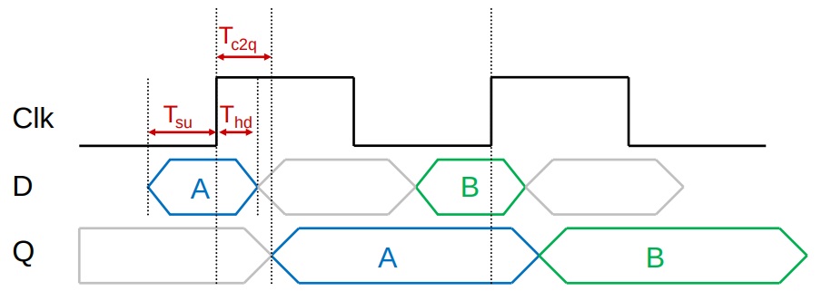
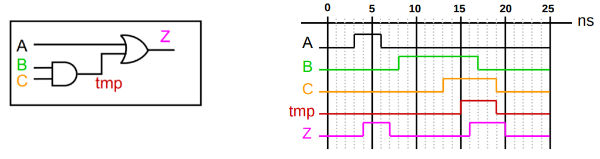

# HY220 - Εργαστήριο Ψηφιακών Κυκλωμάτων
# Διάλεξη 1 - Εισαγωγή στις Λογικές πύλες και Στοιχεία μνήμης

## 1. Βασικά στοιχεία Ψηφιακής Σχεδίασης
Η Ψηφιακή σχεδίαση βασίζεται κυρίος σε λογικές πύλες και στοιχεία μνήμης. Οι βασικές κατηγορίες κυκλωμάτων που μελετώνται είναι:
- Συνδυαστική Λογική (χωρίς μνήμη)
- Ακολουθιακή Λογική (με μνήμη και ρολόι)

## 2. Λογικές πύλες
**AND**
| Α | Β | Α $\cdot$ Β |
|---|---|-------|
| 1 | 1 |   1   |
| 1 | 0 |   0   |
| 0 | 1 |   0   |
| 0 | 0 |   0   |

**OR**
| Α | Β | Α + Β |
|---|---|-------|
| 1 | 1 |   1   |
| 1 | 0 |   1   |
| 0 | 1 |   1   |
| 0 | 0 |   0   |

**NOT**
| Α | Α' |
|---|----|
| 1 |  0 |
| 0 |  1 |

**NAND**
| Α | Β | (ΑΒ)' |
|---|---|-------|
| 1 | 1 |   0   |
| 1 | 0 |   1   |
| 0 | 1 |   1   |
| 0 | 0 |   1   |

**NOR**
| Α | Β | (A+B)'|
|---|---|-------|
| 1 | 1 |   0   |
| 1 | 0 |   0   |
| 0 | 1 |   0   |
| 0 | 0 |   1   |

**XOR**
| Α | Β | Α $\oplus$ Β |
|---|---|-------|
| 1 | 1 |   0   |
| 1 | 0 |   1   |
| 0 | 1 |   1   |
| 0 | 0 |   0   |

**XNOR**
| Α | Β | Α $\odot$ Β |
|---|---|-------|
| 1 | 1 |   1   |
| 1 | 0 |   0   |
| 0 | 1 |   0   |
| 0 | 0 |   1   |

## 3. Στοιχεία Μνήμης - Latches και Flip-Flops
#### RS Latch (Set - Reset)
Αποθυκέυει τιμή χρησιμοποιόντας δύο σήματα: 
1. S (set)
2. R (reset)

| S | R | Q | Q' |
|---|---|---|----|
| 1 | 1 | ? |  ? |
| 1 | 0 | 1 | 0  |
| 0 | 1 | 0 | 1  |
| 0 | 0 | $Q_{t-1}$ | $Q'_{t-1}$  |

#### D Latch
Έχει:
1. μία είσοδο δεδομένων (D)
2. μία Load (Ld)

| D | Ld | Q | Q' |
|---|----|---|----|
| 1 | 1 | 1 |  0 |
| 1 | 0 | $Q_{t-1}$ | $Q'_{t-1}$  |
| 0 | 1 | 0 | 1  |
| 0 | 0 | $Q_{t-1}$ | $Q'_{t-1}$  |

#### D Flip-Flop (Ακμοπυρόδοτητο)
- Αποθυκέυει την τιμή του D μόνο στην ακμή (συνήθως θετική) του ρολογιού (Clk)
- Μέσα του έχει δύο Latches τον *master* και τον *slave*
- Πιο σταθερό απο Latch γιατί βασίζεται σε ακμές και όχι σε επίπεδα σημάτων
- Απαιτεί:
    1. *Setup time (Tsu)*: Πόσο νωρίτερα από την ακμή πρέπει να σταθεροποιηθεί η είσοδος
    2. *Hold time (Thd)*: Πόσο πρέπει να διατηρηθεί μέτα την ακμή
    3. *Clock-to-Q delay (Tc2q)*: καθυστέρηση μέχρι να εμγανιστεί η έξοδος μετά την ακμή

  

## 4. Συνδυαστική Λογική
- Δεν περιέχει στοιχεία μνήμης
- Η έξοδος εξαρτάται **μόνο** από τις παρούσες τιμές εισόδων
- Χρησιμοποιούνται λογικές πύλες που συνδέονται μεταξύ τους 
- Οι πύλες και τα καλώδια έχουν καθυστερήσεις, κυρίος σε CMOS τεχνολογία λόγω αντιστάσεων και χωρητικοτήτων

#### Χρονισμός και κυματομορφές
- Οι καθυστερήσεις των πυλών οδηγούν σε διαφορετικές χρονικές στιγμές άφιξης σήματος στις εξόδος
- Αν υπάρχουν πολλές διαδρομές με διαφορετική καθυστέρηση, η έξοδος μπορεί να αλλάξει στιγμιαία ("glitch")

Παράδειγμα για:
- `Tand`: 2ns
- `Tor`: 1ns

  

Έχουμε τρία μονοπάτια:
- Α -> Ζ: 1ns
- B -> tmp -> Z: 3ns
- C -> tmp -> Z: 3ns

