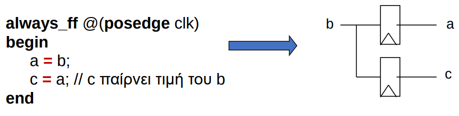
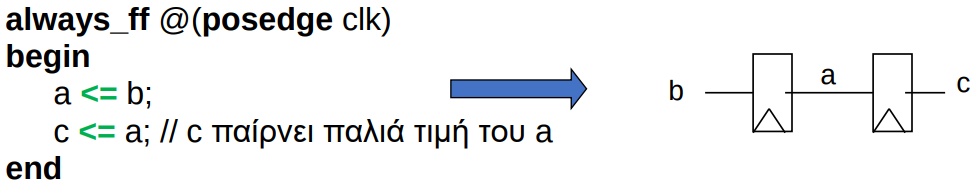

# HY220 - Εργαστήριο Ψηφιακών Κυκλωμάτων
# Διάλεξη 2 - Εισαγωγή στην Verilog

## Τυπική Ροή Σχεδίασης (Design Flow)
1. Καθορισμός Απαιτήσεων
2. Δημιουργία RTL μοντέλου (Register Transfer Level)
3. Προσομοίωση (Simulation/Testing)
4. Syntheses se gate-level
5. Προσομοίωση (Simulation/Testing)
6. Χρονική επαλήθευση
7. Υλοποίηση σε ASIC/FPGA

To τελικό σύστημα αποτελείται από τα Leaf blocks που τρέχουν παράλληλα

## Τί είναι η verilog
Η **Verilog HDL** είναι γλώσσα περιγραφής υλικού:
- Υψηλού επιπέδου γλώσσα που μπορεί να αναπαριστά και να προσομειώνει ψηφιακά κυκλώματα
- Περιγράφει παράλληλες ενέργειες και χρονική συμπεριφορά:
    - Hardware concurrency
    - Parallel Activity Flow
    - Semantics for Signal Value and Time

## Στοιχεία γλώσσας
Συντακτικές Συμβάσεις:
- Case Sensitive
- Σχόλια: `//`, `/* ... */`
Τιμές 1-bit σημάτων:
- `0`: Λογικό Μηδέν
- `1`: Λογικό Ένα
- `χ`: άγνωστη τιμή
- `z`: ασύνδετο σχήμα

## Αριθμοί
βασική γραφή: `<size>'<base_format><number>`
- `size`: τον αριθμό απο bits
- `base_format`: μπορεί να είναι: `d`,`h`,`b`,`o` (deffault = `d`)

Παραδείγματα: <br>
`4’b1111` → 4-bit δυαδικό 1111 = 15 <br>
`6’h3a` → 6-bit hex = 58 <br>
`8’b10_10_1110` → χρήση _ για αναγνωσιμότητα

## Τελεστές
- Αριθμητικοί: `+ - * / %`
- Λογικοί: `! && ||`
- Σχέσης: `< > <= >=`
- Ισότητας: `== !=`
- Bitwise: `~ & | ^`
- Reduction: `& | ^` σε όλα τα bits
- Shift: `<< >>`
- Concatenation: `{A,B}`, replication `{4{A}}`
- Conditional: `x ? y : z`

## Module
Η βασική μονάδα στη Verilog είναι το moduleQ
```verilog
module arith (output out1, output out2, input in1, input in2);
  // ...
endmodule
```

- **Instantiation**: δημιουργία αντικειμένο απο ένα module
- Πόρτες: `input`, `output`, `inout`
    - Τα `input` και `inout` έχουν τύπο wire μέσα στο module
    - Τα `outputs` μπορεί να έχουν τύπο wire ή reg

## Primitive Gates
Υπάρχουν βασικά primitives: `and`, `or`, `not`, `nand`, `nor`, `xor`, `xnor`, `buf`

Παράδειγμα
```verilog
and N25 (out, A, B)     // όνομα instance: N25
and #10 (out, A, B)     // delay
or #15 N33(out, A, B)   // name + delay
```

## Χρονισμός Simulation
- `timescale <time_unit>/<time_prescision>` (π.χ `1ns\100ps`)
- καθυστέρηση `#5`
- Αναμονή για ένα γεγονός: `@(posedge clk)` ή `@(a or b)`

## Δομή Module
Ένα module περιέχει:
- Δηλώσεις μεταβλητών (`wire`, `reg`)
- Αναθέσεις (`assign`)
- Μπλοκ `always` για δυναμική συμπεριφορά
- Μπλοκ `initial` για αρχικοποιήση
- Instantiations άλλων modules

```verilog
module test(input a, output reg b);
// δηλώσεις μεταβλητών
wire c, d;

// Αναθέσεις
assign d = a & c;

// μπλόκ always
always @(posedge a) begin
b = #2 a;
end
always @(negedge a) begin
b = #2 ~c;
end

// μπλος initial
initial begin
b = 0;
end

// Instantiations άλλων modules
not N1 (c, a)

// τέλος module
endmodule
```

## Τύποι μεταβλητών
- `wire`: για συνδυαστική λογική
- `reg`: για ακολουθιακή λογική
- `logic`: γενικός τύπος SystemVerilog (αντικαθιστά wire/reg)
- `integer`, `tri` κ.α που δεν θα δούμε τόσο

## Συνδυαστική λογική με `wire`
Αφού τα wires δεν έχουν μνήμη μπορούμε να κάνουμε μόνο συνδυαστική λογική με αυτά
```verilog
assign sum = a ^ b;
assign muxout = (sel == 1) ? a : b;
```

## Ακολουθιακή Λογική με `reg`
Μόνο `regs` (όχι `wires`) παίρνουν τιμή σε `initial` και `always` blocks 
```verilog
reg q;
always @(posedge clk)
  q = #2 (load) ? d : q;
```

## System Verilog Keywords
- `always_comb`: για συνδυαστική λογική
    Μόνο **blocking assignments** `=`
- `always_ff`: για flip-flops 
    Μόνο **non-blocking assignments** `<=`
- `always_latch`: για Latch Λογική

## Blocking vs Non-Blocking
- blocking
<p align="center">
  
</p>
- non-blocking
<p align="center">
  
</p>

## Πολυμπιτικά Σήματα (Multi-bit)
- Είναι όμοια με τους πίνακες που ξέρουμε
- συμβάσεις: `[high:low]`, `[msb:lsb]`
- προσοχή σε μήκη bits κατά τις συνδέσεις και αναθέσεις

```verilog
imput[7:0] a;
output[7:0] sum;
```

## Συνθήκες - if/cases
- `if ... else` & `case` μπορούμε μόνο μέσα σε block
- `deffault` είναι απαραίτητο στο `case`

if:
```verilog
module mux(
input [4:0] a,
input [4:0] b,
input sel,
output reg [4:0] out);

always @(a or b or sel) begin
    if ( sel == 0 ) begin
        out = a;
    end
    else
        out = b;
end
endmodule
```

case:
```verilog
module mux (
input [4:0] a,
input [4:0] b,
input [4:0] c,
input [4:0] d,
input [1:0] sel,
output reg [4:0] out);

always @(a or b or c or d or sel) begin
    case (sel)
        2’b00: out = a;
        2’b01: out = b;
        2’b10: out = c;
        2’b11: out = d;
        default: out = 5’bx;
    endcase
end
endmodule
```


## Επίπεδα Αφαίρεσης
- **Behavioral**: παρόμοια με την C - ο κώδικας δεν έχει άμεση σχέση με το hardware
```verilog
wire a = b + c;
```
- **Gate level/structural**: Ο κώδικας δείχνει πώς πραγματικά υλοποιείται σε πύλες η λογική
```verilog
wire sum = a ^ b;
wire cout = a & b;
```

## Synthesizable vs Non-Synthesizable
- **Synthesizable**: μπορεί να μετατραπέι σε υλικό (π.χ FPGA)
```verilog
wire [7:0] sum = tmp[7:0] & {8{a}};
wire cout = tmp[8];
```
- **Non-Synthesizable**: χρησιμοποιείται μόνο για testbenches
```verilog
initial begin
    a = 0; b = 0;
    #5 a = 1;
    b = 1;
end
```

## Testbench - Προσομοίωση
Top module που κάνει instantiate το module που τεστάρουμε, δημιουργεί τις τιμές των εισόδων του (stimulus) και ελέγχει ότι οι εξόδοι του παίρνουν σωστές τιμές
- 2 προσεγγίσεις:
    - Έλεγχος εξόδων και χρονισμού με το μάτι.
    - Έλεγχος εξόδων και χρονισμού μέσω κώδικα, δηλαδή αυτόματη σύγκριση των αναμενόμενων εξόδων.

## Παράδειγμα Μετρητή
```verilog
module clk (output logic out);
    initial out = 1'b0;
    always_comb
        out = #10 ~out;
endmodule
```

```verilog
module counter(input clk, input reset, output logic [7:0] out);
  always_ff @(posedge clk) begin
    if (reset)
      out <= #2 8'b0;
    else
      out <= #2 out + 1;
  end
endmodule
```

```verilog
module test;
    logic clk;
    logic reset;
    logic [7:0]count;

    clock clk0(clk);
    counter cnt0(clk,reset,count);

    initial begin
        reset = 1;
        @(posedge clk);
        @(posedge clk);
        
        reset = #2 0;
        @(posedge clk);
        #300
        $stop
    end
endmodule
```

