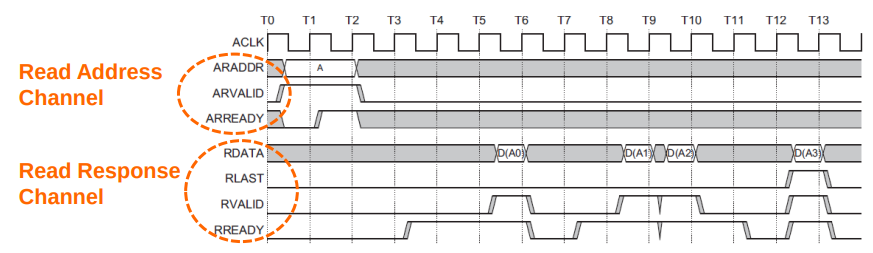
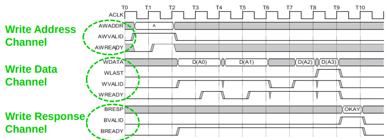

# HY220 - Εργαστήριο Ψηφιακών Κυκλωμάτων
# Διάλεξη 7 - Πρωτόκολλο AXI

## Τί είναι το AXI
Το AXI (Advanced eXtensible Interface) είναι πρωτόκολλο διασύνδεσης της ARM, σχεδιασμένο για:
- Υψηλή απόδοση
- Υψηλή συχνότητα λειτουργίας
- Υποστήριξη DMA (Direct Memory Access)

## Βασικά Χαρακτηριστικά AXI
- Ξεχωριστές φάσεις διεύθυνσης/ελέγχου και δεδομένων
- Στήριξη μη εθυγραμμισμένων μεταφορών με χρήση byte strobes
- Ξεχωριστά κανάλια ανάγνωσης και εγγραφής
- Υποστήριξη πολλαπλών ταυτόχρονων συναλλαγών (bursts)
- Υποστήριξη out-of-order ολοκλήρωσης συναλλαγών
- Εύκολη εισαγωγή pipeline stages (register slices) για επίτευξη χρονισμού

## Πέντε Ανεξάρτητα Κανάλια AXI
1. **Read Address Channel**
2. **Read Data Channel**
3. **Write Address Channel**
4. **Write Data Channel**
5. **Write Response Channel**

Κάθε κανάλι είναι ανεξάρτητο και μπορεί να μεταφέρει πληροφορία ταυτόχρονα

## Λειτουργίες Ανάγνωσης/Εγγραφής
### Ανάγνωση (Read)
- O master στέλνει διέυθυνση μέσω **Read Address Channel**
- Ο slave απαντά με δεδομένα μέσω **Read Data Channel**

    

Read Addres Channel:
1. *ARADDR*: Η διεύθυνση από την οποία θέλουμε να διαβάσουμε.
2. *ARVALID*: Ο master λέει: "Έχω έτοιμη διεύθυνση για ανάγνωση".
3. *ARREADY*: Ο slave απαντά: "ΟΚ, πήρα τη διεύθυνση".

Read Response Channel:
1. *RDATA*: Τα δεδομένα που διαβάσαμε από τη μνήμη.
2. *RLAST*: Αν είναι το τελευταίο κομμάτι σε μια σειρά (burst) από δεδομένα.
3. *RVALID*: Ο slave λέει: "Έχω έτοιμα τα δεδομένα για αποστολή".
4. *RREADY*: Ο master λέει: "Είμαι έτοιμος να τα παραλάβω".

### Εγγραφή (Write)
- **Write Address Channel**: στέλνει διέυθυνση
- **Write Data Channel**: στέλνει δεδομένα
- **Write Response Channel**: απάντηση επιτυχίας/αποτυχίας

    

Write Address Channel:
1. *AWADDR*: Η διεύθυνση στην οποία θέλουμε να γράψουμε.
2. *AWVALID*: Ο master λέει: "Έχω έτοιμη διεύθυνση για εγγραφή".
3. *AWREADY*: Ο slave απαντά: "ΟΚ, πήρα τη διεύθυνση".

Write Data Channel:
1. *WDATA*: Τα δεδομένα που θέλουμε να γράψουμε.
2. *WLAST*: Αν είναι το τελευταίο κομμάτι σε burst εγγραφής.
3. *WVALID*: Ο master λέει: "Έχω έτοιμα τα δεδομένα".
4. *WREADY*: Ο slave λέει: "Είμαι έτοιμος να τα πάρω".

Write Response Channel:
1. *BRESP*: Η απάντηση από τον slave: Αν η εγγραφή έγινε σωστά ή όχι.
2. *BVALID*: Ο slave λέει: "Έχω έτοιμη την απόκριση εγγραφής".
3. *BREADY*: Ο master λέει: "Είμαι έτοιμος να τη λάβω".

## Out-of-Order Completion
- Κάθε συναλλαγή έχει ID tag
- ΑΧΙ μπορεί να ολοκληρώνει συναλλαγες με διαφορετικό ID εκτός σειράς
- Αν θέλουμε In-Order εκτέλεση, δώσε ίδιο ID σε όλες τις συναλλαγές
### Πλεονεκτήματα
- Γρήγοροι slaves
- Μεγάλη συνολική απόδοση

## Register Slices
- Μπορούν να εισαχθούν pipeline στάδια σε οποιοδήποτε κανάλι AXI
- Προσθέτουν latency αλλά διευκολύνουν τον χρονισμό
- Πλύ χρήσιμο σε fast CPU - memory interfaces

## AXI4-Lite (Υποσύνολο  του AXI4)
Ελαφριά έκδοση του AXI:
- Χωρίς bursts
- Fixed data width: 32 ή 64 bits
- Ιδανικό για απλά περιφερειακά (GPIO,UART)

Χρησιμοποιείται για έλεγχο και παραμετροποίηση, όχι για δεδομένα υψηλής ταχύτητας

## Σήματα AXI-Lite
- Υποσύνολο των σημάτων του AXI4
- Απλή δομή σημάτων για μικρές υλοποιήσεις
- Δεν έχει burst, ούτε out-of-order

Χρήση σε χαμηλών απαιτήσεων περιφερειακά

## AXI-Stream
- Καμία διέυθυνση - μόνο ροή δεδομένων
- Μόνο κατέυθυνση: master -> slave
- Υποστήριξη απριόριστου burst
- Πολύ καλό για multimedia, video, ήχου, packed data

## Επιπλέον Δυνατότες AXI
- ID Fields για tagging και παράλληλες συναλλαγές
- Burst Types: fixed, increment, wrap
- Lock signals για atomic transactions
- Υποστήριξη για cache, προστασία προσβάσεων, σφάλματα
- Υποστήριξη unaligned

