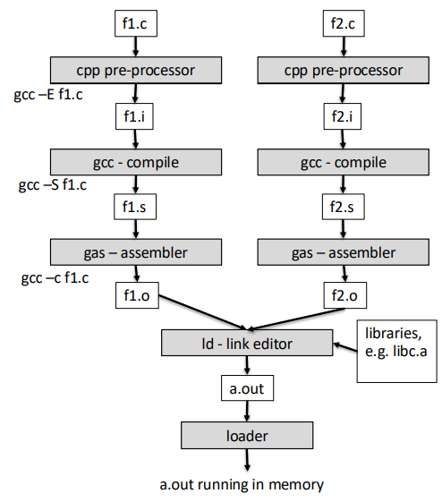

## Σημειώσεις Νίκου Μαρκαντώνης για πρόοδος HY255
- Statements
    - Assignment: `x=1`
    - Control Flow: `if`,`then`,`else`
    - Loops: `for`,`while`,`etc`
    - Function Calls: `f(x)`
- Structured τύποι
    - Arrays
    - Structured
    - Enumerated
        - Ποιάνει όσο χώρο στην μνήμη όσο χρειάζεται για να αναπαρασταθούν οι τιμές του τύπου
        - π.χ `enum color {RED,GREEN,BLUE}` ποιάνει 2 bit χώρο
    - Pointers
    - Union: Σαν struct αλλά όλα τα δεδομένα μοιράζονται τον ίδιο χώρο μέσα στην μνήμη
- Constants:
    - char:
        - 'a'       character a
        - '\\035'   character with octal code 035
        - '\\x1a'   chracter with hex code 1a
        - '\\t'     tab
        - '\\n'     new line
        - '\\0'     character with code 0 (null char = NUL but not NULL)
    - int:
        - '128'     deciamal 128
        - '0156'    octal 156
        - '0x1abc'  hexcadecimal 0x1abc !!!!!
    - long
        - `128l`    is correct but causes confusion as it looks like a `1`
        - `128L`    good practise to use this, easier to read
    - float
        - `15.5f`, `3.14e2f`    scientific notation `3.12e2f` $\to$ $3.14 \cdot 10^2$
        - `15.5F`, `3.14e2f`    F can be both lowercase and upercase
    - double
        - `15.5`    when not finishing with `f` it means it's a double
        - `15.5l`, '3.14e2L'    either `l` or `L`: long double (higher precision)
        - '15.5L', '3.14e2L'1
    
    | Type         | Example    | Meaning                   |
    |-------------|-----------|---------------------------|
    | `long`      | `128L`    | Long integer              |
    | `float`     | `15.5f`   | 15.5 as `float`           |
    | `double`    | `15.5`    | 15.5 as `double` (default) |
    | `long double` | `15.5L` | 15.5 as `long double`     |
- sizeof
    Επιστρέφει το μέγεθος ενός τύπου ή μεταβλητής στην  συγκεκριμμένη υλοποίηση της γλώσσας
    Είναι ένα δεσμευμένο keyword της C, ΟΧΙ ΣΥΝΑΡΤΗΣΗ ΒΙΒΛΙΟΘΉΚΗΣ
        - Επειδή μόνο η γλώσσα (compiler) γνωρίζει τα μεγέθη των τύπων
        - Για αυτόν τον λόγο μπορόυμε και να γράφουμε:
            - `s  = sizeof x;`  ΛΕΙΤΟΥΡΓΕΙ
            - `s = sizeof int` ΛΑΘΟΣ θέλει παρενθέσεις 
- Αρχικά I/O
    Κάθε πρόγραμμα όταν ξεκινάει γνωρίζει τρία streams:
        - `stdout`: οθόνη, write only stream (πάει στο `output.txt`)
        - `stdint`: πληκτρολόγιο, read only stream
        - `sdterr`: οθόνη, read only stream, για errors (πάει στο `error.txt`)
- pointers
    Ένας τύπος που μας επτιτρέπει να δείχνουμε σε θέσεις μνήμης
    Πράξεις που μπορόυμε να κάνουμε:
    - `&`: pointer σε
    - `*`: επιστρέφει τα δεδομένα τις διέυθυνσης που περιέχονται στον pointer
    - assignment: `ip = &i`
    - αριθμητική: `*(ip+1) = 3` μετακίνηση του δείκτη κατά μία θέση στην μνήμη (μετακινήτε όσο είναι το μέγεθος της μεταβλητής στην οποία δείχνει ο ip) και εκχώρηση της τιμής 3 εκέι
    - σύγκριση: `ip == &i`
    Ο pointer αποθυκέυει και τον τύπο της μεταβλητής στην οποία δείχνει, δηλαδή: pointer to char != pointer to int
- Σχέση arrays - pointers
    Το όνομα ενός array στην γλώσσα C είναι μία σταθερή τιμή τύπου pointer 
    Εφόσον το όνομα είναι ισδύναμο με μια τιμή τύπου "pointer σε..." τότε μία οποιαδήποτε μεταβλητή τύπου "pointer σε..." μπορεί να χρησιμοποιηθεί σαν όνομα array άρα:
    - `ip[0] = 0`       στην πρώτη θέση του πίνακα
    - `(ip+1)[0] = 0`   στην δέυτερη θέση του πίνακα, ισοδύναμη με την `*(ip+1) = 0`
- Σχέση strings - pointers
    Δεν έχουμε τύπο string στην C, χρησιμοποιούμε `char*` (πίνακας με chars)
    Πάντε έχουν στο τέλος τον χαρακτήρα: `'\0'`
- Δηλώσεις μεταβλητών:
    - Συναρτήσεις που επιστρέφουν συναρτήσεις
    Μπορούμε να δηλώσουμε μεταβλητές οποιδήποτε τύπου **εκτό**ς απο συναρτήσεις που επιστρέφουν συναρτήσεις, μπορούμε όμως συναρτήσεις που επιστρέφουν pointer σε άλλη συνάρτηση
        Παράδειγμα: `int (*f())();` f είναι μία συνάρτηση που επιστρέφει δείκτες σε συναρτήσεις που επιστρέφουν int και δεν έχουν παραμέτρους, και την οποία στην συνέχεια καλούμε
        Παράδειγμα ολόκληρου κώδικα:
        ```c
        #include <stdio.h>
        
        int func(void* Par) {
            printf("%c\n", *(char*) Par);
            return 1;
        }
        
        int (*f()) (void* par) {    // συνάρτηση με όνομα f που δεν παίρνει παραμέτρους και 
                                    // επιστρέφει έναν δείκτη σε μία συνάρτηση που επιστρέφει 
                                    // int και παίρνει παραμέτρους void*
            
            return &func;           // επιστρέφουμε τον δείκτη στην συνάρτηση func
        }
        
        int main(void) {
            void* func_ptr = &f;    // δείκης στην συνάρτηση f
            char cha = 'A';
            char* char_ptr = &cha;
            
            (*f())((void*)char_ptr);    // καλούμε την συνάρτηση f να επιστρέψει έναν δείκτη 
                                        // σε συνάρτηση και μετά εκτελούμε την συνάρτηση αυτή
        }
        ```
    - Συναρτήσεις που επιστρέφουν πίνακες:
        με την ίδια λογική μπορούμε να έχουμε και: `int (*f())[];` που εdπιστρέφει έναν πίνακα με int
    - Πίνακες με δείκτες συναρτήσεων:
        Δεν πρέπει να μπερδέυουμε το απο πάνω με πίνακες που έχουν δείκτες σε συναρτήσεις: `int (*f[0])();` εδώ καλούμε την συνάρτηση στην πρώτη θέση ενός πίνακα
- Program Building Process
    
- CPP - Preprocessor  
    Ο cpp είναι ένα πρόγραμμα που δεν σχετίζεται με τη γλώσσα C και κάνει συγκεκριμμένες δουλειές
    - Οι γραμμές του .c που ξεκινούν με `#` αποτελούν οδηγίες προς τον cpp και δεν είναι μέρος της γλώσσας
    - Ουσιατικά το source πρόγραμμα .c περιέχει ένα μείγμα απο οφηγίες προς τον cpp και απο εντολές της γλώσσας C
    Ο cpp παίρνει σαν input ένα αρχείο .txt και:
        1. Αφαιρεί όλα τα σχόλια (`\* .... *\`),
        Συγκεκριμμένα αντικαθιστά κάθε σχόλιε με τον κενό χαρακτήρα ' '
        2. Επεξεργάζεται τις οδηγίες που ξεκινούν με `#`
        3. Συνενώνει τις γραμμές του κώδικα που είναι σπασμένες σε περισσότερες φυσικές γραμμές με τον χαρακτήρα "\"
    Ο cpp δεν ενδιαφέρεαι για το αν το source πρόγραμμα είναι C ή κάτι άλλο ή απλό text. Απλά κάνει αυτά τα βήματα
- `#include <filename>`
    Η οδηγία αυτή μεταφράζεται περίπου στο:
    Πάρε το αρχείο *filename* και αντικατέστησε την γραμμή του include με τα περιεχόμενα του αρχείου μέσα στο f1.c
    Όταν χρησιμοποιούμε '\<filename\>' ο cpp θα ψάξει το αρχείο filename μέσα σε μερικά προκαθορισμένα directories
    Όταν χρησιμοποιούμε '"filename"' ο cpp θα ψάξει το αρχείο filename μέσα στον φάκελο που βρίσκεται και το f1.c


- Linking Βήματα:
  1. Merge: Αντιγραφή όλων τον sections απο το αρχείο `.o` στο `a.out`
  2. Resolve: Επίλυση των εξωτερικών συμβόλων μέσω του symbol table
  3. Relocate: Υπολογισμός των σωστών διευθύνσεων και ενημέρωση των κλήσεων/προσβάσεων


