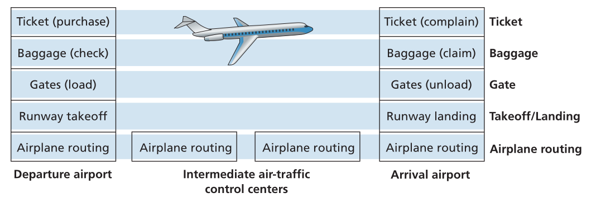

# HY335 - Δίκτυα Υπολογιστών
## Κεφάλαιο 1 - Δίκτυα Υπολογιστών και το Διαδίκτυο

## 1.1 Τι είναι το Διαδίκτυο
Το Διαδίκτυο μπορεί να περιγραφεί από δύο διαφορετικές οπτικές γωνίες:
1. **Περιγραφή "Βίδες και Παξιμάδια"**: Εστιάζει στα βασικά υλικά και λογισμικά στοιχεία
2. **Περιγραφή "Υπηρεσιών"**: Θεωρεί το διαδίκτυο ως μια υποδομή που παρέχει υπηρεσίες στις εφαρμογές

### Βασική Περιγραφή
Αυτή η οπτική περιγράφει το Διαδίκτυο ως ένα τεράστιο δίκτυο διασυνδεδεμένων υπολογιστικών συσκευών:
 - Κύρια στοιχεία
   - **Δισεκατομμύρια συνδεδεμένες συσκευές**: Ονομάζονται **υπολογιστές** (*hosts*) ή **τερματικά συστήματα** (*end systems*). Δεν είναι μόνο παραδοσιακοί υπολογιστές (PC και servers) αλλά και smartphones, tablets και ένας συνεχώς αυξανόμενος αριθμός συσκευών "*Internet of Things*" (*IoT*), όπως τηλεοράσεις, θερμοστάτες, αισθητήρες και αυτοκίνητα.
   - **Ζευξεις Επικοινωνίας** (*Communication Links*): Τα φυσικά μέσα (όπως ομοαξονικό καλώδιο, χάλκινο σύρμα, οπτικές ίνες και ραδιοφάσμα) που συνδέουν τις συσκευές.
   - **Μεταγωγές Πακέτων** (*packet switches*): Συσκευές που δέχονται ένα πακέτο από έναν εισερχόμενο σύνδεσμο και το προωθούν σε έναν εξερχόμενο σύνδεσμο. Οι δύο πιο σημαντικοί τύποι είναι:
     - **Routers**: Συνήθως χρησιμοποιούνται στον πυρήνα του δικτύου
     - **Switches Στρώματος Σύνδεσης**: Συνήθως χρησιμοποιούνται σε δίκτυα πρόσβασης
   - **Πακέτα**: Όταν ένα end system έχει δεδομένα για αποστολή, τα διασπά σε μικρότερα κομμάτια που ονομάζονται **πακέτα**. Κάθε πακέτο στέλνεται μέσω του δικτύου στον προορισμό, όπου επανασυναρμολογείται στα αρχικά δεδομένα.
   - **Διαδρομή/Μονοπάτι** (*route/path*): Η ακολουθία των συνδέσμων επικοινωνίας και των switches πακέτων που διασχίζει ένα πακέτο από το αποστολέα στο δέκτη.
   - **Πάροχοι Υπηρεσιών Διαδικτύου** (*Internet Service Providers, ISPs*): Τα end systems συνδέονται στο Διαδίκτυο μέσω ISPs (π.χ. εταιρείες καλωδιακής, τηλεφωνίας, κινητής ή πανεπιστημίων). Κάθε ISP είναι με τη σειρά του ένα δίκτυο από switches πακέτων και συνδέσμους επικοινωνίας. Οι ISPs πρέπει να διασυνδεθούν για να σχηματίσουν το *παγκόσμιο διαδίκτυο*.
   - **Πρωτόκολλα** (*Protocols*): Τα end systems, τα switches πακέτων και άλλα στοιχεία του Διαδικτύου εκτελούν πρωτόκολλα που ελέγχουν την αποστολή και λήψη πληροφοριών. Το πιο θεμελιώδες σύνολο πρωτοκόλλων είναι το TCP/IP (Transmission Control Protocol/Internet Protocol)
     - **IP (Internet Protocol)**: ορίζει τη μορφή των πακέτων που αποστέλλονται και λαμβάνονται.
   - **Πρότυπα Διαδικτύου** (*Internet Standarts*): Τα πρωτόκολλα ορίζονται σε **RFC**s (*Request for Comment*) που αναπτύσσονται από το **IETF** (*Internet Engineering Task Force*). Άλλοι φορείς, όπως η επιτροπή *IEEE* 802, ορίζουν πρότυπα για τεχνολογίες στρώματος σύνδεσης (π.χ. Ethernet, Wifi).
 - Αναλογία: Το Διαδίκτυο είναι σαν ένα παγκόσμιο δίκτυο μεταφορών για πληροφορίες
   - **Πακέτα** είναι σαν **φορτηγά**
   - **Σύνδεσμοι επικοινωνίας** είναι σαν **αυτοκινητόδρομοι και δρόμοι**
   - **Switches πακέτων** είναι σαν **διασταυρώσεις**
   - **End Systems** είναι σαν **κτίρια**
  
### Περιγραφή με Βάση Παρεχόμενες Υπηρεσίες
Αυτή η οπτική περιγράφει το Διαδίκτυο ως πλατφόρμα για **κατανεμημένες εφαρμογές**. Αυτές οι εφαρμογές περιλαμβάνουν πολλαπλά end systems που ανταλλάσσουν δεδομένα μεταξύ τους (π.χ. email, web streaming, online παιχνίδια).

- Κύρια στοιχεία:
  - Οι εφαρμογές εκτελούνται στα end systems, *όχι* στα switches του πυρήνα του δικτύου
  - Το Διαδίκτυο παρέχει μια υπηρεσία σε αυτές τις εφαρμογές: την δυνατότητα αποστολής δεδομένων μεταξύ προγραμμάτων που εκτελούνται σε διαφορετικά end systems.
  - Για να χρησιμοποιήσει αυτή την υπηρεσία, μια εφαρμογή πρέπει να ακολουθεί τους κανόνες της **Διεπαφής Socket του Διαδικτύου** (*socket interface*). Αυτή η διεπαφή καθορίζει πώς ένα πρόγραμμα ζητά από το Διαδίκτυο να παραδώσει δεδομένα σε ένα συγκεκριμένο πρόγραμμα προορισμού.
- Αναλογία: η υπηρεσία του Διαδικτύου είναι σαν την ταχυδρομική υπηρεσία
  - Ένα πρόγραμμα (π.χ. ένα άτομο που ονομάζεται "Alice") πρέπει να βάλει τα δεδομένα του (το γράμμα) σε ένα πακέτο (τον φάκελο) και να ακολουθήσει τους κανόνες της διεπαφής socket (γράψιμο της σωστής διεύθυνσης, χρήση γραμματοσήμου) για να παραδώσει το Διαδίκτυο (η ταχυδρομική υπηρεσία) σε άλλο πρόγραμμα (άλλο άτομο, π.χ. "Bob")
  - Όπως η ταχυδρομική υπηρεσία για εφαρμογές (που θα εξετάσουμε στο κεφάλαιο 2)

### Τι είναι ένα πρωτόκολλο;
Ένα **πρωτόκολλο** ορίζει τη *μορφή* και τη *σειρά των μηνυμάτων* που ανταλλάσσονται μεταξύ δύο ή περισσότερων οντοτήτων που επικοινωνούν, καθώς και τις ενέργειες που εκτελούνται κατά την αποστολή ή/και λήψη ενός μηνύματος ή άλλου γεγονότος.

- Ανθρώπινες Αναλογίες: 
  - **Ρωτώντας την ώρα**: Το πρωτόκολλο περιλαμβάνει έναν χαιρετισμό ("Γεια"), αμοιβαίο χαιρετισμό ("Γεια"), μια ερώτηση ("Τι ώρα είναι;") και μια απάντηση ("2 η ώρα"). Η ενέργεια εξαρτάται από το μήνυμα που λαμβάνεται (π.χ. δεν θα ρωτήσεις την ώρα αν πάρεις την απάντηση "Μην με ενοχλείς!").
  - **Κάνοντας μια ερώτηση στην τάξη**: Το πρωτόκολλο περιλαμβάνει τον δάσκαλο να ρωτά "Υπάρχουν ερωτήσεις;", έναν μαθητή να σηκώνει το χέρι, τον δάσκαλο να αναγνωρίζει, και τον μαθητή να κάνει την ερώτηση.
- Δικτυακά Πρωτόκολλα: Οι οντότητες είναι υλικό ή λογισμικό συστατικά συσκευών (υπολογιστές, routers, κτλ.)
  - **Παράδειγμα: HTTP (Web)** Το πρωτόκολλο ορίζει τη σειρά των μηνυμάτων: 
    - αίτηση σύνδεσης (χαιρετισμός)
    - απάντηση σύνδεσης (αμοιβαίος χαιρετισμός)
    - αίτηση `GET` για μια ιστοσελίδα (ερώτηση)
    - η ιστοσελίδα επιστρέφεται (απάντηση)
  - Τα πρωτόκολλα υπάρχουν παντού στο Διαδίκτυο, ρυθμίζοντας όλη την επικοινωνία

## 1.2 Τα Άκρα των Δικτύων
Τα "Άκρα των Δικτύων" αναφέρεται στα στοιχεία με τα οποία είμαστε περισσότερο εξοικειωμένοι: τους πελάτες και εξυπηρετές (clients and servers) και τα δίκτυα που τα συνδέουν με το ευρύτερο Διαδίκτυο. Αυτή η ενότητα καλύπτει τα **δίκτυα προσπέλασης** (πώς συνδεόμαστε online) και τα φυσικά μέσα.

### Δίκτυα Προσπέλασης
Ένα **δίκτυο προσπέλασης** είναι το δίκτυο που συνδέει φυσικά ένα end system με τον πρώτο δρομολογητή (τον "**edge router**") στη διαδρομή του προς άλλα end systems. Υπάρχουν διάφοροι τύποι, χρησιμοποιούμενοι σε διαφορετικά περιβάλλοντα (σπίτι, επιχείρηση, κινητό).

#### Οικιακή Πρόσβαση: DSL, Καλωδιακή, FTTH, Μέσω Τηλεφώνου και Δορυφορική
- **Digital Subscriber Line (DSL)**:
  - **Πάροχος**: Η τοπική τηλεφωνική εταιρεία (*telco*)
  - **Υποδομή**: Χρησιμοποιεί την υπάρχουσα **τηλεφωνική γραμμή**
  - **Πώς λειτουργεί**:
    - Ένα DSL modem στο σπίτι επικοινωνεί με ένα **Digital Subscriber Line Access Multiplexer** (*DSLAM*) στο κεντρικό γραφείο (CO) του telco
    - Χρησιμοποιεί **frequency division multiplexing** (*FDM*) για να χωρίσει τη γραμμή σε τρεις ζώνες συχνοτήτων:
      - High-speed downstream (50 kHz - 1 MHz)
      - Medium-speed upstream (4 kHz - 50 kHz)
      - Voice (0 - 4 kHz)
    - Ένας splitter στο σπίτι χωρίζει τα σήματα δεδομένων και τηλεφώνου
  - **Χαρακτηριστικά**:
    - Ασύμμετρο: Η ταχύτητα downstream (προς το σπίτι) είναι συνήθως μεγαλύτερη από την upstream (από το σπίτι)
    - Αφιερωμένο: Η σύνδεση από το σπίτι προς το DSLAM δεν μοιράζεται με άλλα σπίτια
    - Ευαίσθητο στην απόσταση: Η ταχύτητα μειώνεται με την απόσταση από το CO
- **Καλωδιακή προσπέλαση στο Διαδίκτυο (cable internet access)**:
  - **Πάροχος**: Εταιρεία καλωδιακής τηλεόρασης
  - **Υποδομή**: Χρησιμοποιεί την υποδομή καλωδιακής τηλεόρασης, συχνά **Hybrid Fiber Coax** (*HFC*): οπτική ίνα μέχρι τον κόμβο της γειτονιάς και ομοαξονικό καλώδιο μέχρι τα σπίτια
  - **Πώς λειτουργεί**:
    - Ένα cable modem στο σπίτι επικοινωνεί με ένα **Cable Modem Termination System** (*CMTS*) στο κεντρικό δίκτυο
    - Χρησιμοποιεί **FDM** για να χωρίσει τα δίκτυα **HFC** σε κανάλια downstream και upstream
  - **Χαρακτηριστικά**:
    - Ασύμμετρο: Η ταχύτητα downstream είναι συνήθως μεγαλύτερη από την upstream
    - Κοινόχρηστο Μέσο Εκπομπής: Κάθε πακέτο που στέλνεται από το head end πηγαίνει σε όλα τα σπίτια, και το κανάλι upstream μοιράζεται. Ο ρυθμός ανά χρήστη εξαρτάται από το πόσοι γείτονες είναι ενεργοί. Χρειάζεται πρωτόκολλο πολλαπλής πρόσβασης για αποφυγή συγκρούσεων.
- **ίνας στο σπίτι (fiber optic at home, FTTH)**:
  - **Πάροχος**: Telco ή άλλος πάροχος
  - **Υποδομή**: Παρέχει **οπτική ίνα** απευθείας από το Central Office (*CO*) στο σπίτι, με πολύ υψηλές ταχύτητες (πιθανά Gbps)
  - **Συνηθισμένη Αρχιτεκτονική: Passive Optical Network (PON)**:
    - Κάθε σπίτι έχει έναν **Optical Network Terminator** (*ONT*)
    - Ίνες από πολλά σπίτια (λιγότερα από 100) συνδυάζονται από έναν splitter σε μία κοινή ίνα μέχρι το CO
    - Στο CO, ένας **Optical Line Terminator** (*OLT*) συνδέεται με το Διαδίκτυο
  - **Χαρακτηριστικά**: Πολύ υψηλή ταχύτητα, όλο και πιο διαδεδομένη
- **5G Fixed Wireless**:
  - **Πάροχος**: Εταιρεία κινητής τηλεφωνίας
  - **Υποδομή**: Χρησιμοποιεί ασύρματη επικοινωνία από το σταθμό βάσης στον οικιακό modem, εξαλείφοντας την ανάγκη φυσικής καλωδίωσης
  - **Χαρακτηριστικά**: Υπόσχεται υψηλές ταχύτητες χωρίς κόστος και προβλήματα καλωδίων

#### Εταιριακή (και Οικιακή) Προσπέλαση: Ethernet και WiFi
- **Ethernet**
  - **Περιβάλλον**: Επιχειρήσεις, πανεπιστήμια και όλο και περισσότερο σπίτια (LAN)
  - **Υποδομή**: Τα end systems συνδέονται με συστρεφόμενο χάλκινο καλώδιο σε Ethernet switch, το οποίο συνδέεται με το Διαδίκτυο
  - **Χαρακτηριστικά**: Πολύ υψηλές ταχύτητες (100 Mbps έως δεκάδες Gbps). Συνήθως αφιερωμένη σύνδεση ανά χρήστη
- **WiFi (IEEE 802.11)**:
  - **Περιβάλλον**: Ασύρματα LANs σε επιχειρήσεις, καφετέριες, αεροδρόμια και σπίτια
  - **Υποδομή**: Οι ασύρματοι χρήστες επικοινωνούν με ένα **access point (AP)**, που συνδέεται στο ενσύρματο δίκτυο (συχνά μέσω Ethernet)
  - **Χαρακτηριστικά**:
    - **Κοινόχρηστος** ρυθμός μετάδοσης (π.χ. 100+ Mbps)
    - Οι χρήστες πρέπει να βρίσκονται σε λίγες δεκάδες μέτρα από το access point
    - Ένα οικιακό wireless router συνδυάζει λειτουργίες router, Ethernet switch και WiFi AP

#### Ασύρματη Προσπέλαση Ευρείας Περιοχής: 3G, 4G και 5G
- **Περιβάλλον**: Κινητή πρόσβαση μέσω της υποδομής κινητής τηλεφωνίας
- **Υποδομή**: Συσκευές συνδέονται σε σταθμό βάσης που λειτουργεί από τον πάροχο κινητής
- **Χαρακτηριστικά**:
  - Παρέχει πρόσβαση σε δεκάδες χιλιόμετρα απόστασης από έναν σταθμό βάσης
  - Οι τεχνολογίες **4G (LTE)** και **5G** προσφέρουν ταχύτητες κατάλληλες για μηνύματα, streaming και άλλα σε smartphones και tablets

### Φυσικά Μέσα
Ένα **φυσικό μέσο** είναι αυτό που πραγματικά μεταφέρει τα ηλεκτρομαγνητικά κύματα ή παλμούς φωτός που αναπαριστούν τα bits. Για κάθε ζεύγος πομπού-δέκτη, το bit αποστέλλεται μέσω ενός φυσικού μέσου.

- **Καθοδηγούμενα Μέσα**: Τα κύματα καθοδηγούνται μέσα από ένα στερεό μέσο
  - **Χάλκινο Συρμα Σύστροφου Ζέυγους**:
    - Δύο μονωμένα χάλκινα σύρματα στριμμένα μαζί για μείωση παρεμβολών
    - **Αθωκάριστο Σύστροφο Ζέυγος (Unshielded Twisted Pair, UTP)** χρησιμοποιείται συχνά σε LANs
    - Φθηνό και διαδεδομένο. Σύγχρονα καλώδια (Cat 6a) φτάνουν 10 Gbps σε μικρές αποστάσεις. Χρησιμοποιείται και σε DSL
  - **Ομοαξονικό Καλώδιο**:
    - Δύο ομόκεντροι αγωγοί χαλκού
    - Υψηλοί ρυθμοί μετάδοσης, καλή θωράκιση
    - Χρησιμοποιείται σε καλωδιακή τηλεόραση και Internet. Μπορεί να λειτουργήσει ως κοινόχρηστο μέσο
  - **Οπτική Ίνα**:
    - Λεπτή, εύκαμπτη ίνα γυαλιού που μεταδίδει παλμούς φωτός
    - **Χαρακτηριστικά**: Πολύ υψηλές ταχύτητες (δεκάδες έως εκατοντάδες Gbps), ανθεκτική σε παρεμβολές, χαμηλή απώλεια σήματος σε μεγάλες αποστάσεις, πολύ δύσκολο να υποκλαπεί
    - **Χρήση**: Προτιμώμενο μέσο για μεγάλες αποστάσεις (π.χ. υπερατλαντικά καλώδια, backbone του Internet)

- **Μη Καθοδηγούμενα Μέσα**: Τα κύματα διαδίδονται στην ατμόσφαιρα και το διάστημα (π.χ. ασύρματο)
  - **Επίγεια Ράδιο-κανάλια**: Μεταφέρουν σήματα στο ηλεκτρομαγνητικό φάσμα. Δεν απαιτούν φυσικό καλώδιο.
    - **Χαρακτηριστικά**: Η ισχύς σήματος μειώνεται με την απόσταση και επηρεάζεται από εμπόδια (path loss, shadow fading), ανακλάσεις (multipath fading) και παρεμβολές
    - **Κατηγορίες**:
      - **Μικρής απόστασης** (π.χ. ασύρματα ακουστικά)
      - **Τοπικής Περιοχής** (π.χ. WiFi)
      - **Ευρείας Περιοχής** (π.χ. κινητά δίκτυα)
  - **Δορυφορικά Ράδιο-κανάλια**:
    - Ένας δορυφόρος συνδέει δύο ή περισσότερους επίγειους σταθμούς
    - Τύποι:
      - **Γεωστατικοί Δορυφόροι**: Παραμένουν σταθεροί πάνω από ένα σημείο της γης (τροχιά ~36,000 km). Εισάγουν μεγάλη καθυστέρηση ~280 msec
      - **δορυφόροι χαμηλής τροχίας**: Πολύ πιο κοντά στη Γη, δεν παραμένουν σταθεροί. Απαιτούνται πολλοί για συνεχή κάλυψη

## 1.3 Ο Πυρήνας του Δικτύου
Ο πυρήνας του δικτύου είναι το πλέγμα από packet switches και συνδέσμους που διασυνδέει τα end systems του Διαδικτύου. Αυτή η ενότητα εξερευνά τις βασικές στρατηγικές μεταφοράς δεδομένων μέσα από αυτόν τον πυρήνα: **packet switching**, και στη συνέχεια μελετά πώς το Διαδίκτυο δομείται ως ένα "δίκτυο από δίκτυα".

### Μεταγωγή Πακέτου (Packet Switching)
Στις δικτυακές εφαρμογές, τα end systems ανταλλάσσουν μηνύματα. Για να σταλεί ένα μήνυμα, η πηγή το διασπά σε μικρότερα κομμάτια δεδομένων που ονομάζονται **πακέτα**.

#### Μετάδοση Αποθύκευσης-και-Προώθησης
- **Έννοια**: Τα περισσότερα packet switches χρησιμοποιούν store-and-forward transmission. Αυτό σημαίνει ότι το switch πρέπει να λάβει ολόκληρο το πακέτο πριν αρχίσει να μεταδίδει το πρώτο bit στην εξερχόμενη γραμμή.
- **Παράδειγμα & Υπολογισμός Καθυστέρησης**:
  - Διαδρομή: Source → Router → Destination
  - Χρόνος μετάδοσης πακέτου μεγέθους *L* bits σε γραμμή με ρυθμό *R* bits/sec = *L/R*
  - Για ένα πακέτο:
    - Μετάδοση από Source σε Router: *L/R*
    - Router λαμβάνει όλο το πακέτο, μετά αρχίζει μετάδοση στο Destination: *L/R*
    - **Συνολική end-to-end καθυστέρηση** = *2L/R* (αγνοώντας propagation και processing delays)
- **Για πολλαπλά πακέτα**:
  - Τα πακέτα μπαίνουν σε pipeline μέσα στο δίκτυο
  - Χρόνος για αποστολή *P* πακέτων σε *N* συνδέσμους:
    - Πρώτο πακέτο: *N·(L/R)*
    - Τελευταίο πακέτο: *(P-1 + N)·(L/R)* (απλοποιημένο μοντέλο)

#### Καθυστέρηση ουράς και Απώλεια πακέτου
- **Output Buffer (Queue)**: Κάθε switch έχει ουρά αναμονής ανά εξερχόμενο σύνδεσμο.
- **Queuing Delay**: Αν ένα πακέτο φτάσει και η γραμμή είναι απασχολημένη, περιμένει στην ουρά.
- **Packet Loss**: Αν η ουρά γεμίσει, πακέτα απορρίπτονται (είτε το νέο είτε κάποιο από τα ήδη στην ουρά).

#### Πίνακες Προώθησης και Πρωτόκολλα Δρομολόγησης
- **Το Πρόβλημα**: Πώς ο router ξέρει σε ποιον εξερχόμενο σύνδεσμο να στείλει το πακέτο;
- **Η Λύση (στο Internet)**:
  - Κάθε end system έχει μοναδική IP διεύθυνση
  - Η πηγή βάζει τη διεύθυνση προορισμού στο header του πακέτου
  - Κάθε router έχει **πίνακες προώθησης** (*forwarding table*) που αντιστοιχεί διευθύνσεις σε εξερχόμενους συνδέσμους
  - Ο router κοιτάζει τη διεύθυνση, συμβουλεύεται τον πίνακα και προωθεί το πακέτο

- **Αναλογία**: Σε road trip, σε κάθε διασταύρωση (router) ρωτάς για οδηγίες. Ο σταθμός βενζίνης (router) κοιτάει το χάρτη του (forwarding table) και σου λέει τον επόμενο δρόμο (outbound link).
- **Πώς φτιάχνονται οι Forwarding Tables**:
  - Μέσω **routing protocols** που βρίσκουν τις καλύτερες διαδρομές (π.χ. shortest path) και ενημερώνουν τους routers.

### Μεταγωγή Κυκλώματος (Circuit Switching)
Στα circuit-switched δίκτυα, οι πόροι (buffers, bandwidth) δεσμεύονται για όλη τη διάρκεια της σύνδεσης. Αντίθετα, στα packet-switched οι πόροι χρησιμοποιούνται **κατά απαίτηση**.

- **Κλασικό Παράδειγμα**: Το παραδοσιακό τηλεφωνικό δίκτυο

#### Πώς λειτουργεί
1. **Circuit Establishment**: Πριν σταλούν δεδομένα, δημιουργείται end-to-end κύκλωμα. Δεσμεύεται σταθερό bandwidth σε κάθε σύνδεσμο.
2. **Communication**: Η μετάδοση γίνεται σε εγγυημένο σταθερό ρυθμό.
3. **Circuit Teardown**: Όταν τελειώσει η επικοινωνία, το κύκλωμα διαλύεται και οι πόροι ελευθερώνονται.

#### Πολύπλεξη σε Δίκτυα Μεταγωγής Κυκλώματος
- **FDM (Frequency Division Multiplexing)**: Το φάσμα συχνοτήτων μοιράζεται σε ζώνες, κάθε ζώνη αφιερωμένη σε μια σύνδεση.
- **TDM (Time Division Multiplexing)**: Ο χρόνος χωρίζεται σε frames, και κάθε frame σε slots. Κάθε σύνδεση παίρνει ένα slot ανά frame.

#### Μεταγωγή Πακέτου vs Μεταγωγή Κυκλώματος

| Χαρακτηριστικό         | Packet Switching                       | Circuit Switching                           |
| ---------------------- | -------------------------------------- | ------------------------------------------- |
| **Δέσμευση Πόρων**     | On-demand, χωρίς κράτηση               | Προ-δεσμευμένοι πόροι για όλη τη συνεδρία   |
| **Εγγυήσεις Απόδοσης** | Καμία, best-effort                     | Εγγυημένος σταθερός ρυθμός                  |
| **Αξιοποίηση Πόρων**   | Αποδοτική, δυναμική                    | Συχνά αναποτελεσματική (idle περιόδοι)      |
| **Συμφόρηση**          | Καθυστερήσεις/απώλειες                 | Blocking αν δεν υπάρχουν ελεύθερα κυκλώματα |
| **Πολυπλοκότητα**      | Απλός πυρήνας, πιο σύνθετα end systems | Πολύπλοκο signaling για setup/teardown      |

**Key Takeaway**: Το packet switching είναι πιο αποδοτικό και απλό για "bursty" δεδομένα (όπως οι περισσότερες εφαρμογές Internet), ενώ το circuit switching παρέχει εγγυήσεις χρήσιμες για σταθερής ροής δεδομένα.

### Ένα Δίκτυο Δικτύων
Το Διαδίκτυο είναι ένα πολύπλοκο, ιεραρχικό **"δίκτυο από δίκτυα"**. Ακόμη και οι access ISPs πρέπει να διασυνδέονται. Η δομή έχει εξελιχθεί:

1. **Network Structure 1**: Ένας παγκόσμιος "transit" ISP διασυνδέει όλα τα access ISPs.  
2. **Network Structure 2**: Πολλοί ανταγωνιστικοί global transit ISPs διασυνδέονται. Τα access ISPs επιλέγουν πάροχο.  
3. **Network Structure 3**: Ιεραρχία πολλών επιπέδων:
   - Access ISPs (κάτω επίπεδο)
   - Regional ISPs (μεσαίο)
   - Tier-1 ISPs (κορυφή, π.χ. Level 3, AT&T, NTT). Είναι διεθνείς και peer-άρουν δωρεάν μεταξύ τους. Δεν υπάρχει επίσημη αρχή που να τους απονέμει status.
4. **Network Structure 4**: Προσθήκη βασικών χαρακτηριστικών:
   - **PoPs (Points of Presence)**: Router hubs όπου συνδέονται οι πελάτες ISPs
   - **Multi-homing**: Ένας ISP μπορεί να συνδεθεί με 2+ παρόχους για redundancy
   - **Peering**: ISPs ίδιου επιπέδου συνδέονται άμεσα, χωρίς πληρωμή (settlement-free)
   - **IXPs (Internet Exchange Points)**: Υποδομές όπου πολλοί ISPs κάνουν peering
5. **Network Structure 5 (Σημερινό Internet)**:
   - **Content Provider Networks** (Google, Microsoft, Amazon κ.λπ.)
   - Δημιουργούν ιδιωτικά δίκτυα με παγκόσμια data centers
   - Συχνά παρακάμπτουν τα upper-tier ISPs με απευθείας peering με lower-tier ISPs ή σε IXPs
   - Μειώνουν κόστος, καθυστέρηση, και έχουν μεγαλύτερο έλεγχο στην παράδοση υπηρεσιών
## 1.4 Καθυστέρηση, Απώλεια και Διεκπεραιωτική Ικανότητα σε Δίκτυα Μεταγωγής Πακέτου
Καθώς ένα πακέτο ταξιδέυει από την πηγή στην προορισμό του, υφιστάται διάφορους τύπους καθυστέρησης σε κάθε κόμβο (δρομολογητή ή υπολογιστή).
Η **συνολική καθυστέρηση κόμβου (nodal delay)** είναι το άθροισμα αυτών των συνιστωσών.
### 1.4.1 Επισκόπηση της Καθυστέρησης σε Δίκτυα Μεταγωγής Πακέτων
**Τύποι Καθυστέρησης**
Ας θεωρήσουμε ότι ένα πακέτο προωθείται από έναν ανάντη κόμβο μέσω του **Δρομολογητή Α**
πρός τον **Δρομολογητή Β**.
Η καθυστέρηση στον Δρομολογητή Α αποτελείται από:
- **Καθυστέρηση Επεξεργασία (`d_proc`)**:
	- **Τι είναι**: Ο χρόνος που απαιτείται για την εξέταση της επικεφαλίδας του πακέτου και τον προσδιορισμό του επόμενου προορισμού του. Μπορεί επίσης να περιλαμβάνει χρόνο για έλεγχο σφαλμάτων σε επίπεδο bit.
	- **Τυπική Τιμή**: Μικροδευτερόλεπτα ή λιγότερο. Επηρεάζει τη μέγιστη ρυθμαπόδοση του δρομολογητή.
- **Καθυστέρηση Ουράς (`d_queue`)**:
	- **Τι είναι**: Ο χρόνος που το πακέτο περιμένει στην έξοδο (ουρά) μέχρι να έρθει η σειρά του να μεταδοθεί
	- **Τυπική Τιμή**: Απο μικροδευτερόλεπτα εως χιλιοστά του δευτερολέπτου. Είναι το πιο μεταβαλλόμενο στοιχείο
	- **Εξάρτηση**: Εξαρτάται από τον ρυθμό των πακέτων που βρίσκονται ήδη στην ουρά. Αν η ουρά είναι άδεια και το κανάλι ελεύθερο, η καθυστέρηση ουράς είναι μηδενική. Μπορεί να παρουσιάζει μεγάλες διακυμάνσεις.
- **Καθυστέρηση Μετάδοσης (`d_trans`)**:
	- **Τι είναι**: Ο χρόνος που απαιτείται για να "ωθηθούν" όλα τα bits του πακέτου στη γραμμή μετάδοσης
	- **Υπολογισμός**: d_trans $= \frac{L}{R}$, όπου $L$ είναι το μήκος του πακέτου (bits) και $R$ ο ρυθμός μετάδοσης της γραμμής (bps)
	- **Τυπική Τιμή**: Μικροδευτερόλεπτα εώς χιλιοστά του δευτερολέπτου
	- **Αναλογία**: Ο χρόνος που χρειάζεται ένα διόδιο για να περάσει ολόκληρη μια σειρά αυτοκινήτων στον αυτοκινητόδρομο
- **Καθυστέρηση Διάδοσης (`d_prop`)**:
	- **Τι είναι**: Ο χρόνος που χρειάζεται ένα bit για να διαδοθεί από την αρχή της γραμμής εως τον επόμενο δρομολογητή.
	- **Υπολογισμός**: d_prop $= \frac{d}{s}$, όπου $d$ είναι η απόσταση μεταξύ των δύο δρομολογητών και $s$ η ταχύτητα διάδοσης του μέσου (~$2 \times 10^8$ εώς $3 \times 10^8$ m/s) 
	- **Τυπική τιμή**: Χιλιοστά του δευτερολέπτου για συνδέσεις μεγάλης απόστασης.
	- **Αναλογία**: Ο χρόνος που χρειάζεται το πρώτο αυτοκίνητο μιας σειράς να ταξιδέψει από ένα διόδιο στο επόμενο.

**Σύγκριση Καθυστέρησης Μετάδοσης και Διάδοσης**:
- **Καθυστέρηση Μετάδοσης**: Εξαρτάται από το μήκος του πακέτου ($L$) και τον ρυθμό μετάδοσης ($R$), όχι απο την απόσταση.
- **Καθυστέρηση Διάδοσης**: Εξαρτάται από την απόσταση ($d$) και την ταχύτητα διάδοσης ($s$), όχι από το μήκος του πακέτου.

**Συνολική Καθυστέρηση Κόμβου**:
$$ d_{nodal} = d_{proc} + d_{queue} + d_{tans} + d_{prop} $$
### 1.4.2 Καθυστέρηση Ουράς και Απώλεια Πακέτου
**Καθυστέρηση Ουράς σε Βάθος**:
- Ένταση Κυκλοφορίας (Traffic Intensity): $\frac{La}{R}$
	- $L$: μήκος πακέτου
	- $a$: μέσος ρυθμός άφιξης πακέτων
	- $R$: ρυθμός μετάδοσης γραμμής
- Αν $\frac{La}{R} > 1$, τότε ο ρυθμός άφιξης υπερβαίνει τον ρυθμό μετάδοσης => η ουρά αυξάνεται απεριόριστα και η καθυστέρηση ουράς τείνει στο άπειρο
- Εξάρτηση από $\frac{La}{R}$ 
	- Όταν $\frac{La}{R} \approx 0$ -> Ελάχιστη καθυστέρηση
	- Όταν $\frac{la}{R} \to 1$ -> Η καθυστέρηση αυξάνεται απότομα (όπως μποτιλιάρισμα σε αυτοκινητόδρομο)
	- Η φύση της κυκλογορίας (πχ. συνεχή ςή εκρηκτική) επηρεάζει επίσης την καθυστέρηση, ακόμη και όταν $\frac{La}{R} < 1$
- Απώλεια Πακέτων
	- **Αιτία**: το πακέτο φτάνει όταν η ουρά εξόδου είναι γεμάτη
	- **Αποτελέσματα**: Ο δρομολογιτής απορίπτει το πακέτο
	- **Απο την οπτική του τελικού συστήματος**: Το πακέτο στάλθηκε αλλά δεν έφτασε ποτέ
	Για αξιόπιστη μεταφορά, το πακέτο μπορεί να επαναμεταδοθεί από την αποστολέα
### 1.4.3 Καθυστέρηση από-Άκρο-σε-Άκρο
Η συνολική καθυστέρηση από την πηγή εώς τον προορισμό είναι το άθροισμα των καθυστερήσεων όλων των κόμβων

**Μοντέλο Μή Συμφόρησης**:
Αν υπάρχουν $Ν$ συνδέσεις και αγνοηθεί η καθυστέρηση ουράς:
$$ d_{end-end} = N(d_{proc} + d_{tans} + d_{prop}) $$
**Trace route**:
Πρόγραμμα που μετρά την καθυστέρηση άκρου-σε-άκρο, στέλνοντας ειδικά πακέτα που προκαλούν απαντήσεις από κάθε δρομολογητή της διαδρομής.
Επιτρέπει στον χρήστη να:
- Ανακαλύψει τη διαδρομή
- Μετρήσει την καθυστέρηση κάθε ενδιάμεσου κόμβου
**Άλλες Καθυστερήσεις**:
- **Καθυστέρηση Πρόσβασης στο Μέσο**: Αναμονή για εκπομπή σε κοινόχρηστο μέσο 
- **Καθυστέρηση Συσκευασίας**: Ο χρόνος που χρειάζεται για την μετάφραση δεδομένων σε πακέτα για αποστολή

### 1.4.4 Διεκπεραιωτική Ικανότητα σε Δίκτυα Υπολογιστών
Η **διεκπεραιωτική ικανότητα** είναι ο ρυθμός (bits/sec) με την οποία μεταφέρονται δεδομένα από τον αποστολέα στον παραλήπτη
- **Στιγμιαία Ρυθμαπόδοση**: Τη δεδομένη χρονική στιμγή
- **Μέση Ρυθματοδόση**: Αν ένα αρχείο $F$  bits μεταφερθεί σε $T$ δευτερόλεπτα, τότε throughput = $\frac{F}{T}$ bps
**Απλές Περιπτώσεις**
- **Διαδρομή Δύο συνδέσεων (Server - > Router -> Client)**
	- Throughput = $min(R_s,R_c)$, όπου $R_s$ και $R_c$ είναι οι ρυθμοί μετάδοσης του διακομιστή και του πελάτη
	- Ο πιο αργός σύνδεσμος είναι το **σημείο συμφόρησης (bottleneck)**
 - **Διαδρομή N Συνδέσεων**
	 - Throughput = $min(R_1,R_2,...,R_N)$
- **Ο Πυρήνας του Διαδικτύου**
	- Οι συνδέσεις πυρήνα είναι συνήθως υπερ-provisioned, δηλαδή πολύ γρήγοες. Το **δίκτυο πρόσβασης** (access network) είναι συνήθως ο περιοριστικός παράγοντας
	- Throughput = $min(R_s,R_c)$
**Πολύπλοκες Περιπτώσεις**
- **Πολλαπλές Ροές σε κοινό σύνδεσμο**
	- Όταν πολλές ροές δεδομένων μοιράζονται μια γραμμή, αυτή μπορεί να γίνει το σημείο συμφόρησης.
	- πχ. 10 πελάτες κατεβάζουν δεδομένα από 10 διακοσμιστές μέσω ενός κοινού δυνδέσμου ρυθμού $R$
		- άν $R$ είναι πολύ μεγάλος -> throughput ανά λήψη = $min(R_s,R_c)$
		- άν $R$ είναι συγκρίσιμο με $R_s$ και $R_c$ -> ο σύνδεσμος μοιράζει το έυρος του εξίσου throughput ανά ροή = $\frac{R}{10}$
## 1.5 Επίπεδα Πρωτοκόλλων και τα Μοντέλα Υπηρεσιών τους
Δεδομένης της τεράστιας πολυπλοκότητας του Διαδικτύου, είναι απαραίτητος ένας δομημένος τρόπος οργάνωσης και ανάλυσης της αρχιτεκτονικής του.
Η **διαστρωμάτωση (layering)** προσφέρει αυτή την δομή, καθιστώντας ευκολότερη την κατανόηση, διαχείριση και εξέλιξη σύνθετων συστημάτων.
### 1.5.1 Αρχικτεκτονική Διαδοχικών Επιπέδων
**Η αναλογία με της Αερομεταφορές**
Για να κατανοήσουμε τη διαστρωμάτωση, ας εξετάσουμε το παράδειγμα ενός αεροπορικού συστήματος.
Η περίπλοκη διαδικασία μεταφοράς ενός επιβάτη από μία πόλη σε άλλη μπορεί να χωριστεί σε επίπεδα, καθένα με τη δική του λειτουργία:
- **Επίπεδο Εισιτηρίων:** Αγορά εισητηρίου και παραλαβή αποσκευών
- **Επίπεδο Αποσκευών**: Έλεγχος και παραλαβή αποσκευών
- **Επίπεδο Πύλης**: Επιβίβαση και αποβίβαση επιβατών
- **Επίπεδο Απογείωσης/Προσγείωσης**: Διαχείριση του διαδρόμου
- **Επίπεδο Δρομολόγησης Αεροσκάφους**: Καθοδήγηση του αεροπλάνου από το αεροδρόμιο αναχώρησης στο αεροδρόμιο προορισμού.

  

Κάθε επίπεδο:
- Εκτελεί τις δικές του ενέργειες (πχ. το επίπεδο της πύλης φορτώνει τους επιβάτες)
- Βασίζεται στις υπηρεσίες του επιπέδου από κάτω (πχ. το επίπεδο της πύλης χρησιμοποιεί την υπηρεσία της απογείωσης/προσγείωσης)
- Παρέχει υπηρεσία στο επίπεδο απο πάνω (πχ. η πύλη προσφέρει υπηρεσία από "πύλη αναχώρησης" σε "πύλη άφιξης")
**Πλεονεκτήματα της Διαστρωμάτωσης**
- **Δομημένη Μορφή**: Παρέχει σαφή τρόπο ανάλυσης των στοιχείων ενός συστήματος
- **Ευκολία Ενημέρωσης**: Η υλοποίηση ενός επιπέδου μπορεί να αλλάξει χωρίς να επηρεάσει τα υπόλοιπα, αρκεί η υπηρεσία προς το επόμενο επίπεδο να παραμένει ίδια.
---
**Διαδοχικά Επίπεδα Πρωτοκόλλων**
Στα δίκτυα υπολογιστών, τα πρωτόκολλα και το υλικό/λογισμικό που τα υλοποιούν οργανώνονται σε επίπεδα.
- **Μοντέλο Υπηρεσίας**: Κάθε επίπεδο προσφέρει μια υπηρεσία στο επόμενο. Ορίζει *τι* κάνει, όχι *πώς* το κάνει.
- **Υλοποίηση**: Μπορεί να γίνει με λογισμικό, υλικό ή και τα δύο
**Παραδείγματα Υλοποίησης**:
- **Επίπεδο Εφαρμογής και Μεταφοράς**: Συνήθως σε λογισμικό, στα τελικά συστήματα
- **Επίπεδα Συνδέσμου και Φυσικά**: Συνήθως σε υλικό πχ. στην κάρτα δικτύου
**Κατανομή**:
Το πρωτόκολλο ενός επιπέδου κανανέμεται σε όλα τα συστατικά που το χρησιμοποιούν

**Πλεονεκτήματα και Μειωνεκτήματα**:
- Πλεονεκτήματα:
	- Προσφέρει σαφή, αρθρωτή δομή
	- Διευκολύνει την αναβάθμιση και συντήρηση
- Μειωνεκτήματα:
	- **Επικάλυψη λειτουργιών**: Πχ. τόσο το επίπεδο συνδέσμου όσο και το επίπεδο μεταφοράς μπορεί να περέχουν μηχανισμούς ανάκτησης σφαλμάτων
	- **Απόκρυψη πληροφορίας**: Ένα επίπεδο μπορεί να χρειάζεται δεδομένα από άλλο επίπεδο, παραβιάζοντας τη λογική του διαχωρισμού

#### Στοίβα Πρωτοκόλλων (Protocol Stack)
Τα πρωτόκολλα του Internet οργανώνονται σε **πέντε επίπεδα**.
Ακολουθούμε προσέγγιση **από πάνω προς τα κάτω**
1. **Επίπεδο Εφαρμογής** (Application Layer)
	Εκεί βρίσκονται οι δικτυακές εφαρμογές και τα πρωτόκολλα τους.
	Πχ. HTTP (Ιστός), SMTP (ηλεκτρονικό ταχυδρομείο), FTP (μεταφορά αρχείων)
	Πακέτα ονομάζονται *Μηνύματα (Messages)*
2. **Επίπεδο Μεταφοράς** (Transport Layer)
	Μεταφέρει τα μυνήματα της εφαρμογής μεταξύ των άκρων επικοινωνίας
	**Πρωτόκολλα**:
	- **TCP**: Προσανατολισμένο στη σύνδεση, αξιόπιστο, με έλεγχο ροής και συμφόρησης
	- **UDP**: Χωρίς σύνδεση, μή αξιόπιστο, χωρίς επιπλέον λειτουργίες
	Πακέτα ονομάζονται *Τμήματα (Segments)*
3. **Επίπεδο Δικτύου** (Network Layer)
	Μετακινεί πακέτα από από τον έναν υπολογιστή στον άλλον
	**Πρωτόκολλα**: IP OSPF, BGP
	Πακέτα ονομάζονται *Διαγράμματα (Datagram)*
4. **Επίπεδο Συνδέσμου** (Link Layer)
	Μετακινεί ένα πακέτο από κόμβο σε κόμβο
	**Πρωτόκολλα**: Ethernet, Wi-Fi, DOCSIS
	Η αξιόπιστη παράδοση (εφόσον υπάρχει) ισχύει **ανα ζέυγη (per-hop)**, όχι άκρο-σε-άκρο
	Πακέτα ονομάζοναι *Πλαίσια (Frame)*
5. **Φυσικό Επίπεδο** (Physical Layer)
	Μεταδίδει τα επιμέρους bits του πλαισίου από κόμβο σε κόμβο.
	Η λειτουργία εξαρτάται από το φυσικό μέσο (χαλκός, οπτική ίνα, ραδιοκύματα)
### 1.5.2 Ενθυλάκωση 
Καθώς τα δεδομένα μίας εφαρμογής κατεβαίνουν στη στοίβα πρωτοκόλλων, κάθε επίπεδο προσθέτει **επικεφαλίδα (header)** - και μερικές φορές **ουρά (trailer)** - στα δεδομένα που λαμβάνει από το ανώτερο επίπεδο. Αυτή η διαδικασία ονομάζεται ενθυλάκωση.

**Το ταξίδι ενός πακέτου**:
- **Επίπεδο Εφαρμογής**: Δημιουργεί ένα μήνυμα
- **Επίπεδο Μεταφοράς**: Προσθέτει επικεφαλίδα μεταφοράς ($H_t$), δημιουργόντας ένα τμήμα
- **Επίπεδο Δικτύου**: Προσθέτει επικεφαλίδα δικτύου ($H_n$) δημιουργόντας ένα διάγραμμα
- **Επίπεδο Συνδέσμου**: Προσθέτει επικεφαλίδα ($H_l$) και ενδεχομένως ουρά, δημιουργόντας ένα πλαίσιο

**Σε κάθε επίπεδο**: 
Το πακέτο αποτελείται από δύο μέρη - την επικεφαλίδα και το φορτίο (payload), δηλαδή το πακέτο του ανώτερου επιπέδου.

**Επεξεργασία από Συσκευές**:
- **Δρομολογητές**: Υλοποιούν τα επίπεδα 1-3 (φυσικό, σύνδεσμο, δίκτυο)
- **Διακόπτες (Switches)**: Επεξεργάζονται εώς το επίπεδο συνδέσμου
- **Τερματικά (Hosts)**: Υλοποιούν και τα 5 επίπεδα - πηγή και προορισμός της ενθυλάκωσης/απεενθυλάκωσης

**Αναλογία: Το Εσωτερικό Υπηρεσιακό Σημείωμα**
- Το **σημείωμα** = μήνυμα επιπέδου εφαρμογής
- Το **φακελάκι γραφείου** με το όνομα του Bob = τμήμα επιπέδου μεταφοράς
- Ο **ταχυδρομικός φάκελος** με διευθύνσεις κτιρίων = διάγραμμα επιπέδου δικτύου
- Η **ταχυδρομική υπηρεσία** = το δίκτυο που παραδίδει τον φάκελο στο σωστό κτίριο
- Το **γραμματοκιβώτιο του Bob** = ο προορισμός όπου γίνται η απεενθυλάκωση και ο Bob διαβάζει το μήνυμα

## 1.6 Δίκτυα Υπό Επίθεση
Αρχικά το Διαδίκτυο σχεδιάστηκε με βάση το μοντέλο "μία ομάδα αμοιβαία εμπιστευόμενων χρηστών συνδεδεμένων σε λεβα διαφανές δίκτυο".
Σήμερα, η πραγματικότητα είναι εντελώς διαφορετική: το Διαδίκτυο είναι ένα εχθρικό περιβάλλον, όπου επιτιθέμενει προσπαθούν διαρκώς να διαταράξουν υπηρεσίες, να κλέψουν πληροφορίες και να παραβιάσουν συστήματα. Η κατανόηση αυτών των απειλών είναι το πρώτο βήμα για την άμυνα απέναντι τους.
#### Πώς Μπορούν να είναι Ευάλωτα τα Δίκτυα Υπολογιστών
1. **Οι Εισβολέις Μπορούν να Εισάγουν Κακόβουλο Λογισμικό (Malware) στο Σύστημα σου μέσω του Διαδικτύου**
	**Τί είναι το Malware;** Κακόβουλο λογισμικό που μπορεί να εισέλθει και να μολύνει τη συσκευή σου όταν συνδέεσαι στο Διαδίκτυο
	**Τύποι και Επιπτώσεις**:
	- Μπορεί να **διαγράψει αρχεία**, να **εγκαταστήσει spyware** που συλλέγει προσωπικές πληροφορίες
	- Μπορεί να μετατρέψει τον υπολογιστή σε ένα μέλος **botnet** που χρησιμοποιείται για αποστολή spam ή επιθέσεις **DDoS**
	- Πολλά είδη malware είναι **αυτοαναπαραγόμενα**, εξαπλούμενα εκθετικά από έναν μολυσμένο υπολογιστή σε άλλους
2. **Οι Εισβολείς Μπορούν να Επιτεθούν σε Διακοσμιτές και Υποδομές Δικτύου**
	**Επιθέσεις Άρνησης Υπηρεσίας (DoS - Denial of Service)**: Στόχος τους είναι να καστήσουν ένα δίκτυο ή σύστημα **μη διαθέσιμο** στους νόμιμους χρήστες.
	**Κύριοι Τύποι**:
	1. **Εκμετάλευση Ευπάθειας (Vulnerability Attack)**: Αποστολή λίγων προσεκτικά διαμορφωμένων πακέτων που προκαλούν κατάρρευση ή επιβράδυνση του στόχου
	2. **Υπερφόρτωση Εύρους Ζώνης (Bandwith Flooding)**: Μαζική αποστολή πακέτων που φράζουν το δίκτυο, αποτρέποντας τη διέλευση νόμιμης κυκλοφορίας
	3. **Υπερφόρτωση Συνδέσεων (Connection Flooding)**: Δημιουργία τεράστιου αριθμού ταυτόχροονων (εν μέρει ή πλήρως ανοιχτών) TCP συνδέσεων, ώστε ο στόχος να εξαντλήσει τους πόρους του και να σταματήσει να δέχεται νόμιμες συνδέσεις.
	4. **Κατανεμημένη Επίθεση DoS (DDoS)**: ισχυρότερη και πιο δύσκολη στην άμυνα εκδοχή, όπου η επίθεση προέρχεται από **πολλούς μολυσμένους υπολογιστές** ενός botnet ταυτόχρονα.
3. **Οι Εισβολείς Μπορούν να κλέψουν πακέτα**
	**Τι είναι το Packet Sniffer;** Ένας παθητικός δέκτης που αντιγράφει κάθε πακέτο που περνάει από ένα δίκτυο
	**Ευπάθεια**: Σε πολλά ενσύρματα και ασύρματα δίκτυα, κάθε συσκευή μπορεί να "δεί" πακέτα που δεν προορίζονται γι' αυτήν.
	**Κίνδυνος**: Μπορούν να υποκλαπτούν **ευαίσθητα δεδομένα** όπως κωδικοί, αριθμοί κοινωνικής ασφάλισης κτλ.
	**Χαρακτηριστικά**: 
	- **Παθητικά**: Δεν μεταδίδουν τίποτα, άρα είναι **δύσκολο να εντοπιστούν**
	- **Νόμιμα εργαλεία**: λογισμικά όπως το *Wireshark* χρησιμοποιούνται και για εκπαιδευτικούς ή διαγνωστικόυς σκοπούς.
	**Κύρια Άμυνα**: η **κρυπτογράφιση**, η οποία "ανακατεύει" τα δεδομένα ώστε να μην μπορούν αν διαβαστούν από μη εξουσιοδοτημένους.
4. **Οι Εισβολείς Μπορούν να Προσποιηθούν ότι είναι Κάποιος που Εμπιστέυεσαι**
	**IP Spoofing**: Είναι σχετικά εύκολο να δημιουργηθεί ένα πακέτο με **ψεύτικη διεύθυνση προέλευσης** και να σταλεί στο διαδίκτυο.
	**Το Πρόβλημα**: Ο παραλήπτης (πχ. ένας δρομολογητής) μπορεί να πιστέψει την πλαστή διεύθυνση και να ενεργήσει αναλόγως - πχ. να αλλάξει τον πίνακα δρομολόγησης του
	**Λύση**: Η **Πιστοποίηση Άκρου (End-point Authentication)** - μηχανισμός που επιτρέπει στον παραλήπτη να **επαληθέυσει με βεβαιότητα** την ταυτότητα του αποστολέα. Αυτό επιτυγχάνεται επίσης μέσω πρυπτογραφικών τεχνικών.
	