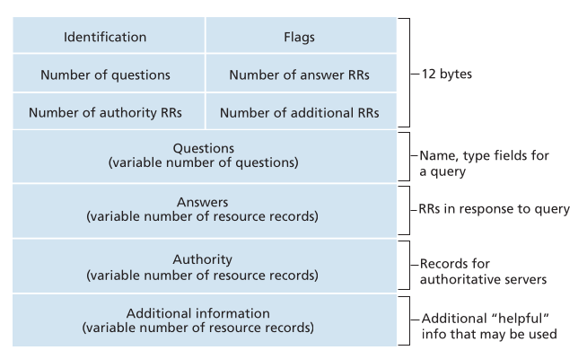
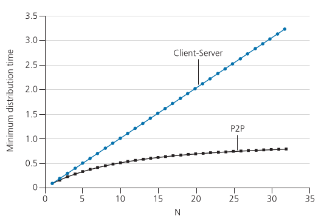

# ΗΥ335 Δίκτυα Υπολογιστών
## Κεφάλαιο 2 - Επίπεδο Εφαρμογής
## 2.1 Αρχές Διακτυακών Εφαρμογών
Αυτό το κεφάλαιο μετακινείται από την υποδομή του δικτύου στις **εφαρμογές** που αυτή υποστηρίζει. Το **επίπεδο εφαρμογής** είναι εκεί όπου βρίσκονται οι εφαρμογές δικτύου (όπως ο Ιστός, το email και το streaming) και τα **πρωτόκολλα επιπέδου εφαρμογής**.

### 2.1.1 Αρχιτεκτονικές Εφαρμογές Δικτύου
Η **αρχιτεκτονική μίας εφαρμογής** διαφέρει από την αρχιτεκτονική του ίδιου του δικτύου. Σχεδιάζεται από τον προγραμματιστή και καθορίζει **πώς η εφαρμογή κανανέμεται** στα διάφορα τελικά συστήματα.
Υπάρχουν δύο κύρια μοντέλα:
1. **Αρχιτεκτονική Πελάτη-Διακοσμιστή** (Client-Server)
	**Συστατικά**:
	- **Διακιμιστής (Server)**: Πάντα ενεργός υπολογιστής με σταθερή, γνωστή IP διέυθυνση. Εξυπηρετεί αιτήματα από πολλούς πελάτες
	- **Πελάτες (Clients)**: Υπολογιστές που επικοινωνούν με τον διακοσμιστή. Συνήθως έχουν δυναμικές IP διευθύνσεις και δεν επικοινωνούν απευθείας μεταξύ τους.
	**Παραδείγματα:** Web, FTP, Telnet, email
	**Επεκτασιμότητα**: Ένας μόνο διακοσμηστής μπορεί να υπερφορτωθεί. Για δημοφιλείς υπηρεσίες χρησιμοποιούνται **κέντρα δεδομένων (data centers)**  με χιλιάδες διακοσμιστές που λειτουργούν ως ένας "εικονικός υπερ-διακοσμιστής"
	**Χαρακτηριστικά**: Οι διακοσμιστές βρίσκονται σε **κεντρικά διαχρειριζόμενα data centers**, με υψηλό κόστος υποδομής και εύρους ζώνης.
2. **Αρχιτεκτονική Ομότιμων Κόμβων** (Peer-to-Peer, P2P)
	**Συστατικά**:
	- Ελάχιστη ή καθόλου εξάρτηση από συνεχώς ενεργούς διακοσμιστές
	- Οι εφαρμογές επιτρέπουν **άμεση επικοινωνία μεταξύ κόμβων (peers)** που συνδέονται περιστασιακά. Οι peers είναι συνήθως προσωπικοί υπολογιστές ή laptop χρήστων.
	**Παραδείγματα**: File-Sharing (BitTorrent), P2P messaging
	**Βασικά χαρακτηριστικά**:
	- **Αυτοεπεκτασιμότητα (Self-Scalability)**: Κάθε peer που ζητά αρχεία ταυτόχρονα συνεισφέρει ικανότητα υπηρεσίας διανέμοντας αρχεία σε άλλους. Περισσότερους χρήστες ➜ περισσότερη χωρητικότητα
	- **Οικονομικό Μοντέλο**: Δεν απαιτείται μεγάλη υποδομή διακομιστών
	- **Προκλήσεις**: Ασφάλεια, απόδοση και αξιοπιστία είναι πιο δύσκολο να διασφαλιστούν λόγω της αποκέντρωσης

#### Διαφορά Client-Server και P2P
Στην Αρχιτεκτονική **Client-Server** υπάρχει ένας κεντρικός server που διαχειρίζεται όλα τα αιτήματα και παρέχει υπηρεσίες ή δεδομένα στους clients, οι οποίοι επικοινωνούν μόνο μαζί του και όχι μεταξύ τους. 
Αντίθετα στην αρχιτεκτονική **P2P** δεν υπάρχει κεντρικός server, κάθε χρήστης λειτουργεί ταυτόχρονα σαν client και σαν server, ανταλλάσοντας δεδομένα απευθείας με άλλους χρήστες. 
Σε ορισμένες περιπτώσεις, το P2P μπορεί να χρησιμοποιεί βοηθητικούς servers μόνο για τον εντοπισμό peers, αλλά η ίδια η μεταφορά δεδομένων γίνεται αποκεντρωμένα.

### 2.1.2 Επικοινωνία Μεταξύ Διεργασίων
Στην καρδιά μιας εφαρμογής δικτύου βρίσκονται **διεργασίες** (processes) που εκτελούνται σε τελικά συστήματα και επικοινωνούν **ανταλλάσοντας μηνύματα** μέσω του δικτύου.
**Πελάτης και Διακοσμιστής**:
Για κάθε ζέυγος διεργασιών:
- **Πελάτης (Client)**: Αυτή που ξενικά την επικοινωνία
- **Διακοσμιστής (Server)**: Αυτή που περιμένει να δεχτεί αίτημα
Στις P2P εφαρμογές, μια διεργασία μπορεί να λειτουργεί και ως πελάτης και ως διακοσμιστής σε διαφορικές συνεδρίες.

#### Η Διασύνδεση Υποδοχής (Socket Interface)
Μια διεργασία στέλνει και λαμβάνει μηνύματα μέσω ενός socket - μίας λογισμικής διεπαφής
**Αναλογία**:
Η διεργασία είναι ένα σπίτι και το socket είναι η πόρτα του.
Το μήνυμα "βγαίνει" από την πόρτα και το δίκτυο το παραδίδει στην πόρτα του προορισμού

Το socket αποτελεί τη **διεπαφή μεταξύ του επιπέδου εφαρμογής και του επιπέδου μεταφοράς (transport layer)** 
Γνωστό και ως **API (Application Programming Interface)**
**Έλεγχος από τον προγραμματισή**:
- Πλήρης έλεγχος στο επίπεδο εφαρμογής
- Περιορισμένος έλεγχος στο επίπεδο μεταφοράς (κυρίως επιλογή πρωτοκόλλου και βασικών παραμέτρων)
#### Διευθυνσιοδότηση Διεργασιών
Για να λάβει μηνύματα μια διεργασία, χρειάζεται **διέυθυνση** που αποτελείται από:
1. **Διέυθυνση Υπολογιστή (IP Address)**: Μοναδικό 32-bit αναγνωριστικό
2. **Αριθμός Θύρας (Port Number)**: Καθορίζει τη συγκεκριμμένη υπηρεσία/διεργασία
**Παραδείγματα**:
HTTP ➜ θύρα 80
SMTP➜ θύρα 25
### 2.1.3 Υπηρεσίες Μεταφοράς Διαθέσιμες σε Εφαρμογές
Ο προγραμματιστής πρέπει να επιλέξει **πρωτόκολλο επιπέδου μεταφοράς** ανάλογα με τις ανάγκες της εφαρμογής.
**Κύριες Διαστάσεις Υπηρεσιών**:
- **Αξιόπιστη Μεταφορά Δεδομένων (Reliable Data Transfer)**:
	Εγγύηση ότι όλα τα δεδομένα παραδίδονται σωστά και πλήρως. Χρήσιμη για εφαρμογές όπως μεταφορά αρχείων ή τραπεζικές συναλλαγές.
- **Διεκπεραιωτική Ικανότητα**:
	Πόσα bits ανά δευτερόλεπτο μπορούν να μεταδοθούν.
	- Εφαρμογές που απαιτούν σταθερή απόδοση: τηλεφονία VoIP
	- "Ελαστικές" εφαρμογές (email, FTP) μπορούν να λειτουργήσουν με οποιοδήποτε ρυθμό.
- **Χρονισμός (Timing)**: 
	Εγγυήσεις καθυστέρησης παράδοσης. Απαραίτητες για εφαρμογές πραγματικού χρόνου
- **Ασφάλεια (Security)**: 
	Περιέχει κρυπτογράφιση, ακεραιότητα δεδομένων και αυθεντικοποίηση
### 2.1.4 Υπηρεσίες Μεταφοράς που Παρέχονται απο το Διαδίκτυο
Το Διαδίκτυο προσφέρει δύο κύρια πρωτόκολλα μεταφοράς: **TCP** και **UDP**
#### TCP (Transmission Control Protocol) - ο αξιόπιστος εργάτης
- **Συνδεστρεφές (Connection-oriented)**: Πραγματοποιεί handshake πριν την μεταφορά δεδομένων
- **Αξιόπιστη μεταφορά**: Όλα τα δεδομένα φτάνουν σωστά και με τη σωστή σειρά
- **Έλεγχος συμφόρησης**: Ρυθμίζει τη ροή όταν το δίκτυο είναι υπερφορτωμένο
- **Δεν παρέχει**: Εγγυήσεις χρονισμού, ελάχιστο ρυθμό μετάδοσης ή ασφάλεια
- **Ενισχύεται με TLS**: για ασφαλή μεταφορά
#### UDP (User Datagram Protocol) - απλό και γρήγορο
- **Χωρίς σύνδεση (Connectionless)**: Δεν υπάρχει handshake
- **Μη αξιόπιστο**: Τα πακέτα μπορεί να χαθούν ή να φτάσουν εκτός σειράς
- **Χωρίς έλεγχο συμφόρησης**: Ο αποστολέας μπορεί να στείλει όσο γρήγορα θέλει.
- **Κατάλληλο για**: Εφαρμογές ανεκτικές σε απώλειες, με απαιτήσεις χαμηλήες καθυστέρησης (πχ. streaming VoIP)

**Εστίαση στην Ασφάλεια - Το ασφαλές TCP**
Ούτε το **TCP** ούτε το **UDP** προσφέρουν κρυπτογράφηση από προεπιλλογή.
Για ασφάλεια χρεισιμοποιείται το **Transport Layer Security (TLS)**, που προσθέτει:
- Κρυπτογράφηση
- Ακεραιότητα δεδομένων
- Αυθεντικοποίηση ακρών
Το TLS υλοποιείται **πάνω από το TCP** μέσω ειδικών βιβλιοθηκών στο επίπεδο εφαρμογής
### 2.1.5 Πρωτόκολλα Επιπέδου Εφαρμογής (API)
Ένα πρωτόκολλο επιπέδο εφαρμογής καθορίζει πώς οι διεργασίες διαφορετικών συστήμάτων ανταλλάσουν μηνύματα.
**Ορίζει:** 
- Τύπους μηνυμάτων
- Συνατικτικό
- Σημασιολογία
- Κανόνες αλληλεπίδρασης
**Παράδειγμα διάκρισης:**
- Η εφαρμογή **Web** περιλαμβάνει HTML, browsers, servers και το HTTP πρωτόκολλο
- Η εφαρρμογή **Netflix** περιλαμβάνει servers, clients, συστήματα χρέσης και το Dash πρωτόκολλο
## 2.2 Ο Iστός και το Πρωτόκολλο HTTP
Ο παγκόσμιος Ιστός (Web) είναι μια επαναστατική εφαρμογή του Διαδικτύου που λειτουργεί **κατ' απαίτηση**, επιτρέποντας στους χρήστες να έχουν πρόσβαση σε **ό,τι** θέλουν, **όποτε** το θέλουν.
Το βασικό πρωτόκολλο είναι το **HTTP (Hyper Text Transfer Protocol)** 
### 2.2.1 Επισκόπηση του HTTP
**Oρισμός:**
Το HTTP είναι ένα πρωτόκολλο **πελάτη-διακοσμιστή**, υλοποιημένο σε δύο προγράμματα:
- **Πελάτης:** Πρόγραμμα περιήγησης (browser) όπως Chrome-Firefox
- **Διακοσμιστής:** Πρόγραμμα όπως Apache ή Microsoft IIS
Τα δύο προγράμματα επικοινωνούν ανταλλάσοντας HTTP μηνύματα

**Βασική Ορολογία:**
- Μία ιστοσελίδα αποτελείται απο **αντικείμενα (objects)** - αρχεία HTML, εικόνες, JavaScript κ.λπ.
- Κάθε αντικείμενο προσδιορίζεται από ένα **URL**
- Οι περισσότερες ιστοσελίδες περιλαμβάνουν **ένα βασικό αρχείο HTML** που αναφέρεται σε άλλα αντικείμενα
Πχ.
```
http://www.someSchool.edu/someDepartment/picture.gif
```
- **Hostname:** `www.someSchool.edu`
- **Pathname:** `/someDepartment/picture.gif`
**HTTP και TCP**
- Το HTTP χρησιμοποιεί το TCP ώς πρωτόκολλο μεταφοράς.
- Ο πελάτης ξεκινά πρώτα μια TCP σύνδεση με τον διακοσμιστή
- Το TCP εξασφαλίζει αξιόπιστη μεταφορά δεδομένων, επομένως το HTTP δεν χρειάζεται να ανησυχεί για χαμένα ή ανακατεμένα πακέτα.
- Το HTTP είναι stateless - Ο διακοσμιστής δεν αποθηκέυει πληροφορίες για προηγούμενα αιτήματα του πελάτη
Αυτό αποτελεί το σχεδιασμό των διακοσμιστών
### 2.2.2 Μη Παραμένουσες και Παραμένουσες Συνδέσεις
Ο προγραμματιστής πρέπει να αποφασίσει **αν πολλές αιτήσεις** θα χρησιμοποιούν την ίδια TCP διέυθυνση
#### HTTP με Μη Παραμένουσες Συνδέσεις (Non persistent)
- Κάθε ζευγος αιτήματος-απάντησης χρησιμοποιεί ξεψωριστή TCP σύνδεση
- Η σύνδεση κλείνει μόλις ο διακομιστής στείλει το αντικείμενο
**Παράδειγμα:**
Μια σελίδα με 1 αρχείο HTML και 10 εικόνες ➜ **11** TCP συνδέσεις
**Ανάλυση Χρόνου Απόκρισης (για ενα αντικείμενο):**
- **RTT (Round-Trip Time):** Χρόνος που χρειάζεται ένα πακέτα να πάει και να επιστρέψει
- **Συνολική καθυστέρηση ~ 2 RTT  + χρόνος μετάδοσης του αρχείου**
#### HTTP με Παραμένουσες Συνδέσεις (Persistent)
- Ο διακοσμιστής κρατά ανοιχτή τη TCP σύνδεση μετά την απάντηση
- Ο πελάτης μπορεί να στείλει επόμενα αιτήματα μέσω της ίδιας σύνδεσης
**Πλεονεκτήματα:**
- Μικρότερη καθυστέρηση (λιγότερα RTT)
- Λιγότερο φορτίο σε πόρους τους διακοσμιστή
- **Pipelining:** Ο πελάτης στέλνει πολλά αιτήματα συνεχόμενα χωρίς να περιμένει απαντήσεις
**HTTP/1.1** χρησιμοποιεί **persistent connections με pipelining** ως **προεπιλογή**
### 2.2.3 Μορφή Μηνυμάτων HTTP
Υπάρχουν δυο τύποι:
- **Μηνύματα Αιτήματος (Request)**
- **Μηνύματα Απόκρισης (Response)**
Όλα είναι αναγνώσιμα από άνρθωπο (ASCII κείμενο)
#### Μηνύματα Αιτήματος:
```yaml
GET /somedir/page.html HTTP/1.1
Host: www.someschool.edu
Connection: close
User-Agent: Mozilla/5.0
Accept-language: en
```
**Βασικά πεδία:**
- **Method:** γραμμή αίτησης, έχει τρία πεδία:
	1. πεδίο μεθόδου (`GET`, `POST`, `HEAD`, `PUT`, `DELETE`)
	2. πεδίο URL
	3. πεδίο έκδοσης HTTP
- **Host:** ποιος διακομιστής έχει το αντικείμενο
- **Connection:** `close`: μή επίμονη σύνδεση
- **User-Agent:** Τύπος προγράμματος περιήγησης
- **Accept-Language:** Προτίμηση γλώσσας χρήστη
#### Μήνυμα Απόκρισης:
```yaml
HTTP/1.1 200 OK
Connection: close
Date: Tue, 18 Aug 2015 15:44:04 GMT
Server: Apache/2.2.3 (CentOS)
Last-Modified: Tue, 18 Aug 2015 15:11:03 GMT
Content-Length: 6821
Content-Type: text/html

<data> ....
```
**Βασικά πεδία:**
- **Status Code & Phrase:** γραμμή κατάστασης, έχει τρία πεδία:
	 1. πεδίο έκδοσης πρωτοκόλλου
	 2. κωδικό κατάστασης
	 3. μήνυμα κατάστασης
- **Connection:** `close`: μή επίμονη σύνδεση (θα κλείσει το TCP αφού σταλθεί το μήνυμα)
- **Date:** Πότε ο διακοσμιστής εξυπηρέτησε το αίτημα
- **Server:** Πληροφορία για το λογισμικό του διακοσμιστή
- **Last-Modified:** Χρήσιμο για caching
- **Content-Length:** Μέγεθος αντικειμένου (bytes)
- **Content-Type:** Είδος περιεχομένου (πχ. `text/html`, `image/jpeg`)

**Συνηθισμένοι Κωδικοί Κατάστασης:**

| Κωδικός                          | Ερμηνεία                                         |
| -------------------------------- | ------------------------------------------------ |
| `200 OK`                         | Το αίτημα ολοκληρώθηκε επιτυχώς                  |
| `301 Moved Permanently`          | Το αντικείμενο μετακινήθηκε μόνιμα               |
| `400 Bad Request`                | Το αίτημα δεν έγινε κατανοητό από τον διακομιστή |
| `404 Not Found`                  | Το αντικείμενο δεν βρέθηκε                       |
| `505 HTTP Version Not Supported` | Μη υποσηριζόμενη έκδοση HTTP                     |
### 2.2.4 Αλληλεπίδραση Χρήστη-Εξυπηρετή: Cookies
Το HTTP είναι **stateless**, επομένως τα cookies επιτρέπουν στους ιστοποιούς να αναγνωρίζουν και να παρακολουθούν χρήστες.
**Τεσσερα Συστατικά της Τεχνολογίας Cookies:**
1. Μια γραμμή `Set-cookie`: Στην HTTP απόκριση
2. Μια γραμμή `Cookie`: στα επόμενα HTTP αιτήματα
3. Ένα **cookie file** αποθηκευμένο στο σύστημα του χρήστη (από τον browser)
4. Μία **βάση δεδομένων στον διακοσμιστή**

**Πώς λειτουργεί:**
1. Στην πρώτη επίσκεψη, ο διακομιστής δημιουργεί **μοδανικό ID** και το στέλνει στον χρήστη μέσω:
   ```javascript
   Set-cookie: 16778
   ```
2. Ο browser αποθηκέυει το cookie (ID + Hostname)
3. Σε κάθε επόμενο αίτημα ο browser στέλνει:
   ```javascript
   Cookie: 16778
   ```
4. Ο διακομιστής αναγνωρίζει τον χρήση, **παρακολουθεί τη δραστηριότητα του** και προσφέρει **εξατομικευμένες υπηρεσίες**
### 2.2.5 Προσωρινή Αποθήκευση Ιστού (Web Caching)
Μία **ενδιάμεση τιμή ιστού** ή **διακομιστής μεσολάβησης (proxy server)** είναι μια οντότητα του δικτύου που εξυπηρετεί **αιτήματα HTTP εκ μέρους** του αρχικού διακομιστή (origin server).
Διαθέτει **δικό του αποθηκευτικό χώρο (disk storage)** και **διατηρεί αντίγραφα** αντικειμένων που έχουν ζητηθεί πρόσφατα.

**Πώς λειτουργεί μια Web Cache**
1. Ο browser του χρήστη είναι ρυθμισμένος να στέλνει όλα τα αιτήματα HTTP στην Web cache
2. Όταν φτάσει ένα αίτημα:
	- **Cache Hit (Επιτυχία):**
	  Αν το αντικείμενο υπάρχει και είναι "φρέσκο", η cache επιστρέφει απευθείας στον browser
	   - Πολύ γρήγορη απόκριση, λιγότερη κυκλοφορία στο Ιντερνετ
	- **Cache Miss (Αποτυχία):**
	  Αν δεν υπάρχει η cache **πρωοθεί το αίτημα** στον αρχικό διακομιστή.
	  Όταν λάβει την απάντηση, αποθυκεύει ένα αντίγραφο και το στέλνει στον πελάτη.

**Γιατί Χρησιμοποιούμε Web Caching**
1. **Μείωση Χρόνου Απόκρισης:**
	-  Οι cache βρίσκονται συνήθως **κοντά στον χρήστη** (πχ. σε ένα πανεπιστήμιο ή εταιρικό LAN)
	-  Η ταχύτητα εντός LAN είναι πολύ μεγαλύτερη από τη σύνδεση προς το Internet
	-  Έτσι, μια cache hit δίνει πολύ πιο γρήγορη απάντηση
2. **Μείωση Κυκλοφορίας στο Δίκτυο Πρόσβασης του Οργανισμού:**
	- Οι αιτήσεις εξυπηρετούνται **εσωτερικά**, μειώνοντας το φορτίο προς το Internet
	- Επιτρέπει σε έναν οργανισμό να έχει **μικρότερη και φθηνότερη** σύνδεση
3. **Μείωση Συνολικής Κυκλοφορίας στο Internet:**
	- Οι δημοφιλείς σελίδες σε caches κοντά στους χρήστες **μειώνουν το φορτίο** στους αρχικούς διακομιστές και τα backbone links.
	- Βελτιώνεται η **συνολική απόδοση τους Διαδικτύου**

**Η GET Υπό Συνθήκη**
**Πρόβλημα**: Ένα αντικείμενο που υπάρχει στην cache μπορεί να παλιώσει (αν έχει ενημερωθεί στον αρχικό δικομιστή)
**Λύση**: Ο μηχανισμός conditional GET του HTTP
#### Παράδειγμα
**Πρώτο αίτημα (Cache miss):**
```yaml
GET /fruit/kiwi.gif HTTP/1.1
HOST: www.exotiquecuisine.com
```
**Απάντηση:**
```yaml
HTTP/1.1 200 OK
Date: Sat, 3 Oct 2015 15:39:29
Server: Apache/1.3.0 (Unix)
Last-Modified: Wed, 30 Sep 2015 09:23:24
Content-Type: image/gif

<data> ....
```
Η cache αποθυκέυει το αντικείμενο και την ημερομηνία **Last-Modified**

**Μεταγενέστερο αίτημα**
```yaml
GET /fruit/kiwi.gif HTTP/1.1
Host: www.exotiquecuisine.com
If-modified-since: Wed, 30 Sep 2015 09:23:24
```
**Δύο πιθανά Σενάρια:**
1. Το αντικείμενο **δεν** έχει αλλάξει
   απάντηση:
	```yaml
	HTTP/1.1 304 Not Modified
	Date: Sat, 10 Oct 2015 15:39:29
	Server: Apache/1.3.0 (Unix)
	```
	- O διακομιστής δεν στέλνει το αρχείο ξανά, μόνο μια μικρή απάντηση `304 Not Modified`
	- Η cache χρησιμοποιεί το δικό της αντίγραφο
2. Το αντικείμενο **έχει** αλλάξει
	- Ο διακομιστής στέλνει κανονικά ένα νέο `200 ΟΚ` με το ενημερωμένο αρχείο
	- Η cache το αποθηκέυει εκ νέου
### 2.2.6 HTTP/2
Το **HTTP/2** είναι μια μεγάλη αναθεώρηση του HTTP που στοχέυει στη μείωση καθυστερήσεων και στη βελτιστοποίηση χρήσης των πόρων του δικτύου.
#### Κύριοι στόχοι και χαρακτηριστικά:
- Ίδιες υψηλού επιπέδου έννοιες:
  Οι μεθόδοι (`GET`, `POST`), οι κωδικοί κατάστασης, τα URI και τα headers παραμένουν τα ίδια, υπάρχει δηλαδή πλήρης συμβατότητα **πρός και πίσω**
#### Μία Ενιαία, Επίμονη Σύνδεση
- Αντί να ανοίγει **πολλαπλές TCP συνδέσεις** όπως στο HTTP/1.1 το HTTP/2 επιτρέπει **όλα τα αιτήματα και τις απαντήσεις** να μοιράζονται **μια μόνο επιμονη TCP σύνδεση**
#### Πολυπλέξια (Multiplexing)
- Πολλαπλά αιτήματα και απαντήσεις μπορούν αν **συνυπάρχουν και να μεταδίδονται ταυτόχρονα** μέσα στην ίδια σύνδεση
- Ο πελάτης μπορεί αν στείλει **πολλά αιτήματα χωρίς να περιμένει** απαντήσεις
- Ο διακοσμιστής μπορεί να απαντήσει **με οποιαδήποτε σειρά**
Εξαλείφει το πρόβλημα **Head-Of-Line Blocking** που υπήρχε στο HTTP/1.1
#### Κατακερματισμός Μηνυμάτων (Message Framing)
- Κάθε μήνυμα (αίτημα ή απάντηση) χωρίζεται σε **μικρότερα κομμάτια (frames)** όπως:
	- Headers frames
	- Data frames
- Αυτά διαπλέκονται στη σύνδεση και ανασυντίθενται στην άλλη άκρη
#### Server Push
- Ο διακοσμιστής μπορεί να στείλει **πολλαπλές απαντήσεις για ενα αίτημα**
  Παράδειγμα: Όταν ο πελάτης ζητήσει μια HTML σελίδα ο διακοσμιστής μπορεί αν **προωθήσει** τα CSS και JavaScript αρχεία πρίν τα ζητήσει ο πελάτης
  ➜ μειώνει τον χρόνο φόρτωσης σελίδας
#### Συμπίεση Headers
- Το HTTP/2 χρησιμοποιεί το πρότυπο **HPACK** για συμπίεση των πεδίων header
  ➜ λιγότερο overhead, καλύτερη απόδοση
#### Πώς το επιτυγχάνει
Η βασική καινοτομία του HTTP/2 είναι η binary framing layer, ένα ενδιάμεσο στρώμα, ανάμεσα στο HTTP (εφαρμογή) και το TCP (μεταφορά).
Αυτό το στρώμα χειρίζεται την πολυπλεξία, τη διαχείριση των frames και τη συμπίεση, ενώ διατηεί το ίδιο API με το HTTP/1.1
## 2.3 Ηλεκτρονικό Ταχυδρομείο στο Διαδίκτυο
Το ηλεκτρονικό ταχυδρομείο του διαδικτύου βασίζεται σε **πολλαπλά πρωτόκολλα και συνιστώσες εφαρμογών**, που συνεργάζονται για να μεταφέρουν μηνύματα από τον αποστολέα στον παραλήπτη. Είναι ένα χαρακτηριστικό παράδειγμα πολύπλοκου συστήματος χτισμένου πάνω σε συνεργαζόμενα πρωτόκολλα.
### SMPT (Simple Mail Transfer Protocol)
Το **SMTP** είναι το βασικό πρωτόκολλο που χρησιμοποιείται για τη μεταφορά email μηνυμάτων από τον διακομιστή του αποστολέα στον διακομιστή του παραλήπτη. 
#### Χαρακτηριστικά
- **Push Control:**
  Το SMTP είναι πρωτόκολλο τύπου *push*, ωθεί δηλαδή τα μηνύμτα από τον πελάτη προς τον διακομιστή.
  ➜ αντίθετα το HTTP είναι πρωτόκολλο *pull*, όπου ο πελάτης ζητάει τα δεδομένα
- **Χρήση TCP:**
  Το SMTP χρησιμοποιεί TCP για αξιόπιστη μεταφορά δεδομένων
- **Άμεση Μεταφορά Διακομιστή-σε-Διακομιστή:**
  Τα μηνύματα **δεν πηγαίνουν** απευθείας από το πρόγραμμα του χρήστη του αποστολέα στο πρόγραμμα του παραλήπτεη, αλλά μέσω mail servers
#### Διαδικασία Επικοινωνίας
Έστω ότι ένα χρήστης (πχ. η Alice) θέλει να στείλει ένα απλό ascii μήνυμα σε έναν άλλο χρήστη (πχ. τον Bob):
1. Η Alice δίνει στον πράκτορα της επιλογής της το mail του Bob, συνθέτει το μήνυμα και λέει στον πράκτορα της να το στείλει
2. Ο πράκτορας στέλνει το μύνημα στον εξυπηρέτη ταχυδρομίου της όπου τοποθετείτε σε ουρά
3. Ο εξυπηρέτης βλέπει το μήνυμα στην ουρά  και ανήγει μια σύνδεση TCP στον εξυπηρέτη ταχηδρομείου του Bob
4. Μετά από χειραψία SMTP, ο πελάτης της Alice στέλνει το μύνημα στο TCP (εξυπηρέτης Bob)
5. Ο εξυπηρέτης του Bob λαμβάνει το μήνυμα και το τοποθετεί στην ταχυδρομική του θυρίδα
6. Ο Bob καλεί τον πράκτορα χρήστη του για να διαβάσει το μήνυμα όποτε θέλει ο ίδιος
#### Ιδιότητες του SMTP:
- **Persistent Connections:**
  Πολλά μηνύματα προς τον ίδιο server μπορούν να σταλούν μέσω μίας TCP σύνδεσης
- **7-bit ASCII:**
  Το SMTP σχεδιάστηκε αρχικά για **7-bit ASCII** δεδομένα
  Μη ASCII περιεχόμενο (πχ. εικόνες, κτλ) πρέπει να κωδικοποιηθεί πρίν την αποστολή
- **Πολλαπλά Αντικείμενα σε Ένα μήνυμα:**
  Ένα email μπορεί αν περιέχει **πολλαπλά αντικείμενα** αντίθετα με το HTTP που στέλνει κάθε αντικείμενο ξεχωριστά
#### Παράδειγμα Χειραψίας:
```yaml
S: 220 hamburger.edu
C: HELO crepes.fr
S: 250 Hello crepes.fr, pleased to meet you
C: MAIL FROM: <alice@crepes.fr>
S: 250 alice@crepes.fr... Sender ok
C: RCPT TO: <bob@hamburger.edu>
S: 250 bob@hamburger.edu... Recipient ok
C: DATA
S: 354 Enter mail, end with "." on a line by itself
C: Do you like ketchup?
C: How about pickles?
C: .
S: 250 Message accepted for delivery
C: QUIT
S: 221 hamburger.edu closing connection
```
### 2.3.2 Μορφές Μηνυμάτων Ταχυδρομείου
Όπως η HTTP, έτσι και το email έχει καθορισμένη μορφή μηνυμάτων
#### Δομή Μηνύματος 
- **Header:**
  Περιέχει γραμμές με λέξεις-κλειδιά και τιμές.
	- Υποχρεωτικά: `From:`, `To:`
	- Συχνά: `Subject:`, `Date:`, `Cc:`, `Reply-To:`
- **Body:**
  Το κυρίως περιεχόμενο του μηνύματος
  ➜ Διαχωρίζεται από την κεφαλίδα με **κενή γραμμή**
**Παράδειγμα Μηνύματος:**

```yaml
From: alice@crepes.fr
To: bob@hamburger.edu
Subject: Searching for the meaning of life.

Bob,
Are we just biological robots?
- Alice

```
### 2.3.3 Πρωτόκολλα Πρόσβασης Ηλεκτρονικού Ταχυδρομείου (Mail Access Protocols)
Αφού το μήνυμα φτάσει στον mail server του παραλήπτει και τοποθετηθεί στον mailbox, ο χρήστης πρέπει να μπορεί να το ανακτήσει (*pull*).
Αυτό γίνεται μέσω mail access protocols, τα οποία είναι pull protocols

#### Γιατί ξεχωριστό Πρωτόκολλο;

- Το **SMTP** είναι push protocol, φτιαγμένο για μεταφορά **μεταξύ mail servers**
- Οι υπόλογιστές των χρήστων δεν είναι πάντα ενεργοί και δεν έχουν σταθερή IP
  ➜ Δεν μπορούν να λειτουργούν ως mail servers
- Άρα, ο user agent χρησιμοποιεί άλλο πρωτόκολλο για να κατεβάσει το μήνυμα από τον server

#### Σηνήθη Πρωτόκολλα Πρόσβασης

1. POP3 (Post Office Protocol - Version 3)
	- Απλό, χωρίς κατάσταση 
	- **Φάσεις:**
		1. **Authorization**: Ο χρήστης εισάγει user και password
		2. **Transaction**: Κατεβάζει ή διαγράφει μηνύματα
	- **Λειτουργίες:**
		- **Download and Delete:**
		  Τα μηνύματα κατεβαίνουν και διαγράφονται από τον server
		  ➜ Δεν μπορείς να τα ξαναδείς από άλλη συσκευή
		- **Download and Keep:**
		  Κρατά αντίγραφα στον server, αλλά κατεβάζονται ξανά κάθε φορά
	- **Περιορισμός:**
	  Δεν επιτρέπει δημιουργία φακέλων ή οργάνωση μηνυμάτων στον server
2. IMAP (Internet Mail Access Protocol)
	- Πιο περίπλοκο αλλά πλούσιο σε δυνατότητες
	- **Κρατά όλα τα μηνύματα στον server**
	- Επιτρέπει:
		- Δημιουργία/Διαγραφή φακέλων
		- Μετακίνηση μηνυμάτων μεταξύ φακέλων
		- **Συγχρονισμένο mailbox** σε πολλές συσκευές
	- **Statefull Protocol:**
	  Ο server θυμάται την κατάσταση κάθε χρήστη (ποιο μήνυμα είναι διαβασμένο, ποιο διαγραμμένο κλπ.)
	- **Flags:** πχ. Seen, Answered, Deleted
3. HTTP (Web Based Email)
	- Χρησιμοποιείται από υπηρεσίες όπως **Gmail**, **Yahoo Mail**, **Outlook.com**
	- Ο χρήστης αλληλεπιδρά μέσω **web browser**, χρησιμοποιώντας **HTTP αιτήματα/απαντήσεις**
	- Ο web mail server στο παρασκήνιο χρησιμοποιεί SMTP για αποστολή παραλαβή email με άλλους server

#### Σύνοψη: Το Ταξίδι ενός Email

1. **Σύνταξη & Αποστολή:**
   Η Alice συντάσσει μήνυμα πρός τον Bob και πατάει "Send"
2. **Αποστολή στον Mail Server:**
   Ο user agent χρησιμοποιεί SMTP για να στείλει το μήνυμα στον mail server 
3. **Μεταφορά Διακομιστή-σε-Διακομιστή:**
   O crepes.fr (παράδειγμα αποστολέα) ενεργεί ως SMTP client, συνδέεται με τον SMTP server του hamburger.edu (παράδειγμα παραλήπτη) καιε μεταφέρει το μήνυμα
4. **Παράδοση στο Mailbox:**
   Ο server του hamburger.edu αποθηκεύει το μήνυμα στο mailbox του Bob
5. **Ανάκτηση από τον Παραλήπτη:**
   Ο Bob χρησιμοποιεί το email client του που μέσω POP3, IMAP ή HTTP τραβάει το μήνυμα από τον mail server

## 2.4 DNS - Η Υπηρεσία Καταλόγου Διαδικτύου

Tο **Domain Name System (DNS)** είναι μια **βασική υπηρεσία του Διαδικτύου** που μεταφράζει ονόματα υπολογιστών σαν `www.google.com` σε διευθύνσεις IP όπως `127.217.1.110`.
Ουσιαστικά λειτουργεί σαν ο "τηλεφωνικός κατάλογος του Διαδικτύου"

### 2.4.1 Υπηρεσίες που παρέχονται από το DNS

To DNS προσφέρει αρκετές κρίσιμες υπηρεσίες:
1. **Μετάφραση Ονόματος σε Διεύθυνση IP**
   Η βασική λειτουργία του DNS:
   Όταν μια εφαρμογή θέλει να επικοινωνήσει με έναν host, δίνει το όνομα (hostname), και το DNS επιστρέφει τη διέυθυνση IP
2. **Host Aliasing**
   Ένα host μπορεί να έχει ένα πολύπλοκο **κανονικό όνομα (canonical name)** πχ. `realy1.west-coast.enterprise.com` αλλά να διαθέτει απλούστερα ονόματα-ψευδώνυμα (aliases) όπως `enterprise.com` ή `www.enterprise.com`. Το DNS μπορεί να σπιτρέψει το κανονικό όνομα και τη διεύθυνση IP του.
3. **Mail Server Aliasing**
   Αντίστοιχα, όπως στο Host Aliasing, το DNS μεταφράζει **domain aliases email** στο κανονικό όνομα του mail server, χρησιμοποιώντας το **MX record** (*Mail Exchange*).
4. **Κατανομή Φόρτου (Load Distribution)**
   Για δημοφιλείς ιστοσελίδες με μεγάλη επισκεψιμότητα, η κίνηση κατανέμεται σε **πολλαπλούς servers** με διαφορετικές IP. Το DNS αποθηκέυει όλες αυτές τις IP και τις **εναλλάσει** στις απαντήσεις του (round-robin), επιτυγχάνοντας **απλή ισορροποία φόροτυ**

### 2.4.2 Επισκόπηση του Τρόπου Λειτουργίας του DNS

Το DNS είναι ένα κατανεμημένο, ιεραρχικό σύστημα βάσεων δεδομένων, υλοποιημένο σε ιεραρχία DNS server, και παράλληλα ένα πρωτόκολλο επιπέδου 
εφαρμογής που επιτρέπει επικοινωνία host - DNS server.

#### Γιατί Κατανεμημένο και Ιεραρχικό;

Ένας ενιαίος, κεντρικός DNS server θα ήταν:
- **Μοναδικό σημείο αποτυχίας** (single point of failure)
- **Υπερβολική πηγή κίνησης** (ολα τα look ups θα περνούσαν από αυτόν)
- **Αργός για απομακρυσμένους χρήστες**
- **Δύσκολος στην συντήρηση και ενημερώση**

#### Η Ιεραρχία DNS: Μία Κατανεμημένη Βάση Δεδομένων

Το DNS χωρίζεται σε τρία βασικά επίπεδα:
1. **Root DNS Servers**
	- Υπάρχουν 13 λογική root servers (A-M) με πάνω από 1.000 φυσικά instances παγκοσμίως
	- Παρέχουν διευθύνσεις IP των TLD servers
2. **Top-Level Domain (TLD) Servers**
	- Υπεύθυνοι για τα ανώτατα domains όπως `.com`, `.org`, `.net`, `.edu`, αλλά και για country-code TLD 's όπως `.uk`, `.jp`, `.gr`
	- Παρέχουν τις IP των authoritative DNS server
3. **Authoritative DNS server**
	- Κάθε οργανισμός που διαθέτει δημόσιους hosts πρέπει να έχει δημόσια DNS records που αντιστοιχούν τα host-names σε IP
	- Αυτά τα records φυλάσονται στους authoritative servers
	- Ο οργανισμός μπορεί να διαχειρίζεται τον δικό του server ή να χρησιμοποιεί υπηρεσίες τρίτων
#### Τοπικός DNS server (Local/Default Name Server)
- Δεν ανήκει επίσημα στην ιεραρχία, αλλά είναι κρίσιμος για την απόδοση
- Συνήθως βρίσκεται κοντά στον χρήστη - πχ. στον ISP ή στο δίκτυο ενός πανεπιστημίου.
- Όταν ένας host κάνει DNS query, το στέλνει στον τοπικό DNS server, ο οποίος ενεργεί ως proxy και προωθεί το αίτημα προς την ιεραρχία DNS.
#### DNS Caching - Το Κλειδί της Απόδοσης
Για να μειωθεί η καθυστέρηση και η κλινηση στο δίκτυο:
- Οι DNS servers αποθηκέυουν προσωρινά (cache) τα mappings που λαμβάνουν 
- Επόμενα ερωτήματα για το ίδιο host-name εξυπηρετούνται άμεσα από την cache
- Τα δεδομένα cache διαγράφονται μετά από ορισμένο χρόνο (TTL - Time To Live)
### 2.4.3 Εγγραφές και Μηνύματα DNS
Η **κατανεμημένη DNS βάση δεδομένων** αποτελείται από **Resource Records (RRs)**, τα οποία είναι αποθηκευμένα στους authoritative servers.
#### Resource Records (RRs)
Κάθε εγγραφή έχει την μορφή:
```yaml
(Name, Value, Type, TTL)
```
Η σημασία του `Name` και `Value` εξαρτάται από το `Type`, συγκκεκριμμένα:

| `Type`  | Name/Value                                                       | Παράδειγμα                                                 |
| ------- | ---------------------------------------------------------------- | ---------------------------------------------------------- |
| `Α`     | Name: όνομα υπολογιστή<br>Value: διέυθυνση υπολογιστή            | `Name: relay1.bar.foo.com`<br>`Value: 145.37.93.126`       |
| `NS`    | Name: τομέας<br>Value: όνομα αυθεντικού εξυπηρέτη DNS            | `Name: foo.com`<br>`Value: dns.foo.com`                    |
| `CNAME` | Name: ψευδώνυμο υπολογιστή<br>Value: όνομα υπολογιστή            | `Name: www.ibm.com`<br>`Value: servereast.backup2.ibm.com` |
| `MS`    | Name: ψευδώνυμο υπολογιστή<br>Value: όνομα εξυπηρέτη ταχυδρομίου | `Name: yahoo.com`<br>`Value: mta7.am0.yahoodns.net`        |
#### DNS Messages
Υπάρχουν δύο είδη DNS μηνυμάτων - **ερωτήματα (queries)** και **απαντήσεις (replies)**. Και τα δύο έχουν ίδια μορφή, με τις εξής ενότητες:
1. **Header Section** - 12 bytesμε βασικά πεδίο ελέγχου
	- **Identification**: 16 bit αριθμός που συνδέει query/reply
	- **Flags**:
		- *Query/Reply*: Αν είναι ερώτηση (`0`) ή απάντηση (`1`)
		- *Authoritative*: Αν η απάντηση προέρχεται από authoritative server
		- *Recursion Desired*: Ζητείται από τον server να εκτελέσει αναδρομική αναζήτηση
		- *Recursion Available*: Δηλώνει αν ο server υποστηρίζει recursion
	- **Counters**: Αριθμοί εγγραφών για τις επόμενες ενότητες
2. **Quesion Section**
   Περιέχει το ερώτημα (hostname + τύπος record)
3. **Answer Section**
   Περιλαμβάνει τα RR που απαντούν στο ερώτημα (το "payload" της απάντησης)
4. **Authority Section**
   Περιέχει πληροφορίες για άλλους authoritative servers (συνήθως NS records)
5. **Additional Section**
   Περιέχει πρόσθετα χρήσιμα records
   Πχ. αν το Answer Section έχει CNAME, εδώ μπορεί να περιέχεται το A record του κανονικού ονόματος

<p align="center">
  
</p>

## 2.5 Διανομή Αρχείων Μεταξύ Ομοτίμων

Αυτό το κεφάλαιο εξετάζει πώς λειτουργεί ο διαμοιρασμός αρχείων σε μία αρχιτεκτονική Perr-to-Peer (P2P), σε σύγκριση με το παραδοσιακό μοντέλο πελάτη-διακομιστή.
Το βασικό συμπεράσμα είναι ότι οι αρχιτέκτονες P2P είναι **υψηλά αυτο-επεκτάσιμες**.

### Κλιμάκωση Αρχιτεκτονικών P2P

Για να καταλάβουμε τη δύναμη του P2P, πρέπει πρώτα να δούμε τους περιορισμούς του client-server μοντέλου όταν θέλουμε να διανείμουμε ένα μεγάλο αρχείο.

**Παράδειγμα:**
Ένας διακομιστής πρέπει να διανείμει ένα αρχείο μεγέθους **F bits** σε **N peers**.
Κύριο μέγεθος μέτρησης θα είναι ο χόνος διανομής, δηλαδή ο χρόνος που χρειάζεται ώστε όλα τα N peers να λάβουν το αρχείο.

**Παράμετροι:**
- $u_s$: Ρυθμός αποστολής του server
- $d_i$: Ρυθμός λήψης κάθε peer
- $u_i$: Ρυθμός αποστολής κάθε peer

#### Χρόνος Διανομής στο Client-Server:

1. **Αποστολή από τον Server:**
	- Ο server πρέπει να στείλει ολόκληρο το αρχείο σε κάθε peer
	- Συνολικά πρέπει να μεταδώσει $NF$ bits
	- Χρονος: $\frac{NF}{u_s}$
2. **Λήψη από Peer:**
	- Ο πιο αργός peer καθορίζει τον ελάχιστο χρόνο λήψης
	- Αν ο πίο αργός έχει ρυθμό $d_{min}$ τότε:
	  Χρονος: $\frac{F}{d_{min}}$
3. **Συνολικός Χρονος διανομής:**
   $$ D_{c-s} = \text{max} \biggl\{ \frac{NF}{u_s}, \frac{D}{d_min} \biggl\} $$

**Πρόβλημα:** Ο χρόνος διανομής αυξάνεται γραμμικά με το N. Όσο περισσότεροι peers ζητούν το αρχείο, τόσο πιο αργά εξυπηρετούνται όλοι.

#### Χρόνος Διανομής στο Peer-to-Peer (P2P)

Στο P2P μοντέλο, οι peers κατεβάζουν αλλά και ανεβάζουν (ανταλλάσουν κομμάτια του αρχείο μεταξύ τους).
**Συνιστώσες Χρόνου Διανομής:**
1. **Αποστολή από τον Server**
	- Ο server χρειάζεται μόνο να στείλει μία πλήρη αντιγραφή του αρχείου στο δίκτυο
	- Χρόνος: $\frac{F}{u_s}$
2. **Λήψη του πιο Αργού peer**
	- O πιο αργός peer πρέπει να λάβει $F$ bits
	- Χρόνος: $\frac{F}{d_{min}}$
3. **Συνολική Ικανότητα Αποστολής του Συστήματος**
	- Δεν περιορίζεται πιο μόνο στον server
	- Τώρα είναι το άθροισμα όλων των ρυθμών αποστολής:
	  $$ u_s + \sum u_i $$
	- Συνολικά πρέπει να διανεμηθούν $NF$ bits άρα:
	  $$ \text{Χρόνος} = \frac{NF}{u_s + \sum u_i} $$
4. **Συνολικός χρόνος διανομής στο P2P:**
$$ D_{P2P} = \text{max} \Biggl\{ \frac{F}{u_s}, \frac{F}{d_{min}}, \frac{NF}{u_s + \sum u_i} \Biggl\} $$
Η διαφορά μπορεί να μήν φαίνεται μεγάλη, πράγμα που ισχύει, ιδιαίτερα για μιρκότερες τιμές $N$, όσο όμως αυτό αυξάνεται, ο Client-Server επίσης αυξάνεται γραμμικά ενώ ο P2P παραμένει σχεδον σταθερός:

<p align="center">
  
</p>

**Γιατί το P2P είναι Αυτο-Επεκτάσιμο;**

- Η **ζήτηση** αυξάνεται με το $N$
- Όμως η ικανότητα εξυπηρε´τησης ($u_s + \sum u_i$) αυξάνεται επίσης με το $N$
- Κάθε νέος peer φέρνει καινούργια ζήτησ, αλλά και καινούργιους πόρους (upload bandwidth)
- Έτσι το σύστημα δεν επιβαρύνεται όσο μεγαλώνει

#### BitTorrent: Ένα Δημοφιλές Πρωτόκολλο P2P

Το **BitTorrent** είναι ένα πρωτόκολλο που εφαρμόζει αποτελεσματικά το μοντέλο P2P για τη διανομή μεγάλων αρχείων.

**Βασικές Έννοιες:**
- Torrent: Το σύνολο όλων των peers που συμμετέχουν στη διανομή ενός αρχείου
- Τμηματοποίηση Αρχείου
  Το αρχείο χωρίζεται σε μικρότερα κομμάτια 
  Οι peers κατεβάζουν και ανεβάζουν διαφορετικά chunks μεταξύ τους
- Tracker:
  Όταν ένας peer ενώνεται σε ένα torrent, συνδέεται με έναν tracker server, ο οποίος κρατά λίστα με τους ενεργούς peers και του προτείνει σε ποιους να συνδεθεί.

#### Πώς οι peers Κατεβάζουν και Ανεβάζουν:

**Rarest First:**
- Κάθε peer δίνει προτεραιότητα στο σπανιότερο chunk που έχει διαθέσιμο το δίκτυο
- Αυτό διασφαλίζει ότι όλα τα κομμάτια του αρχείου παραμένουν διαθέσιμα στην κοινότητα

**Αλγόριθμος Tit-for-Tat**
- Ο πυρήνας της καινοτομίας του BitTorrent
- Βασίζεται στη θεωρία παιγνίων: επιβραβέυει όσους μοιράζονται και τιμωρεί όσους "απλώς κατεβάζουν"
- Unchoking: Κάθε peer ανεβάζει δεδομένα μόνο σε λίογυς (πχ. 4) γείτονες κάθε φορά
	- **Επιλογή Unchoked Peers:** Κάθε 10 δευτερόλεπτα, ο peer μετρά τους ρυθμούς λήψης από 
  τους γείτονες του και "ανοίγει" εκείνους που του δίνουν τα καλύτερα rates.
	- **Optimistic Unchoking:** Περιοδικά, ένας peer κάνει **random unchoke** σε έναν νέο γείτονα, αυτό επιτρέπει:
		- την ανακάλυψη νέων, πιο γρήγορων συνεργατών
		- τη συμμετοχή νέων peers που δεν έχουν ακόμα chunks να προσφέρουν
## 2.6 Βίντεο Συνεχούς Ροής και Δίκτυα Διανομής Περιεχομένου
### 2.6.1 Βίντεο Διαδικτύου
Το βίντεο είναι ο **μεγαλύτερος καταναλωτής εύρους ζώνης** στο Διαδίκτυο.
Βασικά χαρακτηριστικά:
- **Yψηλό Bitrate:**
  Τα αρχεία βίντεο είναι τεράστια. Ένα ασυμπίεστο HD βίντεο μπορεί να απαιτεί **gigabits ανά δευτερόλεπτο.**
- **Αναγκαία Συμπίεση:**
  Η συμπίεση μειώνει δραστικά το bitrate - συχνά κατά **100 φορές** ή και περισσότερο
- **Μεταβλητό Bitrate (VBR):**
  Το Bitrate ενός συμπιεσμένου βίντεο **μεταβάλλεται δυναμικά**, ανάλογα με τη σκηνή 
### 2.6.2 Ροή μέσω HTTP και DASH
Στο HTTP streaming, ένα βίντεο αποθηκέυεται απλώς σε έναν HTTP server ώς ένα κανονικό αρχείο.
Ο client (πχ. broswer ή εφαρμογή) το κατεβάζει μέσω `HTTP Get` αιτήσεων.
**Το Πρόβλημα:**
Διαφορετικοί χρήστες έχουν διαφορετικές δυνατότητες δικτύου:
- Ένας χρήστης με οπτική ίνα μπορεί να δεί 4K χωρίς πρόβλημα
- Ένας χρήστης σε κινητό πρέπει να δει χαμηλότερη ποιότητα
**Πώς αποφασίζει ο server ποια έκδοση του βίντεο θα στείλει;**
#### Dash (Dynamic Adaptive Streaming over HTTP)
Το **Dash** λύνει αυτό το πρόβλημα και αποτελεί τη βάση για υπηρεσίες όπως Netflix, YouTube, Hulu
**Κεντρική ιδέα**:
Το βίντεο κωδικοποιείται σε **πολλαπλές εκδόσεις**, καθεμία με διαφορετικό bitrate και ανάλυση.
**Manifest File**:
Ο server παρέχει στον client ένα manifest αρχείο, που περιέχει τις διευθύνσεις (URLs) όλων των διαθέσιμων εκδόσεων και τα αντ´σιτοιχα bitrates τους.
**Προσαρμογή από τον Client**:
Ο client επιλέγει **δυναμικά** ποιο chunk (τμήμα) να κατεβάσει ανάλογα με τις τρέχουσες συνθήκες του δικτύου του.
- Αν η ταχύτητα είναι υψηλή -> ζητά chunk υψηλού bitrate
- Αν πέσει το bandwidth -> επιλέγει χαμηλότερης ποιότητας chunk για να **αποφύγει buffering**
**Πλεονεκτήματα DASH**:
- Ευφυΐα στην πλευρά του client:
  Ο client γνωρίζει καλύτερα την κατάσταση του δικτύου και τη χωρητικότητα της μνήμης του.
- Απλότητα για τον server:
  Ο server απλώς αποθηκέυει **στατικά αρχεία** - δεν χρειάζεται να διαχειρίζεται ενεργές συνεδρίες
### 2.6.3 Δίκτυα Διανομής Περιεχομένου (CDNs)
Η διανομή τεράστιων αρχείων βίντεο (και άλλου web περιεχομένου) σε εκατομμύρια χρήστες δεν μπορεί να γίνει από έναν μόνο server.
**Προβλήματα ενός "Mega-Server"**
- **Καθυστέρηση (Latency)**:
  Οι χρήστες μακριά από τον server βιώνουν μεγάλες καθυστερήσεις.
- **Υπερφόρτωση Εύρους Ζώνης**:
  Ο server και οι γραμμές πρόσβασης του δεν μπορούν να αντέξουν τον όγκο κίνησης
#### Τί είναι ένα CDN;
Ένα **Content Distribution Network (CDN)** διαχειρίζεται **πολλαπλά, γεωγραφικά κατανεμημένα** clusters από servers. Το CDN κατυθύνει κάθε χρήστη στον πλησιέστερο server για ταχύτερη εξυπηρέτηση.
#### Δύο Βασικές Στρατηγικές Τοποθέτησης Servers:
1. **Enter Deep**
	- Πολλοί μικροί servers τοποθετημένοι **βαθιά μέσα στα δίκτυα πρόσβασης**
	- Στόχος: Ελάχιστη καθυστέρηση, βελτιωμένη εμπειρία χρήστη
	- Δυσκολία: Πολύπλοκη διαχείρηση και συντήρηση χιλιάδων τοποθεσίων
	- Παράδειγμα Πολλά από τα data centers της Google
2. **Bring Home**
	- Λίγα αλλά **μεγάλα** cluster servers τοποθετημένα σε σημεία ανταλλαγής Internet (IXPs)
	- Στόχος: Μειωμένο κόστος και πολυπλοκότητα, με σημαντική βελτίωση απόδοσης
	- Παράδειγμα: Χρησιμοποιείται από μικρότερους CDN παρόχους
#### Πώς λειτουργεί ένα CDN
<<<<<<< Updated upstream

Τα βήματα που γίνονται όταν ένας πελάτης θέλει να προσβάσει ένα βίντεο απο μία ιστοσελίδα είναι:
1. Ο χρήστης επισκέπτεται την ιστοσελίδα
2. Ο χρήστης πατάει σε ένα βίντεο και η ιστοσελίδα στέλνει ένα ερώτημα DNS
3. Ο τοπικός εξυπηρέτης DNS καλεί έναν *αυθεντικό εξυπηρέτει DNS* που το επιστρέφει το όνομα ενός υπολογιστή
4. ο τοπικός εξυπηρετής DNS στέλνει στον υπολογιστή ένα αίτημα ο οποίος του απαντάει τελικά με μια διευθυνση IP ενός εξυπηρέτη περιεχομένου
5. Ο τοπικός εξυπηρετής προωθεί την διευθυνση IP στον υπολογιστή του χρήστη
6. Ο χρήστης κάνει `HTTP GET` στον εξυπηρέτη περιεχομένου για το βίντεο

</br>

1. Στρατηγική Επιλογής Cluster
   Όταν ένας χρήστης ζητά περιεχόμενο, το CDN πρέπει να τον κατευθύνει στο κατάλληλο cluster
	- Στόχος: Να επιλέξει το cluster που προσφέρει την καλύτερη εμπειρία
	- Απλή προσέγγιση: Ο **πιο κοντικός** γεωγραφικά server (δεν λειτουργεία πάντα καλά)
	- Προηγούμενη προσέγγηση: Το CDN μετρά περιοδικά καθυστερήσεις και απώλειες μεταξύ των clusters και των DNS servers των χρήστων, ώστε να λαμβάνει **δυναμικές αποφάσεις σε πραγματικό χρόνο**.

### 2.6.4 Παραδείγματα: Youtube και Netflix
#### Netflix
- Ανέβασμα
	Η Netflix ανεβάζει ολόκληρη τη βιβλιοθήκη της στο ιδιωτικό της CDN που ακολουθεί τη στρατηγική "**bring home**", με τεράστια IXP's και data cetners ISP's
- Αίτημα ΧρήστηQ
	1. Ο χρήστης ανήγει την εφαρμογή -> επικοινωνεί με τους API servers της Netflix για έλεγχει ταυτότητας
	2. Λαμβάνει το manifest file (DASH)
	3. Η εφαρμογή χρησιμοποιεί τον **cluster selection service** για να επιλέξει τον βέλτιστο CDN server
	4. Το streaming γίνεται απευθείας από αυτόν τον CDN server μέσω DASH

#### YouTube
- Ανέβασμα
	Οι χρήστες ανεβάζουν τα βίντεο τους σε λίγα κεντρικά data cetners της YouTube.
- Διανομή:
	Η YouTube χρησιμοποιεί **μεικτό σύστημα** - δικό της CDN αλλά και συνεργασίες με τρτους CDN παρόχους, συμπεριλαμβανομένου του παγκόσμιου CDN της Google
- Αίτημα Χρήστη
	1. Όταν κάποιος ζητά ένα βίντεο, το αίτημα περνά μέσα από την υποδομή της Google
	2. Ο αλγόριθμος επιλογής cluster της Google κατυεθύνει το αίτημα στο κατάλληλο CDN cache server
	3. Το βίντεο γίνεται stream από εκείνον τον server προς τον χρήστη
	4. Και εδώ χρησιμοποιείται ευρέως το DASH
   
## 2.7 Προγραμματισμός Υποδοχών: Δημιουργία Δικτυακών Εφαρμογών
Σε αυτό το κεφάλαιο, περνάμε από τη θεωρία στην πράξη: βλέπουμε πώς υλοποιούνται στην πράξη οι δικτυακές εφαρμογές, χρησιμοποιόντας τη διεπαφή socket. Ο στόχος είναι αν κατανοήσουμε πώς γράφονται προγράμματα που επικοινωνούν μέσω δικτύου.

### 2.7.1 Προγραμματισμός Sockets με UDP
Το UDP είναι πρωτόκολλο χωρίς σύνδεση. Δεν πραγματοποιείται χειραψία (handshaking) μεταξύ αποστολέα και παραλήπτη, και τα πακέτα μπορεί να χαθούν ή να φτάσουν εκτός σειράς.
**Βασικές έννοιες UDP Sockets:**
- Χωρίς Σύνδεση:
	Ο client και ο server **δεν** δημιουργούν μόνιμη σύνδεση πριν την ανταλλαγή δεδομένων
- Διευθυνσιοδοτημένα Πακέτα:
	Κάθε φορά που στέλνεται πακέτο, ο αποστολέας πρέπει να δηλώσει τη διεύθυνση IP και την πόρτα του παραλήπτη.
- "Send and Pray":
	Η αποστολή γίνεται χωρίς εγγύηση παράδοσης - ο αποστολέας απλώς "ελπίζει" ότι το πακέτο θα φτάσει

#### Ροή επικοινωνίας UDP Client-Server
1. Εγκατάσταση Server
   - Ο server ξεκινά πρώτος **δημιουργεί UDP socket**
   - Δεσμέυει (bind) το socket σε **συγκεκριμμένη πόρτα**
   - Περιμένει **εισερχόμενο datagram** 
2. Ενέργεια Client
	 - Ο client δημιουργεί UDP socket
	 - Συντάσσει datagram με τα δεδομένα και τη διευθυνση (IP, port) του server
	 - Στέλνει το datagram στο δίκτυο μέσω του socket του.
3. Επικοινωνία
	 - Ο server λαμβάνει datagram, επεξεργάζεται το αίτημα και εξάγει τη διέυθυνση του client
	 - Δημιοργεί datagram απόκρισης και το στέλνει πίσω στον client
	 - Ο client λαμβάνει την απόκρηση

#### UDP σε python:
##### Ο κώδικας από την μεριά του πελάτη:
```python
from socket import *

serverName = 'hostname'
serverPort = 12000
clientSocket = socket(AF_INET, SOCK_DGRAM)
message = input('Input lowercase sentence: ')
clientSocket.sendto(message.encode(),(serverName, serverPort))
modifiedMessage, serverAddress = clientSocket.recvfrom(2048)
print(modifiedMessage.decode())
clientSocket.close()
```

Ας αναλύσουμε τώρα μία μια τις γραμμές: 
- `from socket import *`
	Βιβλιοθήκη `socket` περιέχε τις συναρτήσεις που χρειαζόμαστε
- `serverName = 'hostname'`
	Εδώ βάζουμε κανονικά ή την διέυθυνση IP ή το όνομα του υπολογιστή εξυπηρετή
- `serverPort = 12000`
	Η θύρα στην οποία 'ακούει' ο εξυπηρετής
- `clientSocket = socket(AF_INET, SOCK_DGRAM)`
	Δημιουργεί την υποδοχή πελάτη, παράμετροι:
	- `AF_INET`: οικογένεια της διέυθυνσης (IPv4 στην προκειμένη περίπτωση)
	- `SOCK_DGRAM`: υποδηλώνει τον τύπο της υποδοχής (UDP στην προκειμένη περίπτωση)
	
	το λειτουργικό σύστημα καθορίζει τον αριθμός της θύρας υποδοχής
- `message = input('Input lowercase sentence: ')`
	Διαβάζουμε είσοδο από τον χρήστη
- `clientSocket.sendto(message.encode(), (serverName, serverPort))`
	- `message.encode()`: μετατρέπουμε την είσοδο από string σε byte stream
	- `clientSocket.sendto()`: στέλνει το πακέτο στην υποδοχή προορισμού
- `modifiedMessage, serverAddress = clientSocket.recvfrom(2048)`
	Διαβάζουμε οτιδήποτε έρθει μέσα από το `clientSocket` με μέγιστο μέγεθος του byte stream `2048`
	- `serverAddress`: Η διέυθυνση προέλευσης του πακέτου
	- `modifiedMessage`: Το πακέτο που πήραμε σε μορφή byte stream
- `print(modifiedMessage.decode())`
	Εκτυπώνουμε το μύνημα αφού το μετατρέψουμε πάλι σε string
- `clientSocket.close()`
	Κλέινουμε την υποδοχή

##### Ο κώδικας από την μεριά του εξυπηρετή:
```python
from socket import * 

serverPort = 12000
serverSocket = socket(AF_INET, SOCKET_DGRAM)
serverSocket.bind(('',severPort))
print('Server is ready to receive')
while True:
	message, clientAddress = serverSocket.recvfrom(2048)
	modifiedMessage = message.decode.upper()
	serverSocket.sendto(modifiedMessage.encode(), clientAddress)
```

- `while True`
	Για να μπορούμε να δεχόμαστε και επεξεργαζόμαστε πακέτα επ' άπειρον
- `serverSocket.bind()`
	Συνδέει τον αριθμό θύρας στην υποδοχή του εξυπηρετή
- `modifiedMessage = message.decode.upper()`
  Μετατρέπουμε το byte stream σε string και κάνουμε όλα τα γράμματα κεφαλαία
- Οι υπόλοιπες συναρτήσεις είναι οι ίδιες με αυτές που έχει ο πελάτης

### 2.7.2 Προγραμματισμός Υποδοχών με TCP
Το TCP (Transmission Control Protocol) είναι πρωτόκολλο με σύνδεση (connection oriented). Πρίν ανταλλαχτούν δεδομένα, client και server πρέπει πρώτα να εγκαταστήσουν μια TCP σύνδεση.

#### Βασικές Έννοιες TCP
- **Με σύνδεση:**
	Η επικοινωνία απαιτεί **εγκατάσταση σύνδεσης** μεταξύ των δύο διεργασιών
- **Αξιόπιστο Ρεύμα Byte:** 
  Τα δεδομένα μεταφέρονται ως **συνεχές, αξιόπιστο ρεύμα bytes** - χωρίς διαχωρισμό μηνυμάτων. Η εφαρμογή πρέπει να ορίσει μόνη της τα όρια των μηνυμάτων.
- **Δύο είδη sockets στον server**
  - Welcoming Socket: περιμένει αιτήσεις σύνδεσης
  - Connection Socket: εξυπηρετεί έναν συγκεκριμμένο client αφού γίνει η σύνδεση

#### Ροή Επικοινωνίας TCP Client-Server
1. Εγκατάσταση Server
   - Ο server ξεκινά πρώτος δημιουργεί welcoming socket
   - Το δεσμέυει (`bind`) σε συγκεκριμμένη διέυθυνση/θύρα
   - Καλεί `socket.listen()` για να περιμένει συνδέσεις
2. Εγκατάσταση Σύνδεσης (Three-Way Handshake)
   - O client δημιουργεί TCP socket και κάνει `socket.connect()`
   - Ο server δέχεται τη σύνδεση με `socket.accept()`
   - Η `accept` επιστρέφει νέο connection socket αφιερομένο στον client, ενώ το welcoming socket παραμένει ανοικτό για άλλες συνδέσεις
3. Επικοινωνία
   - Client και Server ανταλλάσουν δεδομένα μέσω `socket.send()` και `socket.recv()`
   - Το TCP υλοποιεί αξιοπιστία και παράδοση με σωστή σειρά στο επίπεδο του λειτοθργικού συστήματος
4. Κλείσιμο Σύνδεσης
   - Όταν ολοκληρωθεί η επικοινωνία, κάθε πλευρά μπορεί να κλείσει τη σύνδεση με `socket.close()`

##### Ο κώδικας από την μεριά του πελάτη:
```python
from socket import *

serverName = 'serverName'
serverPort = 12000
clientSocket = socket(AF_INET, SOCK_STREAM)
clientSocket.connect((ServerName,ServerPort))
message = input('Input lowercase sentence: ')
clientSocket.send(message.encode())
modifiedSentence = clientSocket.recv(2048)
print(modifiedMessage.decode())
clientSocket.close()
```

- `clientSocket = socket(AF_INET, SOCK_STREAM)`
  Όπως παρατηρούμε τώρα χρησιμοποιούμε `SOCK_STREAM` αντί για `SOCK_DGRAM` για να υποδηλώσουμε ότι η σύνδεση γίνεται με TCP (αντί για UDP)
- `clientSocket.connect()`
	Εκκινεί την σύνδεση TCP ανάμεσα στον πελάτη και τον εξυπηρετή
- `clientSocket.send(message.encode())`
	Στέλνει την πρόταση αφού την μετατρέψει σε byte stream.
	**Προσοχή**: είναι `send` όχι `sendto` που είδαμε στο UDP
- `clientSocket.recv(2048)`
  Δέχετε την πρόταση από τον εξυπηρετή.
	**Προσοχή**: είναι `recv` όχι `recvfrom` που είδαμε στο UDP

##### O κώδικας απο την μεριά του εξυπηρετή:
```python
from socket import *

serverPort = 12000
serverSocket = socket(AF_INET, SOCK_STREAM)
serverSocket.bind(('',serverPort))
serverSocket.listen(1)
print('The server is ready to receive')
while True:
	connectionSocket, clientAddress = serverSocket.accept()
	message = connectionSocket.recv(2048)
	modifiedMessage = message.decode().upper()
	connectionSocket.send(modifiedMessage.encode())
	connectionSocket.close()
```

- `serverSocket.listen(1)`
	Ξεκινάει ο εξυπηρετής να περιμένει για αιτήσεις σύνδεσης TCP, η παράμετρος ορίζει τον μέγιστο αριθμό συνδέσεων σε αναμονή
- `serverSocket.accept()`
  Δημιουργεί μια νεα υποδοχή κάθε φορά που κάποιος πελάτης θέλει να συνδεθεί
- `connectionSocket.close()`
	Κλείνουμε την υποδοχή αοφύ στείλουμε την απάντηση στον πελάτη
=======
1. Στρατηγική Επιλογής Cluster
   Όταν ένας χρήστης ζητά περιεχόμενο, το CDN πρέπει να τον κατευθύνει στο κατάλληλο cluster
	- Στόχος: Να επιλέξει το cluster που προσφέρει την καλύτερη εμπειρία
	- Απλή προσέγγιση: Ο πιο κοντικός γεωγραφικά server (δεν λειτουργεία πάντα καλά)
	- Προηγούμενη προσέγγηση: Το CDN μετρά περιοδικά καθυστερήση και απώλειες μεταξύ των clusters και των DNS servers των χρήστων, ώστε να λαμβάνει **δυναμικές αποφάσεις σε πραγματικό χρόνο**
2. Caching & Παράδοση Περιεχομένου
	- **Pushing Content:** Το περιεχόμενο προωθείται προληπτικά στους CDN servers πριν ζητηθεί
	- **Pulilng Content:** Αν ένας CDN server δεν έχει το ζητούμενο περιεχόμενο, το τραβά από τον αρχικό server (origin) ή από άλλο CDN node, το αποθυκέυει και το σερβίρει στους χρήστες.
>>>>>>> Stashed changes
