# ΗΥ335 Δίκτυα Υπολογιστών
## Κεφάλαιο 3 - Επίπεδο Μεταφοράς

## 3.1 Εισαγωγή και Υπηρεσίες Επιπέδου Μεταφοράς
Σε αυτό το κεφάλαιο εξετάζουμε τον πυρήνα της ενδοτελικής υπηρεσίας επικοινωνίας του Διαδικτύου. Το στρώμα μεταφοράς είναι υπεύθυνο για τη λογική επικοινωνία μεταξύ διεργασιών εφαρμογών που εκτελούνται σε διαφορετικούς υπολογιστές.

### 3.1.1 Σχέση Ανάμεσα στα Επίπεδα Μεταφοράς και Δικτύου
Είναι κρίσιμο να γίνει κατανοητός ο διακριτός ρόλος του στρώματος μεταφοράς και του στρώματος δικτύου. Ας το αναλύσουμε με μία αναλογία:

- **Στρώμα Δικτύου (IP)**: Παρέχει λογική επικοινωνία μεταξύ υπολογιστών. Είναι μία υπηρεσία "best effort" - προσπαθεί να μεταφέρει τα segments από τον αποστολέα στον παραλήπτη, αλλά δεν παρέχει καμία εγγύηση. Είναι αξιόπιστο: segments μπορεί να χαθούν, να παραδοθούν εκτός σειράς ή να αλλοιωθούν
- **Αναλογία**: Η ταχυδρομική υπηρεσία που μεταφέρει γράμματα μεταξύ δύο κτήρια

- **Στρώμα Μεταφοράς (TCP/UDP)**: Παρέχει λογική επικοινωνία μεταξύ διεργασιών (εφαρμογών). Επεκτείνει την υπηρεσία υπολογιστή-σε-υπολογιστή του στρώματος δικτύου σε υπηρεσία διεργασίας-σε-διεργασία

- **Αναλογία**: Τα άτομα μέσα στα κτήρια που στέλνουν και λαμβάνουν τα γράμματα. Βασίζονται στην ταχυδρομική υπηρεσία, αλλά προσθέτουν τους δικούς τους κανόνες ώστε η συνομιλία να έχει νόημα.

**Ο ρόλος του στρώματος μεταφοράς:**
- Το στρόμα μεταφοράς βρίσκεται στα τελικά συστήματα, όχι στους δρομολογητές του δικτύου
- Στην πλευρά του αποστολέα, μετατρέπει μηνύματα τη εφαρμογής σε segments και τα περνά στο στρώμα δικτύου
- Στην πλευρά του παραλήπτη, το στρώμα δικτύου παραδίδει segments στο στρώμα μεταφοράς, το οποίο ανσυνθέτει τα δεδομένα και τα παραδίδει στη σωστή διεργασία εφαρμογής.

Αυτή η σχεδίαση είναι θεμελιώδης για την αρχιτεκτονική του Διαδικτύου:
- **Πολυπλοκότητα στην Περιφέρεια:** Οι "έξυπνες" λειτουργίες (όπως η αξιοπιστία)
- **Απλότητα στην Πυρήνα:** Ο πυρήνας του δικτύου (δρομολογητές) παραμένει απλός και γρήγορος, χειριζόμενος μόνο datagrams χωρίς να ενδιαφέρεται για την αξιοπιστία κάθε ροής επικοινωνίας.

### 3.1.2 Επισκόπηση του Επιπέδου Μεταφοράς στο Διαδίκτυο
Το Διαδίκτυο παρέχει δυο κύρια πρωτόκολλα στρώματος μεταφοράς στις εφαρμογές:
- **UDP (User Datagram Protocol)**
- **TCP (Transmission Control Protocol)**

Το πρωτόκολλο του στρώματος δικτύου είναι το **IP (Internet Protocol)**. Η σχέση αυτή ονομάζεται συχνά "στοίβα πρωτοκόλλων TCP/IP"
#### Σημείωση για το Στρώμα Δικτύου:
Το στρώμα δικτύου του Διαδικτύου έχει ένα πολύ περιορισμένο μοντέλο υπηρεσιών:
- Παρέχει μία μόνο υπηρεσία: best-effort delivery

Αυτό σημαίνει ότι τα segments του στρώματος μεταφοράς μπορεί να:
- χαθούν
- παραδοθούν εκτός σειράς
- περιέχουν αλλοιωμένα δεδομένα
  
Επομένως, είναι ευθύνη του στρώματος μεταφοράς να παρέχει τυχόν πρόσθετες υπηρεσίες που απαιτεί μια εφαρμογή, όπως η αξιόπιστη μεταφορά, εγγυημένο ρυθμό μετάδοσης ή χρονικές εγγυήσεις. Αν μια εφαρμογή χρειάζεται αξιοπιστία, δεν μπορεί να την πάρει από το στρώμα δικτύου, πρέπει να χρεισιμοποιήσει ένα πρωτόκολλο μεταφοράς (όπως TCP) που υλοποιέι αυτή την υπηρεσία πάνω από το IP.

#### Υπηρεσίες που παρέχουν τα Πρωτόκολλα Μεταφοράςτου Διαδικτύου

| Υπηρεσία                     | UDP                        | TCP                                            |
| ---------------------------- | -------------------------- | ---------------------------------------------- |
| Αξιόπιστη Μεταφορά Δεδομένων | ΟΧΙ                        | ΝΑΙ (εγγυημένη, εντός σειράς)                  |
| Εγγύηση Ρυθμοαπόδοσης        | ΟΧΙ                        | ΟΧΙ                                            |
| Χρονικές Εγγυήσεις           | ΟΧΙ                        | ΟΧΙ                                            |
| Έλεγχος Συμφόρησης           | ΟΧΙ                        | ΝΑΙ (μειώνει τον ρυθμό αποστολέα σε συμφόρηση) |
| Προσανατολισμένο σε Σύνδεση  | ΟΧΙ                        | ΝΑΙ (handshaking πριν τη ροή δεδομένων)        |
| Έλεγχος Ακεραιότητας         | ΝΑΙ (προαιρετικό checksum) | ΝΑΙ (υποχρεωτικό checksum)                     |

#### Εφαρμογές που χρησιμοποιούν TCP:
Όσες απαιτούν αξιόπιστη μεταφορά δεδομένων - οι περισσότερες εφαρμoγές Web, email, μεταφορά αρχείων, απομακρυσμένη πρόσβαση κτλ

#### Εφαρμογές που χρησιμοποιόυν UDP:
- Εφαρμογές ανεκτικές σε απώλειες όπου η ταχύτητα είναι σημαντικότερη από την τέλεια αξιοπιστία
- Εφαρμογές που δεν θέλουν καθυστέρηση λόγω σύνδεσης
- Εφαρμογές που μπορούν να κάνουν δική της ανάκτηση λάθων
- Εφαρμογές που δεν θέλουν έλεγχο συμφόρσηης και θέλουν αν στέλνουν με σταθερό ρυθμό

## 3.2 Πολύπλεξη και Αποπολύπλεξη
Η εννότητα αυτή ασχολείται με τις έννοιες της multiplexing και demultiplexing στο επίπεδο μεταφοράς. Σκοπός είνα να επεκταθεί η υπηρεσία παράδοσης δεδομένων από **host-to-host** σε **process-to-process**, δηλαδή να διανέμονται τα δεδομένα στις σωστές εφαρμογές που τρέχουν σε κάθε host.
#### Βασικό σενάριο:
- Σε ένα host τρέχουν πολλαπλές εφαρμογές δικτύου
- Όταν το transport layer λαμβάνει τμήματα από το network layer, πρέπει να στείλει στη σωστή εφαρμογή.

#### Μηχανισμός:
- Τα δεδομένα παραδίδονται μέσω sockets, που λειτουργούν ως ενδιάμεσος κρίκος μεταξύ transport layer και process
- Κάθε socket έχει μοναδικό αναγνώριστικό
- Τα transport layer εξετάζει συγκεκριμμένα πεδία σε κάθε segment για να ανγνωρίσει τον προοριζόμενο socket
- Εντίστροφα, το transport layer, συλλέγει δεδομένα από διάφορα sockets, τα τυλίγει με header πληροφορίες και τα στέλνει στο network layer

Παράδειγμα με μια πολυκατοικία που λαμβάνει όλα τα γράμματα η γραμματεία
- Η γραμματεία κάνει **demultiplexing** όταν διανέμει τα γράμματα στα διαμερίσματα
- Η γραμματεία κάνει **multiplexing** όταν συλλέγει όλα τα γράμματα και τα δινει στον ταχυδρόμο

### Multiplexing/Demultiplexing in UDP

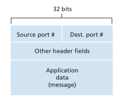

Στο UDP, η multiplexing/demultiplexing διαδικασία είναι σχετικά απλή:
- Κάθε UDP socket έχει 16-bit port number (0–65535).
  - 0–1023: well-known ports, για γνωστά πρωτόκολλα (HTTP: 80, FTP: 21).
  - 1024–65535: δυναμικά ports, επιλέγεται ένα από αυτά
- Το transport layer χρησιμοποιεί destination port για να κατευθύνει τα segments στο σωστό socket απο το οποίο μεταβιβάζεται στην ανάλογη διεργασία.
- Το source port λειτουργεί ως “return address” για την απάντηση στον αποστολέα.

Σημείωση:
- Ένα UDP socket αναγνωρίζεται από το δίδυμο (destination IP, destination port).
- Ακόμα και αν δύο segments έχουν διαφορετικές πηγές αλλά ίδιο destination socket, θα καταλήξουν στο ίδιο process.

### Multiplexing/Demultiplexing in TCP
Στο TCP η διαδικασία είναι πιο περίπλοκη:
- Κάθε TCP socket αναγνωρίζεται από τέσσερα πεδία (four-tuple):
  - source IP
  - source port
  - destination IP 
  - destination port
- Ο λόγος που έχουμε παραπάνω σε σχέση με UDP connection είναι για να μπορεί ο host να διαχειρίζει πολλαπλές ταυτόχρονες συνδέσεις TCP
- Ο server ξεκινάει με ένα welcoming socket σε γνωστό port που δέχεται requests
- Όταν έρχεται request, δημιουργείται νέο connection socket που ταυτοποιείται από το four-tuple
- Όλα τα επόμενα segments για αυτή τη σύνδεση χρησιμοποιούν το ίδιο four-tuple για demultiplexing

### Εξυπηρετές ιστού και TCP

**Παράδειγμα Web Server:**
- Ο server ακούει στο port 80
- Πελάτες στέλνουν requests στο port 80, αλλά χρησιμοποιούν διαφορετικά source ports
- Ο server διακρίνει τις συνδέσεις με βάση τον συνδυασμό source IP/port + destination IP/port
- Οι μοντέρνει servers ανοίγουν καινούργιο νήμα για κάθε σύνδεση
- Σε **persistent HTTP**, η ίδια σύνδεση χρησιμοποιείται για πολλαπλά requests/responses
- Σε **non-persistsnt HTTP**, δημιουργούνται και κλείνουν νέες συνδέσεις για κάθε request, κάτι που επιβαρύνει την απόδοση

## 3.3 Ασυνδεσμική Μεταφορά: UDP
Το UDP είναι απλό, connectionless transport protocol. Η βασική του λειτουργία είναι να παρέχει multiplexing/demultiplexing και ελάχιστο έλεγχο σφαλμάτων, χωρίς πρόσθετες υπηρεσίες όπως reliability ή congestion control που παρέχει το TCP.

**Βασικά χαρακτηριστικά UDP**:
- **Connectionless**: Δεν υπάρχει handshake πριν την αποστολή δεδομένων
- **Minimal Overhead**: Μικρό overhead (8 bytes) σε σχέση με το TCP (20 bytes)
- Τα δεδομένα της εφαρμογής περνούν σχεδόν απευθείας στο IP
- Παρέχει source port και destination port για την αποστολή δεδομένων στο σωστό process

**Παράδειγμα Χρήσης**:
- DNS: Τα queries στέλνονται μέσω UDP χωρίς handshake, ωστε να μειωθεί η καθυστέρηση
- Εφαρμογές real-time προτιμούν UDP λόγο μικρών καθυστερήσεων και άμεσης αποστολής, ακόμη και αν υπάρχει κάποια απώλεια πακέτων

**Γιατί να επιλέξει κάποιος UDP αντί TCP:**
1. **Αμεσότητα στην αποστολή:** Τα δεδομένα στέλνονται αμέσως χωρίς congestion control ή αναμονή για aknowledgment
2. **Μηδενική καθυστέρηση connection establishment:** Κατάλληλο για μικρές, γρήγορες επικοινωνίες
3. **Καμία διατήρηση κατάστασης (connection state):** Ένας server μπορεί να υποστηρίζει περισσότερους clients χωρίς να φορτώνεται με buffers και sequence numbers
4. **Μικρό header overhead:** 8 bytes ενάντι 20 bytes του TCP

**Προβλήματα/Προβλέψεις:**
- **Χωρίς reliability:** Αν το πακέτο αλλοιωθεί, UDP δεν κάνει retransmission. Η εφαρμογή πρέπει να διαχειριστεί τυχόν απώλειες
- **Χωρίς congestion control:** Αν όλοι οι χρήστες στέλνουν συνεχώς δεδομένα, το δίκτυο μπορεί να κορεστεί.
- Μερικές εφαρμογές υψηλού bitrate πρέπει να ενσωματόσουν μηχανισμούς ελέγχου σφαλμάτων και congestion control πάνω απο UDP
 
### 3.3.1 Δομή Τμήματος UDP
Το UDP segment αποτελείται από header 8 bytes και application data:
1. **Source port:** 16 bit, αγνωρίζει τον αποστολέα
2. **Destination port:** 16 bit, αναγνωρίζει τον παραλήπτη
3. **Length:** 16 bit, μέγεθος ολόκληρου segment (header + data)
4. **Checksum:** 16 bit, έλεγχος σφαλμάτων

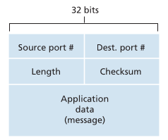

- Τα δεδομένα της εφαρμογής καταλαμβάνουν το πεδίο data
- Το μήκος μπορεί να αλλάζει απο segment σε segment
- To checksum ελέγχει αν το segment αλλοιώθηκε κατά τη μετάδοση ή την αποθύκευση του σε δρομολογητές

### 3.3.2 Άθροισμα Ελέγχου TCP
Η διαδικασία υπολογισμού του UDP checksum:
1. Ο αποστολέας παίρνει όλα τα 16-bit words του segment
2. Τα αθροίζει, εφαρμόζοντας wrap-around σε overflow
3. Παίρνει το **1's compelement** του αθροίσματος και το βάζει στο πεδίο checksum

**Σκοπός:**
- Ανιχνέυει αλλαγές στα bits λόγω θορύβου ή αποθήκευσης σε router
- Δεν παρέχει διόρθωση σφαλμάτων, απλώς ανίχνευση
- Εφαρμόζεται ανεξάρτητα από το αν τα link-layer πρωτόκολλα κάνουν error checking, σύμφωνα με την **end-to-end principle**

**Σημείωση:**
- Ορισμένες υλοποιήσεις απλώς απορύπτουν το κατεστραμμένο segment
- Άλλες ενημερώνουν την εφαρμογή ότι υπήρξε σφάλμα

Συνοπτικά, το UDP είναι ιδανικό για εφαρμογές που απαιτούν **γρήγορη, ελφριά αποστολή δεδομένων** και μπορούν να διαχειριστούν απώλειες ή reliability στο επίπεδο εφαρμογής. Δεν παρέχει όμως τα χαρακτηριστικά αξιοπιστίας και ελέγχου συμφόρησης του TCP

## 3.4 Αρχές Αξιόπιστης Μεταφοράς Δεδομένων
Η ενότητα θέτει τα θεμελιώδη πρωτόκολλα και μηχανισμούς που χρειάζονται ώστε δυο διεργασίες να επικοινωνήσουν εξιόπιστα, ακόμη και αν το υποκείμενο κανάλι είναι αναξιόπιστο. Το πρόβλημα υατό εμφανίζεται σε πολλά επίπεδα - application, transport, link όχι μόνο στο TCP.

Ο στόχος ενός reliable data transfer πρωτοκόλλου είναι να παρέχει στο πάνω layer την αφαίρεση ενός αξιόπιστου καναλιού:
- Χωρίς αλλίωση bits 
- Χωρίς απώλεια
- Με παράδοση **in-order**

Τo TCP είναι απλά μια υλοποίηση αυτών των αρχών

Το περιβάλλον του προβλήματος

- Το κάτω layer είναι αναξιόπιστο: μπορεί να κάνει corruption, μπορεί να χάσει πακέτα
- Το πρωτόκολλα μας έχει δύο πλευρες: `sender` και `receiver`, οι οποίο επικοινωνούν μέσω:
  - `rdt_send()`: κλήση από την εφαρμογή προς το πρωτόκολλο
  - `rdt_receive()`: κλήση από το κάτω layer προς το πρωτόκολλο
  - `deliver_data()`: παράδοση δεδομένων στην εφαρμογή
  - `udt_send()`: αποστολή στο αναξιόπιστο κανάλι

Αρχικά θεωρούμε **μονοκατευθυνόμενη μεταφορά** άρα για μεταφορά δεδομένων από την αποστολή στην λήψη, αλλά χρειάζονται control packets και προς τις δυο κατευθύνσεις.

### 3.4.1 Δημιουργία ενός Πρωτοκόλλου Αξιόπιστης Μεταφοράς Δεδομένων
Θα δούμε μια αλληλουχία από εκδόσεις του πρωτοκόλλου:
#### rdt1.0: Αξιόπιστη Μεταφορά Δεδομένων επάνω από Πλήρως Αξιόπιστο Κανάλι
Η πιο απλή μορφή. Καμία υποστήριξη για error handling, acknowledgments, sequence numbers
**Sender:**
1. περιμένει `rdt_send(data)`
2. φτιάχνει packed
3. στέλνει με `udt_send(packet)`

**Receiver:**
1. περιμένει `rdt_rcv(packet)`
2. εξάγει data
3. καλεί `deliver_data(data)` 

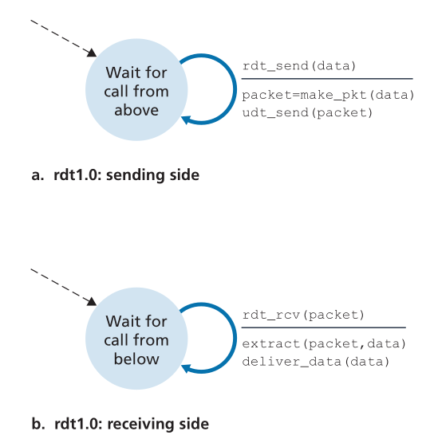

Δεν υπάρχει feedback. Δεν υπάρχει flow control. Είναι απλώς passthrought
#### rtd2.0: Αξιόπιστη Μεταφορά Δεδομένων επάνω σε κανάλι με Σφάλματα Bit
Πλέον χρειαζόμαστε:
- **Error detection** (cheksum)
- **Receiver feedback** (ACK/NAK)
- **Retransmission**

Το πρωτόκολλο γίνεται **stop-and-wait**:
- στέλνεις ενα packet
- Δεν στέλνεις επόμενο μέχρι να πάρεις ACK/NAK
  - ACK: θετική επιβεβαίωση
  - NAK: αρνητική επιβεβαίωση

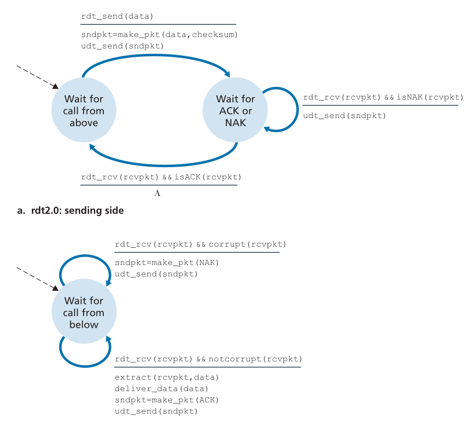

**Πρόβλημα**:
Τι γίνεται αν το ACK/ANK είναι corrupted
Το πρωτόκολλο δεν έχει τρόπο να καταλάβει τι συνέβη -> deadlock ή λάθη

##### rtd2.1: Διόρθωση του προβλήματος των corrupted ACK/NAK
Λύση: sequence numbers (1 bit)
Έτσι ο receiver μπορεί να ανγνωρίσει:
- Αν το πακέτο είναι πραγματικά νέο
- Αν το πακέτο είναι retransmission

**Sender:**
- Έχει δύο states: "στέλνω seq=0" και "στέλνω seq=1"
- Αν λάβει ACK λάθος seq -> το αγνοεί και περιμένει το σωστό
- Αν λάβει NAK ή currupted feedback -> retransmit

**Receiver:**
- Έχει επίσης δύο states: "περιμένω seq=0" και "περιμένω seq=1"
- Αν πάρει corrupted -> στέλνει NAK
- Αν πάρει λάθος seq -> στέλνει ACK του τελευταίου σωστού (έμμεσο NAK)

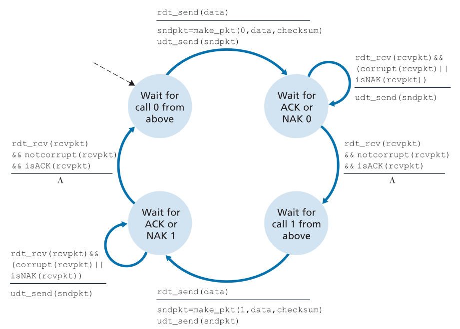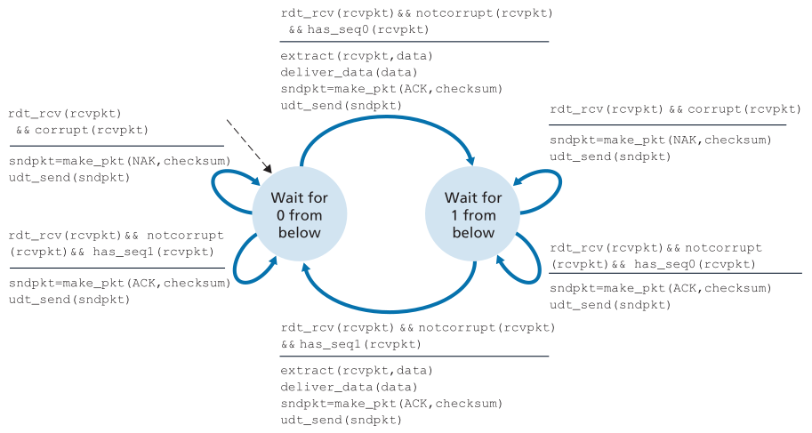

##### rtd2.2: Αφαίρεση του NAK
Στην πράξη τα πρωτόκολλα δεν θέλουν NAKs. Μπορείς να πετύχεις το ίδιο απλά με duplicate ACKs (δηλαδή δυο ACKs με για το ίδιο πακέτο)

**Receiver:** Για corrupted packets ή λάθος seq: στέλνει ACK του τελευταίου σωστόυ

**Sender:** Αν δει ACK με λάθος seq: επαναμετάδοση

Είναι πιο καθαρό και πιο κοντά στο TCP

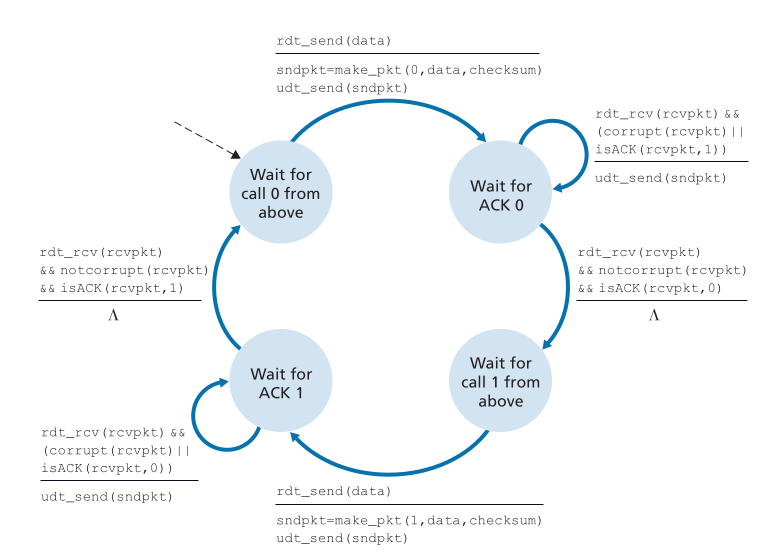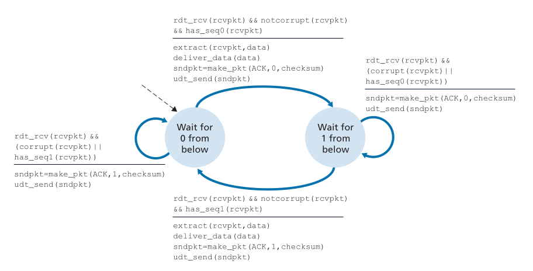

#### rtd3.0: Αξιόπιστη Μεταφορά Δεδομένων επάνω από κανάλι με Απώλειες και Σφάλματα Bit
Τώρα το πρόβλημα είναι σοβαρό: Αν χαθεί packet ή ACK, ο sender δεν ακούει τίποτα.
Λύση: Timer + Timeout -> Retransmission

**Sender:** Κάθε φορά που στέλνει ένα πακέτο:
1. Ξεκινάει timer
2. αν timeout: retransmit
3. αν λάβει ACK σωστό: σταματάει timer και προχωρά

Ο χρόνος που θα περιμένει θα είναι η καθυστέρηση διαδρομής μετ' επιστροφής συν τον χρόνο επεξεργασίας τους πακέτου απο τον παραλήπτη. Εφόσον όμως είναι δύσκολο να εκτιμηθεί μία τέτοια τιμή χρόνου ο αποστολέας επιλέγει μια ώστε να μεγιστοποιηθεί, αν όχι εγγυηθεί, μια απόλια πακέτου.

**Receiver:** Απλώς κάνει παρόμοια με rdt2.2 (error detection + seq numbers + duplicate ACKs)

Σημείο κλειδί:
- Ο sender δεν ξεχωρίζει corruption vs loss vs delay -> πάντα ίδια ενέργεια: retransmit

Το πρωτόκολλο έχει sequence numbers 0/1 -> ειναι κλασικό alternating bit

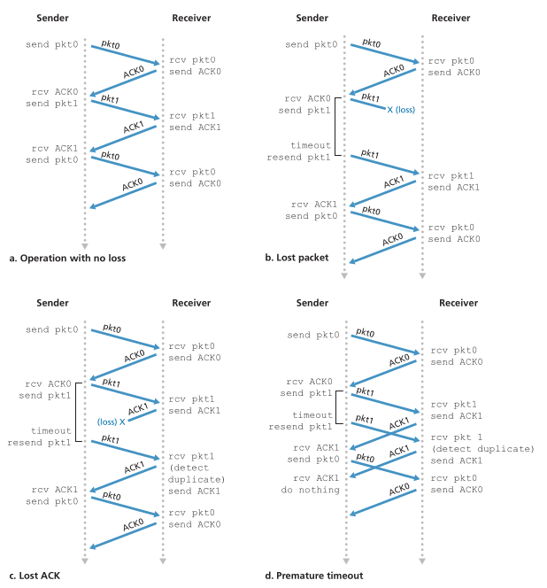

#### Γιατί το πρωτόκολλο rtd3.0 είναι "πλήρες"
Έχουμε πλέον:
- Error detection
- Sequence numbers
- ACKs
- Retransmissions
- Timeout Mechanism
- Duplicate handling
- Stop-and-Wait flow

### 3.4.2 Πρωτόκολλα για Αξιόπιστη Μεταφορά Δεδομένων με Διοχέτευση
Αν και το πρωτόκολλο rdt3.0 λειτουργεί σωστά η απόδοση του είναι τραγική λόγο του stop-and-wait, ο αποστολέας πρέπει να περιμένει μετά από την αποστολή κάθε πακέτου μέχρι να έρθει το ACK. Σε δίκτυα με μεγάλο RTT ή ψυλό bandwidth, αυτό μπορεί να είναι καταστροφικό. 

Ένα παράδειγμα που τονίζει την καθυστέρηση αυτή είναι:
- $\text{RTT} \approx 30~ms$
- $\text{R} = 1~Gbps$
- $\text{Packet Size} = 1000~bytes = 8000~bits$
- Transmission time:

$$ d_{\text{trans}} = \frac{L}{R} = 8 μs $$

Δηλαδή ο sender δουλεύει για 8 μs και μετά περιμένει για 30 ms, ειναι ενεργός δηλαδή κατά:
$$ U_{\text{sender}} = \frac{\frac{L}{R}}{RTT + \frac{L}{R}} = 0.00027 = 0.027\% $$

Αυτό σημαίνει ότι ο αποστολέας είναι απασχολημένος μόνο **2.7 εκατοστά του ενός εκατοστού του χρόνου**, απο το 1Gbps λοιπόν μπορούμε να στείλουμε τελικά μόνο **270 kbps!!!**.
H λύση σε αυτό το πρόβλημα είναι **pipelining**. Αντί να περιμένει ACK πρίν από κάθε πακέτο, ο sender στέλνει πολλαπλά πακέτα συνεχόμενα, γεμίζοντας το κανάλι με δεδομένα "εν πτήσει".

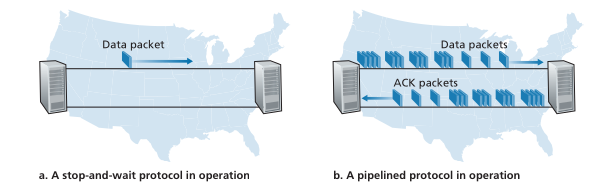

Αν στείλουμε 3 πακέτα πριν περιμένουμε ACK, η αξιοποίηση τριπλασιάζεται. Αν στείλουμε αρκετά ώστε να καλύπτουν το RTT, η γραμμή αξιοποιείται σχεδόν **100%**.
Δεν έχει όμως μόνο θετικές συνέπειες, συγκεκριμμένα:
1. **Χρειαζόμαστε μεγαλύτερο ευρος sequence numbers**, δεν αρκούν πλέον μόνο το 0/1
2. **Buffering και στις δύο πλευρές**, ο αποστολέας πρέπει να κρατάει όλα τα πακέτα για τα οποία δεν έχει λάβει επιβεβαίωση, ο receiver ίσως χρειαστεί να κρατά πακέτα εκτός σειράς
3. **Πιο σύνθετος μηχανισμός recovery**, με πακέτα μέσα στην γραμμή το ερώτημα γίνεται: "_τί κάνεις όταν χαθεί ή αλλιωθεί ένα πακέτο στο pipeline;_", υπάρχουν δυο βασικές στρατηγικές:
   - Go-Back-N (GBN, Οπισθοχώρηση κατά N)
   - Selective Repeat (SR)

### 3.4.3 Οπισθοχώρηση κατά N (GBN)
O αποστολέας επιτρέπεται να έχει μέχρι και N μη επιβεβαιωμένα πακέτα σε διοχέτευση. Το πρωτόκολο είναι βασισμένο σε ACKs και συνήθως χωρίς NAKs.

**Κεντρικές μεταβλητές:**
- `base`: seq num του παλαιότερου μη-επιβεβαιωμένου πακέτου
- `nextseqnum`: seq num του επόμενου προς αποστολή
- window: [base,base+N-1]

**Sender:**
1. Στέλνει πακέτα όσο έχει χώρο στο παράθυρο.
2. Κρατάει **έναν** μόνο χρονομετρητή για το παλαιότερο πακέτο που ακόμη περιμένει ACK, αν αυτό δεν επιβεβαιωθεί εγκαίρος έχουμε timeout
3. Μόλις λάβει ACK μετακινέι το παράθυρο μπροστά. Τα ACK είναι **συσωρευτικά** που σημαίνει ότι υποδηλώνουν ότι όλα τα πακέτα μέχρι αυτό ήταν σωστά. Αν μετά δεν υπάρχουν άλλα πακέτα στην ουρά σταματάει τον timer, αλλιώς τον επανεκκινεί.
4. Αν έχουμε timeout ξανα στέλνουμε **όλα** τα πακέτα που είχαμε στείλει αλλα δεν είχαν επιβεβαιωθεί, ακόμη αν και κάποια τα έχει ήδη παραλάβει ο receiver

**Receiver:**
1. Θέλει μόνο το **επόμενο** πακέτο στην σειρά
2. Οτιδήποτε άλλο το πετάει
3. Στέλνει ACK μόνο όταν λάβει το τελευταίο σωστό πακέτο στην σειρά

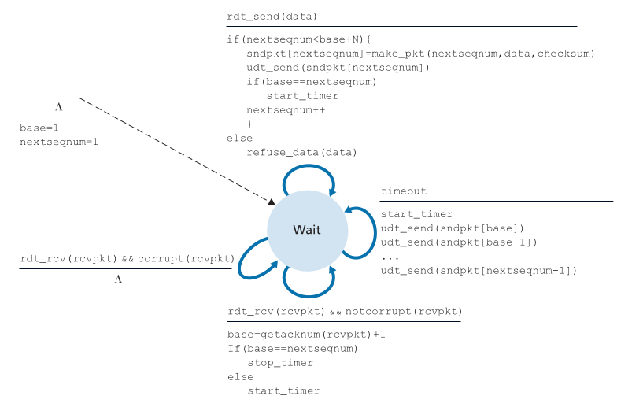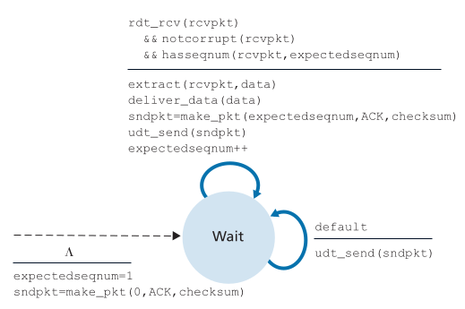

### 3.4.4 Επιλεκτική Επανάληψη (SR)
Ο αποστολέας στέλνει εώς N πακέτα εν πτήσει όπως στο GBN, αλλά **επανεκπέμπει μόνο τα πακέτα που λείπουν**. Ο receiver αποθυκέυει στον buffer τα υπόλοιπα πακέτα και στέλνει ACK μόνο για τα σωστά πακέτα που λείπουν.

**Sender variables:**
- `send_base`: seq num του πρώτου μη-ack'd πακέτου
- `nextseqnum`: επόμενος προς αποστολή
- window: [send_base,send_base+N-1]

**Receiver variables:**
- `rcv_base`: seq num του πρώτου πακέτου που περιμένει να παραδώσει στην άνω στρώση
- παράθυρο λήψης = [rcv_base,rcv_base+N-1]
- buffer για αποθυκευμένα out-of-order πακέτα

**Sender:**
1. Όσο `nextseqnum` βρίσκεται μέσα στο επιτρεπτό έυρος του παραθύρου:
   - φτιάχνει ένα πακέτο
   - το στέλνει
   - το αποθηκέυει σε buffer
   - ξεκινάει ένα καινούργιο timer **ειδικά** για αυτό το πακέτο
   Δεν υπάρχει ένα κοινό timer, κάθε πακέτο λειτουργεί σαν "μικρή ανεξάρτηση αποστολή"
2. Μόλις φτάσει ένα πακέτο στον παραλήπτη αυτός δεν στέλνει "_μέχρι εδώ όλα καλά_" όπως έκανε για GBN, λέει αποκλειστικά "_έλαβα το πακέτο με seq num: n_" ο αποστολέας μετά:
   - σημειώνει ότι το πακέτο n επιβεβαιώθηκε
   - σταματά τον timer **μόνο** για αυτό το πακέτο

   Αν το ACK αφορά το πακέτο που βρίσκεται στην αρχή του παραθύρου (`send_base`):
   - μετακινεί το παράθυρο μπροστά μέχρι να φτάσει στη πρώτη μη-επιβεβαιωμένη θέση
3. Αν λήξει ο timer ενός πακέτου ο αποστολέας ξαναστέλνει μόνο αυτό το πακέτο

**Receiver:**
1. Αν το sequence number είναι μέσα στο `[rcv_base, rcv_base + N - 1]` τότε:
   - Αν το πακέτο είναι καινούργιο: το αποθηκέυει σε buffer
   - στέλνει ACK συγκεκριμμένο για αυτό τον αριθμό
   
   Ακόμα κι αν δεν μπορεί να το παραδώσει ακόμη στην εφαρμογή το κρατάει
2. Αν έρθει το πακέτο που περιμένει (`seq=rcv_base`), τότε:
   - το παραδίδει στην εφαρμογή
   - μετά κοιτάει στο buffer αν υπάρχουν συνεχόμενα πακέτα που είχα πάρει νωρίτερα
   - τα παραδίδει και αυτά στην σειρά
   - μετακινεί το `rcv_base` όσο πάει συνεχόμενα

   Δηλαδή κλείνει τις τρύπες που καλύφθηκαν
3. Αν έρθει παλιό πακέτο (`seq < rcv_base`) ξανα στέλνει ACK γι' αυτό αλλα δεν το αποθηκέυει
4. Αν έρθει πακέτο εκτός του παραθύρου (πολύ μπροστά) το αγνοέι και **δεν** το αποθηκεύει

## 3.5 Σνδεσμική Μεταφορά: TCP
Στην ενότητα αυτή συγκεντρονόμαστε στο TCP σαν το πιο αξιόπιστο πρωτόκολλο μεταφοράς του Διαδικτύου, εφαρμόζει τους ήδη γνωστούς μηχανισμούς αξιόπιστης μεταφοράς.

### 3.5.1 Η σύνδεση TCP
**Φύση της TCP σύνδεσης:**
- Η σύνδεση είναι λογική, όχι κυκλωτομερισμένη (TDM/FDM)
- State (buffers, variables, socket info) υπάρχει μόνο στα endpoints, ποτέ στα routers
- Τα routers βλέπουν μόνο IP datagrams, όχι TCP connection

**Connection Establishment (Three-Way Handshake)**
Πριν αποσταλεί δεδομένο, client και server εκτελούν handshake ώστε να συμφωνήσουν παραμέτρους και να αρχικοποιήσουν state variables

Τα βήματα:
1. Client->Server: στέλνει ειδικό TCP segment (SYN)
2. Server->Client: απαντά με δεύτερο ειδικό segment (SYN+ACK)
3. Client->Server: στέλνει τρίτο segment (ACK). Μπορεί να περιέχει data

Κανένα από τα δύο πρώτα segments δεν έχει payload. O σκοπός είναι η δημιουργία και συγχρονισμός αρχικών sequence numbers και η έναρξη τνω buffers.

**Send/Receive Buffers:**
Μετά την εγκατάσταση της σύνδεσης:
- Το application γράφει data στο socket - μπαίνουν στο send buffer
- Το TCP τα "κόβει" σε τμήματα μεγέθους μέχρι MSS και τα στέλνει όταν "βολεύει". Η προδιαγραφή είναι επίτηδες χαλαρή: TCP "send at its own conveniece" 
- Στον παραλήπτη, τα segments καταλήγουν σε receive buffer, από όπου το application δαιβάζει

Κάθε άκρο έχει δικό του send και receive buffer το MSS συνήθως 1460 bytes

Η σύνδεση TCP αποτελείται ουσιαστικά από:
- buffers
- state variables
- sockets και στα δύο άκρα
  και τίποτα άλλο στο ενδιάμεσο δίκτυο

### 3.5.2 Δομή Τμήματος TCP
Το τμήμα περιέχει **header** + **data**
**Βασικά πεδία:**
- **Source/Dest port:** multiplexing/demultiplexing
- **Sequence number (32-bit):** byte offset του πρώτου byte στο segment
- **Acknowledgment number (32-bit):** επόμενος αναμενόμενος byte από τον άλλον
- **Windows size (16-bit):** flow control - πόσα bytes ο παραλήπτης είναι έτοιμος να λάβει
- **Header length (4-bit):** μέγεθος header (λόγω options μπορεί να μεγαλώσει)
- **Flags (ACK, SYN, FIN, RST, PSH, URG, CWR, ECE):**
  - ACK: το ACK field είναι έγκυρο
  - SYN / FIN / RST: setup & teardown
  - PSH / URG: πρακτικά σχεδόν αχρησιμοποίητα σήμερα
  - CWR / ECE: explicit congestion notification
- **Checksum:** έλεγχος λαθών
- **Options:** MSS negotiation, window scaling, timestamps κ.λπ

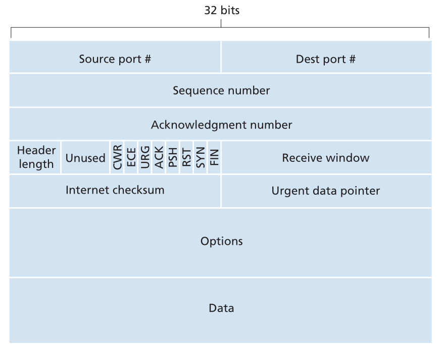

