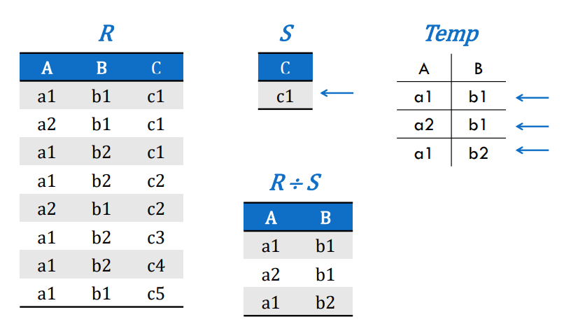
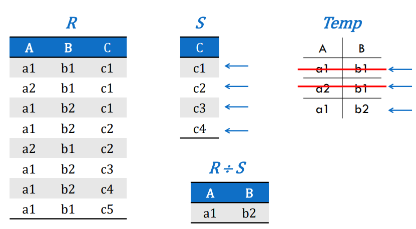
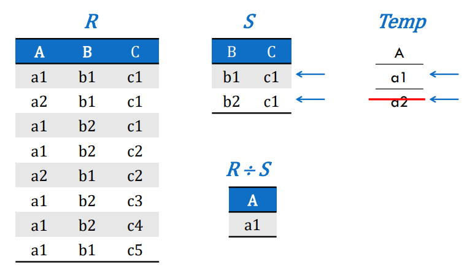
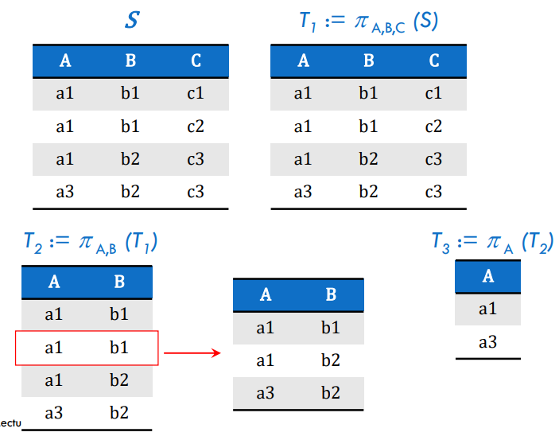
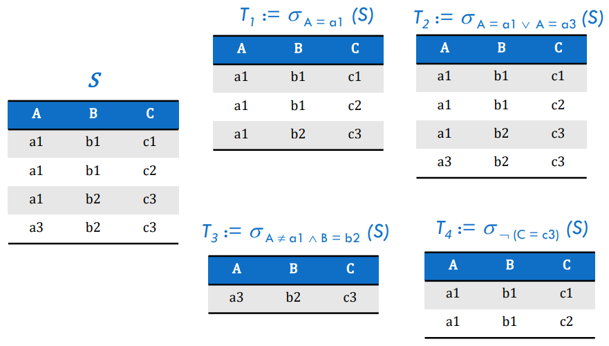

# ΗΥ360 - Αρχεία και Βάσεις Δεδομένων
## Σχεσιακή Άλγεβρα
### 1. Εισαγωγή
- **Σχεσιακή Άλγεβρα:** Είναι μια διαδικαστική γλώσσα επερωτήσεων. Ορίζει ένα σύνολο πράξεων (τελεστών) που δέχονται μία ή δύο σχέσεις ως είσοδο και **επιστρέφουν πάντα μια νέα σχέση** ώς αποτέλεσμα
- **Βασική Ιδιότητα:** Κλειστότητα - το αποτέλεσμα κάθε πράξης είναι σχέση, άρα μπορεί να είναι είσοδος σε άλλη πράξη
### 2. Τελεστές Θεωρίας Συνόλων
**Προϋπόθεση:** Οι σχέσεις πρέπει να είανι **"συμβατές"**, δηλαδή να έχουν το ίδιο ακριβώς σχήμα (ίδια γνωρίσματα και ίδιους τύπους/πεδία τιμών)
- **Ένωση (Union - R $\cup$ S):**
	- Επιστρέφει όλες τις πλειάδες που βρίσκονται στην **R ή στην S ή και στις δύο**
	- Οι διπλότυπες πλειάδες απομακρύνονται (αδού η σχέση είναι σύνολο)
- **Τομή (Intersection - R $\cap$ S):**
	- Επιστρέφει όλες τις πλειάδες που βρίσκονται **και στην R και στην S**
- **Διαφορά (Difference - R $-$ S):**
	- Επιστρέφει όλες τις πλειάδες που βρίσκονται στην **R αλλά όχι στην S**
- **Καρτεσιανό Γινόμενο (Cartesian Product - R $\times$ S):**
	- Συνδυάζει **κάθε πλειάδα της R** με **κάθε πλειάδα της S**
	- Το σχήμα του αποτελέσματος είναι η ένωση των γνωρισμάτων και των δυο σχέσεων. Συχνά τα γνωρίσματα προηγούνται από το όνομα της σχέσης για αποφυγή ασάφειας
### 3. Τελεστής Διαίρεσης 
- **Σκοπός:** Εξάγει τις πλειάδες που έχουν την λέξη που λέμε
- **Προϋπόθεση:** 
	- Το σχήμα της σχέσης `S` πρέπει να είναι υποσύνολο του σχήματος της σχέσης `R`
	- `Head(R) = {A1, A2, ... , An, B1, B2, .... , Bn}`
	- `Head(S) = {B1, B2, ... , Bn}`
- **Αποτέλεσμα:** Μία νέα σχέση `T` με σχήμα `{Α1, A2, .... , An}`
- **Σημασιολογία (Πως το "διαβάζουμε"):**
	- Μία πλειάδα `t` ανήκει στο αποτέλεσμα `R ÷ S` αν και μόνο αν για κάθε πλειάδα `s` στη σχέση `S`, η πλειάδα που προκύπτει από την συνένωση (συνδυασμός) της `t` με την `s` (`t || s` ) υπάρχει στην αρχική σχέση `R`.
- **Αναλογία:** Μπορεί να θεωρηθεί ως το αντίστροφο του Καρτεσιανού Γινομένου.
	- Αν `T = R ÷ S` τότε `T × S` είναι ένα υποσύνολο της `R`
	- Η `Τ` είναι το μέγιστο δυνατό σύνολο πλειάδων τέτοιο ώστε `T × S ⊆ R`

	
	
	

### 4. Τελεστές Σχεσιακής Άλγεβρας
- **Προβολή (Projection - $\pi$):**
	- **Σκοπός:** Επιλέγει συγκεκριμμένες στήλες από μια σχέση
	- **Λειτουργία**: Δημιουργεί μια νέα σχέση που περιέχει μόνο τα καθορισμένα γνωρίσματα
	- Μπορεί να δημιοργήσει διπλότυπες πλειάδες στο αποτέλεσμα, τα οποία απομακρύνονται αυτόματα
	

		
	

-  **Επιλογή (Selection - $σ$):**
	- **Σκοπός:** Επιλέγει **συγκεκριμμένες γραμμές** από μια σχέση
	- Λειτουργία: Επιστρέφει τις πλειάδες που ικανοποιούν μια **συνθήκη (predicate)**
	- **Συνθήκη (C):** Μπορεί να περιλαμβάνει συγκερίσεις (`=`,`>`,`<`,`!=`) μεταξύ γνωρισμάτων και σταθερών, συνδεόμενες με λογικούς τελεστές 
	

		
	

### 5. Σύνθετοι Τελεστές
- **Σύζευξη (Join - R $\Join$ S):**
	- **Σκοπός:** Συνδυάζει πλειάδες από δυο σχέσεις που σχετίζονται λογικά
	- **Ορισμός:** Είναι ισοδύναμη με την ακολουθία: **Καρτεσιανό Γινόμενο -> Επιλογή (για ισότητα στα κοινά γνωρίσματα) -> Προβολή (για αφαίρεση διπλότυπων στηλών)**
	- $R \Join S = \pi ( ~ \sigma (R.B1 = S.B1 ~ \land ~ ... ~ \land ~ R.Bk = S.Bk) ~ (R \times S) )$ 
	- Ειδικές Περιπτώσεις:
		- Αν δεν υπάρχουν κοινά γνωρίσματα: Γίνεται Καρτεσιανό Γινόμενο
		- Αν οι σχέσεις είναι συμβατές (ίδιο σχήμα): Γίνεται Τομή
- **Θ-Σύζευξη (Theta Join - R $\Join ^θ$ S):**
	- Μια γενίκευση της συζευξης, όπου η συνθήκη `θ` μπορεί να είναι οποιοδήποτε τελεστής σύγκρισης (`<`,`>`...) 
	- Ισοδύναμη με: $\sigma ^ \theta (R \times S)$ 
- **Εξωτερική Σϋζευξη (Outer Join):**
	- **Σκοπός:** να διατηρήσει και τις πλειάδες που δεν ταιριάζουν με κάποια πλειάδα στην άλλη σχέση συμπληρώνοντας της με **NULL** τιμές
	- **Αριστερή (Left):** Διατηρεί όλες τις πλειάδες από την αριστερή σχέση
	- **Δεξιά (Right):** Διατηρεί όλες τις πλειάδες από την δεξιά σχέση
	- **Πλήρης (Full):** Διατηρεί όλες τις πλειάδες από τις δύο σχέσεις
### 6. Άλλες βασικές έννοιες
- **Προτεραιότητα Τελεστών:**
	1. Παρενθέσεις 
	2. Προβολή, Επιλογή
	3. Καρτεσιανό Γινόμενο
	4. Σύζευξη, Διαίρεση
	5. Διαφορά
	6. Ένωση, Τομή
- **Σχέση Ανάθεσης ($:=$):**
	- Χρησιμοποιείται για να δώσουμε όνομα σε ένα ενδιάμεσο αποτέλεσμα, διευκολύνοντας τη σύνταξη πολύπλοκων εκφράσεων
	- $T1 := \sigma_{\text{city = "Boston"}} (Customers)$
- **Αναγωγή Τελεστών:**
	- Κάθε πράξη της Σχεσιακής Άλγεβρας μπορεί να εκφραστεί με το ελάχιστο σύνολο τελεστών $\{\sigma,\pi,\cup,-,\times\}$
	- 