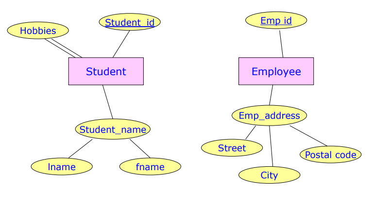
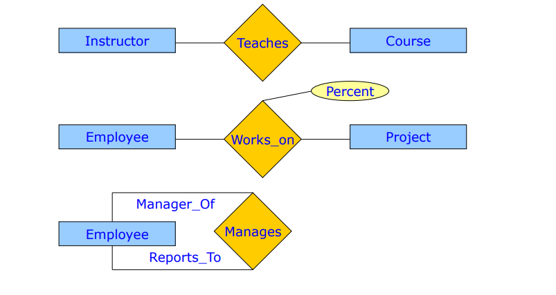
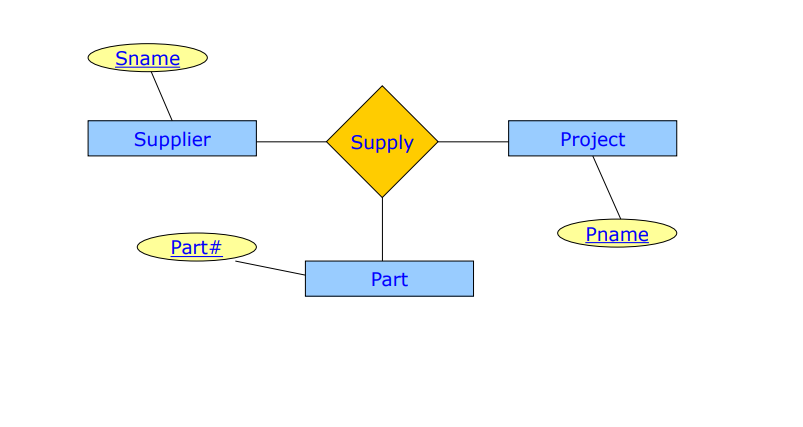
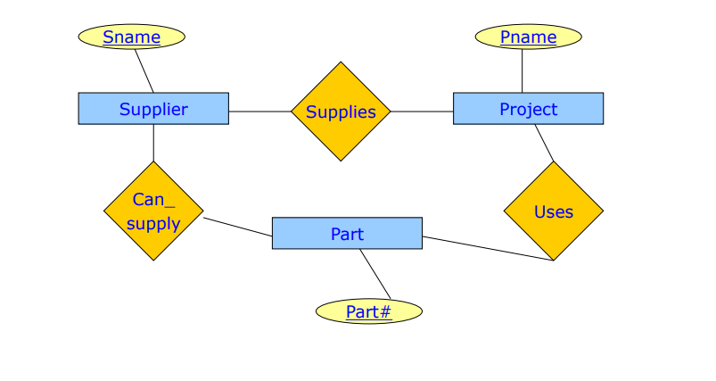
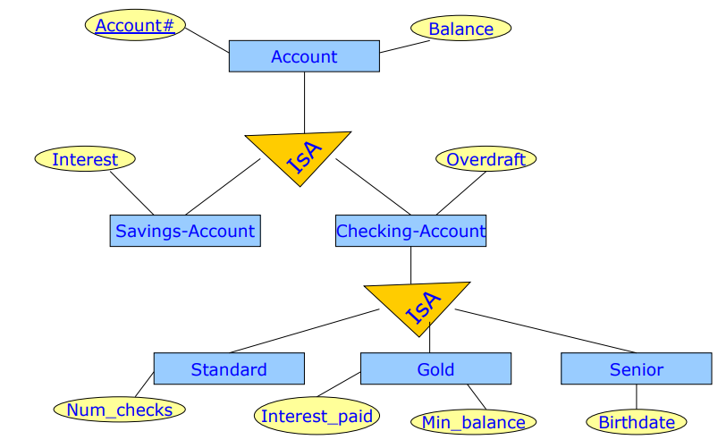

# ΗΥ360 - Αρχεία και Βάσεις Δεδομένων
## Διάλεξη 1 - Μοντέλο Οντότητων - Σχέσεων (E-R Model)

### 1. Βασικές έννοιες
- **Δεδομένα**: περιγράφονται με γλώσσα/συντακτικά + τελεστές
- **E-R Model** (Μοντέλο Ονότητων Σχέσεων): για σχεδιασμό εννοιολογικών σχημάτων
  - Περιλαμβάνει: **οντότητες**, **σχέσεις**, **περιορισμούς**

### 2. Οντότητες
- Μία *οντότητα* είναι μία συλλογή από διακεκκριμένα αντικείμενα με κοινές ιδιότητες
- Μπορεί να έχουν φυσική ή αφηρημένη υπόσταση
- Έχουν **στιγμοιότυπα** (πχ. φοιτητής: Μαρία, Γιάννης)
- Γνωρίσματα (*attributes*):
  - ένα γνώρισμα είναι μία περιγραφή μίας ιδιότητας που αποδίδεται σε μία οντότητα
  - Απλά ή σύνθετα (πχ. ηλικία - διεύθυνση)
  - Μονότιμα ή πλειότιμα (πχ. ηλικία - αγαπημένες ταινίες)
  - Αναγνωριστικά (μοναδικές τιμές) και περιγραφίκα

  

### 3. Σχέσεις
- Αντιστοιχίσεις μεταξύ οντότητων
- Βαθμός (Degree): ο αριθμός των οντοτήτων που συμμετέχουν σε μία σχέση
  - Δυαδική τριαδική, n-αδική
- Μπορεί να έχουν γνωρίσματα (πχ. ποσοστό χρόνου)
- Αναδρομικές σχέσεις: μια οντότητα με τον εαυτό της
- Αναπαράσταση 3-αδικών σχέσεων:
  - σύνολο απο δυαδικές σχέσεις
  - ρόμβος με 3 οντότητες
  - **δεν είναι** εν γένει ισοδύναμοι

  

  
  

### 4. Πληθικότητες (Cardinalities)
- δείχνουν πόσες φορές (ελάχιστα–μέγιστα) μπορεί ή πρέπει μια οντότητα να συμμετέχει σε μια σχέση
- **max-card(E,R)**:
  - =1 -> μονότιμη συμμετοχή
  - =Ν -> πλειότιμη συμμετοχή
- Σχέσεις
  - $1-1$, $1-N$, $N-N$
- **min-card(E,R)**:
  - =0 -> προαιρετική συμμετοχή
  - =1 -> υποχρεωτική συμμετοχή
- Πληθικότητες γνωρισμάτων (πχ. (0,1),(1,Ν))

### 5. Ασθενείς & Ισχυρές Οντότητες
- **Ασθενής Οντότητα**: εξαρτάται απο ισχυρή
  - Δεν έχει δικό της αναγνωριστικό -> χρησιμοποιεί *partial key* + αναγνωριστικό ισχυρής

### 6. Εξειδίκευση 
- Διαδικασία Top-Down -> δημιουργία υπο-ομάδων
- IsA ιεραρχίες (superclass-subclass)
- Παραδείγματα account
  - savings account
  - checking account
- Μπορεί να εφαρμοστεί επαναληπτικά

  

### 7. Γενίκευση
- Bottom-up
- Οντότητες με κοινά γνωρίσματα ενώνονται σε υψηλότερη
- Αντίστροφο της εξιδίκευσης

### 8. Κληρονομικότητα Γνωρισμάτων
- Subclasses κληρονομούν attributes & συμμετοχές από superclasses

### 9. Περιορισμοί
- **Ορισμός μελών**: condition-defined ή user-defined
- **Αποκλιεστικότητα** (*Disjointness*): ένα στιγμιότυπο ανήκει σε μόνο μία οντότητα ανα επίπεδο ιεραρχίας IsA (πχ. savings, checkings account)
- **Επικάλυψη** (*Overlapping*): στιγμιότυπο μπορεί να ανήκει σε περισσότερες οντότητες
- **Πληρότητα** (*Completeness*):
  - Total -> κάθε στιγμιότυπο ανήκει κάπου
  - Partial -> κάποια μπορεί να μην ανήκουν πουθενά
