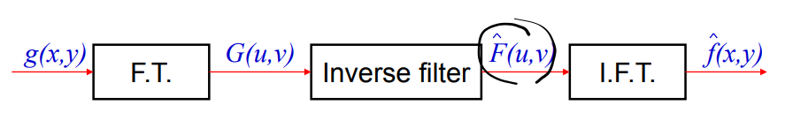
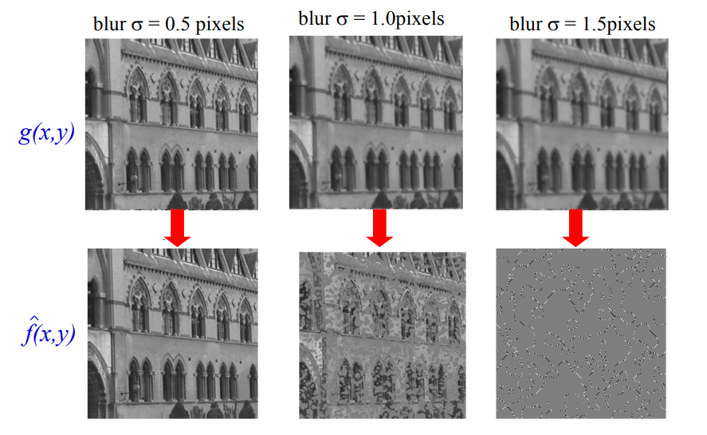
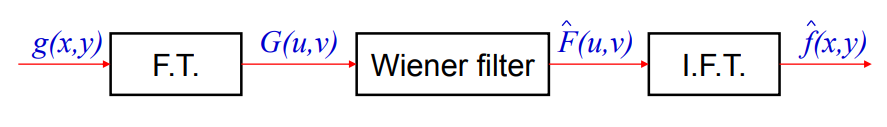
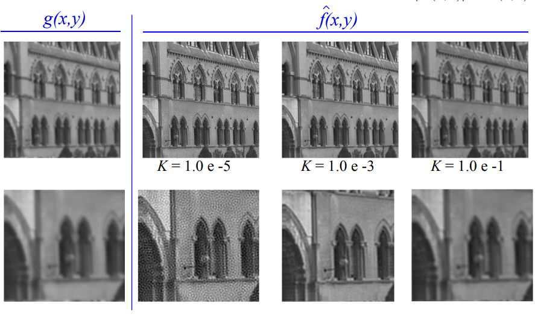
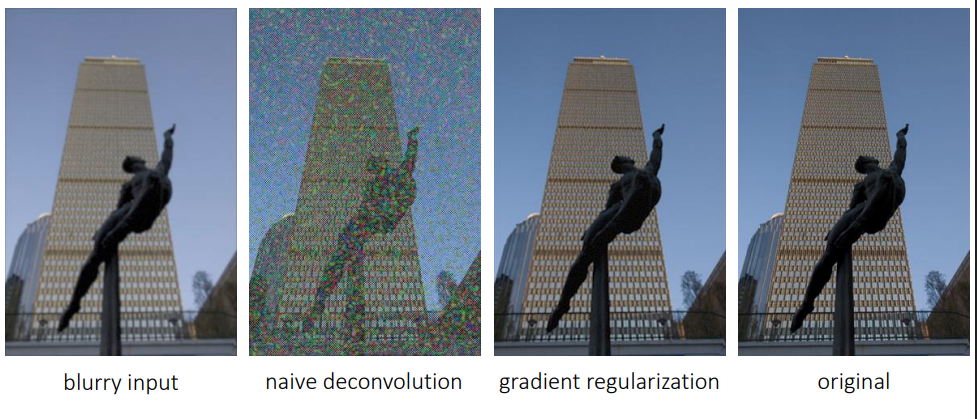
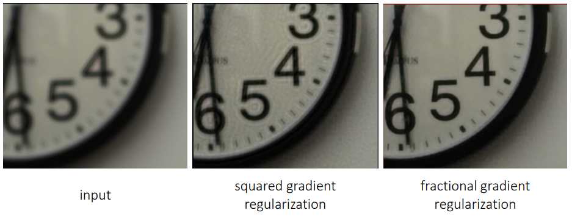

# ΗΥ371 - Ψηφιακή Επεξεργασία Εικόνων

## Υποβάθμιση Εικόνας
Σε πολλές περιπτώσεις η εικόνα που παρατηρούμε δεν είναι η "αληθινή" αλλά μία υποβαθμισμένη εκδοχή της. Οι βασικές ατίες υποβάθμισης μπορούν να είναι:
- θόλωση
- θόλωση κίνησης
- κβαντοποίηση
- θόρυβος

Όλες αυτές οι αιτίες οδηγούν σε απώλεια πληροφορίας κια δυσκολέυουν την ανάκτηση της αρχικής εικόνας. Στόχος μας λοιπόν με την αποκατάση εικόνας είναι να επαναφέρουμε μία υποβαθμισμένη εικόνα όσο το δυνατόν πιο κοντά στην κανονική της μορφή.

Μπορούμε να αναπαραστήσουμε μία εικόνα ώς εξής:

χώρου:
$$ g(x,y) = \int \int h(x-x',y-y')f(x',y')dx'dy' + n(x,y) $$

συχνότητας:
$$ G(u,v) = H(u,v)F(u,v) + N(u,v) $$

Όπου:
- $g$: είναι η τελική, παρατηρούμενη εικόνα
- $f$: είναι η αρχική εικόνα
- $h$: είναι ένα φίλτρο υποβάθμισης
- $n$: είναι επιπρόσθετος θόρυβος

> Ο στόχος της αποκατάστασης είναι δεδομένου της εικόνας $g$ να εκτιμήσουμε όσο καλύτερα γίνεται την αρχική εικόνα $f$.

## Το αντίστροφο φίλτρο (Inverse Filter)
Η πιο απλή ιδέα αποκατάστασης είναι το αντίστροφο φίλτρο. Αν αγνοήσουμε τον θόρυβο προσωρινά μπορούμε να εκτιμήσουμε την αρχική εικόνα στο πεδίο Fourier διαιρώντας το $G$ με το $H$. Στην συνέχεια εφαρμόζουμε εντίστροφο μετασχηματισμο Fourier για να επιστρέψουμε στο χωρικό πεδίο.

  

Έστω ότι θέλουμε να ανακατασκευάσουμε μία εικόνα που περνάει από το χαμηλοπέρατο φίλτρο Gausian:

  

Το πρόβλημα με το αντίστροφο φίλτρο είναι οτί ενισχύει δραματικά τον θόρυβο. Σε συχνότητες όπου το $H$ είναι πολύ μικρό, η διαίρεση με το $H$ οδηγεί σε τεράστια ενίσχυση του $N. Έτσι αντί να ανακτήσουμε λεπτομέρειες καταλήγουμε με έντονο θόρυβο.

## Φίλτρο Wiener
Ένας άλλος τρόπος για να αντιμετωπίσουμε το πρόβλημα της ενίσχυσης θορύβου είναι να χρησιμοποιούμε το _φίλτρο Wiener_. Το φίλτρο Wiener πολλαπλασιάζει το φάσμα της παρατηρούμενης εικόνας με μία συνάρτηση $W(u,v)$ η οποία εξαρτάται από το φίλτρο υποβάθμισης και από τη στατιστική σχέση σήματος-θορύβου.

$$ W(u,v) = \frac{H^*(u,v)}{|H(u,v)|^2 + K(u,v)} $$
$$ K(u,v) = \frac{S_n(u,v)}{S_f(u,v)} $$

Όπου:
- $S_n = |F(u,v)|^2$
- $S_f = |N(u,v)|^2$

Όταν η παράμετρος $K$ είναι 0 το φίλτρο Wiener καταλήγει να είναι απλά ένα αντίστροφο φίλτρο. 

$$ W(u,v) = \frac{1}{H(u,v)} $$

Όταν όμως το $K$ είναι μεγάλο σε σχέση με το $|H|$ οι υψηλές συχνότητες εξασθενούνται, περιορίζοντας την ενίσχυση του θορύβου. Το φίλτρο Wiener ελαχιστοποιεί το μέσο τετραγωνικό σφάλμα μεταξύ της εκτιμώμενης και της πραγματικής εικόνας.

  

Ας δοκιμάσουμε το φίλτρο Wiener σε μία εικόνα που είναι θολωμένη με φίλτρο Gaussian και θόρυβο:

  

### Θόλωση λόγο κίνησης
Σε περίπτωση που η θόλωση οφείλεται σε κίνηση, το φίλτρο υποβάθμισης έχει μηδενικά στο πεδίο Fourier καθιστόντας το αντίστροφο φίλτρο πρακρικά άχρηστο, το φίλτρο Wiener όμως παραμένει να είναι λειτουργικό.

### Κανονικοποίηση με κλίηση (Gradient Regularization)
Η αποσυνέλιξη μπορεί να διατυπωθεί ως πρόβλημα εκαχιστοποίησης, όπου εκτός από τον όρο πιστότητας στα δεδομένα προστίθεται και ένας όρος κανονικοποίησης που επιβάλλει ομαλότητα ή φυσική δομή στην εικόνα. Βλέπουμε δηλαδή το πρόβλημα σαν ένα πρόβλημα ελαχιστοποίησης:

$$ \text{min}_x || b - c * x ||^2 + || \nabla x ||^2 $$

Όπου:
- $x$: η αρχική, σωστή, εικόνα
- $b$: η τωρινή, λανθασμένη, εικόνα
- $c$: το φίλτρο θολώματος 

Τα δύο κομμάτια είναι:
- $|| b - c * x ||^2$: Η διαφορεά τις ανακατασκευασμένης εικόνας από την κανονική, αρχική εικόνα
- $|| \nabla x ||^2$: Πόσο απότομες είναι οι διαφορές σε φωτεινότητα της εικόνα (με άλλο λόγια ο θόρυβος)

Με άλλα λόγια αυτό που θέλουμε να πετύχουμε είναι να ελαχιστοποιήσουμε τις διαφορές της αρχική εικόνα με την ανακατσκευή αλλά ταυτόχρονα να μήν έχουμε πολύ μεγάλο θόρυβο.
Να βρούμε δηλαδή το ολικό ελάχιστο του αθροίσματος των δύο αυτών τιμών.

  

Μπορούμε όμως να έχουμε ακόμα καλύτερα αποτελέσματα πειράζοντας λίγο την τιμή στην οποία υψώνουμε την επίδραση του θορύβου, συγκεκριμμένα:

$$
\begin{align*}
L_2 &:& &\text{min}_x || b - c * x ||^2 + || \nabla x ||^2 \\
L_1 &:& &\text{min}_x || b - c * x ||^2 + || \nabla x ||^1 \\
L_{n<1} &:& &\text{min}_x || b - c * x ||^2 + || \nabla x ||^{0.8} 
\end{align*}
$$

  

## Τυφλή Αποσυνέλιξη
Στην τυφλή αποσυνέλιξη δεν γνωρίζουμε ούτε την αρχική εικόνα ούτε το φίλτρο. Ο στόχος μας εδώ είναι να ανακαλύψουμε το φίλτρο $c$ που προκαλεί την ασαφάνεια στην εικόνα που έχουμε

