# ΗΥ371 - Ψηφιακή Επεξεργασία Εικόνων
### Διαδικασία καταγραφής ακτινοβολίας/φώς

<p align="center">
	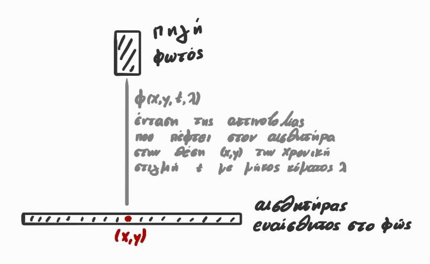
</p>
- $x,~y$: θέση στην αισθητήρα
- $t$: χρονική στιμγή
- $λ$: μήκος κύμματος
- $\phi$: εισερχόμενη ακτινοβολία
-  $E(x,y,t,λ)$: αιυεσθησία της κάμερας στο μήκος κύμματος λ
$$ L (x,y,t) = \int_λ \phi(x,y,t,λ) \cdot E(λ)~dλ $$
<p align="center">
	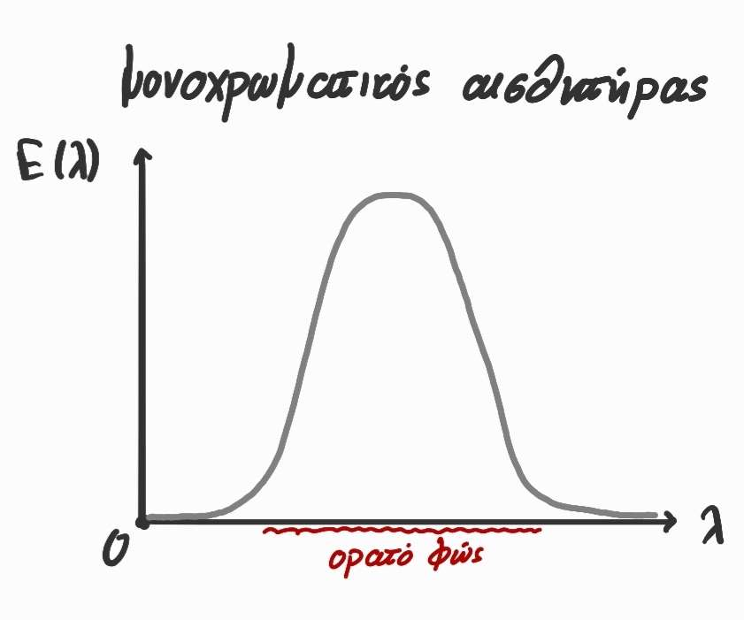
	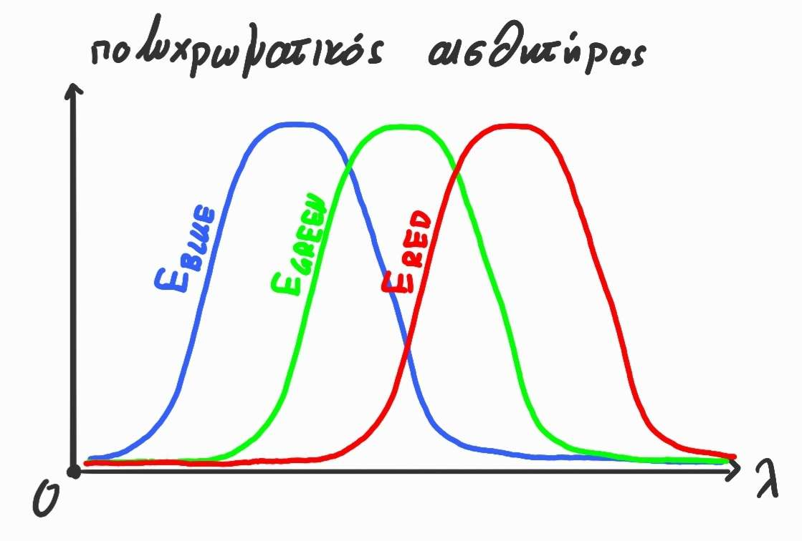
</p>
$$ L_{BLUE}(x,y,t) = \int_λ \phi(x,y,t,λ) \cdot E_{BLUE}(λ)~dλ $$
$$ L_{GREEN}(x,y,t) = \int_λ \phi(x,y,t,λ) \cdot E_{GREEN}(λ)~dλ $$
$$ L_{RED}(x,y,t) = \int_λ \phi(x,y,t,λ) \cdot E_{RED}(λ)~dλ $$

### Το Ανθρώπινο μάτι

### Είδη Φωτουποδοχέων στον άνθρωπο

1. Κωνία (Cones):
	- υπέυθυνα για αντίληψη χρωμάτων
	- υψηλής ποιότητας
	- ενεργοποιούνται όταν υπάρχει φώς
	- πολύ λίγοι, πολύ συγκετρωμένοι
	- ξεχωριστή σύνδεση με το οπτικό νεύρο

2. Ραβδιά (Rods):
	- μονοχρωματικοί (ασπρό-μαυρό)
	- χαμηλή ποιότητα
	- ενεργοποιούνται στο χαμηλό φως
	- πολύ περισσότεροι
	- μοιράζονται τη σύνδεση με το οπτικό νεύρο

**Το σημείο Α είναι σωστά εστιασμένο**
<p align="center">
	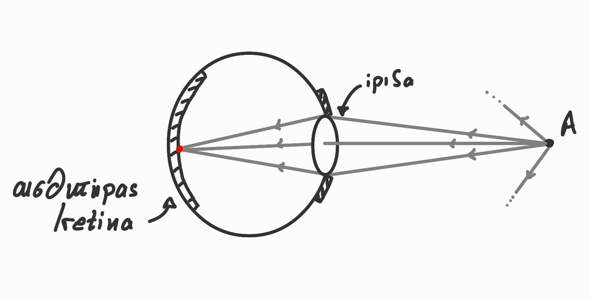
</p>

**Το σημείο Α είναι κακός εστιασμένο**
<p align="center">
	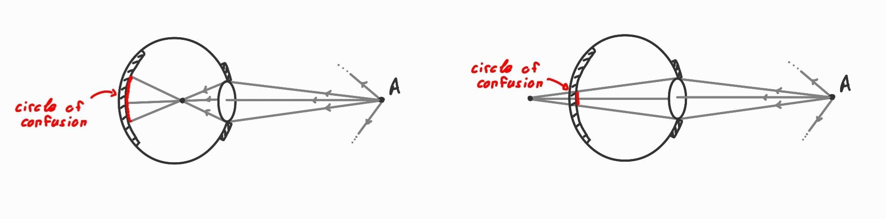
</p>

**Ανεστραμένο είδωλο**
<p align="center">
	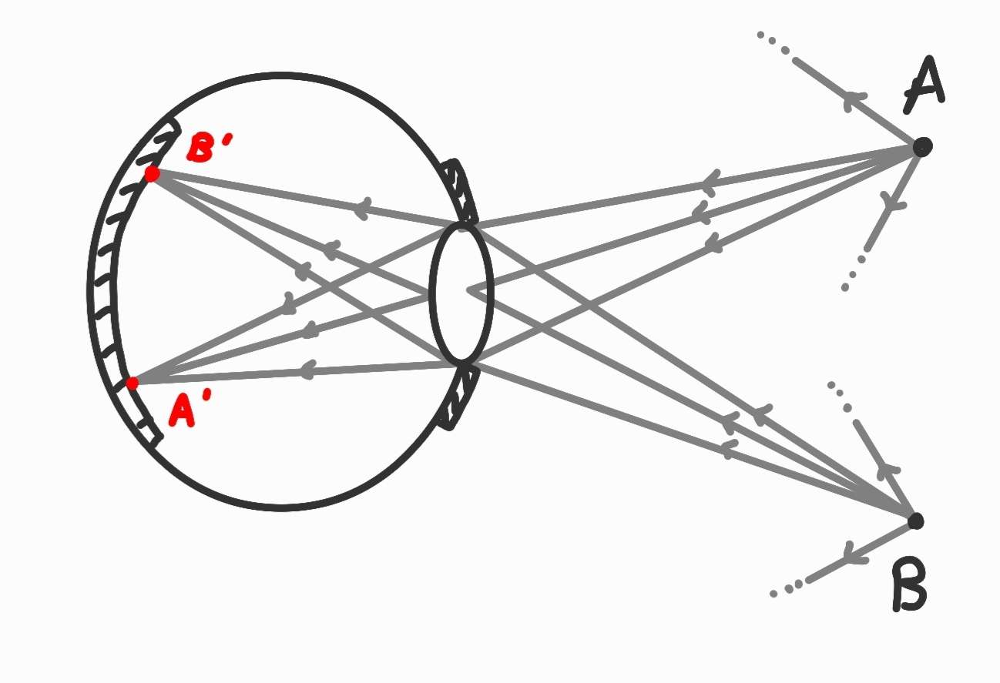
</p>

### Μετατροπή από Φως σε εικόνα
Pipeline Ψηφιακής κάμερας, αποτελείτε απο 2 στάδια στα οποία το φώς μετατρέπεται σε ψηφιακή εικόνα, τα δυο στάδια αυτά είναι:
1. Συλλογή και κατεύθυνση του φωτός
   Αυτό είναι το **οπτικό στάδιο**
	- Το φώς από τη σκηνή εισέρχεται μέσω του φακού
	- Ο φακός κατυθύνει τις ακτίνες φωτός πάνω στον αισθητήρα εικόνας
	- Εδώ παίζουν στοιχεία όπως:
		- το **εστιακό μήκος φακού** (focal length): ρυθμίζει η κάμερα να είναι καθαρή
		- το **μέγεθος διαφράγματος** (aperture size): κατευθύνει τις ακτίνες φωτός
		- ο **χρόνος έκθεσης** (shutter/exposure time): καθορίζει την διάρκεια έκθεσης στο φως
		Περισσότερες λεπτομέριες για τις παραμέτρους αυτές ακολουθούν
2. Μετατροπή (από φωτόνια σε ψηφιακά δεδομένα)
	Αυτό είναι το **ηλεκτρονικό στάδιο**
	- Ο **αισθητήρας εικόνας** μετατρέπει το φώς (φωτόνια) σε ηλεκτρικά σήματα (ηλεκτρόνια)
	- Κάθε pixel του αισθητήρα καταγράφει πόσο φώς έπεσε πάνω του
	- Αυτά τα ηλεκτρικά σήματα **ενισχύονται**, **ψηφιοποιούνται** και τελικά σχηματίζουν την ψηφιακή εικόνα (τις τιμές RGB για κάθε pixel)
	Περισσότερες λεπτομέρειες για το δέυτερο στάδιο ακολουθούν

### Πρώτο Στάδιο: καταγραφής εικόνας
Στο στάδιο αυτό θέτονται δύο βασικά ερωτήματα:
1. Που; (σε ποιό σημείο της εικόνας θα πέυτει το φώς)
2. Πόσο; (πόσο φώς θα πέυτει)

#### **Παραμέτροι:**
##### **Εστιακό Μήκος Φακού (focal length)**
**ανθρώπινο μάτι**: έχει την δυνατότητα να αλλάζει το focal length
**ψηφιακή κάμερα**: το focal length είναι σταθερό

Άμα θέλουμε να αλλάξουμε την εστίαση (πχ. απο το σημείο Α στο Β) θα πρέπει να μετακινήσουμε τον αισθητήρα

<p align="center">
	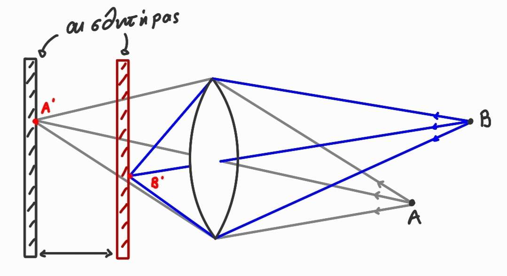
</p>

**focal length (f)**: η **απόσταση** του σημείου σύγκλισης παράλληλων ακτίνων απο τον φάκο

<p align="center">
	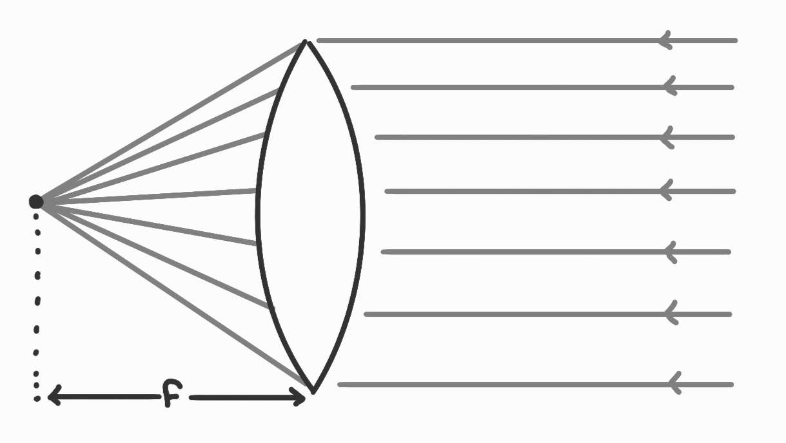
	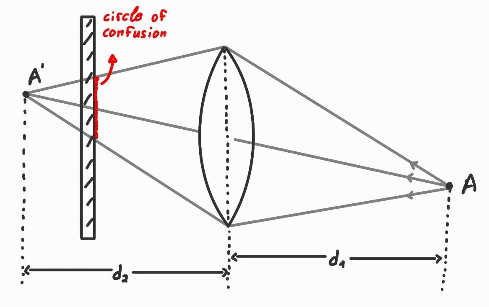
</p>

$$ \frac{1}{f} = \frac{1}{d_1} + \frac{1}{d_2} $$

Το σημείο Α είναι σωστά εστιασμένο $\Leftrightarrow$ Το σημείο A' βρίσκεται **πάνω** στον αισθητήρα
Το εστιακό μήκος $f$: 
- καθορίζει το σημείο σύγκλισης των ακτίνων φωτός
- καθορίζει πως πρέπει να μετακινήσω το επίπεδο της εικόνας για να πετύχω σωστή εστίαση (όσο δυνατό μικρότερο κύκλο σύγχισης)
	- κακή εστίαση -> μεγάλος κύκλος σύγχισης -> θολή εικόνα
- Επηρεάζει και το *field of view* (FOV, οπτικό πεδίο της κάμερας)

<p align="center">
	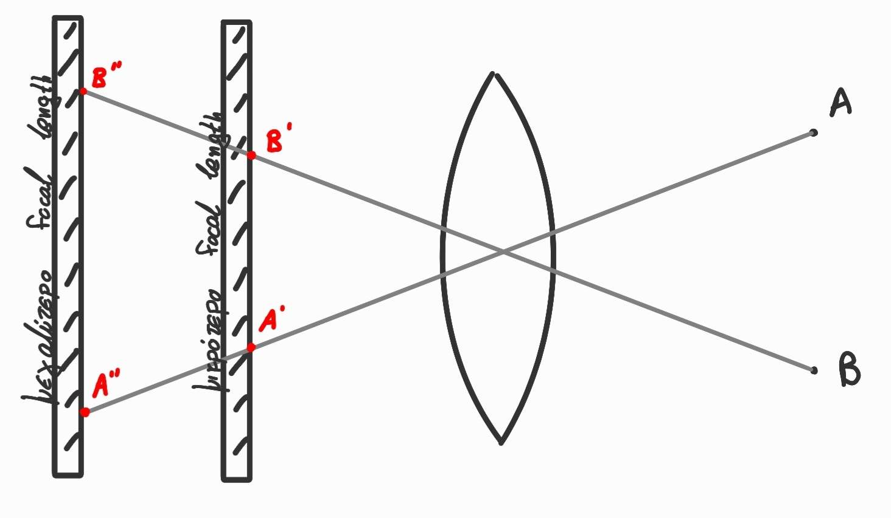
</p>

Μεγαλύτερο f => μικρότερο FOV
Μικρότερο f => μεγαλύτερο FOV
- Κύρια κάμερα: focal length ~ μέγεθος του image sensor
- Ευρύγωνη κάμερα: focal length < μέγεθος τους image sensor
- Telephoto κάμερα: focal length > μέγεθος του image sensor

Autofocus:
- active (hardware)
- passive (software)

Σημείωση:

<p align="center">
	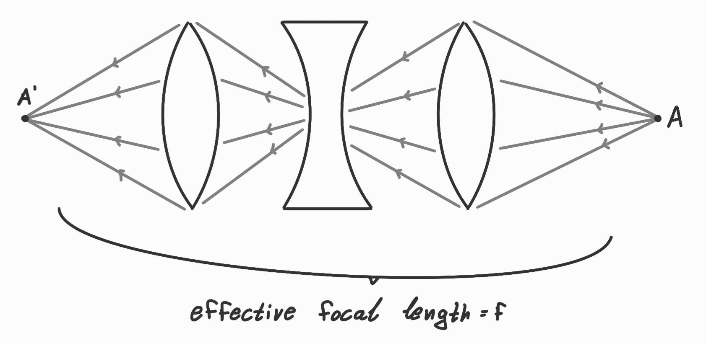
</p>

##### **Μέγεθος Διαφράγματος**

<p align="center">
	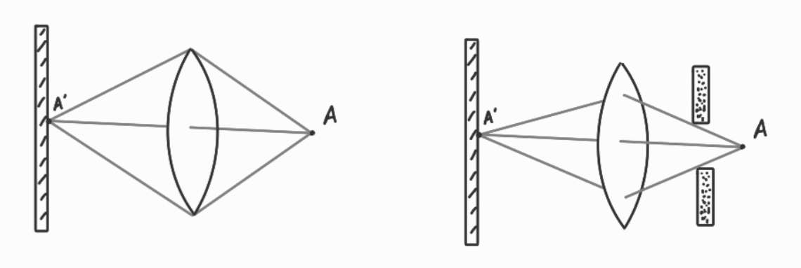
</p>

- Το διάγραγμα καθορίζει **πόσο** φώς φτάνει στο επίπεδο της εικόνας κάθε χρονική στιγμή.
- διάμετρος: $d = \frac{f}{N}$, όπου:
	- $f$: εστιακό μήκος
	- $Ν$: f-stop
- μεγαλύτερο άνοιγμα (aperature size): ο φακός συλλέγει περισσότερες ακτίνες φωτός -> περισσότερο φώς
- **Αλλά**: το μέγεθος του ανοίγματος επηρεάζει και το circle of confusion

<p align="center">
	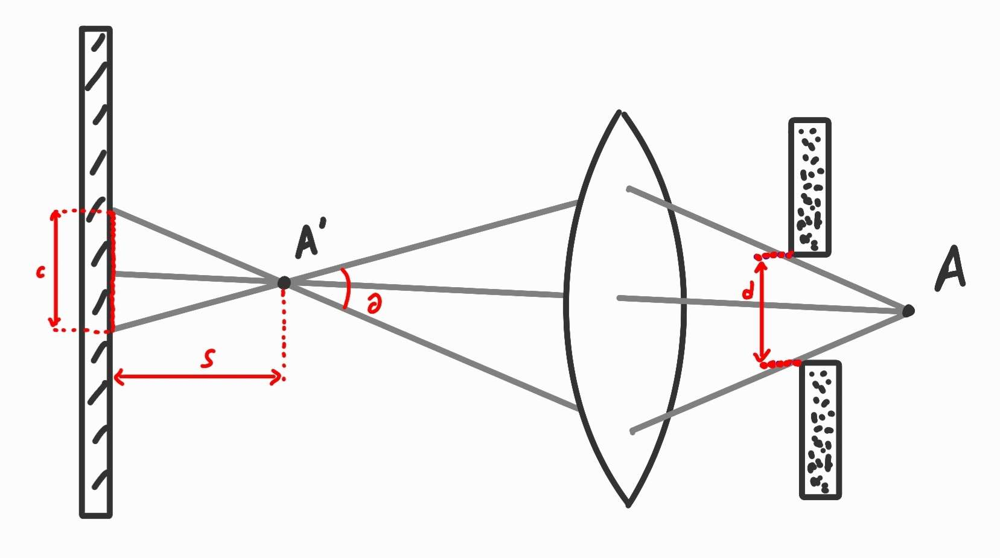
</p>

- To $c$ επιρεάζεται από:
	- το $θ$ (άρα το μέγεθος $d$)
	- την απόσταση $S$
- Μεγαλύτερο aperature size => μικρότερο depth of field (διαφορά μεγίστου και ελαχίστου βάθους μέσο στο οποίο υπάρχει σωστή εστίαση)
##### **Χρόνος έκθεσης**
- Για πόσο χρόνο επιτρέπω στο φώς να πέσει στο επίπεδο της εικόνας 
- Ταχύτητα κλείστρου (shutter speed)
	- μηχανικό κλείστρο (πχ. DSLR)
	- ηλεκτρονικό κλέιστρο (πχ. κινητό)
- μεγάλο exposure time:
	- περισσότερο φώς
	- αυξάνει την πιθανότητα η εικόνα να βγεί θολή (camera shake)
- exposure = aperture size $\times$ exposure time
	- στόχος είναι η μεγιστοποίηση του exposure και ανάλογως τις συνθήκες ρυθμίζω κατάλληλα τις παραμέτρους

### Δεύτερο στάδιο: Μετατροπή
**επίπεδο εικόνας**: εισθητήρες πυριτίου (silicon)
**βασικό στοιχείο**: φωτοδίοδος
<p align="center">
	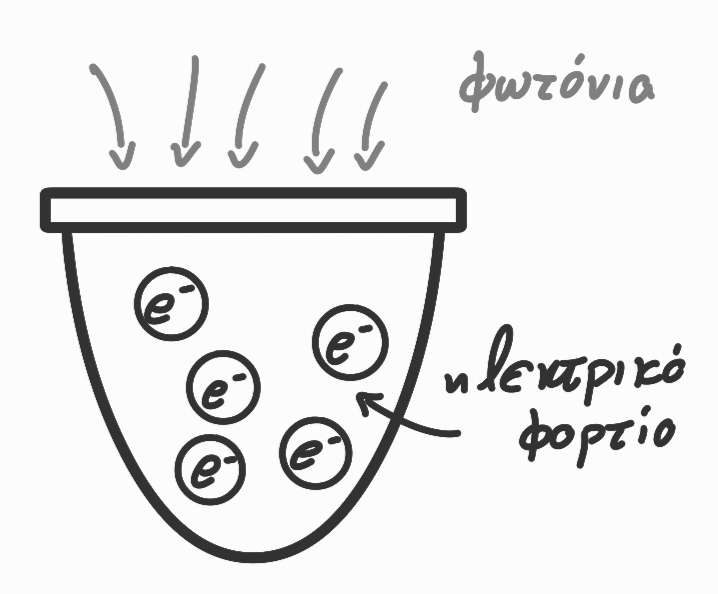
</p>

##### **Αισθητήρας**
**εικόνας**: φωτοδιόδοι διατεταγμένοι σε ένα δισδιάστατο πλέγμα
2 βασικές τεχνολογίες:
1. **CCD** (Chraged Couple Devices): 
	Pros:
	- Χαμηλό θόρυβο, καλή ποιότητα
	- fill factor
	Cons:
	- κατανάλωση ενέργειας
	- υψηλό ρυθμό εικόνων
2. **CMOS** (Complementary Metal Oxide Semiconductor)
	Pros:
	- Χαμηλή κατανάλωση
	- υψηλό ρυθμό ανανέωσης 
	Cons:
	- περισσότερος θόρυβος
	- μικρότερο fill-factor

<p align="center">
	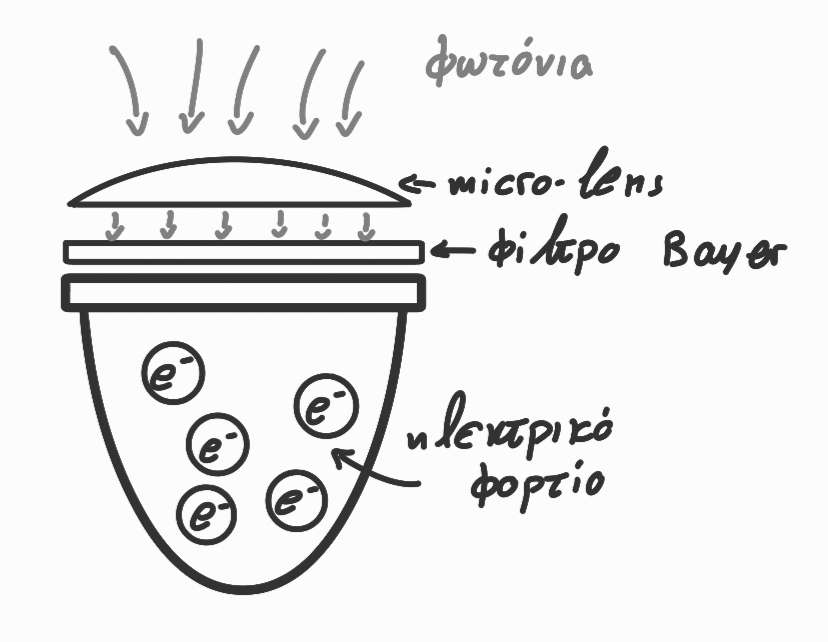
	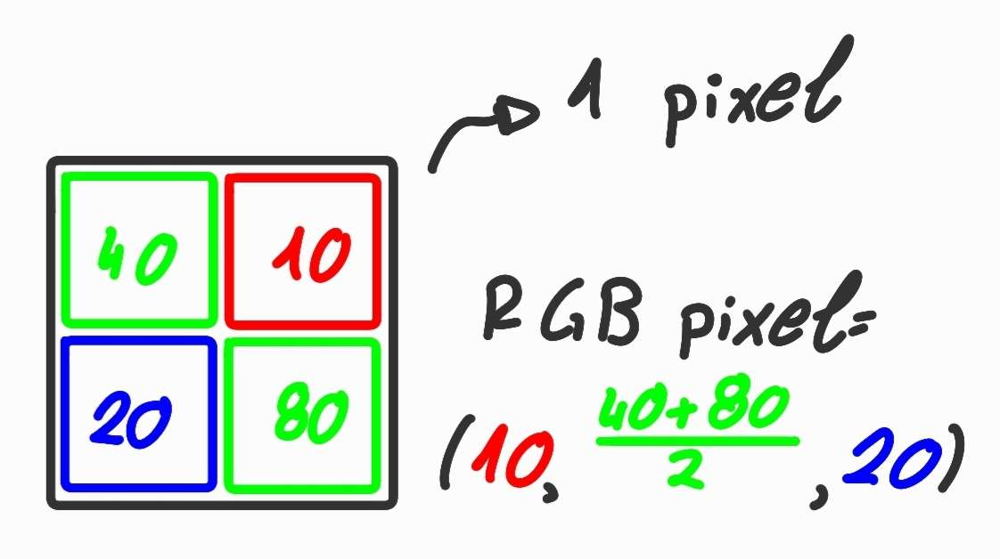
</p>

**Φίλτρο bayer**: ένα μοτύβο μικροσκοπικών χρωματικών φίλτρων που ακοκλείουν τα άλλα χρώματα εκτός από αυτό που θέλουμε (κόκκινο, πράσινο ή μπλέ). Κάθε pixel βλέπει έτσι μόνο από ένα χρώμα, το πιο συνηθισμένο μοτίβο είναι:
```
G R
B G
```

Ο λόγος που έχουμε δυο πράσσινα pixel είναι γιατί το ανθώπινο μάτι είναι πιο ευαίσθητο στο πράσσινο φώς, οπότε δίνουμε δύο pixels στο πράσσινο για πίο πολύ λεπτομέρια και πιο ρεαλιστική φωτινότητα.