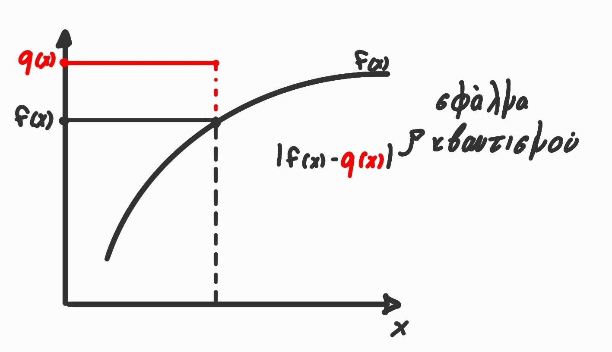
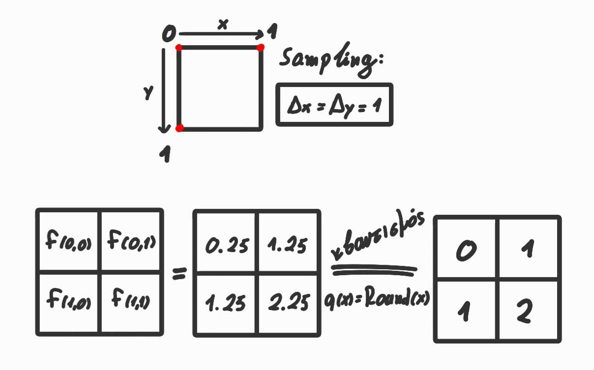
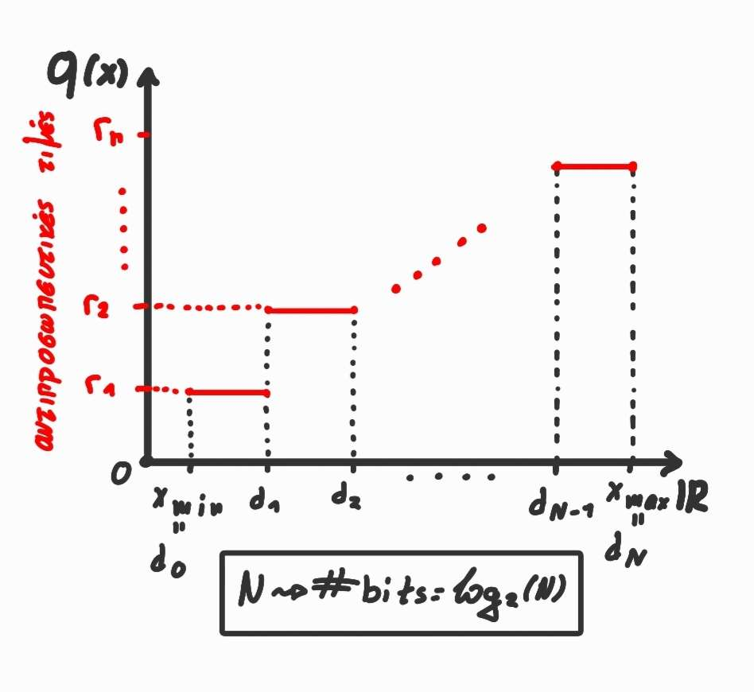
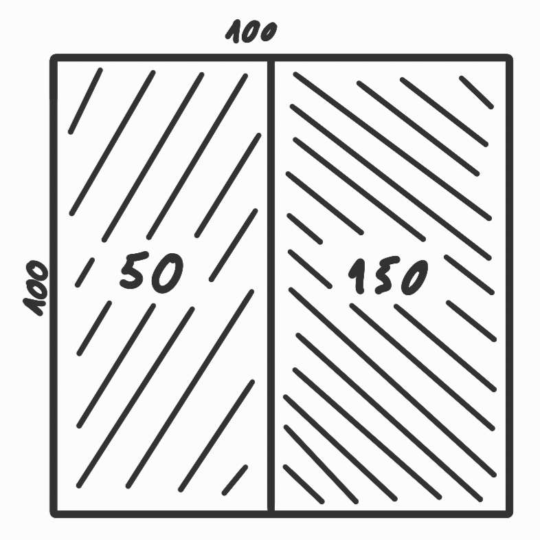
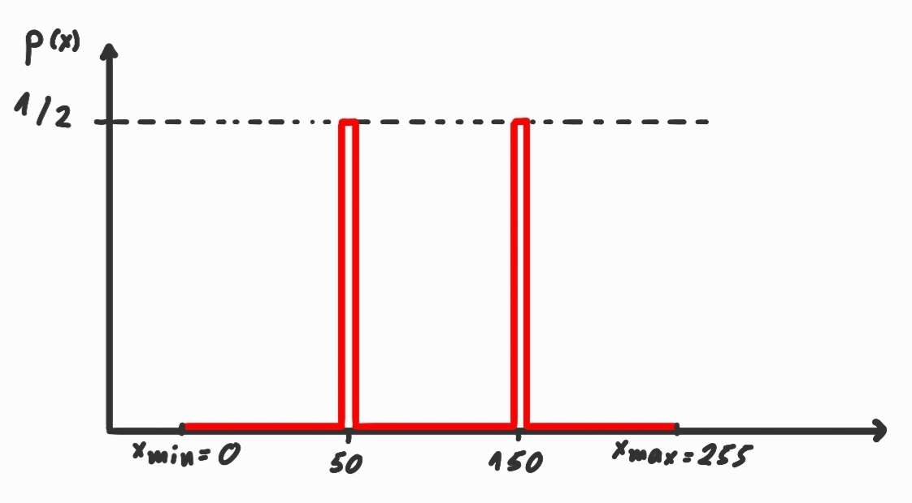
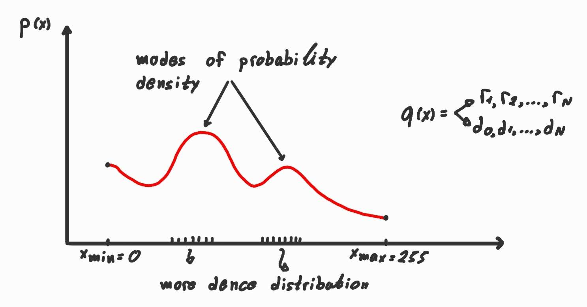
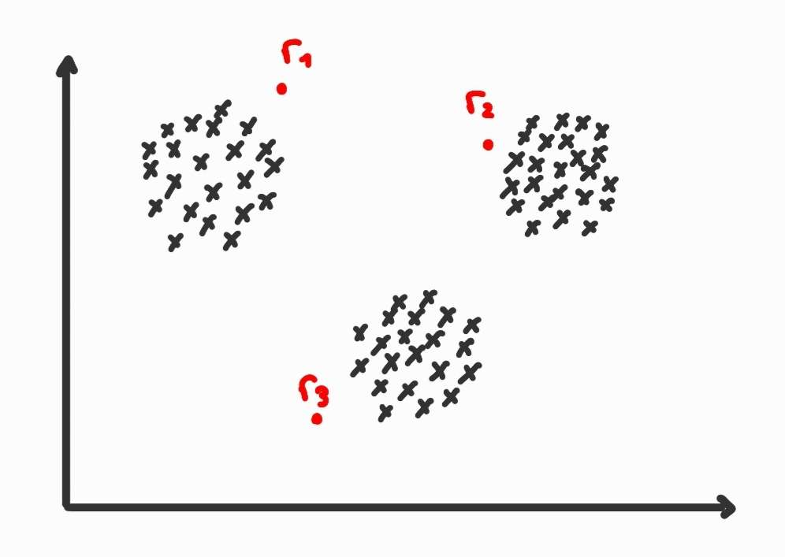

# ΗΥ371 - Ψηφιακή Επεξεργασία Εικόνων
## Γεωμετρικοί μετασχηματισμοί
Οι γεωμετρικοί μετασχηματισμοί μεταβάλουν τη χωρική διάταξη (spatial arrangement) των pixels μιας εικόνας, χωρίς να αλλάζουν τις τιμές φωτεινότητας (intensity values).
Κάθε μετασχηματισμός περιγράφεται ως συνάρτηση:
$$ (x',y') = T(x,y) $$

	

#### **Παραδείγματα:**

**Μετατόπιση**: μετακινέι κατά $(t_x,t_y)$
$$ \begin{bmatrix}  a_x \\ a_y \end{bmatrix} = \begin{bmatrix}  b_x \\ b_y \end{bmatrix} + \begin{bmatrix}  t_x \\ t_y \end{bmatrix} $$

**Κλιμάκωση**: μεγενθύνει κατά $(s_x,s_y)$
$$  \begin{bmatrix}  a_x \\ a_y \end{bmatrix} = \begin{bmatrix}  s_x & 0 \\ 0 & s_y \end{bmatrix} \cdot \begin{bmatrix}  b_x \\ b_y \end{bmatrix}  $$

#### Αφίνικοι Μετασχηματισμοί (affine transformation)

$$ \begin{bmatrix}  a_x \\ b_y \end{bmatrix} = \begin{bmatrix}  l_11 & l_12 \\ l_21 & l_22 \end{bmatrix} \cdot \begin{bmatrix}  b_x \\ b_y \end{bmatrix} + \begin{bmatrix}  t_x \\ t_y \end{bmatrix} $$

	

## Δειγματοληψία
Η δειγματοληψία είναι η διαδικασία με την οποία μια συνεχή εικόνα μετατρέπεται σε διακρική.
**Παράδειγμα 1D**, συνεχές αναλογικό σήμα:

	

$$ \{f(x) \in \mathbb{R},~\forall x \in [0,1] \} \xrightarrow{\text{δειγματοληψία}} \{ f'(mΔx),~ m \in \{0,1,...,M\} \} $$

**Παράδειγμα 2D**, εικόνα:

	

	

$$ \{f(x,y),~\forall x,y \in [0,1] \} \xrightarrow{\text{δειγματοληψία}} \{ f'(mΔx,nΔy),~ m \in \{0,1,...,M\},~ n \in \{0,1,...,N\} \}  $$

#### Πυκνότητα Δειγματοληψίας
Πόσα δείγματα (pixels) παίρνουμε ανά μονάδα μήκους/επιφάνειας της συνεχούς εικόνας
Εξαρτάται από τις "λεπτομέριες" του σήματος:

	

Όπως βλέπουμε στο παραπάνω σχήμα, σε περίπτωση που έχουμε δείγμα με πολλές λεπτομέριες και μικρή ανάληση δειγματοληψίας υπάρχει η περίτπωση η ανακατασκευή μας να είναι πολύ λανθασμένη. 
Σε εικόνες χρησιμοποιούμε γενικά την μονάδα μέτρησης *ppi (pixels per inch)*, όσο πιο ψηλό είναι αυτό, τοσο πιο πολλές λεπτομέρειες μπορούμε να εξάγουμε από μία εικόνα:

	

### Υποδειγματοληψία (Subsampling/Downsampling)
Μειώνω το πλήθος των δειγμάτων $\to$ μειώνω την ανάλυση

**Παράδειγμα 1D:**

	

**Παράδειγμα 2D:**

	

	

## Παρεμβολή (Interpolation)
Η διαδικασία υπολογισμού **ενδιάμεσων** τιμών για σημεία εικόνας που αντιστοιχούν σε υπάρχοντα δείγματα. Εφαρμόζεται σε περιπτώσεις μετασχηματισμού ή αλλαγή ανάλυσης που χρειαζόμαστε τιμές για **μη ακέραιες** συντεταγμένες.
**Παράδειγμα 1D:**

	

**Παράδειγμα 2D:**

	

## Επαναδειγματοληψία (Resampling)
#### Υλοποίηση γεωμετρικού μεασχηματισμόυ μέσω **ευθή (forward) warping**
  Παιρνουμε κάθε pixel της αρχικής εικόνας και το προβάλλουμε στη νέα θέση στην έξοδο εφαρμόσοντας **ευθέως** τον μετασχηματισμό

	

**Δεν** γεμίζει τέλεια την έξοδο:
- Κάποια pixels μένουν κενά ("holes") επειδή δεν αντιστοιχεί ακριβως σε κάποιο pixel εισόδου εκεί
- Άλλα μπορούν να καλυφθούν δυο φορές (overlapping) αν διαφορετικά input pixels προβάλονται στο ίδιο output pixel

Για αυτόν τον λόγο χρησιμοποιείτε και το **αντίστροφο (backwards) warping**:
- Για κάθε pixel εξόδου $(x',y')$ υπολογίζουμε απο πια είσοδο προέρχεται:

$$ (x,y) = T^{-1}(x',y') $$

- Παίρνουμε την τιμή $I(x,y)$ από την είσοδο (με παρεμβολή) και την βάζουμε στο $(x',y')$

	

### Forward vs Backward warping
Στην **επαναδειγματοληψία εικόνων**, υπάρχουν δύο τρόποι εφαρμογής του γεωμετρικού μετασχηματισμού: **forward warping** και **inverse warping**.

Στο *forward warping*, κάθε pixel της αρχικής εικόνας μεταφέρεται στη νέα θέση του μέσω του μετασχηματισμού $ (x', y') = T(x, y) $. Το πρόβλημα είναι ότι οι νέες συντεταγμένες σπάνια είναι ακέραιες, με αποτέλεσμα “τρύπες” και ανομοιομορφίες στην τελική εικόνα.

Αντίθετα, στο *inverse warping*, για κάθε pixel της νέας εικόνας υπολογίζουμε από ποιο σημείο της αρχικής προήλθε, εφαρμόζοντας τον αντίστροφο μετασχηματισμό $ (x, y) = T^{-1}(x', y') $. Επειδή αυτές οι συντεταγμένες είναι μη ακέραιες, η τιμή του pixel προκύπτει με **παρεμβολή** (π.χ. bilinear ή bicubic).

Έτσι, το inverse warping παράγει πλήρη και ομαλά αποτελέσματα, ενώ το forward warping είναι απλούστερο αλλά δημιουργεί κενά και χρησιμοποιείται σπάνια στην πράξη.

## Πώς κάνουμε υποδειγματοληψία σε εικόνες;

- Εφαρμόζουμε ένα φίλτρο για να απομακρύνουμε τις υψηλές συχνότητες (anti aliasing)
- Εφαρμόζουμε την υποδειγματοληψία όπως είπαμε παραπάνω

## Πώς εφαρμόζουμε Παρεμβολή 

	

Ψάχνουμε την τιμή του $Ι$ 
Η ιδέα:
-  Σπάω το πεδίο ορισμού σε π  ολλες μικρές περιοχές
-  Σε κάθε μικρή περιοχή κατασκευάζω ένα μοντέλο ($f_{local}(x,y)$) που προβλέπει τις τιμές στη τοπική περιοχή

### 1. Παρεμβολή με το πλησιέστερο γείτονα

**1D:**

	

**2D:**

	

### 2. Διγραμμική παρεμβολή (Linear/Bilinear interpolation)

**1D:**

	

**2D:**

	

	

	

### 3. Δικυβική παρεμβολή (Cubic/Bicubic interpolation)

**1D:**

	

**2D:**

	

**Συνταγή:** 
τοπικό μοντέλο πρόβλεψης: πολυώνυμο χαμηλού βαθμού ως προς τα x, y
τοπική περιοχή: αυξάνω τα γνωστά δείγματα που καλύπτει

### 4. Το τέλειο μοντέλο

Υπάρχει τρόπος να έχω κάποιο μοντέλο παρεμβολής που εγγυημένα να μου δίνει σωστά αποτέλεσματα;
- Πυκνότητα-Δειγματοληψίας πρέπει να είναι αρκετά μεγάλη
- Ιδανική παρεμβολή: numerical

### 5. Νευρωνικά δίκτυα

$f_{flocal}$ : νευρωνικό δίκτυο
- ισχυρά μη γραμμικές συναρτήσεις
- εκκατομύρια παραμέτρους
τοπική περιοχή -> πολύ μεγαλύτερη

## Κβαντισμός
Ο Κβαντισμός ανάλογα και με την δειγματοληψία είναι η διαδικασία στην οποία μετατρέπουμε τις συνεχές **τιμές** μιας εικόνας σε διακριτές.

	

Συνάρτηση Κβαντισμού $q(x)$:
$$ q(x): \mathbb{R} \to \{ r_1, r_2, ..., r_n \} $$
Με τις τιμές $r_i$ να είναι οι αντισπρωσοπικές τιμές που μπορούμε να δώσουμε.
Μπορούμε να υλοποιήσουμε την συνάρτηση κβαντισμού με διάφορους τρόπους:
1. `round(x)`: Πλησιέστερος ακέραιος του $x$
2. `floor(x)`: μικρότερος ακέραιος του $x$
3. `ceil(x)`: μεγαλύτερος ακέραιος του $x$

**Παράδειγμα:**
$$f(x,y) = x + y + 0.25 \\ ~ x,y \in [0,1] $$

	

### Τί χρειαζόμαστε για να ορίσουμε μία συνάρτηση Κβαντισμού;
Για να ορίσω έναν κβαντιστή $q(x)$ πρέπει να ορίσω: 
$$
\begin{align*}
d_0&,d_1,...,d_n \\ 
r_0&,r_1,...,r_n 
\end{align*} 
$$

Υπάρχουν διάφοροι τρόποι κβαντισμού:

### Ομοιόμορφος Κβαντισμός
Το έυρος των δυνατών τιμών χωρίζεται σε ίδα διαστήματα και κάθε πραγματική τιμή αντικαθιστάται από το **κοντινότερο** κεντρικό επίπεδο του αντίστοιχου διαστήματος.

	

$$
\begin{align*}
N &\to \#bits = \log_2(N) \\ 
d_{i+1} - d_i &= \frac{x_{max} - x_{min}}{N} \\
r_i &= \frac{d_i + d_{i-1}}{2}
\end{align*}
$$

### Κβαντισμός με βάση τον νόμο Weber
Στον ομοιόμορφο κβαντισμό, το βήμα είναι $Δ$ είναι σταθερό, ο ανθρώπινος όμως οφθαλμός είναι πιο ευαίσθητος σε χαμηλές φωτεινότητες, βλέπει μικρές διαφορές στο σκοτάδι αλλα όχι στο φώς. Ο νόμος του Weber λέει:
$$ \frac{ΔI}{I} = k $$
- $I$: η ένταση της πχ. φωτεινότητας
- $ΔΙ$: η ελάχιστη μεταβολή έντασης που μπορεί να αντιληφθεί ο άνθρωπος
- $k$: σταθερά (Weber fraction)

Αντί λοιπόν για το βήμα που είχαμε στον ομοιόμορφο κβαντισμός ($d_{i+1} - d_i$) ορίζουμε το βήμα ανάλογο της φωτεινότητας:
$$ ΔI = k \cdot I $$
Έτσι:
- Σε **σκοτεινές περιοχές** θα κάνουμε μικρά βήματα 
- Σε **φωτεινές περιοχές** θα κάνουμε μεγαλύτερα βήματα

### Κβαντισμός με βάση στατιστικά κριτήρια
Στον στατιστικό κβαντισμό μελετάμε την κατανομή πιθανότητας των τιμών φωτεινώντητας και επιλέγουμε επίπεδα κβαντισμού $r_i$ τέτοια ώστε να έχουμε πιο πυκνά διαστήματα εκεί που δεδομένες τιμές εμφανίζοντια περισσότερο

	
	

μέσο σφάμλα κβαντισμού σταθμισμένο με βάση τη πιθανότητα $p(x)$

$$ f(\{r_i\}^N_{i=1}, \{d_i\}^N_{i=0}) = \int^{max}_{min} (x - q(x))^2 \cdot p(x) dx  $$

	

Προφανώς θέλουμε να βρούμε τις τιμές $r_i$, $d_i$ τέτοιες ώστε η $f$ να ελαχιστοποιήτε, αυτό το κάνουμε μέσω του Κβαντιστή *Lloyd-Max*:
1. Αρχικοποιούμε τα $r_i$, $d_i$
2. Mε σταθερές τιμές $d_i$ υπολογίζουμε τα $r_i$:
  $$ r_i = \frac{\int^{d_i}_{d_{i-1}} x \cdot p(x) \cdot dx}{\int^{d_i}_{d_{i-1}} p(x) \cdot dx} $$
1. Με σταθερές τιμές $r_i$ υπολογίζουμε τα $d_i$:
	$$ d_i = \frac{r_i + r_{i+1}}{2} $$
2. Επαναλαμβάνουμε τα βήματα 2, 3 μέχρι να συγκλίνουν τα $r_i$ 

### Κβαντισμός έγχρωμης εικόνας 
Για να εφαρμόσουμε κβαντισμό σε μία έγχρωμη εικόνα μπορούμε να χρησιμοποιήσουμε τις ίδιες τακτικές και με τον κβαντισμό στις μαυρο-ασπρες εικόνες όπως κάναμε μέχρι αυτό το σημείο. Αυτή την φορά όμως γιατί έχουμε να κάνουμε με 3 διαστάσεις (μια για κάθε χρώμα R,G,B) πρέπει να χωρίσουμε κάθε μία σε δική της συνάρτηση:

$$ f(x,y) \in \mathbb{R}^3 = 
\begin{cases}
\begin{align*}
f_{\text{RED}}& (x,y) \in \mathbb{R} \\ 
f_{\text{GREEN}}& (x,y) \in \mathbb{R} \\ 
f_{\text{BLUE}}& (x,y) \in \mathbb{R}
\end{align*}
\end{cases}
$$

$$ 
q_{\text{RED}} (f_{\text{RED}} (x,y)) \\
q_{\text{GREEN}} (f_{\text{GREEN}} (x,y)) \\
q_{\text{BLUE}} (f_{\text{BLUE}} (x,y)) \\
$$

### Διανυσματικός Κβαντισμός
Στον Διανυσματικό Κβαντισμό θεωρούμε κάθε δείγμα (δηλαδή pixel ή block) σαν ένα **διάνυσμα**. 

$$ q: \mathbb{R}^3 \to \{r_1,r_2,...,r_N\},~r_i \in \mathbb{R}^3 \\ q(f(x,y)) \in \mathbb{R}^3 $$

Παράδειγμα στην δεύτερη διάσταση:
$$ q: \mathbb{R}^2 \to \{r_1,r_2,...,r_N\}, r_i \in \mathbb{R}^2 $$

	

