# ΗΥ371 - Ψηφιακή Επεξεργασία Εικόνων

## Μετασχηματισμός Έντασης
Άν έχουμε μια εικόνα $f(x,y)$ ο μετασχηματιμός ορίζει μια συνάρτηση $T$ ώστε η νέα εικόνα $g(x,y)$ να είναι 
$$ g(x,y) = T[f(x,y)] $$
- $f(x,y)$: αρχική φωτεινότητα pixel
- $g(x,y)$: νεα φωτεινότητα pixel
- $T$: μετασχηματισμός έντασης, συνήθως μονοδιάσταση συνάρτηση
- Δεν αλλάζει η χωρική θέση των pixels $(x,y)$, μόνο η φωτεινότητα

## Ιστόγραμμα εικόνας
$L$: #τιμών ($L-1$ μέγιστη τιμή)
$H_x(x_0)$: #pixels που έχουν τιμή $x_0$ στην εικόνα μας
$P_x(x_0) = \frac{H_x(x_0)}{\text{\#pixels}}$: κανονικοποιημένο ιστόγραμμα ή πιθανότητα εμφάνισης τιμής

	

$Q_x$: αθροιστική πιθανότητα
$$ Q_x(x_0) = \text{Prob}(x \leq x_0) = \sum^{x_0}_{x=0} P(x) $$

## Τύποι μετασχηματισμών
### Γραμμικός μετασχηματισμός
Απλή κλίμμακα brightness/contrast
$$ g(x,y) = a \cdot f(x,y) + b $$

#### a) Αρνητική μιας εικόνας ($α = -1$, $b = L-1$) 
$$f(x) = -x + L - 1 = L-1+x$$

	
	

	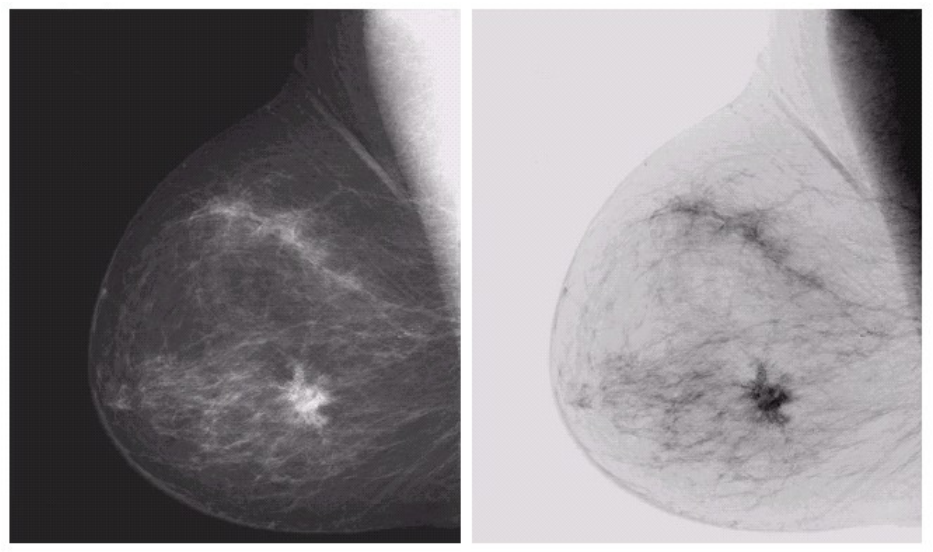

#### b) Γραμμικό και Additive $f$ ($a=1$)
$$f(x) = x + b$$

	

- Αν $b > 0$: φωτεινότερη εικόνα
- Αν $b < 0$: σκοτεινότερη εικόνα

#### c) Multiplicative f ($a>0,~a\neq1,b=0$)
$$ f(x) = a x $$

	

επεκτείνεται το ιστόγραμμα: αυξάνει το contrast

	

συμπίπτει το ιστόγραμμα: μειώνει το contrast

#### d) Γραμμικός μετασχηματισμός ($a \in \mathbb{R},~b \in \mathbb{R}$)
Απλός γραμμικός μετασχηματισμός
Για να επεκτήνουμε το ιστόγραμμα σε όλες τις τιμές του ($f(x_{min}) = 0, f(x_{max} = L-1)$) πρέπει:

$$
\begin{cases}
f(x_{min}) &= 0 \\
f(x_{max}) &= L-1
\end{cases}
\Rightarrow
f(x) = (L-1) \frac{x - x_{min}}{x_{max} - x_{min}}
\\
a = \frac{L-1}{x_{max} - x_{min}}, ~~~ b = -\frac{x_{min}}{x_{max} - x_{min}}
$$

	

Κάνοντας αυτό μπορούμε να φτιάξουμε μια εικόνα η οποία είναι πιο καθαρή για το ανθρώπινο μάτι με τις αντιθέσεις να είναι πιο έντονες:

	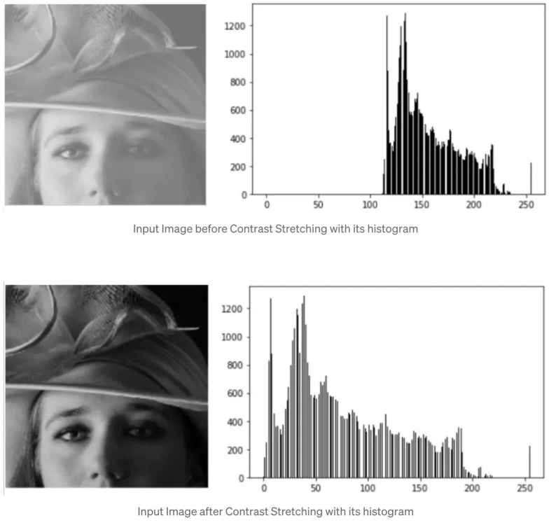

### Τμηματικα γραμμικός μετασχηματισμός

Συναρτήσεις που είνα γραμμικές σε επιμέρους διαστήματα της έντασης $r$, αλλα όχι απαραίτητα σε όλο το έυρος $[0,L-1]$. 
Αν και έχει αρκετές εφαρμογές (διάταση αντίθεσης, κατωφλίωση κα.) θα δείξουμε μόνο το παράδειγμα της διάτασης αντίθεσης (contrast stretching).
Αυτό που κάνει είναι απλά:
- τα σκούρα σημειά πιο σκούρα
- τα φωτεινά σημεία πιο φωτεινά
Ενισχύοντας την αντίθεση της εικόνας

Ο μετασχηματισμός δίνεται από:
$$ 
f(x) =
\begin{cases}
l \cdot x &, 0 \leq x \lt x_0 \\
m \cdot x + lx_0 &, x_0 \leq x \lt x_1 \\
n \cdot x + mx_1 &, x1 \leq x \lt L-1
\end{cases}
$$

Οι σταθερές $l$, $m$, $n$ καθορίζουν την **κλίση** των γραμμικών τμημάτων και επομένως ελέγχουν πόσο έντονη θα είναι η ενίσχυση της αντίθεσης σε κάθε περιοχή φωτεινότητας.

  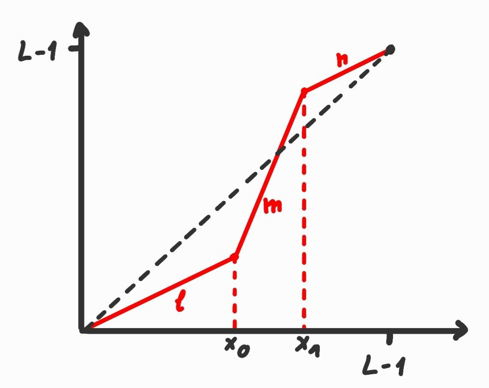

  $$ 
  f'(x)=
  \begin{cases}
	l &, 0 \leq x \lt x_0 \\
	m &, x_0 \leq x \lt x_1 \\
	n &, x1 \leq x \lt L-1
  \end{cases}
  $$

#### $l = 0, n = 0$

Ο μετασχηματισμός αυτός "τεντώνει" τις εντάσεις που είναι ανάμεσα στις τιμές $x_0$ και $x_1$. Συγκεκριμμένα:
- ότι είναι κάτω από το $x_0$ γίνεται μάυρο
- ότι είναι πάνω από το $x_1$ γίνεται άσπρο
- ότι είναι ανάμεσα αναλογείτε γραμμικά στο διάστημα τιμών ($[0,L-1]$)

  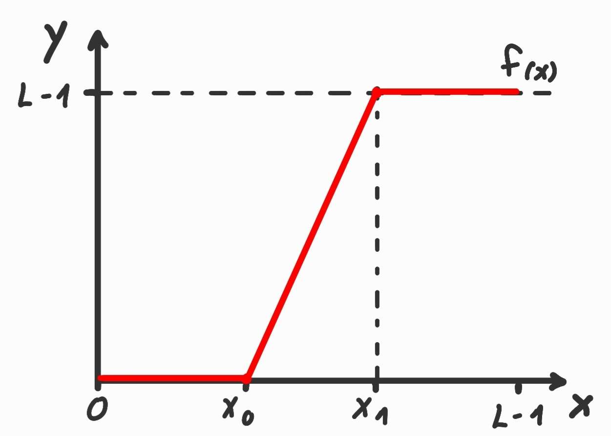

  $$ 
  y=
  \begin{cases}
  0 &, x \leq x_0 \\
  (L-1) \cdot \frac{x-x_0}{x_1-x_0} &, x_0 \lt x \lt x_1 \\
  L-1 &, x_1 \leq x
  \end{cases}
  $$

	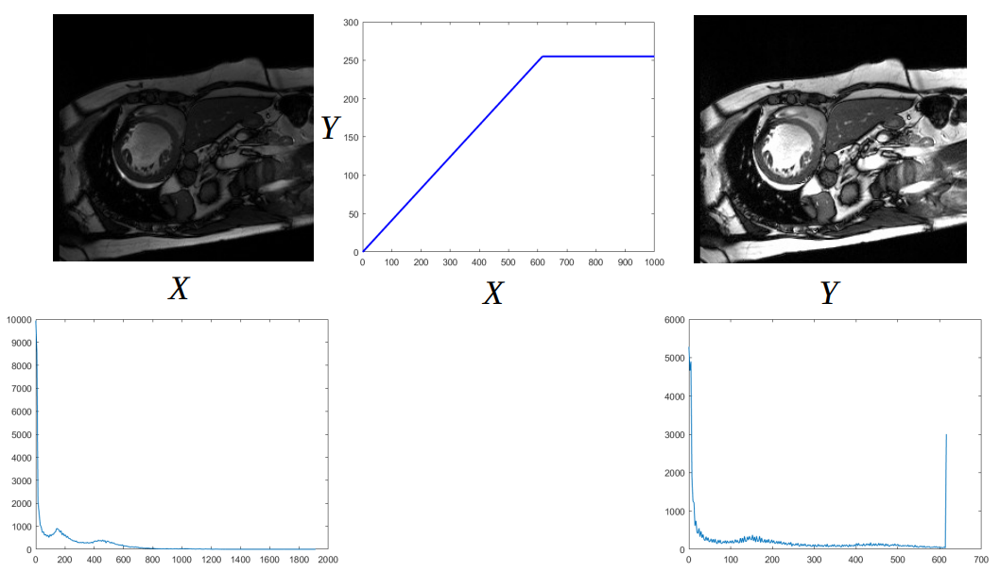

### Μη γραμμικές Συναρτήσεις

#### a) Συνάρτηση γάμμα 

$$ f(x) = c \cdot x^\gamma $$

Την συνάρτηση βέβαια θα την βλέπουμε πιο συχνά σαν:
$$ f(x) = (L-1) \Bigl( \frac{x}{L-1} \Bigl) ^\gamma $$
όπως βλέπουμε τώρα απλά κανονικοποιούμε την είσοδο $x$ και θέτουμε το $c=L-1$ ώστε να επαναφέρουμε τις τιμές μετά τον μετασχηματισμό

Η συνάρτηση αλλάζει τη φωτεινότητα της εικόνας:
- για $γ < 1$ φωτίζει την εικόνα
- για $γ > 1$ σκοτεινιάζει την εικόνα

	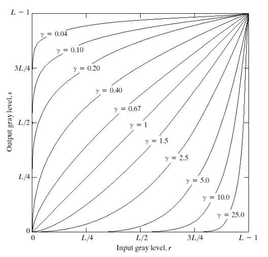
	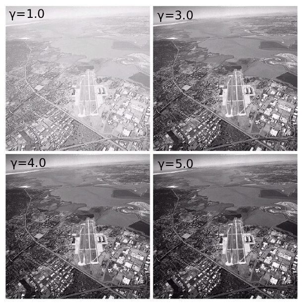

#### b) Συνάρτηση λογαρίθμου

$$ f(x) = c \cdot \log(1 + r) $$
όπου $r$ η κανονικοποιημένη τιμή του $x$, $r = \frac{x}{L-1}$

Συχνά θα βλέπουμε την σταθερά $c$ να πέρνει την τιμή:

$$ c = \frac{L-1}{\log(1 + r_{\text{max}})} $$

Άρα η συνάρτηση θα έχει τελική μορφή:

$$ f(x) = \frac{L-1}{\log(1 + r_{\text{max}})} \cdot \log(1 + r),~r = \frac{x}{L-1} $$

Αυτό που κάνει ο μετασχηματισμός αυτός είναι να:
- αυξάνει τις μικρές τιμές του $x$, άρα φωτίζει/αυξάνει την αντίθεση στα σκοτεινά σημεία
- συμπιέζει τις μεγάλες τιμές του $x$, άρα περιορίζει τις φωτεινές τιμές

Είναι ιδανική λοιπόν για να τραβήξουμε λεπτομέριες απο σκιές/σκοτεινά σημεία αλλα ταυτόχρονα να μήν "κάψουμε" τα φωτεινά

### Εξισορρόπηση ιστογράμματος
Ας δούμε ένα παράδειγμα απο τμηματικά γραμμικό μετασχηματισμό:

  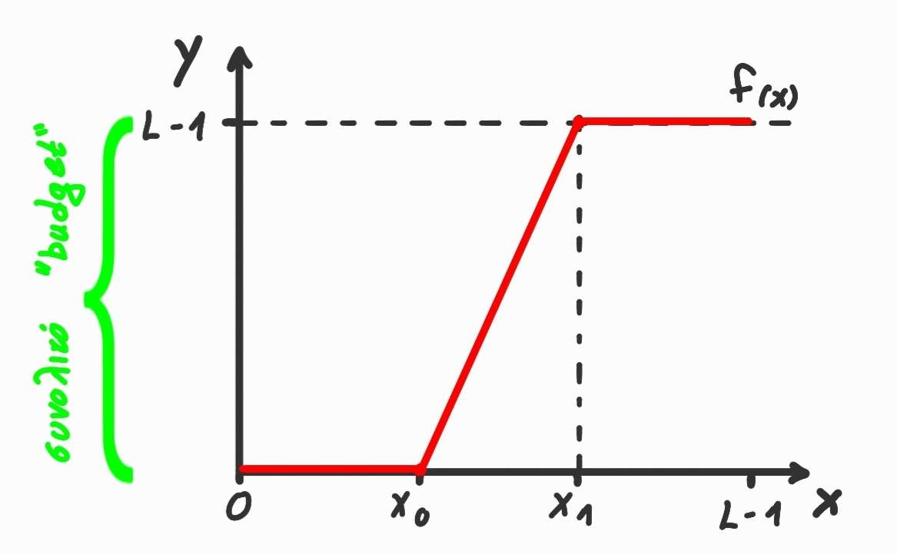

  $$
	\begin{align*}
	[0,x_0] &\to 0\% & \text{"budget"} \\
	[x_0,x_1] &\to 100\% & \text{"budget"} \\
	[x_1,L-1] &\to 0\% & \text{"budget"}
	\end{align*}
  $$

Με "budget" εννούμε πόσο διατίθεται για άυξηση αντίθεσης, δηλάδη **που** θα ξοδευτεί η γραμμική ενίσχυση. 

Εδώ τήθεται η ερώτηση "Πώς μπορούμε να κατανείμουμε το budget με αυτόματο τρόπο;". Προέκυψε έτσι η ιδέα ότι ο ρυθμός αλλαγής (δηλαδή η κλήση της συνάρτησης μετασχηματισμού, $f'$) πρέπει να εξαρτάται από την κατανομή των τιμών φωτεινότητας $P_X(x)$
Δηλαδή:

$$ f'(x) \propto P_X(x) $$

Με πιο απλά λογια αυτό σημαίνει:
> _Όσο πιο συχνά εμφανίζεται μια τιμή φωτεινότητας $x$ τόσο μεγαλύτερη πρέπει να είναι η "έκταση" που της δίνουμε για να εξισορροπείσουμε το ιστόγραμμα._

|  | Διακριτή Περίπτωση | Συνεχής Περίπτωση |
| ---| ------------------ | ----------------- |
| Συνάρτηση πυκνότητας | $$ P_X(x_0) = \text{Prob}(X=x_0) $$ | $$ P_X(x_0) $$ |
| Αθροιστική συνάρτηση κατανομής | $$ Q_X(x_0) = \sum^{x_0}_{x'=0} P_X(x') $$ | $$ Q_X(x_0) = \int^{x_0}_0 P_X(x')dx' $$ |
| Σχέση πυκνότητας με CDF | $$ P_X(x_0) = Q(x_0)-Q(x_0-1) $$ | $$ P_X(x_0) = Q'_X(x_0) $$ |

Υπάρχουν δύο τρόποι για να το κάνουμε αυτό:

#### Εξισορόπηση/Ισοστάθμιση Ιστογράμματος
Σκοπός μας είναι να κάνουμε την κατανομή επιπέδων φωτεινότητας πιο **ομοιόμορφη**.

Αν $X$ είναι η αρχική φωτεινότητα και $P_X(x)$ η πυκνότητα της, θέλουμε η νέα μεταβλητή $Y = f(x)$ να έχει ομοιόμοεφη κατανομή 
$$ P_Y(y) = \text{constant} $$
Αυτό επιτυγχάνεται όταν ο μετασχηματισμός είναι:
$$ 
\begin{align*}
f(x) &= \lfloor Q_X(x) \cdot (L-1) \rfloor   \\
f'(x) &= Q_X'(x) \cdot (L-1) \propto P_X(x)
\end{align*}
$$

	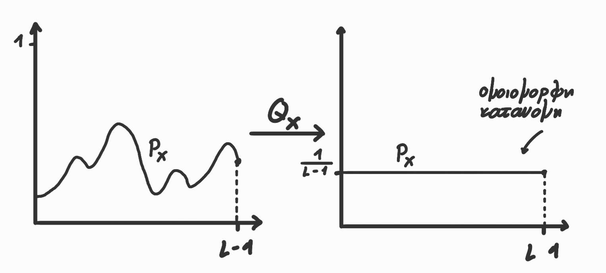

_Η εξισορρόπηση ιστογράμματος “τεντώνει” το ιστόγραμμα ώστε να χρησιμοποιηθεί όλο το δυναμικό εύρος φωτεινοτήτων, κάνοντάς το προσεγγιστικά ομοιόμορφο._

#### Ταίριασμα Ιστογράμματος
Ενώ η **Ισοστάθμιση Ιστογράμματος** προσπαθεί να κάνει το ιστόγραμμα ομοιόμορφο το **Ταίριασμα Ιστογράμματος** έχει σκοπό να κάνει το ιστόγραμμα να μοιάζει με ένα επιθυμητό ιστόγραμμα.
Δεν "τεντώνουμε" δηλαδή απλά το ιστόγραμμα αλλά το διαμορφώνουμε ώστε να έχει την ίδια κατανομή με μία άλλη εικόνα ή με μια καθορισμένη μορφή.

Αν έχουμε πχ. μία αρχική εικόνα $X$ με $P_X(x)$ και $Q_X(x)$ και μία εικόνα-στόχο $Z$ με $P_Z(x)$ και $Q_Z(x)$. Θέλουμε να βρούμε μια συνάρτηση $f(x)$ τέτοια ώστε η **κατανομή της εξόδου** να είναι ίδια με με του στόχου.

	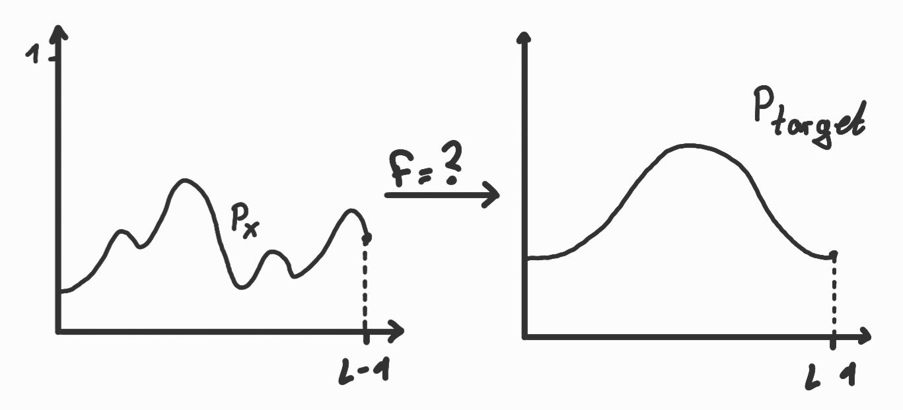

Η βασική ιδέα είναι η εξής αλληλουχία μετασχηματισμών:
1. Εξισοροπούμε πρώτα το ιστόγραμμα της αρχικής εικόνας:
$$ y = Q_X(x) $$
2. Εφαρμόζουμε τον αντίστροφο μετασχηματισμό της $Q_Z(x)$ 
$$ z = Q^{-1}_Z(y) $$

Συνεπώς ο συνολικός μετασχηματισμός είναι ο:
$$ f(x) = Q^{-1}_Z (Q_X(x)) $$
Αυτό εξασφαλίζει ότι η έξοδος $Z=f(X)$ έχει την επιθυμητή κατανομή $P_Z(z)$

### Δυαδικοποίηση Εικόνας
Μετατρέπει μία εικόνα γκρίζας κλίμακας σε εικόνα δύο τιμών

	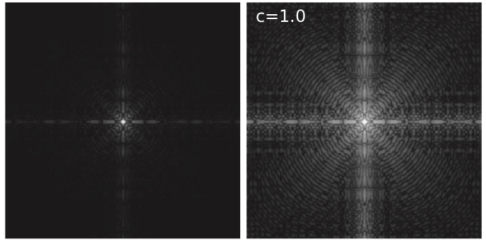

