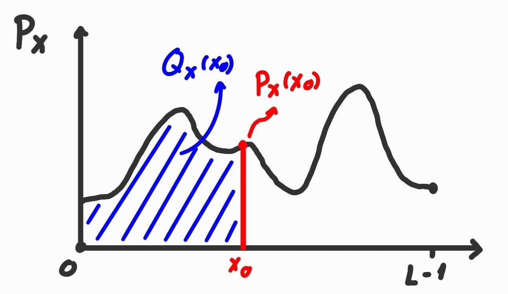
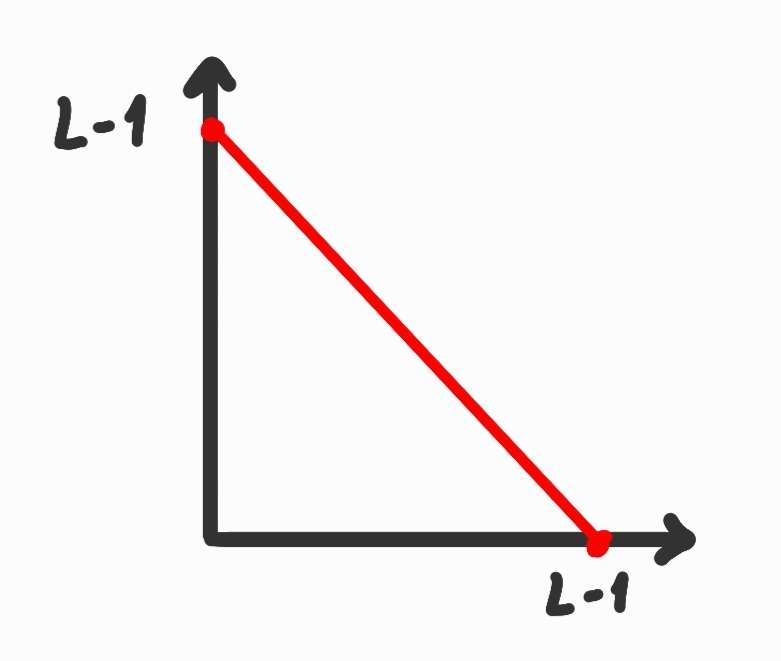
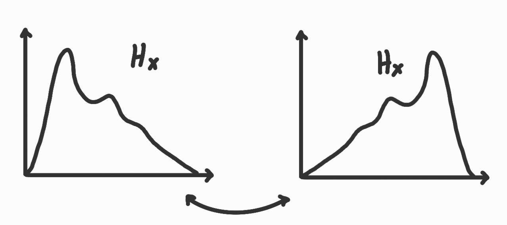
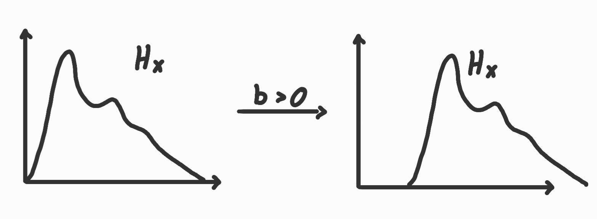
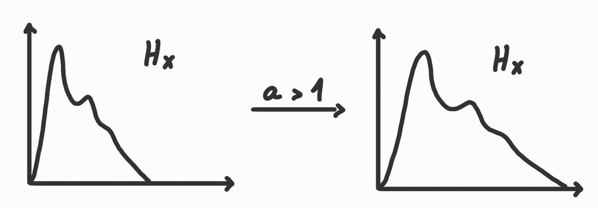
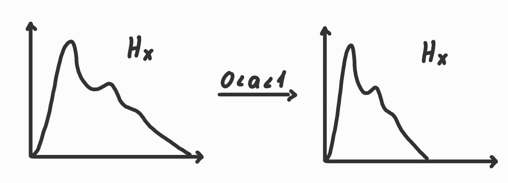
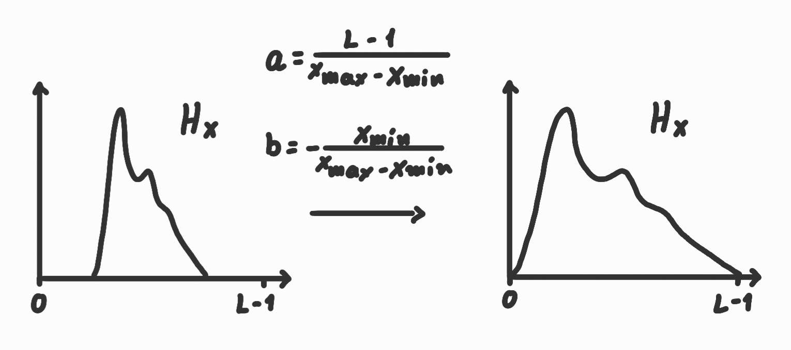

# ΗΥ371 - Ψηφιακή Επεξεργασία Εικόνων

## Μετασχηματισμός Έντασης
Άν έχουμε μια εικόνα $f(x,y)$ ο μετασχηματιμός ορίζει μια συνάρτηση $T$ ώστε η νέα εικόνα $g(x,y)$ να είναι 
$$ g(x,y) = T[f(x,y)] $$
- $f(x,y)$: αρχική φωτεινότητα pixel
- $g(x,y)$: νεα φωτεινότητα pixel
- $T$: μετασχηματισμός έντασης, συνήθως μονοδιάσταση συνάρτηση
- Δεν αλλάζει η χωρική θέση των pixels $(x,y)$, μόνο η φωτεινότητα

## Ιστόγραμμα εικόνας
$L$: #τιμών ($L-1$ μέγιστη τιμή)
$H_x(x_0)$: #pixels που έχουν τιμή $x_0$ στην εικόνα μας
$P_x(x_0) = \frac{H_x(x_0)}{\text{\#pixels}}$: κανονικοποιημένο ιστόγραμμα ή πιθανότητα εμφάνισης τιμής

	

$Q_x$: αθροιστική πιθανότητα
$$ Q_x(x_0) = \text{Prob}(x \leq x_0) = \sum^{x_0}_{x=0} $$

## Τύποι μετασχηματισμών
### Γραμμικός μετασχηματισμός
Απλή κλίμμακα brightness/contrast
$$ g(x,y) = a \cdot f(x,y) + b $$

#### a) Αρνητική μιας εικόνας ($α = -1$, $b = L-1$) 
$$f(x) = -x + L - 1 = L-1+x$$

	
	

#### b) Γραμμικό και Additive $f$ ($a=1$)
$$f(x) = x + b$$

	

- Αν $b > 0$: φωτεινότερη εικόνα
- Αν $b < 0$: σκοτεινότερη εικόνα

#### c) Multiplicative f ($a>0,~a\neq1,b=0$)
$$ f(x) = a x $$

	

επεκτείνεται το ιστόγραμμα: αυξάνει το contrast

	

συμπίπτει το ιστόγραμμα: μειώνει το contrast

#### d) Γραμμικός μετασχηματισμός ($a \in \mathbb{R},~b \in \mathbb{R}$)
Απλός γραμμικός μετασχηματισμός
Για να επεκτήνουμε το ιστόγραμμα σε όλες τις τιμές του ($f(x_{min}) = 0, f(x_{max} = L-1)$) πρέπει:

$$
\begin{cases}
f(x_{min}) &= 0 \\
f(x_{max} &= L-1)
\end{cases}
\Rightarrow
f(x) = (L-1) \frac{x - x_{min}}{x_{max} - x_{min}}
\\
a = \frac{L-1}{x_{max} - x_{min}}, ~~~ b = -\frac{x_{min}}{x_{max} - x_{min}}
$$

	

