# ΗΥ371 - Ψηφιακή Επεξεργασία Εικόνων

Ένα σύστημα παίρνει μια εικόνα εισόδου και παράγει μια εικόνα εξόδου μέσω κάποια κανονικής διαδικασίας, όπως φίλτρα κα. είναι γραμμικά και ανναλίωτα ως προς μετατόπιση. Προσοχή: οι ματασχηματισμοί εικόνας που έχουμε δει μετατρέπουν μια εικόνα σε **άλλο χώρο αναπαράστασης**.

## Συστήματα γραμμικά και αναλοίωτα ως προς τη μετατόπιση

- \[LSIS]: συστήματα (Linear Sift-Invariant System)

  - LS = Linear
  - IS = Invariant to Shift

### 1. Γραμμικά (Linear):
Συστήματα που έχουν την ιδιότητα της γραμμικότητας

	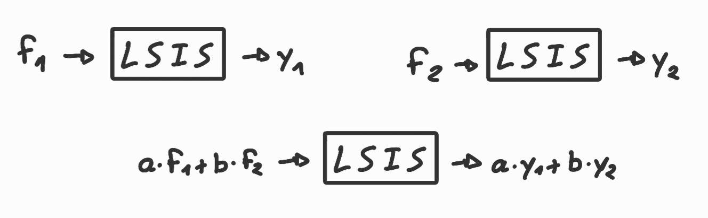

### 2. Αναλοίωτα ως προς την μετατόπιση (Shift Invariant):
Συστήματα που η έξοδος μετατοπίζεται με τον ίδιο τρόπο με τον οποίο θα μετατοπίσουμε και την είσοδο

	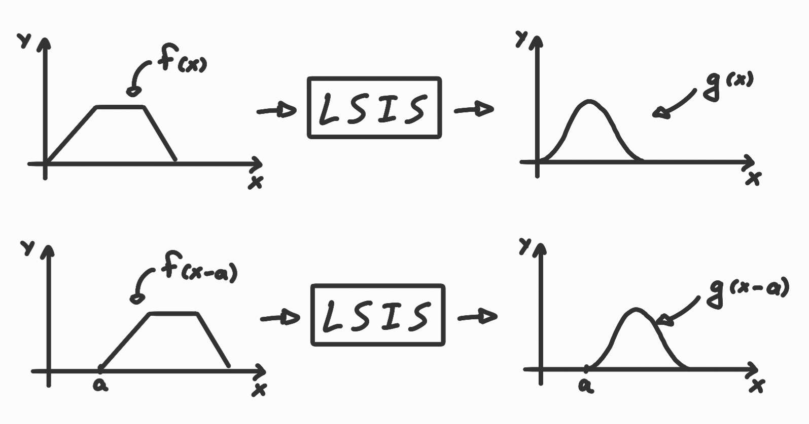

Τί γίνεται όμως πραγματικά μέσα στα συστήματα αυτά; Τελικά δεν είναι παρά μία πράξη συνέληξης όπως είχαμε δεί και στο μάθημα ΗΥ-215:
$$ f \to [ \text{LSIS} ] \to g \Leftrightarrow g = f * h $$

## Συνέλιξη 
### 1D (Συνεχής περίπτωση)

$$ (f * y) (x) = \int^{+\infty}_{-\infty} f(τ)g(x-τ)dτ $$

Αυτό που κάνει θεωρητικά είνα να παίρνει το ένα σήμα ($g$), να το αντιστρέφει και μετά να το κυλάει πάνω από το άλλο πολλαπλασιάζοντας τα κατά όλη την διαδικασία αυτή.

	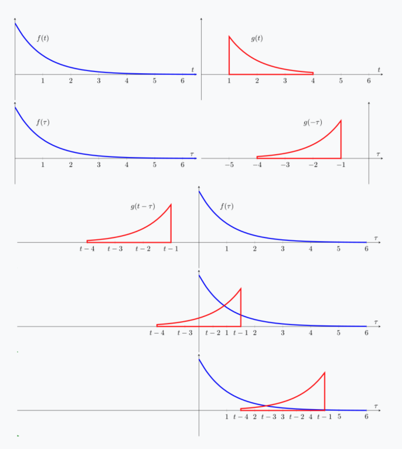

Παράδειγμα αποτελέσματος:

	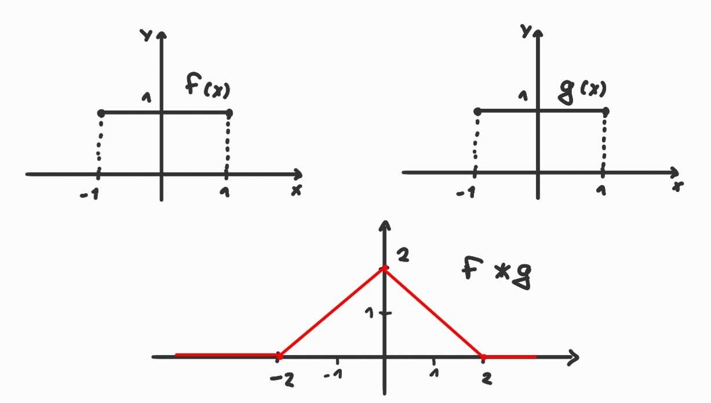

### 2D

#### Συνεχής περίπτωση
$$ (f*g)(x,y) = \int^{+\infty}_{-\infty} \int^{+\infty}_{-\infty} f(τ,μ)g(x-τ,y-μ) dτdμ $$

#### Διακριτή περίπτωση
$$ (f*g)(x,y) = \sum^{+\infty}_{m'=-\infty} \sum^{+\infty}_{n'=-\infty} f(m',n') g (x - m', y - n') $$

Αυτό που κάνει είναι να παίρνει ένα μικρό φίλτρο (**kernel**) και σαρώνει όλη την εικόνα συνδυάζοντας σε κάθε θέση τις τιμές των γειτονικών pixels με τα βάρη του kernel για να πάρει μια νέα τιμή εξόδου. Με άλλα λόγια, για κάθε pixel υπολογίζει ένα **σταθμισμένο άθροισμα** της τοπικής του περιοχής. [Αυτό](https://www.youtube.com/watch?v=yb2tPt0QVPY) το βίντεο το εξηγεί πολύ καλά.

	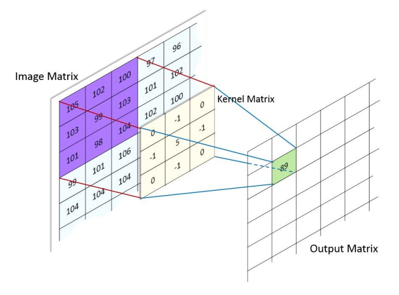

#### Υπολογισμός των άκρων
Όπως κάποιος μπορεί να παρατηρήσει με την συνέλιξη σε μία εικόνα θα αλλάξουμε ελαφρός την άναλυση της. Άμα όμως θέλουμε να κρατήσουμε την αρχική ανάλυση δεν ξέρουμε τί τιμές να βάλουμε στα ακριανά (αυτά που "χάσαμε"). Για αυτό υπάρχουν διάφοροι τρόποι:
1. **Μηδενικά**: Απλά γεμίζουμε τις άκρες με μηδενικά, δηλαδή με κατάμαυρα pixels
2. **Επανάληψη**: βάζουμε στα άκρα τις ίδιες τιμές που είναι στα άκρα από την τελική εικόνα
3. **Συμμετρική Επέκταση**: επεκτήνουμε συμμετρικά τα pixels από τις άκρες της τελικής εικόνας

	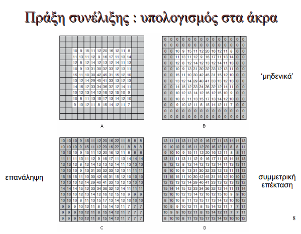

## Εφαρμογές Συνέλιξης
### Παράδειγμα Κρουστικής Απόκρουσης:

	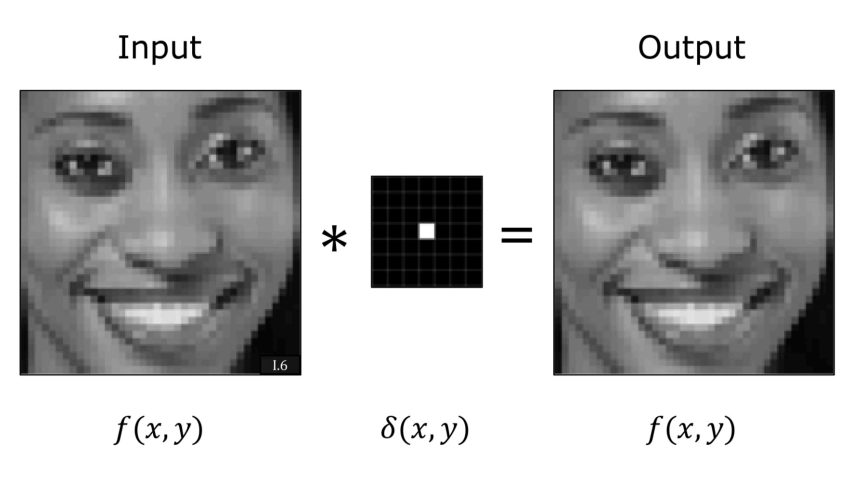

### Παράδειγμα Μετατόπισης εικόνας

	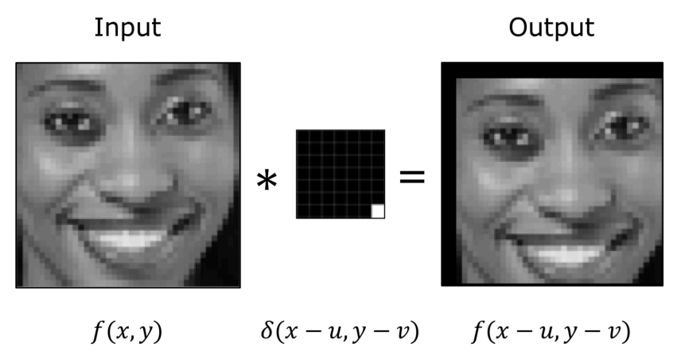

### Φίλτρο ορθογώνιας περιοχής

	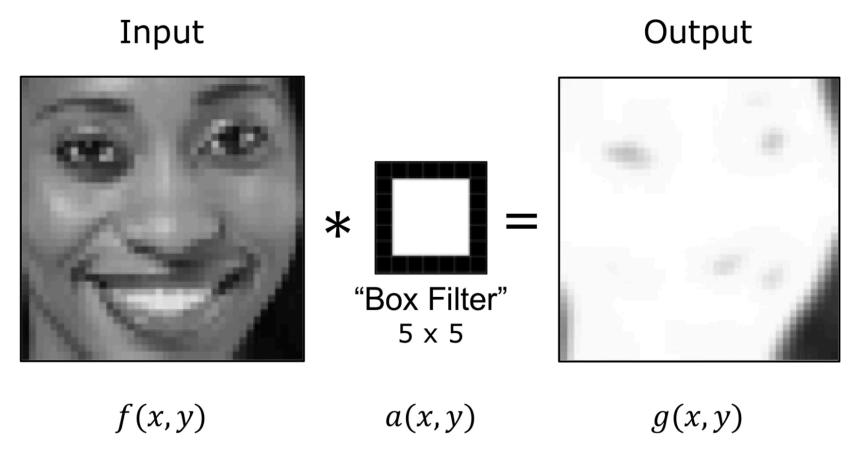

Όπως βλέπουμε το αποτέλεσμα είναι μια εικόνα που είναι υπερκορεσμένη, για να το αποφύγουμε αυτό πρέπει να σιγουρευτούμε ότι το **άθροισμα του φίλτρου πρέπει να είναι 1**

	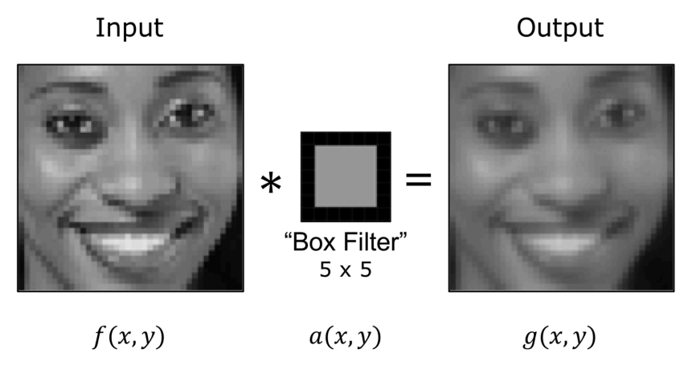

### Θάμπωμα με φίλτρο ορθογώνιας περιοχής

	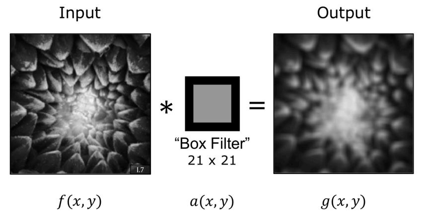

Όπως παρατηρείτε το αποτέλεσμα δεν φαίνεται "φυσικό", έχει τετράγωνες αποχρώσεις. Αυτό δικαιολογήτε εφόσον το φίλτρο δεν είναι παρά ένα τετράγωνο που παίρνει όλα τα pixels μέσα στο kernel και βγάζει τον μέσο τους όρο. Για να μπορέσουμε όμως να κάνουμε ένα πιο "φυσικό" θάμπωμα μπορούμε να χρησιμοποιήσουμε το Γκαουσιανό.

	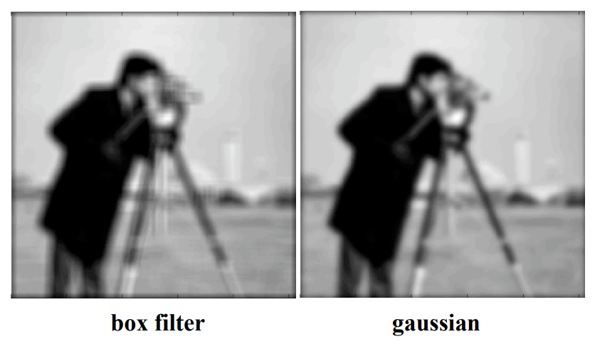
	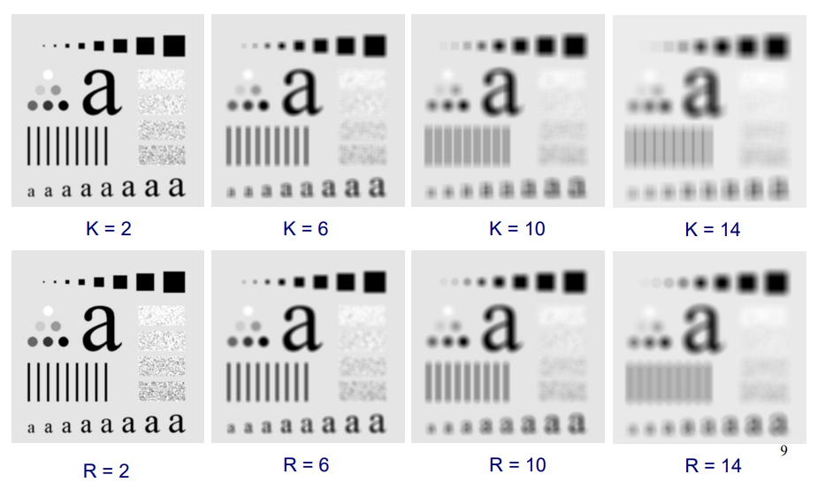

### Θάμπωμα με Γκαουσιανό Φίλτρο
Το γκαουσιανό φίλτρο δεν είναι παρά ένας δίσκος με πιο πολύ βάρος στην μέση παρά στης άκρες:

	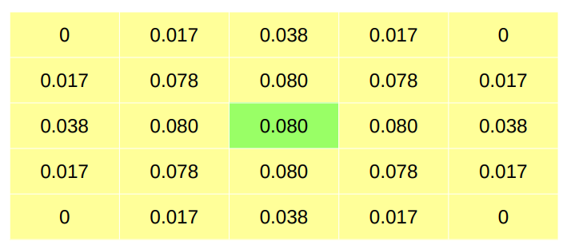

Είναι δηλαδή ένα "fuzzy filter":

	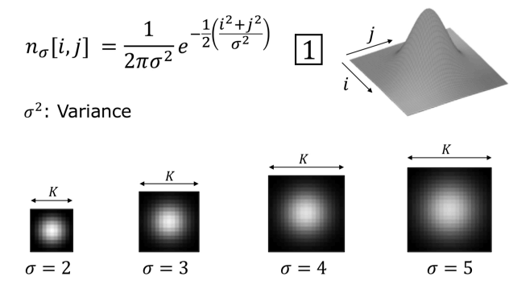
	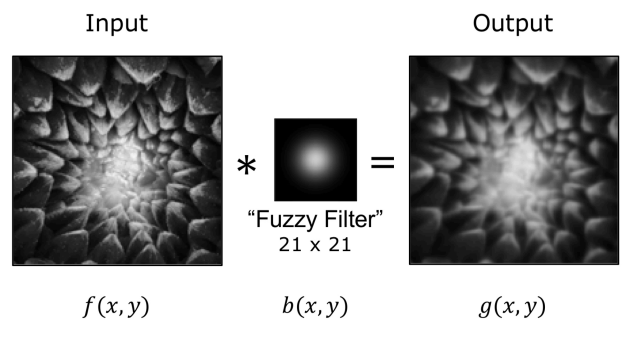

#### Διαχωρισμός του Γκαουσιανού φίλτρου
Το γκαουσιανό φίλτρο είναι διαχωρίσιμο, αυτό σημαίνει ότι μπορούμε να χωρίσουμε το 2D φίλτρο σε δύο 1D φίλτρα, ένα για την οριζόντια και ένα για την κατακόρυφη διάσταση. Κάνοντας το αυτό μπορούμε να μειώσουμε σημαντικά τον υπολογιστικό φόρτο υπολογισμού του:
$$ G(x,y) = \frac{1}{2πσ^2} e^{-\frac{x^2+y^2}{2σ^2}} \Rightarrow G(x,y) = G_x(x) \cdot G_y(y) = \frac{1}{\sqrt{2π}σ} e^{-\frac{x^2}{2σ^2}} \cdot \frac{1}{\sqrt{2π}σ} e^{-\frac{y^2}{2σ^2}} $$

	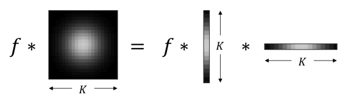

### Κρουστική Απόκριση ενός συστήματος
Με κρουστική απόκριση ενός συστήματος αναφερόμαστε στην έξοδο που παράγει όταν η είσοδος είναι ένα μοναδιαίο κρουστικό σήμα, δηλαδή μία εικόνα που είναι μηδεν παντού εκτός από ένα pixel που έχει την τιμή 1. Δείχνει πως αντιδρά δηλαδή σε ένα "τέλειο" σημειακό ερέθισμα. Είναι πολύ χρήσιμη γιατι:
- μας περιγράφει **πλήρος** το σύστημα
- Η έξοδος για οποιοδήποτε είδοδο υπολογίζεται με συνέλιξη
  $$ y = f*h $$
Όπου το h είναι η έξοδος του συστήματος άμα εφαρμόσουμε σαν είσοδο μία μοναδιαία κρούση, είναι δηλαδή η κρουστική ικανότητα.

### Τοπική Τυπική Απόκλιση

### Εξομάλυνση
Εξομάλυνση είναι η διαδικασία στην οποία αφαιρούμε τον θόρυβο/μικρές λεπτομέρειες από μία εικόνα, για να το πετύχουμε αυτό χρησιμοποιούμε γραμμικά φίλτρα όπως το ορθογώνιο ή γκαουσιανό φίλτρο. Σαν αποτέλεσμα η εικόνα γίνεται πιο "μαλακή", μειώνεται ο θόρυβος αλλα χάνει λίγο λεπτομέρεια

	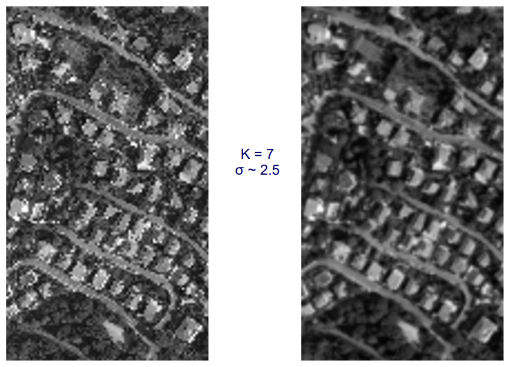

## Όρια αντικειμένων (Object Boundaries)
Γραμμές/περιοχές σε μία εικόνα που αλλάζει απότομα η ένταση ή η υφή, δηλαδή εκεί που τελειώνει το ένα αντικείμενο και ξεκινάει το άλλο. Object Boundaries είναι γενικά εκεί που:
- αλλάζει απότμα η φωτεινότητα
- αλλάζει η υφή
- υπάρχει ακμή στην εικόνα

	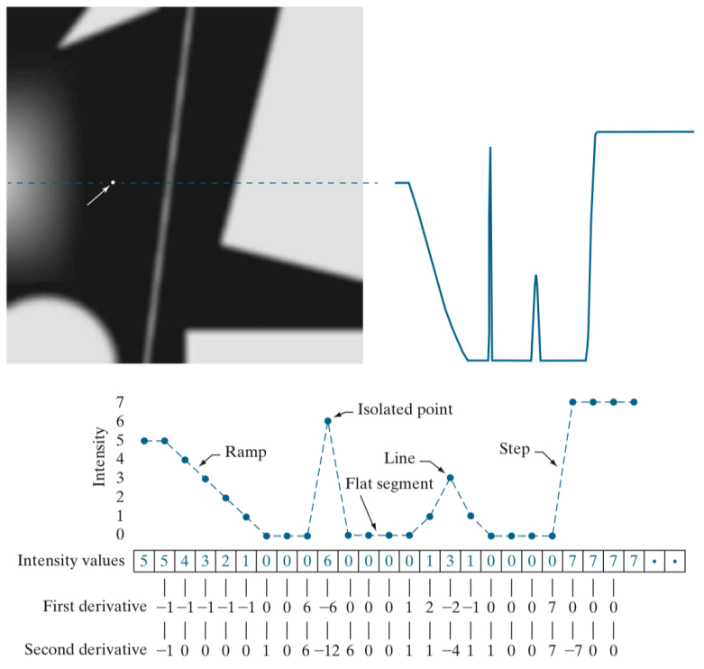
	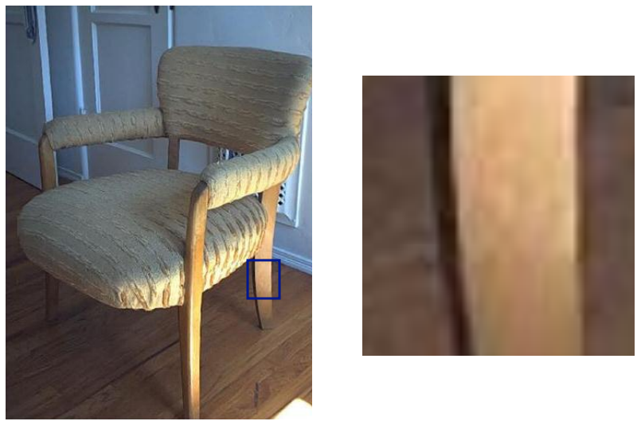

### Edge detection 
#### 1D
Σημεία όπου η τιμή του σήματος αλλάζει ξαφνικά. 
Ο βασικός τρόπος που την εντοπίζουμε είναι υπολογίζοντας την διαφορά (δηλαδή την παράγωγο του σήματος) εφόσον μας επιτρέπει να υπολογίσουμε και το σημεία αλλά και την ένταση της διαφοράς:

	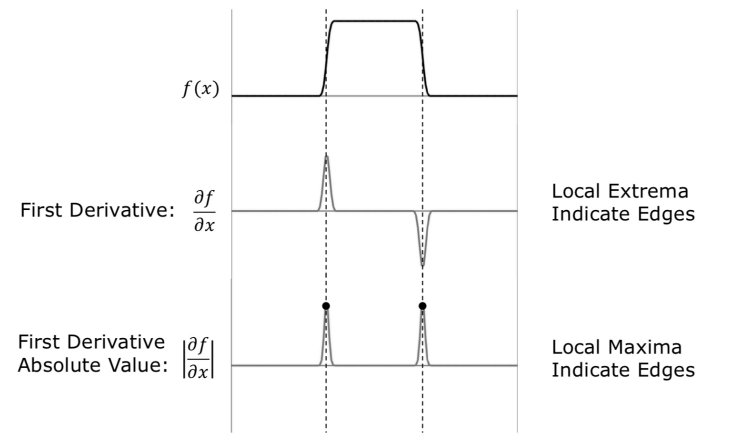

#### 2D
Διαδικασία όπου αναζητούμε για απότομες διαφορές πάνω σε μία εικόνα, όμοια όπως και στην 1 διάσταση ο κύριος τρόπος για να το κάνουμε αυτό είναι υπολογίζοντας την παράγωγο. Στην δευτερη διάσταση υπολογίζεται αρκετά όμοια όπως και στην πρώτη, η διαφορά είναι ότι υπολογίζουμε δυο διαφορετικά, μια για τον άξονα X και μία για τον άξονα Y:

	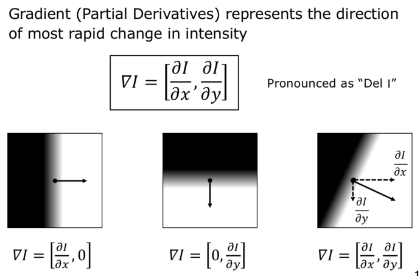

##### Gradient Magnitude (παράγωγος βαθμίδας)
Μετράει πόσο έντονα αλλάζει η φωτεινότητα σε ένα σημείο της εικόνας, υπολογίζεται από τις δύο παραγώγους:

$$ S = || \nabla I || = \sqrt{ \Bigl( \frac{\partial I}{\partial x} \Bigl)^2 + \Bigl( \frac{\partial I}{\partial y} \Bigl)^2 } $$

##### Gradient Orientation (παράγωγος κατέυθυνσης)
Μετράει προς ποιά κατέυθυνση αλλάζει η φωτεινότητα πιο έντονα, υπολογίζεται πάλι με την χρήση των δύο παραγώγων:

$$ θ = tan^{-1} \Bigl( \frac{\frac{\partial I}{\partial y}}{\frac{\partial I}{\partial x}} \Bigl) $$

### Αριθμητικές παράγωγοι (Numerical Derivatives)
Τρόποι για να προσεγγίσουμε την παράγωγο μίας συνάρτησης με την χρήση διακριτών τιμών αντί για αναλυτικούς τύπους. Χρησιμοποιούνται ειδιαίτερα στην ψηφιακή επεξεργασία εικόνας γιατί η εικόνα είναι διακριτή (pixel by pixel) και δεν μπορούμε να υπολογίσουμε την παράγωγο αναλυτικά.

**Προωθημένη Διαφορά (Finite Forward Difference)**
$$ f'(x) \approx \frac{f(x+h)-f(x)}{h} = f'(x) + O(h) $$ **Οπισθοχωρημένη Διαφορά (Finite Backwards Difference)**
$$ f'(x) \approx \frac{f(x)-f(x-h)}{h} = f'(x) + O(h) $$ **Κεντρική Διαφορά (Finite Central Difference)**
Η πιο ακριβής
$$ f'(x) \approx \frac{f(x + h)-f(x-h)}{2h} = f'(x) + O(h^2) $$

Πιο συγκεκριμμένα θα μπορούσε κανείς να δεί ότι οι αριθμιτικοί παράγωγοι δεν είναι παρά να η διαφορά μεταξύ του προηγούμενου και του επόμενου pixel (εφόσον h = 1).

	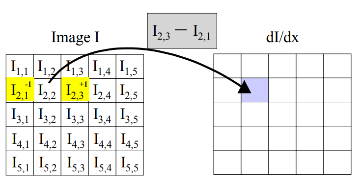
	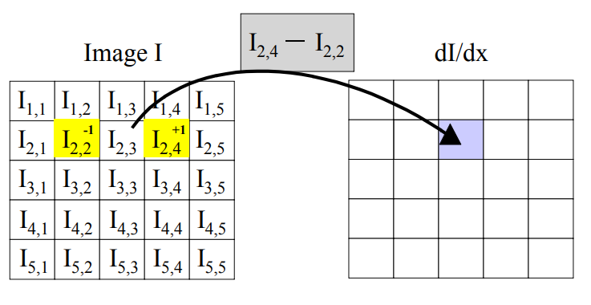
	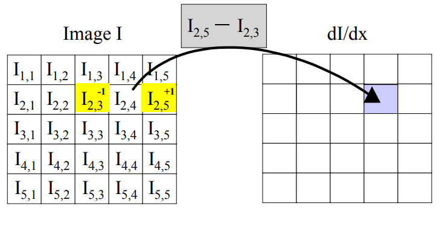
	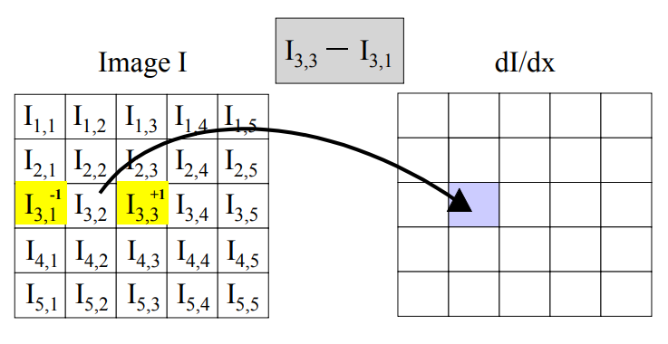

Αυτό όπως είναι προφανές μπορεί πολύ έυκολα να υλοποιηθεί με ένα φίλτρο, και πράγματι μπορούμε να αναπαραστήσουμε την παραπάνω διαδιακασία με τα φίλτρα:

$$ \text{Κάθετη: } G_x = \begin{bmatrix} -1 & 0 & 1 \end{bmatrix}~,~ \text{Οριζόντια: } G_y = \begin{bmatrix} -1 \\ 0 \\ 1 \end{bmatrix} $$ 

Εφόσον όμως πρόκειτε να κάνουμε συνέλιξη θα πρέπει να τα αντιστρέψουμε πρώτα:

$$ \text{Κάθετη: } G_x = \begin{bmatrix} 1 & 0 & -1 \end{bmatrix}~,~ \text{Οριζόντια: } G_y = \begin{bmatrix} 1 \\ 0 \\ -1 \end{bmatrix} $$ 

	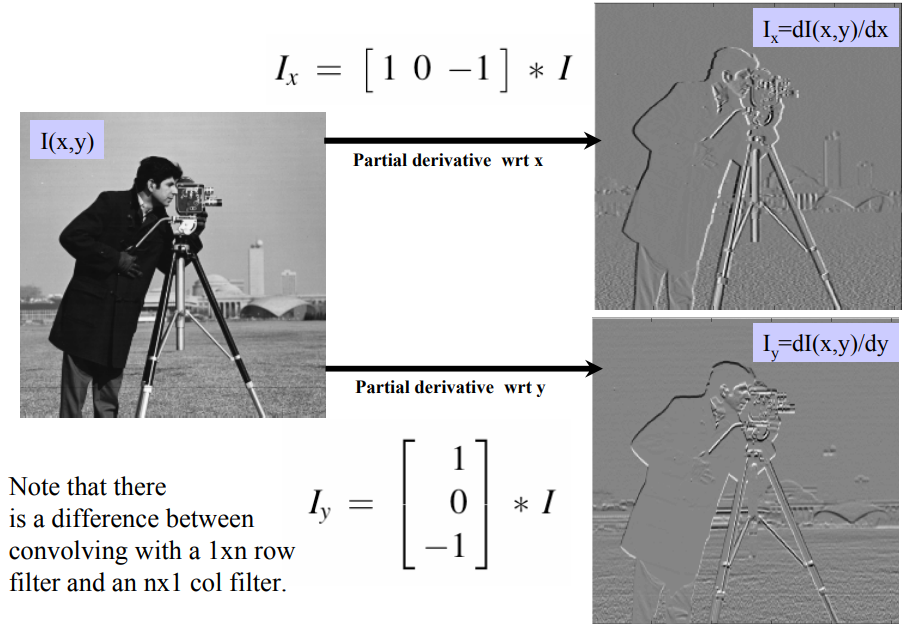

### Ένας απλός αλγόριθμος υπολογισμού ορίων σε εικόνα:
Ας υλοποιήσουμε έναν απλό αλγόριθμο εντοπισμού ορίων σε μία εικόνα, τα βήματα που θα πρέπει να ακολουθήοσυμε είναι ώς εξής:
1. Υπολογισμός της παραγώγου κάθε pixel
2. Υπολογισμός της παργώγου βαθμίδας (gradient magnitude)
3. Εφαρμογή Threshold στο magnitude

Ας ξεκινήσουμε:

#### 1. Υπολογισμός της παραγώγου κάθε pixel

	

#### 2. Υπολογισμός της παργώγου βαθμίδας (gradient magnitude)

	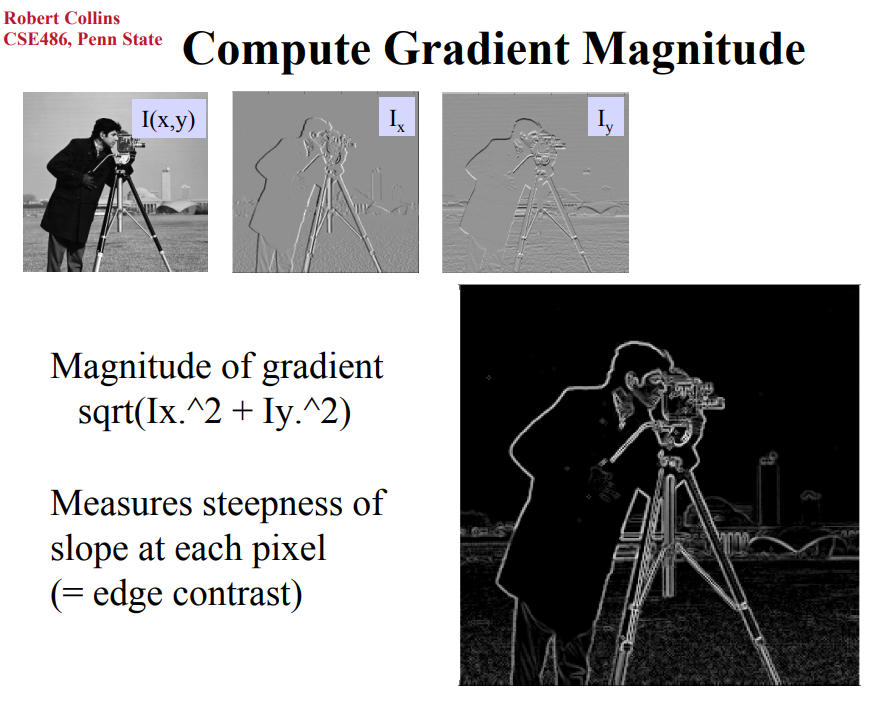

#### 3. Εφαρμογή Threshold στο magnitude

	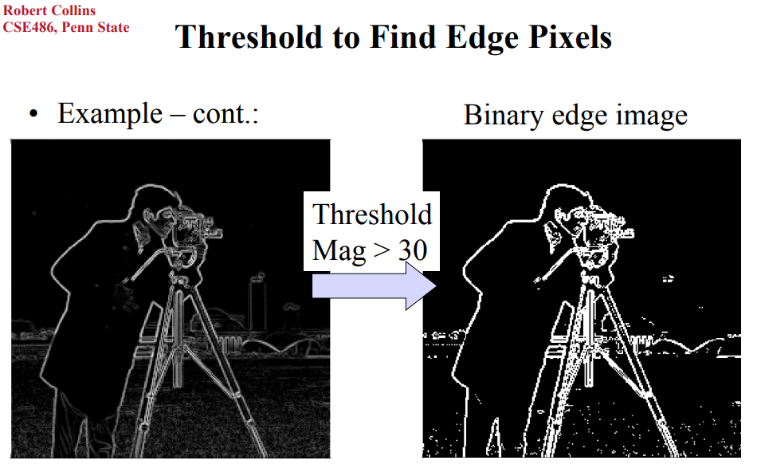

Εδώ όμως δημιουργείται ένα πρόβλημα:
**Πώς θα ξέρουμε τί threshold να χρησιμοποιήσουμε;**

	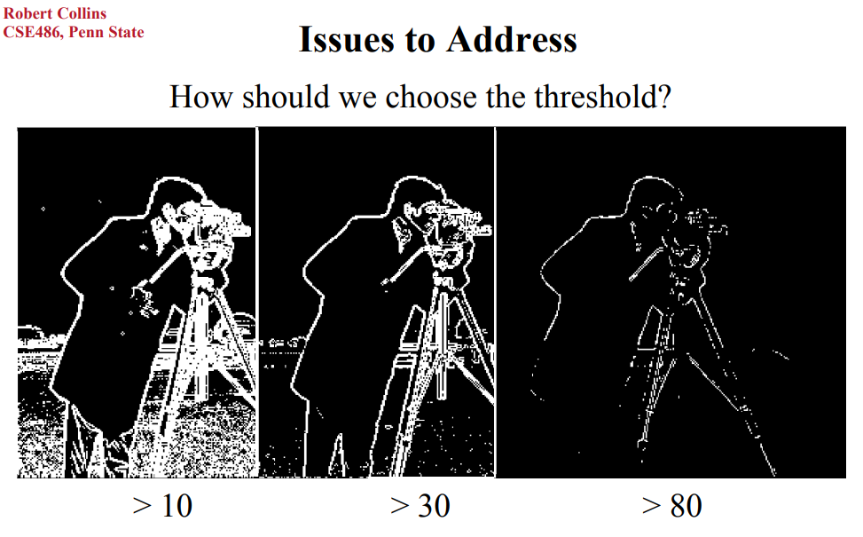

Όπως φαίνεται από πάνω για διαφορετικά threshold έχουμε πολύ διαφορετικά αποτελέσματα... Είναι πολύ δύσκολο να βρούμε πιο θα είναι το πιο "σωστό" για την εικόνα που επεξεργαζόμαστε εκείνη την στιγμή. Συγκεκριμμένα τα προβλήματα που έχουμε είναι:
- δεν μπορούμε να εντοπίσουμε τα όρια με μεγάλη ακρίβεια
- αναβαθμισμένα όρια θα οδηγήσουν σε πολλαπλά ή καθόλου pixels ανάλογα με το threshold:
  - πολύ μεγάλο και μπορεί να μήν τα εντοπίσουμε
  - πολύ μικρό και θα είναι υπερβολικά παχή

**Λύση:** Non-Maximum Suppression (NMS)
Εξετάζουμε άν το $|g|$ είναι τοπικό μέγιστο στην κατέυθυνση της παργώγου ή στις 8 πιθανές κατυθύνσεις σε 3x3 γείτονιά, κρατάμε μόνο τα pixels που είναι τοπικά μέγιστα και έχουν $|g| > T$

Για αυτό πάλι υπάρχουν δυο μεθόδοι:
#### 1. Standart - Single Threshold (T)
Χρησιμοποιούμε ένα όριο T
- Άν $||\nabla I(x,y)|| < T$: σίγουρα δεν είναι ακμή
- Άν $||\nabla I(x,y)|| \ge T$: σίγουρα  είναι ακμή

Πρόβλημα, όπως πρίν:
Άν το $T$ είναι μεγάλο χάνουμε αδύναμες ακμές και άμα το $T$ είναι μικρό κρατάμε θόρυβο

#### 2. Hysteresis Thresholding - Two Thresholds ($T_0 < T_1$)
Χρησιμοποιούμε δύο thresholds, ένα χαμηλό ($T_0$) και ένα ψηλό ($T_1$), δημιοργούμε έτσι 3 κατηγορίες pixel:
- Weak rejection zone
  $||\nabla I|| < T_0$: σίγουρα δεν είναι ακμή
- Strong edges
  $||\nabla I|| \ge T_1$: σίγουρα είναι ακμή
- Potential Edges
  $T_0 \le ||\nabla I|| < T_1$: είναι ακμή μόνο αν έχει γειτονικό pixel που είναι strong edge

## Παραγωντοποίηση και Θόρυβος
Η παραγωντοποίηση επιρεάζεται πολύ από τον θόρυβο που έχει μία εικόνα:

	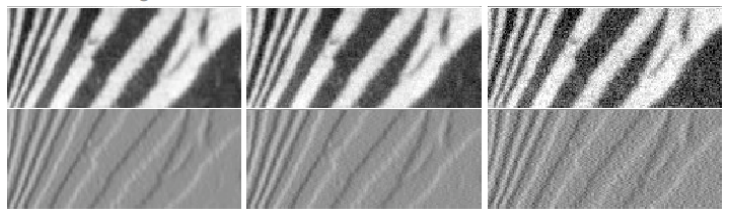

Η παραγωντοποίηση πολλαπλασιάζει τον θόρυβο κατα **πολύ**:

	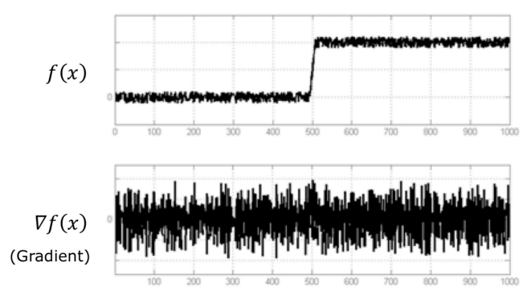

Ο εντοπισμός του ορίου είναι σχεδόν αδύνατος
Η λύση: Λειάνουμε το σήμα πρίν υπολογίσουμε την παράγωγο
Για να το επιτυγχάνουμε αυτό εφαρμόζουμε ένα φίλτρο λειανίσματος στην εικόνα πρίν την παράγωγο:
$$ 
I(x,y) \to \fbox{Smooth} \to \fbox{Derivative} \to E(x,y) \\
(Ι * \text{SmoothFilter}) * \text{DerivativeFilter}
$$
Μποορύμε να παρτηρήσουμε εδώ ότι άμα συνδυάσουμε το φίλτρο λειανίσματος και παργώγισης δεν χρειάζεται να κάνουμε τόσες πράξεις και να σώσουμε σε υπολογιστικό φόρτο.
$$
(Ι * \text{SmoothFilter}) * \text{DerivativeFilter} = \\
I * (\text{SmoothFilter} * \text{DerivativeFilter})
$$

Έχουμε ήδη έτοιμα φίλτρα που κάνουν ακριβώς αυτό, τα πιο γνωστά είναι:
### Prewit Operator
$$ 
\text{Κάθετα: } \underset{\substack{\longleftarrow\text{Κλίση}\longrightarrow}}
{\begin{bmatrix} -1 & 0 & 1 \\ -1 & 0 & 1 \\ -1 & 0 & 1 \end{bmatrix}} ~,~ 
\text{Οριζόντια: } \underset{\substack{\longleftarrow\text{Θόρυβος}\longrightarrow}}
{\begin{bmatrix} -1 & -1 & -1 \\ 0 & 0 & 0 \\ 1 & 1 & 1 \end{bmatrix}} 
$$

### Sobel Operator
$$ 
\text{Κάθετα: } \underset{\substack{\longleftarrow\text{Κλίση}\longrightarrow}}
{\begin{bmatrix} -1 & 0 & 1 \\ -2 & 0 & 2 \\ -1 & 0 & 1 \end{bmatrix}} ~,~ 
\text{Οριζόντια: } \underset{\substack{\longleftarrow\text{Θόρυβος}\longrightarrow}}
{\begin{bmatrix} 1 & 2 & 1 \\ 0 & 0 & 0 \\ -1 & -2 & -1 \end{bmatrix}} 
$$

Παράδειγμα:

	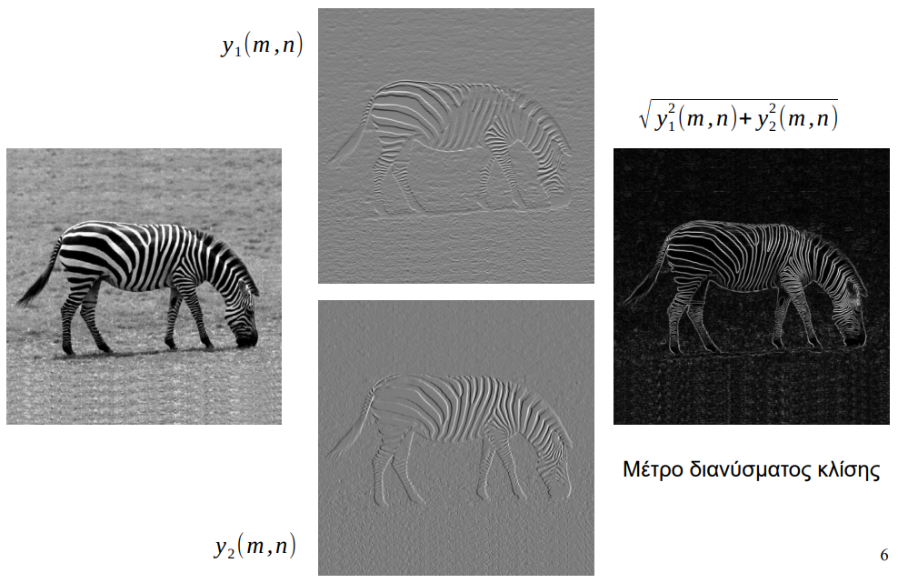

Μπορεί κανείς να παρατηρήσει ότι και οι δύο operators μπορούν να διαχωριστούν ως εξής:

$$
\begin{bmatrix} 
-1 & 0 & 1 \\ 
-1 & 0 & 1 \\ 
-1 & 0 & 1 
\end{bmatrix} = 
\begin{bmatrix} -1 & 0 & 1 \end{bmatrix} *
\begin{bmatrix} 1 \\ 1 \\ 1 \end{bmatrix}
$$

$$
\begin{bmatrix} 
-1 & 0 & 1 \\ 
-2 & 0 & 2 \\ 
-1 & 0 & 1 
\end{bmatrix} = 
\begin{bmatrix} -1 & 0 & 1 \end{bmatrix} *
\begin{bmatrix} 1 \\ 2 \\ 1 \end{bmatrix}
$$

Εδώ γίνεται προφανές ότι και στις δύο περιπτώσεις πρόκειται για τον πολλαπλασιασμό ενός πίνακα διαφοράς (παραγώγου) με ένα φίλτρο θολώματος (smoothing filter). Συγκεκριμένα:

- Στην περίπτωση του **Prewitt**, έχουμε ένα φίλτρο ορθογώνιας περιοχής.  
- Στην περίπτωση του **Sobel**, έχουμε ένα φίλτρο τύπου Γκαουσιανού.  

Δεδομένου αυτού, προκύπτει η εξής προσέγγιση για την παράγωγο μιας εικόνας \(f\) ως προς \(x\):

$$
\frac{\partial f}{\partial x} \approx \frac{\partial (G_\sigma * f)}{\partial x} = \frac{\partial G_\sigma}{\partial x} * f
$$

Δηλαδή, η παράγωγος της εικόνας μπορεί να υπολογιστεί μέσω συνέλιξης με την παράγωγο ενός Γκαουσιανού φίλτρου:

$$
G_\sigma^x = \frac{\partial G_\sigma}{\partial x} = x \, e^{-\frac{x^2 + y^2}{2\sigma^2}}
$$

Αφού όμως και το Γκαουσιανό φίλτρο είναι διαχωρίσιμο προκείπτει:
$$ G_σ^x * f = g_σ^x * g_σ * f $$