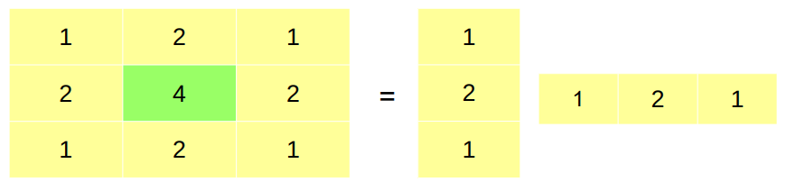

# ΗΥ371 - Ψηφιακή Επεξεργασία Εικόνων

Ένα σύστημα παίρνει μια εικόνα εισόδου και παράγει μια εικόνα εξόδου μέσω κάποια κανονικής διαδικασίας, όπως φίλτρα κα. είναι γραμμικά και ανναλίωτα ως προς μετατόπιση. Προσοχή: οι ματασχηματισμοί εικόνας που έχουμε δει μετατρέπουν μια εικόνα σε **άλλο χώρο αναπαράστασης**.

## Συστήματα γραμμικά και αναλοίωτα ως προς τη μετατόπιση

- \[LSIS]: συστήματα (Linear Sift-Invariant System)

  - LS = Linear
  - IS = Invariant to Shift

### 1. Γραμμικά (Linear):
Συστήματα που έχουν την ιδιότητα της γραμμικότητας

	

### 2. Αναλοίωτα ως προς την μετατόπιση (Shift Invariant):
Συστήματα που η έξοδος μετατοπίζεται με τον ίδιο τρόπο με τον οποίο θα μετατοπίσουμε και την είσοδο

	

Τί γίνεται όμως πραγματικά μέσα στα συστήματα αυτά; Τελικά δεν είναι παρά μία πράξη συνέληξης όπως είχαμε δεί και στο μάθημα ΗΥ-215:
$$ f \to [ \text{LSIS} ] \to g \Leftrightarrow g = f * h $$

## Συνέλιξη 
### 1D (Συνεχής περίπτωση)

$$ (f * y) (x) = \int^{+\infty}_{-\infty} f(τ)g(x-τ)dτ $$

Αυτό που κάνει θεωρητικά είνα να παίρνει το ένα σήμα ($g$), να το αντιστρέφει και μετά να το κυλάει πάνω από το άλλο πολλαπλασιάζοντας τα κατά όλη την διαδικασία αυτή.

	

Παράδειγμα αποτελέσματος:

	

### 2D

#### Συνεχής περίπτωση
$$ (f*g)(x,y) = \int^{+\infty}_{-\infty} \int^{+\infty}_{-\infty} f(τ,μ)g(x-τ,y-μ) dτdμ $$

#### Διακριτή περίπτωση
$$ (f*g)(x,y) = \sum^{+\infty}_{m'=-\infty} \sum^{+\infty}_{n'=-\infty} f(m',n') g (x - m', y - n') $$

Αυτό που κάνει είναι να παίρνει ένα μικρό φίλτρο (**kernel**) και σαρώνει όλη την εικόνα συνδυάζοντας σε κάθε θέση τις τιμές των γειτονικών pixels με τα βάρη του kernel για να πάρει μια νέα τιμή εξόδου. Με άλλα λόγια, για κάθε pixel υπολογίζει ένα **σταθμισμένο άθροισμα** της τοπικής του περιοχής. [Αυτό](https://www.youtube.com/watch?v=yb2tPt0QVPY) το βίντεο το εξηγεί πολύ καλά.

	

#### Υπολογισμός των άκρων
Όπως κάποιος μπορεί να παρατηρήσει με την συνέλιξη σε μία εικόνα θα αλλάξουμε ελαφρός την άναλυση της. Άμα όμως θέλουμε να κρατήσουμε την αρχική ανάλυση δεν ξέρουμε τί τιμές να βάλουμε στα ακριανά (αυτά που "χάσαμε"). Για αυτό υπάρχουν διάφοροι τρόποι:
1. **Μηδενικά**: Απλά γεμίζουμε τις άκρες με μηδενικά, δηλαδή με κατάμαυρα pixels
2. **Επανάληψη**: βάζουμε στα άκρα τις ίδιες τιμές που είναι στα άκρα από την τελική εικόνα
3. **Συμμετρική Επέκταση**: επεκτήνουμε συμμετρικά τα pixels από τις άκρες της τελικής εικόνας

	

## Εφαρμογές Συνέλιξης
### Παράδειγμα Κρουστικής Απόκρουσης:

	

### Παράδειγμα Μετατόπισης εικόνας

	

### Φίλτρο ορθογώνιας περιοχής

	

Όπως βλέπουμε το αποτέλεσμα είναι μια εικόνα που είναι υπερκορεσμένη, για να το αποφύγουμε αυτό πρέπει να σιγουρευτούμε ότι το **άθροισμα του φίλτρου πρέπει να είναι 1**

	

### Θάμπωμα με φίλτρο ορθογώνιας περιοχής

	

Όπως παρατηρείτε το αποτέλεσμα δεν φαίνεται "φυσικό", έχει τετράγωνες αποχρώσεις. Αυτό δικαιολογήτε εφόσον το φίλτρο δεν είναι παρά ένα τετράγωνο που παίρνει όλα τα pixels μέσα στο kernel και βγάζει τον μέσο τους όρο. Για να μπορέσουμε όμως να κάνουμε ένα πιο "φυσικό" θάμπωμα μπορούμε να χρησιμοποιήσουμε το Γκαουσιανό.

	
	

### Θάμπωμα με Γκαουσιανό Φίλτρο
Το γκαουσιανό φίλτρο δεν είναι παρά ένας δίσκος με πιο πολύ βάρος στην μέση παρά στης άκρες:

	

Είναι δηλαδή ένα "fuzzy filter":

	
	

#### Διαχωρισμός του Γκαουσιανού φίλτρου
Το γκαουσιανό φίλτρο είναι διαχωρίσιμο, αυτό σημαίνει ότι μπορούμε να χωρίσουμε το 2D φίλτρο σε δύο 1D φίλτρα, ένα για την οριζόντια και ένα για την κατακόρυφη διάσταση. Κάνοντας το αυτό μπορούμε να μειώσουμε σημαντικά τον υπολογιστικό φόρτο υπολογισμού του:
$$ G(x,y) = \frac{1}{2πσ^2} e^{-\frac{x^2+y^2}{2σ^2}} \Rightarrow G(x,y) = G_x(x) \cdot G_y(y) = \frac{1}{\sqrt{2π}σ} e^{-\frac{x^2}{2σ^2}} \cdot \frac{1}{\sqrt{2π}σ} e^{-\frac{y^2}{2σ^2}} $$

	

### Κρουστική Απόκριση ενός συστήματος
Με κρουστική απόκριση ενός συστήματος αναφερόμαστε στην έξοδο που παράγει όταν η είσοδος είναι ένα μοναδιαίο κρουστικό σήμα, δηλαδή μία εικόνα που είναι μηδεν παντού εκτός από ένα pixel που έχει την τιμή 1. Δείχνει πως αντιδρά δηλαδή σε ένα "τέλειο" σημειακό ερέθισμα. Είναι πολύ χρήσιμη γιατι:
- μας περιγράφει **πλήρος** το σύστημα
- Η έξοδος για οποιοδήποτε είδοδο υπολογίζεται με συνέλιξη
  $$ y = f*h $$
Όπου το h είναι η έξοδος του συστήματος άμα εφαρμόσουμε σαν είσοδο μία μοναδιαία κρούση, είναι δηλαδή η κρουστική ικανότητα.

#### Διαχωρίσιμη κρουστικη απόκρουση
Όμοια όπως και στο Γκαουσιανό φίλτρο μπορούμε να διαχωρίσουμε και την κρουστική απόκριση

	

### Εξομάλυνση
Εξομάλυνση είναι η διαδικασία στην οποία αφαιρούμε τον θόρυβο/μικρές λεπτομέρειες από μία εικόνα, για να το πετύχουμε αυτό χρησιμοποιούμε γραμμικά φίλτρα όπως το ορθογώνιο ή γκαουσιανό φίλτρο. Σαν αποτέλεσμα η εικόνα γίνεται πιο "μαλακή", μειώνεται ο θόρυβος αλλα χάνει λίγο λεπτομέρεια

	

