# ΗΥ371 - Ψηφιακή Επεξεργασία Εικόνων

## Μετασχηματισμός Fourier
Ο Μετασχηματισμός Fourier (Fourier Transform, FT) μετατρέπει ένα σήμα (στην περίπτωση μας εικόνας) από τον χώρο $(x,y)$ στον **χώρο συχνοτήτων**.
- στον **χώρο**: βλέπουμε τις τιμές φωτεινότητας από κάθε pixel
- στις **συχνότητες**: βλέπουμε πόσο έντονες είναι οι αλλαγές και σε ποία κλίμακα

Στον Μετασχηματισμό Fourier προσπαθούμε να περιγράψουμε ένα σήμα ή μια εικόνα ως άθροισμα ημιτονοειδών συναρτήσεων. Οι συναρτήσεις αυτές, όταν προστεθούν, μπορούν να προσεγγίσουν και τελικά να ανακατασκευάσουν το αρχικό σήμα.
Όσο αυξάνεται ο αριθμός των ημιτονοειδών, τόσο βελτιώνεται η ακρίβεια της ανακατασκευής και το σφάλμα μειώνεται. Στο θεωρητικό όριο, όταν ο αριθμός των συναρτήσεων τείνει στο άπειρο, το σφάλμα τείνει στο μηδέν και επιτυγχάνεται πλήρης ανακατασκευή του σήματος.

Η ημιτονοειδές συνάρτηση έχει μορφή:

$$ \boxed{f(x) = A \sin(2\pi ux + φ)} $$

- $Α$: Πλάτος
- $φ$: Φάση
- $u$: Συχνότητα

Όπως βλέπουμε από πάνω για να περιγράψουμε κάθε συχνότητα χρειαζόμαστε δύο μέτρα:
- Το **πλάτος**
- Την **φάση**

Δεν είναι δηλαδή όπώς στον κανονικό χώρο όπου χρειαζόμαστε μόνο ένα μέτρο για την φωτεινότητα.

Παράδειγμα:

	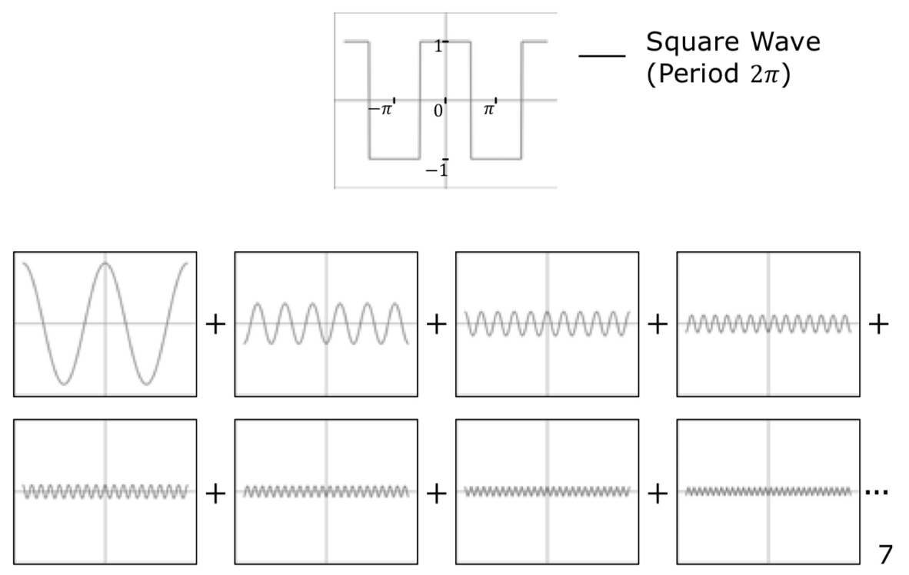
	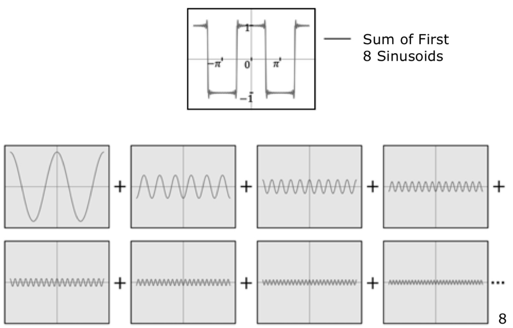

Όπως βλέπουμε το άθροισμα από τις πρώτες 8 ημιοτονοειδές συναρτήσεις αναπαρηστά πολύ κοντά το σήμα που είχαμε στην αρχή. Όσο πιο πολλές συναρτήσεις βάλουμε τώρα στο άροισμα τόσο πιο κοντά θα είναι η ανακατασκευή.
Μπορούμε επίσης να αναπαρασουμε όλες τις ημιτονοειδές συναρτήσεις με δύο απλές σύναρτήσεις, μία που δείχνει το **πλάτος** και μία που δείχνει την **φάση**:

	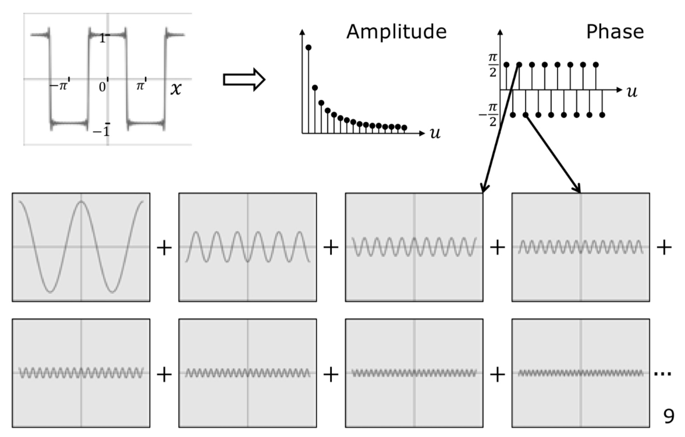

Θέλει προσοχή εδώ να δούμε ότι οι συναρτήσεις του πλάτους και της φάσης είναι στον άξονα της **συχνότητας** ($u$), δείχνουν δηλαδή πώς το πλάτος και την φάση κάθε ημιτόνου σε μία δεδομένη συχνότητα.

### Αντίστροφος Σχηματισμός Fourier
Ο Αντίστροφος Μετασχηματισμός Fourier (Inverse Fourier Transform, IFT) χρησιμοποιείται για να επιστρέψουμε από τον χώρο συχνοτήτων στον αρχικό χώρο (χώρο εικόνας).
Παίρνοντας το πλάτος και τη φάση των συχνοτήτων, ο αντίστροφος μετασχηματισμός συνδυάζει όλες τις ημιτονοειδείς συνιστώσες και ανακατασκευάζει το αρχικό σήμα ή την εικόνα.
Αν δεν έχει χαθεί πληροφορία (π.χ. από φιλτράρισμα), η ανακατασκευή είναι ακριβής. Διαφορετικά, προκύπτει μια προσεγγιστική εικόνα.

### Υπολογισμός Fourier και Αντίστροφου Fourier
Για να υπολογίζουμε τον Μετασχηματισμός Fourier και τον Αντίστροφο Μετασχηματισμό Fourier χρησιμοποιούμε τους δύο τύπους:

Fourier Transform:
$$ F(u) = \int^{\infty}_{-\infty} f(x) e^{-j2\pi ux} dx $$

Inverse Fourier Tranform:
$$ f(x) = \int^{\infty}_{-\infty} F(u) e^{j2\pi ux} du $$

Αν και στους τύπους του Μετασχηματισμού Fourier εμφανίζεται συχνά η σταθερά του Euler ($e$), στην πραγματικότητα δεν χρησιμοποιούμε το $e$ επειδή μας ενδιαφέρει το ίδιο, αλλά επειδή μας επιτρέπει να εκφράσουμε ημίτονα και συνημίτονα με έναν ενιαίο τρόπο.
Ο όρος βασίζεται στον Τύπο του Euler, ο οποίος συνδέει τις μιγαδικές εκθετικές συναρτήσεις με τις τριγωνομετρικές:

$$ e^{j\theta} = \cos \theta + j \sin \theta, ~~~~~ j = \sqrt{-1} $$

Έτσι, κάθε μιγαδική εκθετική του Fourier αναπαριστά ταυτόχρονα ένα συνημίτονο και ένα ημίτονο, δηλαδή μια ημιτονοειδή συνιστώσα συγκεκριμένης συχνότητας. Αυτό κάνει τους υπολογισμούς πιο απλούς και πιο συμπαγείς.
Παρατηρούμε επίσης ότι ο Μετασχηματισμός Fourier είναι μιγαδικός:

$$ F(u) = \Re \{F(u)\} + j \Im \{F(u)\} $$

Μπορούμε να χρησιμοποιοήσουμε τους πραγματικούς και μιγαδικούς αριθμούς τώρα για να υπολογίσουμε το πλάτος και την φάση του μετασχηματισμού:

$$
\begin{align*}
\text{Amplitude} &: A(u) = \sqrt{ \Re \{ F(u) \}^2 + \Im \{ F(u) \}^2 } \\
\text{Phase} &: φ(u) = \text{atan} (\Im \{ F(u) \},\Re \{ F(u) \})
\end{align*}
$$

### Ιδιότητες Μετασχηματισμού Fourier

| Ιδιότητα | χώρος | χώρος συχνότητας |
| -- | -- | -- |
| Γραμμικότητα | $$af_1(x) + βf_2(x)$$ | $$aF_1(u) + βF_2(u)$$ |
| Στάθημιση | $$f(ax)$$ | $$\frac{1}{\|a\|} F(\frac{u}{a})$$ |
| Μετατόπιση | $$ f(x-a) $$ | $$ e^{-j2\pi ua} F(u) $$ |
| Παραγώγιση | $$ \frac{d^n}{dx^n} f(x) $$ | $$(j2\pi u)^n F(u)$$ |

**Συνέλιξη και Μετασχηματισμός Fourier**
| χώρος | χώρος συχνοτήτων |
| -- | -- |
| $$ g(x) = f(x) * h(x) $$ Συνέλιξη | $$ G(u) = F(u)H(u) $$ Πολλαπλασιασμός |
| $$ g(x) = f(x)h(x) $$ Πολλαπλασιασμός | $$ G(u) = F(u) * H(u) $$ Συνέλιξη |

## 2D Μετασχηματισμός Fourier
O 2D Μετασχηματισμός Fourier επεκτήνει τον Μετασχηματισμό στην δέυτερη διάσταση. Ενώ στον 1D Μετασχηματισμό Fourier αναλύουμε ένα σήμα ώς προς μία μεταβλητή, στον 2D Μετασχηματισμό Fourier αναλύουμε μία εικόνα προς τις **δύο** χωρικές μεταβλητές $x$ και $y$.
Ο Μετασχηματισμός αποσυνθέτει την εικόνα σε διδιάστατες ημητονοειδής συναρτήσεις διαφορετικών συχνωτήτων και κατευθύνσεων. Κάθε συχνότητα περιγράφεται από ένα ζεύγος ($u$,$v$) όπου:
- το $u$: μεταβολές στον οριζόντιο άξονα
- το $v$: μεταβολές στον κάθετο άξονα

Το αποτέλεσμα του 2D Μετασχηματισμού είναι μάι **μιγαδική** συνάρτηση στον χώρο των συχνοτήτων η οποία περιέχει:
- **πλάτος**: πόσο έντονη είναι η κάθε χωρική συχνότητα
- **φάση**: πώς είναι τοποθετημένες οι δομές στην εικόνα

Ο τύπος για τον υπολογισμό του είναι πολύ όμοις με αυτόν από τον 1D μετασχηματισμό:

$$ F(u,v) = \int\int^{\infty}_{-\infty} f(x,y) e^{-j2\pi (ux + vy)} dxdy $$

Και για τον αντίστοιχο αντίστροφο μετασχηματισμό:

$$ f(x,y) = \int\int^{\infty}_{-\infty} F(u,v) e^{j2\pi (ux + vy)} dudv $$

### Επίπεδα Κύμματα
Τα επίπεδα κύμματα (Plane Waves) είναι ημιτονοειδή μοτίβα που επεκτείνονται σε όλη την εικόνα και έχουν **σταθερή συχνότητα και κατέυθυνση**. Αποτελούν τα δομικά στοιχεία στον 2D Μετασχηματισμό Fourier εφόσον είναι τα δοκιμά στοιχεία με την οποία αναλύεται κάθε εικόνα.
Ποιο συγκεκριμμένα ένα Plane Wave έχει την μορφή:

$$ \cos(2\pi(ux + vx)) ~~~~ \text{ή} ~~~~ e^{j2\pi(ux + vx)} $$

	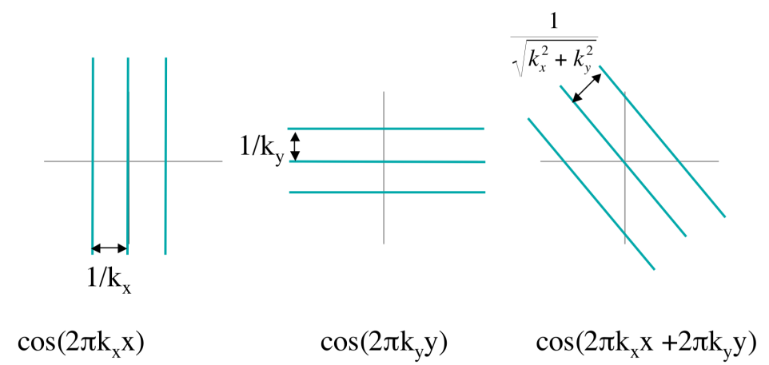

Συγκεκριμμένα Η μορφή από τα κύμματα προκείπτει ώς εξής:

	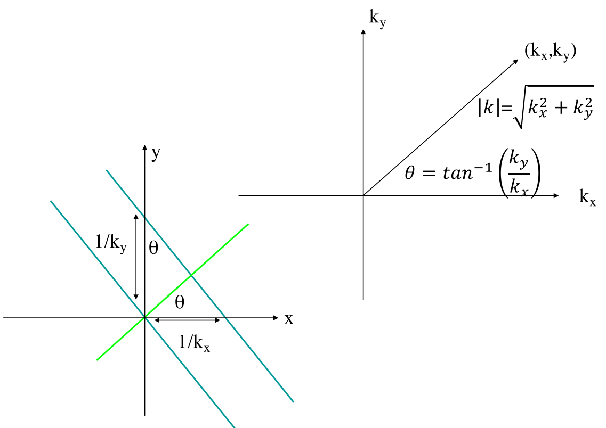

Τώρα όμοια όπως και στον 1D Μετασχηματισμό μπορούμε να αθροίσουμε όλα τα κύμματα ώστε να μπορέσουμε να ανακατασκευάσουμε την εικόνα:

	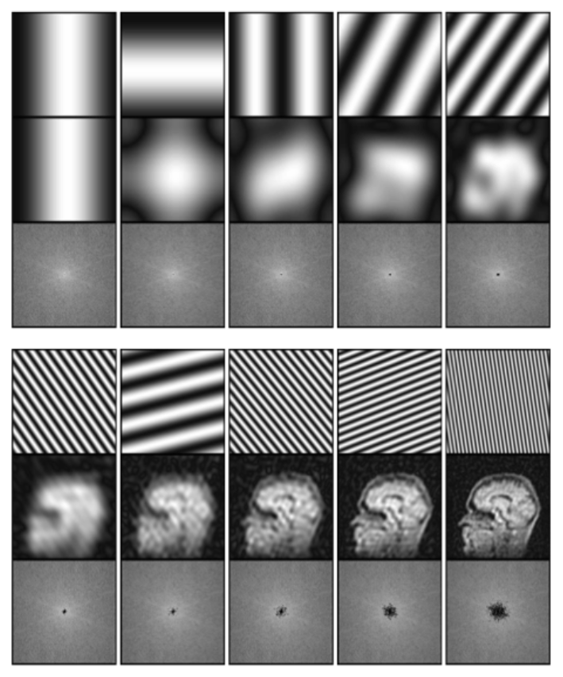

Παρατηρούμε πάλι ότι όσο ποιο πολλά κύμματα χρησιμοποιούμε για να ανακατασκευάσουμε την εικόνα τόσο πιο καλή και λεπτομερής θα είναι η ανακατασκευή της.

### K-Space
Αυτό που μπορούμε να παρατηρήσουμε κάτω από την ανακατασκευασμένη εικόνα είναι άλλη μία εικόνα που απλά φαίνεται να έχει μερικές μάυρες κουκίδες. Η εικόνα αυτή είναι το *K-Space*.
Το K-Space είναι η αναπαράσταση της εικόνας στον χώρο των συχνοτήτων, δηλαδή το αποτέλεσμα του 2D μετασχηματισμού Fourier. Κάθε στοιχεία στην εικόνα αντιστοιχεί σε μία συγκεκριμμένη χωρική συχνότητα ($u$,$v$) και η ένταση δείχνει πόσο ισχυρή είναι αυτή η συχνότητα στην εικόνα.
Το κέντρο του K-Space περιέχει χαμηλές συχνότητες, οι οποίες καθορίζουν την γενική μορφή και φωτεινότητα της εικόνας, ενώ όσο απομακρυνόμαστε από το κέντρο εμφανίζονται οι υψηλές συχνότητες που σχετίζονται με λεπτομέρειες και ακμές.
Οι "μάυρες κουκίδες" που παρατηρούμε αντιστοιχούν σε **μεμονωμένες συχνότητες** που συμβάλλουν στην ανακατασκευή της εικόνας. Παρόλο το K-Space δεν μοιάζει οπτικά με την αρχική εικόνα, περιέχει όλη την πληροφορία της και μέσω αντίστροφου μετασχηματισμού Fourier μπορούμε να την ανακατασκευάσουμε πλήρως.

	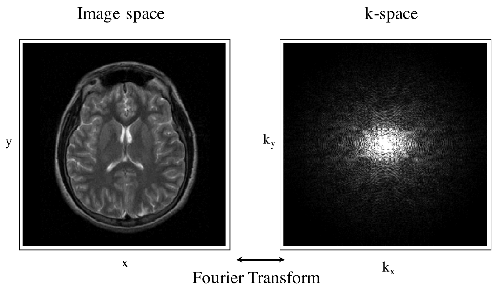

Μπορούμε να δούμε πώς κάθε κουκίδα αναπαριστά ένα επίπεδο κύμα στην εικόνα:

	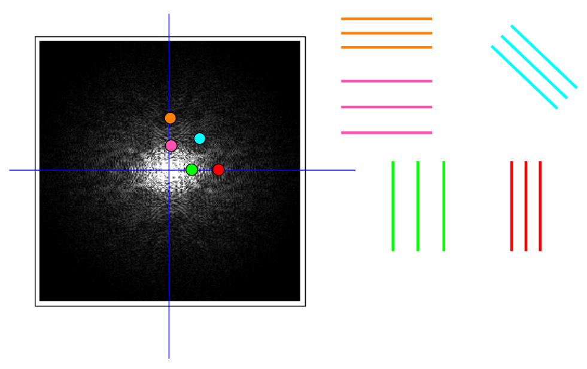
	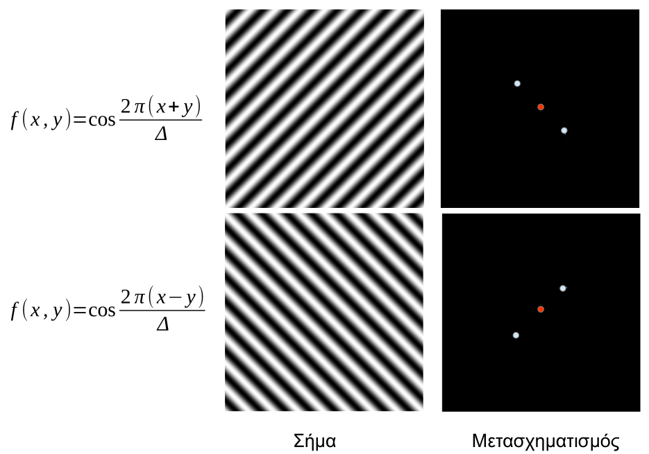

Μερικά παραδείγματα:

	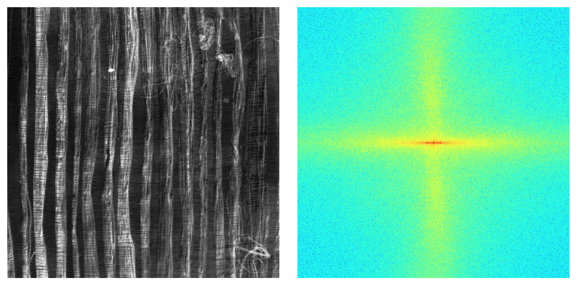
	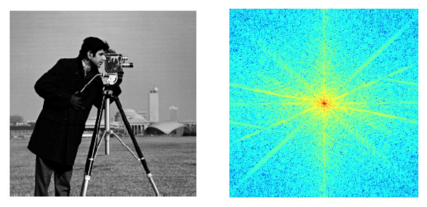

### Βάση στον 2D Μετασχηματισμό Fourier
Η βάση στον μετασχηματισμό Fourier είναι ένα σύνολο συναρτήσεων της μορφής:

$$ \phi(x,y;u,v) = e^{j2\pi(ux+vy)} = e^{j2\pi ux} e^{j2\pi vy}, ~ u,v \in (-\infty,+\infty) $$

οι οποίες παριστάνουν 2D ημιτονοειδή κύματα με συγκεκριμμένες χωρικές συχνότητες $(u,v)$.

Κάθε εικόνα $F(x,y)$ μπορεί να γραφτεί ως γραμμικός συνδυασμός αυτών των βάσεων. Οι συντελεστές Fourier $F(u,v)$ εκφράζουν το πόσο έντονα συμμετέχει κάθε βάση στην αναπαράσταση της εικόνας.

Οι συναρτήσεις βάσης είναι ορθογώνιες και πλήρεις, εξασφαλίζοντας μοναδική αναπαράσταση της εικόνας στο πεδίο της συχνότητας.

Με άλλα λόγια οι συναρτήσεις βάσεις χρησιμοποιούνται για να αναπαραστήσουν τα κύμματα μέσα στον μετασχηματισμό Fourier:
Ευθύς μετασχηματισμός:
$$ F(u,v) = \int^{+\infty}_{-\infty} \int^{+\infty}_{-\infty} f(x,y) \overline \phi (x,y;u,v) dx dy $$
Αντίστροφος μετασχηματισμός:
$$ f(x,y) = \int^{+\infty}_{-\infty} \int^{+\infty}_{-\infty} F(u,v) \phi (x,y;u,v) du dv $$

## Δειγματοληψία
Όπως έχουμε ήδη δεί στο [κεφάλαιο 3](<3)Δειγματολειψία, Κβαντισμός και Γεωμετρικοί Μετασχηματισμοί εικόνας.md>) η δειγματοληψία είναι η διαδικασία στην οποία πέρνουμε μία συνεχής εικόνα και την μετατρέπουμε σε διακριτή παίρνοντας τιμές σε συγκεκριμμένα σημεία. Μαθηματικά, η ιδανική δειγματοληψία μοντελοποιείται με την συνάρτηση $\text{comb}()$, γνωστή και ώς *Dirac Comb*, ορίζεται ώς εξής:

$$ \text{comb}_X(x) = \sum^{\infty}_{n=-\infty} \delta(x-nX) $$

όπου:
- $\delta(\cdot)$ είναι η συνάρτηση Dirac
- $T$ είναι το διάστημα δειγματοληψίας

Τι κάνει πρακτικά:
- Πολλαπλασσιάζοντας ένα συνεχές σήμα με την $\text{comb}()$
  - Κρατάμε μόνο τις τιμές του σήματος στα σημεία $x = nT$
  - όλα τα άλλα μηδενίζονται

	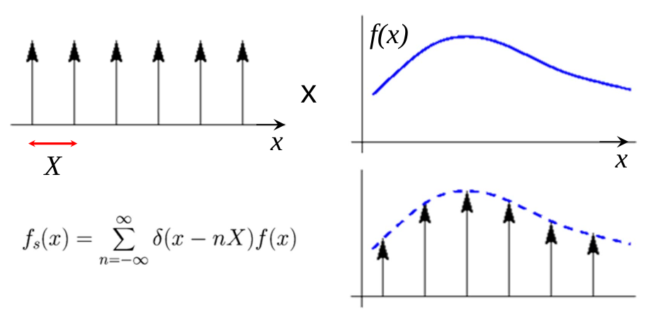

Για εικόνες 2D χρησιμοποιούμε 2D comb:

$$ 
	\text{comd}_{X,Y}(x,y) = 
	\text{comb}_{X}(x)\text{comb}_{Y}(y) = 
	\sum^{\infty}_{n=-\infty} \sum^{\infty}_{m=-\infty} \delta(x-nX)\delta(y-mY) 
$$

  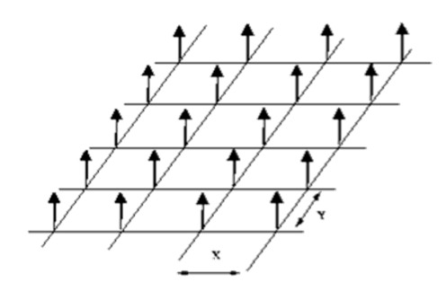

### Θεώρημα Δειγματοληψίας
Η δειγματοληψία ενός συνεχούς σήματος στο χωρικό πεδίο ισοδυναμεί με περιοδική επανάληψη του φάσματός του στο πεδίο της συχνότητας. Το θεώρημα δειγματοληψίας (Shannon–Nyquist) ορίζει τις συνθήκες υπό τις οποίες η επανάληψη αυτή δεν προκαλεί απώλεια πληροφορίας.

#### 1D 
Έστω ένα συνεχές σήμα $f(x)$ με μετασχηματισμό Fourier $F(u)$, το οποίο είναι περιορισμένο σε συχνότητα, δηλαδή:

$$ F(u) = 0,~\text{για}~|u| > u_{\text{max}} $$

Η ιδανική δειγματολήψία γράφεται σαν:

$$ f_s(x) = f(x) comb_X(x) $$

Στο πεδίο της συχνότητας ισχύει:

$$ F_s(u) = F(u) * comb_{\frac{1}{X}} (u) $$

  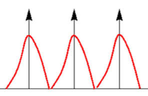

Δηλαδή το φάσμα $F(u)$ επαναλαμβάνεται περιοδικά με περίοδο $\frac{1}{X}$
Το σήμα μπορεί να ανακατασκευαστεί πλήρως αν:

$$ \frac{1}{X} \geq 2u_b $$

όπου:
- $\frac{1}{X}$: συχνότητα δειγματοληψίας
- $2u_b$: συχνότητα *Nyquist*

#### Aliasing
Αν η συχνότητα δειγματοληψίας είναι μικρότερη από τη συχνότητα Nyquist:

$$ \frac{1}{X} < 2u_b $$

τότε τα αντίγραφα του φάσματος **επικαλύπτονται**. Οι υψηλές συχνότητες "διπλώνουν" προς τις χαμηλότερες, προκαλώντας το φαινόμενο ψευδώνυμων συχνωτήτων (aliasing).
> Το aliasing οδηγεί σε **μη αναστρέψιμη** αλλοίωση του σήματος.

  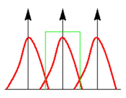

#### 2D
Για μία εικόνα $f(x,y)$ με φάσμα $F(u,v)$, η ιδανική δειγματοληψία δίνεται από:

$$ f_s(x,y) = f(x,y) \text{comb}_{X,Y}(x,y) $$

Στο πεδίο της συχνότητας:

$$ F_s(u,v) = F(u,v) * \text{comb}_{\frac{1}{X},\frac{1}{Y}}(u,v) $$

  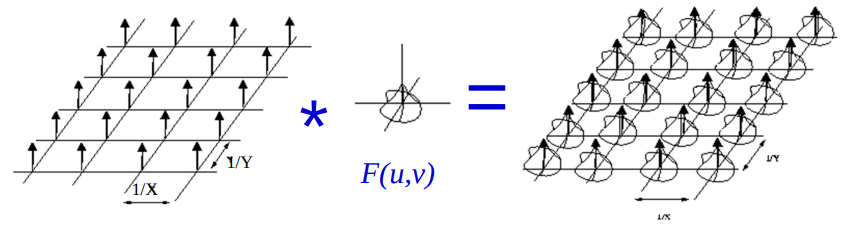

Το φάσμα επαναλαμβάνεται περιοδικά στους άξονες $u$ και $v$:
Αν το φάσμα είναι περιορισμένο:

$$ F(u,v) = 0,~\text{για} |u| > u_b~\text{ή}~|v| > v_b $$

Τότε η εικόνα ανακατασκευάζεται πλήρως αν:

$$ \frac{1}{X} \geq 2u_b ~~~\text{και}~~~ \frac{1}{Y} \geq 2v_b $$

#### Aliasing σε εικόνες
Η υποδειγματοληψία εικόνων οδηγεί σε:
- παραμορφωμένες ακμές
- ψευδο-δομές και απώλεια λεπτομέρειας

Το aliasing στις εικόνες εμφανίζεται όταν το φάσμα επικαλύπτεται στο πεδίο της συχνότητας λόγω ανεπαρκούς δειγματοληψίας.

	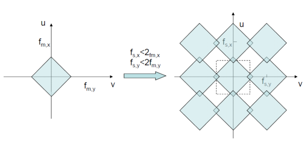
	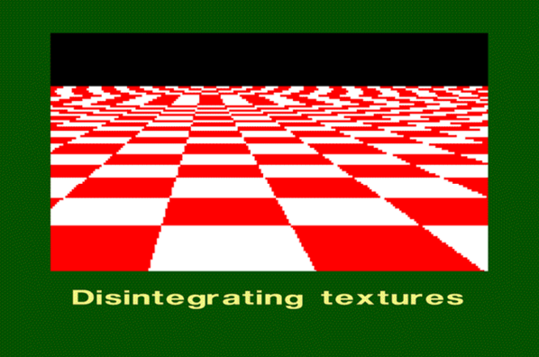

### Anti-Aliasing
Για να αποφύγουμε aliasing εφαρμόζουμε τις εξείς τεχνικές:
- Αύξηση της συχνότητας δειγματοληψίας
- Μείωση της μέγιστης χωρικής συχνότητας πριν την δειγματοληψία

Η δεύτερη επιτυγχάνεται με τη χρήση χαμηλοπέρατου φίλτρου (anit-aliasing filter), όπως φίλτρο Gaussian.

  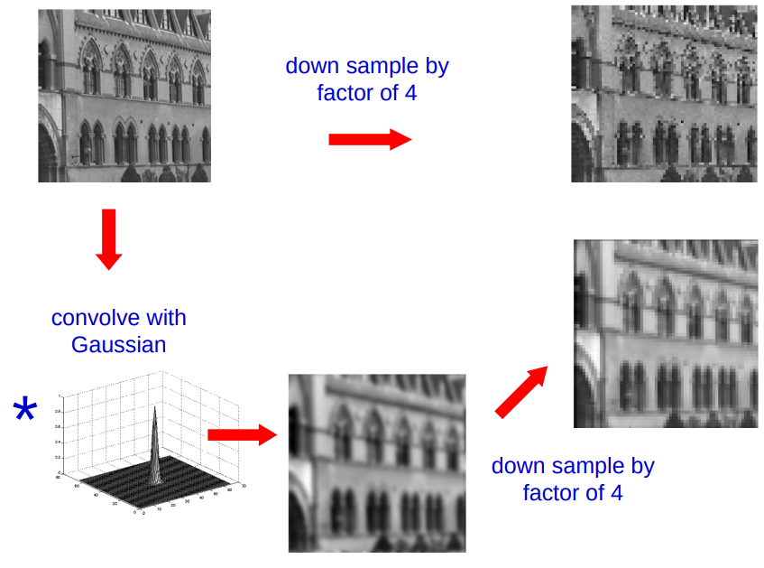

#### Φίλτρο πρίν την δειγματοληψία
Πρίν την δειγματοληψία ή την σμίκρυνση μίας εικόνας, εφαρμόζεται φίλτρο εξομάλυνσης ώστε:
- να αμβλυνθούν οι λεπτομέρειες
- να περιοριστοί το φάσμα εντός του ορίου Nyquist
- να αποφευχθεί η σύγχυση λεπομερείων (aliasing)

Στην πράξη, το φίλτρο απέχει από το ιδανικό sinc, αλλά παρέχει ικανοποιητικά αποτελέσματα

  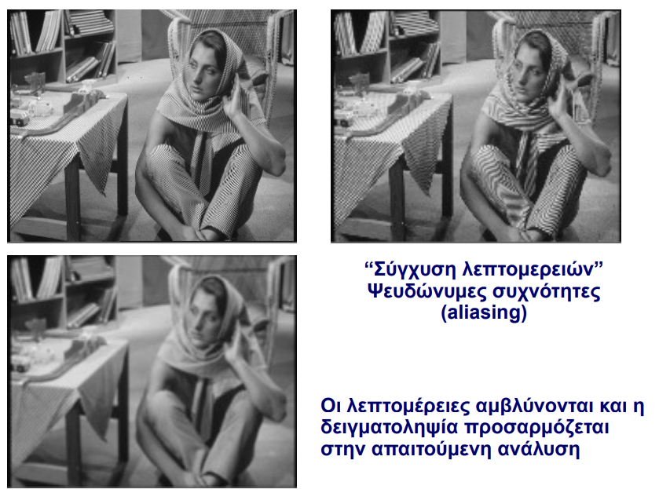

#### Υποδειγματοληψία με σμίκρυνση (Downsampling)
Η σμίκρυσνη εικόνας εισοδυναμεί με:
- μείωση της συχνότητας δειγματοληψίας
- αύξηση του κινδύνου aliasing

Για σωστή υποδειγματοληψία απαιτείται:
1. Φιλτράρισμα (Blur)
2. Υποδειγματοληψία (downsampling)

#### Αποκατάσταση - Παρεμβολή
Η ανακατασκευή συεχούς εικόνας από διακριτά δείγματα πραγματοποιείται μέσω παρεμβολής, η οποία ισοδυναμεί με συνέλιξη των δειγμάτων με κατάλληλο πυρήνα.
Ιδιώτητες φίλτρων παρεμβολής:
- συμμετρική απόκριση
- διαχωρίσιμη απόκριση
- διατήρηση των αρχικών δειγμάτων
- φθίνουσες τιμές

Τυπικά φίλτρα:
- πλησιέστερου γείτονα
- διγραμμική παρεμβολή
- κυβική παρεμβολή
- ιδανική παρεμβολή

