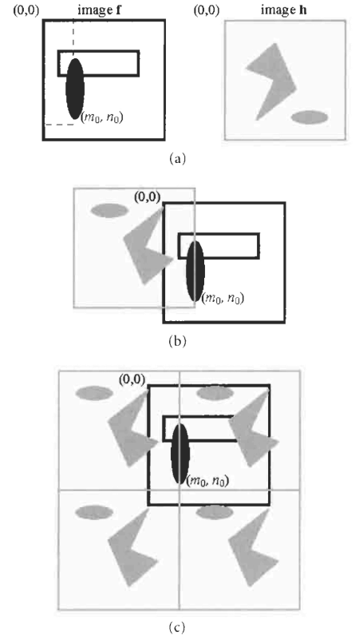
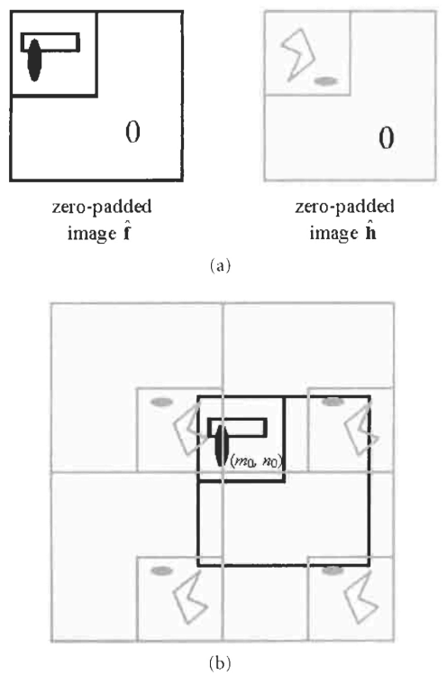
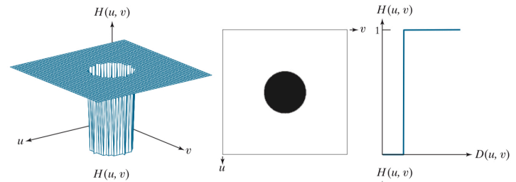
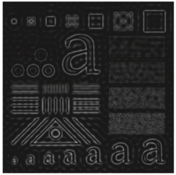
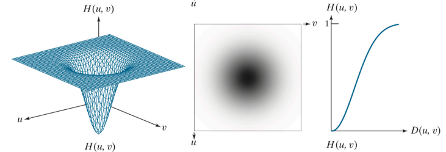
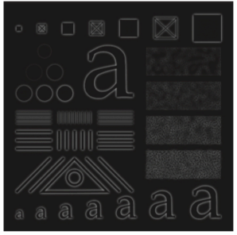
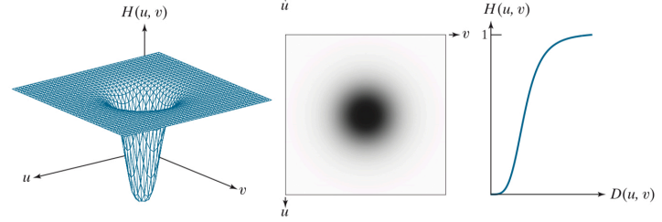
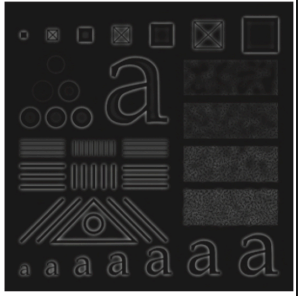
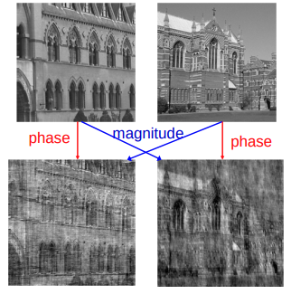
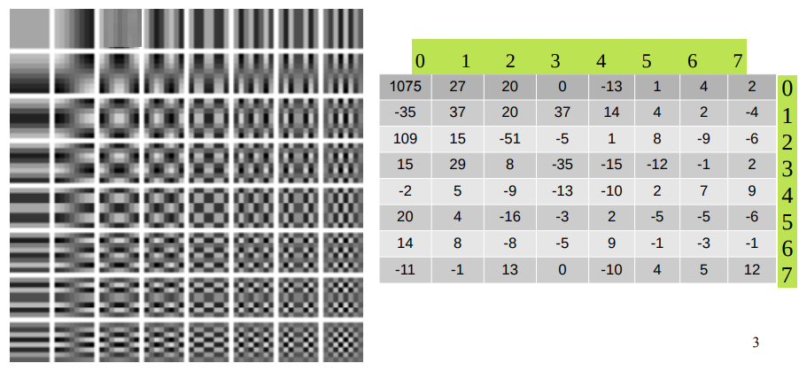

# ΗΥ371 - Ψηφιακή Επεξεργασία Εικόνων

## Μετασχηματισμός Fourier Διακριτών σημάτων
Σε εικόνες που εστιαζόμαστε εμείς έχουμε το προφανές πρόβλημα ότι το σήμα (στη περίπτωση μας εικόνα) που θέλουμε να μετατρέψουμε με τον μετασχηματισμό Fourier δεν είναι συνεχές, αλλά διακριτό. Προκειμένου να μπορούμε ακόμα να υπολογίσουμε τον Μετασχηματισμό μπορούμε να χρησιμοποιήσουμε δύο παραλλαγές του Μετασχηματισμού:
1. Τον Μετασχηματισμό Fourier Διακριτών σημάτων (DSFT)
	Άπειρα Διακριτά Σήματα $\to$ Συνεχές Φάσμα
2. Τον Διακριτό Μετασχηματισμό Fourier (DFT)
  Πεπερασμένα Διακριτά Σήματα $\to$ Διακριτό Φάσμα

Ο _Μετασχηματισμός Fouier Διακριτών σημάτων (DSFT)_ εφαρμόζεται σε σήματα που είναι διακριτά και άπειρα στον πεδίο του χρόνου, αλλά έχει αποτέλεσμα που είναι συνεχές στο πεδίο των συχνοτήτων. 

### 1D Μετασχηματισμός Fourier Διακριτών σημάτων

Μετασχηματισμός Fourier Διακριτού σήματος:
$$ F(u) = \sum ^{\infty}_{n=-\infty}f(n)e^{-j2\pi un} $$

Αντίστροφος Μετασχηματισμός Fourier Διακριτού σήματος
$$ f(n) = \int^{\frac{1}{2}}_{-\frac{1}{2}} F(u)e^{j2\pi un} du $$

#### Ορθοκανονική βάση DSTF
Ο DSFT βασίζεται στην ανάπτυξη του διακτριτού σήματος $f(n)$ ώς γραμμικό συνδυασμό μιγαδικών εκθετικών συναρτήσεων της μορφής:

$$ \phi _u(n) = e^{j2\pi un} $$

οι συναρτήσεις αυτές αποτελούν ορθοκανονική βάση στο πεδίο $[-\frac{1}{2},\frac{1}{2}]$ αφού ισχύει:

$$ 
\int ^ {\frac{1}{2}}_{-\frac{1}{2}} e^{j2\pi u(n-m)} du = 
\begin{cases}
	1 &, n = m \\
	0 &, n \neq m
\end{cases}
$$

Κάθε διακριτό σήμα μπορεί να αναπαρασταθεί ώς άθροισμα αυτών των βάσεων με συντελεστές $F(u)$

#### Περιοδικότητα του φάσματο
Το φάσμα του DFS είναι περιοδικό στη συχνότητα με περίοδο 1:

$$ F(u + 1) = F(u) $$

Η περιοδικότητα αυτή προκύπτει επό το γεγονός ότι το σύστημα είναι διακρίτο στον χρόνο/χώρο.
Ως αποτέλεσμα, το φάσμα περιέχει πλήρη πληροφορία σε οποιοδήποτε διάστημα μήκους 1, συνήθως στο $[-\frac{1}{2},\frac{1}{2}]$.

#### Πραγματικά σήματα και συζυγής συμμετρία
Αν το διακριτό σήμα $f(n)$ είναι πραγματικό, τότε το φάσμα του DSFT παρουσιάζει συζυγή συμμετρία:

$$ F(-u) = F*(u) $$

Συνέπειες:
- το **μέτρο** φάσματος είναι άρτιο:
	$$ |F(-u)| = |F(u)| $$
- η **φάση** είναι περιττή
	$$ \angle F(-u) = -\angle F(u) $$

### 2D Μετασχηματισμός Fourier Διακριτών σημάτων

Μετασχηματισμός Fourier Διακριτού σήματος:
$$ F(u,v) = \sum ^{\infty}_{n=-\infty} \sum ^{\infty}_{m=-\infty} f(m,n)e^{-j2\pi (um + vn)} $$

Αντίστροφος Μετασχηματισμός Fourier Διακριτού σήματος
$$ f(n,m) = \int^{\frac{1}{2}}_{-\frac{1}{2}} \int^{\frac{1}{2}}_{-\frac{1}{2}} F(u,v)e^{j2\pi (um+vn)} dudv $$

### Ιδιότητες
| Ιδιότητα |  χώρο |  συχνότητα |
|-|-|-|
| Συνέλιξη | \( f[n] * g[n] \) | \( F(u)\,G(u) \) |
| Πολλαπλασιασμός | \( f[n]\;g[n] \) | \( F(u) * G(u) \) |
| Εσωτερικό γινόμενο | \( \sum_n f[n]\,g^*[n] \) | \( \int_{-1/2}^{1/2} F(u)\,G^*(u)\,du \) |
| Διατήρηση ενέργειας | \( \sum_n \|f[n]\|^2 \) | \( \int_{-1/2}^{1/2} \|F(u)\|^2\,du \) |

## Διακριτός Μεταχηματισμός Fourier
Ο _διακριτός Μετασχηματισμός Fourier (DFT)_ εφαρμόζεται σε σήματα που είναι διακριτά και πεπερασμένου μήκους στον χώρο και παράγει φάσμα που επίσης είναι διακριτό στο χώρο της συχνότητας.

### 1D Διακριτός Μετασχηματισμός Fourier
Διακριτός Μετασχηματισμός Fourier:
$$ F(k) = \sum ^{N-1}_{n=0} f(n) e^{-j2\pi kn / N} $$

Αντίστροφος Διακριτός Μετασχηματισμός Fourier:
$$ f(n) = \frac{1}{N} \sum ^{N-1}_{k=0}F(k) e^{j2\pi kn / N} $$

Όπου $N$ το πλήθως σημείων 

### 2D Διακριτός Μετασχηματισμός Fourier
Διακριτός Μετασχηματισμός Fourier
$$ F(u,v) = \sum^{M-1}_{m=0} \sum^{N-1}_{n=0} f(m,n) e^{-j2\pi (\frac{um}{M} + \frac{vn}{N})} $$

Αντίστροφος Διακριτός Μετασχηματισμός Fourier:
$$ f(m,n) = \frac{1}{MN} \sum^{M-1}_{u=0} \sum^{N-1}_{v=0} F(u,v) e^{-j2\pi (\frac{um}{M} + \frac{vn}{N})} $$

### Ιδιότητες DFT
- Περιοδικότητα
  $$ F(u + kM,v+lN) = F(u,v) $$
- Συζυγής συμμετρία
  $$ F(u,v) = \overline{F(M-u,N-v)} $$
- Κυκλική ολίσθηση
  $$ f((m-m_0) \mod M, (n-n_0) \mod N) $$

## Συνέλιξη εικόνας με DFT και DSFT
Η συνέλιξη στο χωρικό πεδίο είναι υπολογιστικά βαριά, για δύο εικόνες $Ν \times N$ και $M \times M$ θα χρειαστούμε $O(N^2 \cdot M^2)$. Ένας τρόπος να κάνουμε την διαδικασία πολύ πιο αποδοτική είναι χρησιμοποιόντας DFT, συγκεκριμμένας ακολουθούμε τα συγκεκριμμένα βήματα:
έστω ότι έχουμε δύο εικόνες, η εικόνα $f$ και το δίλτρο $h$
1. Zero-Padding
  Κάνουμε μηδενική επέκταση της εικόνας και του φίλτρου για να αποφύγουμε την κυκλική συνέλιξη.
2. DFT
  $\text{F} = \text{DFT}(f)$, $\text{H} = \text{DFT}(h)$
3. Υπολογίζουμε το γινόμενο στο πεδίο συχνοτήτων
  $\text{G}(u,v) = \text{F}(u,v) \cdot \text{H}(u,v)$
4. υπολογίζουμε το αντίστροφο DFT
  $\text{g}(x,y) = \text{IDFT}(G)$

### Κυκλική συνέλιξη
Ο λόγος που κάνουμε το βήμα 1 είναι όπως είπαμε για να απφύγουμε την κυκλική συνέλιξη, τι ακριβώς είναι όμως αυτό;
Ο Διακριτός Μετασχηματισμός Fourier (DFT) υποθέτει ότι τα διακριτά σήματα είναι περιοδία. Δηλαδή, για μία εικόνα $f(x,y)$ διαστάσεων $Ν \times N$. ισχύει νοητά ότι:
$$ f(x,y) = f(x~\text{mod}~N, y~\text{mod}~N) $$

Αυτό σημαίνει ότι η εικόνα επαναλαμβάνεται άπειρα προς όλες τις κατευθύνσεις. Ως αποτέλεσμα, όταν υπολογίζουμε:
$$ \text{IDFT}\{F(u,v) \cdot H(u,v)\} $$

Το αποτέλεσμα δεν είναι γραμμική συνέλιξη αλλά κυκλική συνέλιξη, δηλαδή σε περιπτώσεις όπου το φίλτρο εκτείνεται πέρα από τα όρια της εικόνας, τα εικονοστοιχεία που βρίσκονται εκτός ορίων «τυλίγονται» και επηρεάζουν την αντίθετη πλευρά της εικόνας.

  

Αυτό μπορεί αν οδηγήσει σε μή-αναμενόμενα αποτελέσματα σαν artifacts στα άκρα που είναι και ο λόγος που εφαρμόζουμε το βήμα 1 που αναφέραμε παραπάνω. Αν λοιπόν βάλουμε zero padding, μπορούμε να το αποφύγουμε εφόσον το φίλτρο θα είναι 0 στα σημεία που προεξέχει και δεν θα επηρεάζει την εικόνα

  

Το πόσο padding θα κάνουμε την εικόνα προκύπτει από το μέγεθος και το φίλτρο, συγκεκριμμένα θα αλλάξουμε και τις δύο εικόνες να έχουν διαστάσει:

$$ (M_1 + M_2 - 1) \times (N_1 + N_2 - 1) $$

όπου $M_1 \times N_1$ οι διαστάσεις της πρώτης εικόνας και $M_2 \times N_2$ οι διαστάσεις της δεύτερης. Προφανώς τα σημία που προεξέχουν οι εικόνες είναι αυτά που θα βάλουμε τις τιμές 0. 

## Φίλτρα στο πεδίο των Συχνωτήτων
Όπως είπαμε μπορούμε να εφαρμόσουμε φίλτρα στο πεδίο των συχνοτήτων αντί για το πεδίο του χώρου εφόσον αυτό θα είναι αρκετά πιο αποδοτικό, συγκεκριμμένα αυτό επιτυγχάνετε με έναν απλό πολλαπλασιασμό:

$$ G(u,v) = H(u,v) \cdot F(u,v) $$

όπου:
- $G$: το φάσμα της φιλτραρισμένης εικόνας
- $F$: το φάσμα της εικόνας
- $H$: η συνάρτηση μεταφοράς φίλτρου

Ο πολλαπλασιασμός είναι **απλός σημειακός**, που σημαίνει ότι κάθε τιμή του φάσματους της εικόνας θα πολλαπλασιαστεί με μία τιμή του φάσματος του φίλτρου. Αναγκαστηκά λοιπόν το φίλτρο θα πρέπει να έχει ίδιες διαστάσεις με το φάσμα της εικόνας, αυτό όμως θα είναι δεδομένο εφόσον έχουμε ήδη κάνει zero padding ώστε να αποφύγουμε την κυκλική συνέλιξη.

Οι τύποι του πολλαπλασιασμού γενικά είναι:
- Το φάσμα της εικόνας $F(u,v)$: μιγαδικός αριθμός
- Η συνάρτηση μεταφοράς του φίλτρου: $H(u,v)$: πραγματικός αριθμός

Ο πολλαπλασιασμός δηλαδή θα μετατοπίζει το μέτρο αλλά όχι την φάση του φάσματος.

Ας δούμε μερικά βασικά φίλτρα:
### Ιδεατά Υψηλοπερατά Φίλτρα (Ideal High-Pass Filter, IHPF)
Ένα ιδανικό υψηλοπερατό φίλτρο περνά όλες τις υψηλές συχνότητες πάνω από μια συχνότητα κατωφλίου $D_0$ και καταργεί όλες τις χαμηλές συχνότητες κάτω από αυτή.

$$ 
H(u,v) = 
\begin{cases}
	0, & D(u,v) \leq D_0 \\
	1, & D(u,v) > D_0  
\end{cases}
$$

όπου $D(u,v) = \sqrt{(u-\frac{M}{2})^2 + (v-\frac{N}{2})^2}$ η απόσταση από το κέντρο του φάσματος

Χαρακτηριστικά:
- Έχει απότομη μετάβαση στο κατώφλι $D_0$
- Δημιουργεί ringing artifacts στο χωρικό πεδίο λογο του φαινομένου Gibbs
- Χρησιμοποιείται όταν θέλουμε να ενισχύσουμε λεπτομέρειες και ακμές

	
	

### Γκαουσιανά Υψηλοπερατά Φίλτρα (Gaussian High-Pass Filter, GHPF)
Τo Γκαουσιανό είναι πιο ομαλό από το ιδανικό χωρίς απότομη μετάβαση.

$$ Η_{LPF}(u,v) = e^{-\frac{D(u,v)^2}{2σ^2}} $$

Άρα το ανάλογο high-pass είναι:

$$ Η_{GH~PF} (u,v) = 1 - H_{LPF} (u,v) = 1 - e^{-\frac{D(u,v)^2}{2σ^2}} $$

Χαρακτηριστικά:
- Ομαλή Μετάβαση από το 0 στο 1
- Δεν δημιουργεί riniging artifacts στο χωρικό πεδίο
- Χρησιμοποιείτε για ενίσχυση ακμών και λεπτομέρειων με λιγότερο θόρυβο από IHPF

	
	

### Butterworth High-Pass Filter (BHPF)
Το Butterworth high-pass filter έχει ελεγχόμενη ομαλότητα στην μετάβαση με παράμετρο τάξης $n$:

$$ H_{BHPF}(u,v) = \frac{1}{1 + (\frac{D_0}{D(u,v)}) ^{2n}} $$

όπου:
- $D_0$: συχνότητα κατωφλίου
- $n$: τάξη φίλτρου, όσο μεγαλύτερο $n$, τόσο πιο απότομη η μετάβαση

Χαρακτηριστικά:
- Μεταξύ ιδανικού και Gaussian φίλτρου: πιο ομαλό από IHPF, πιο απότομο από GHPF
- Ομαλή απόκριση χωρίς πολύ ringing αν η τάξη $n$ είναι μικρή
- Συχνά χρησιμοποιείται για γενική ενίσχυση και φίλτρανση υψηλών συχνοτήτων

	
	

> ### Γιατί τα IHPF, GHPF και BHPF κάνουν edge dection
> Μπορεί να έχετε προσέξει και εσείς ότι τα φίλτρα που δείξαμε από πάνω κάνουνε μία μορφή edge detection. Αυτό είναι λογικό άμα σκεφτεί κανένας ότι οι ακμές σε μία εικόνα αντιστοιχούν σε απότομε μεταβολές έντασης, δηλαδή σε υψηλές χωρικές συχνότητες. Άρα κάθε φίλτρο που κάθε φίλτρο που καταστέλλει τις χαμηλές συχνότητες και ενισχύει τις υψηλές τονίζει ακμές και λεπτομέρειες.

## Γρήγορος Μετασχηματισμός Fourier
Ο Γρήγορος Μετασχηματισμός Fourier (FFT) δεν είναι ένας νέος μετασχηματισμός, αλλά ένας αποδοτικός αλγόριθμος υπολογισμού του DFT. Μειώνει την υπολογιστική πολυπλοκότητα από $O(N^4)$ σε $O(N^2 \log_2 N)$, κάτι που είναι κρίσιμο για την επεξεργασία μεγάλων εικόνων.

Η βασική αρχή είναι η λογική **Διαίρει και Βασίλευε (Divide and Conquer)**:
- Χωρίζουμε το σήμα σε μικρότερα υποσήματα.
- Υπολογίζουμε τον DFT σε αυτά.
- Συνδυάζουμε τα αποτελέσματα.

## Μέτρο και Φάση
Ο DFT μίας εικόνας επιστρέφει ένα μιγαδικό αποτέλεσμα:
$$F(u,v) = |F(u,v)|e^{j\phi(u,v)}$$

- $|F(u,v)|$ (_Φάσμα Πλάτους_): Εκφράζει την ισχύ κάθε χωρικής συχνότητας (την αντίθεση).
- $\phi(u,v)$ (_Φάσμα Φάσης_): Καθορίζει τη θέση των συχνοτήτων (πού βρίσκονται τα αντικείμενα).

> Η φάση παίζει καθοριστικό ρόλο στην αναγνώριση της εικόνας: αν χαθεί η φάση, χάνεται η δομή του αντικειμένου.

  

## Διακριτός Μετασχηματισμός Συνημιτόνου (DCT)
Ο DCT είναι πραγματικός μετασχηματισμός (χρησιμοποιεί μόνο συνημίτονα) και είναι η βάση του JPEG λόγω της υψηλής ενεργειακής συμπύκνωσης.

### DCT σε μπλοκ $N \times N$
Στην πράξη, χωρίζουμε την εικόνα σε μπλοκ (συνήθως $8 \times 8$). Ο υπολογισμός των συντελεστών γίνεται με πολλαπλασιασμό πινάκων:

$$Y = TXT^T$$

Όπου:
- $X$: Το αρχικό μπλοκ εικόνας (pixel intensities).
- $T$: Ο πίνακας μετασχηματισμού (περιέχει τις τιμές των συνημιτόνων).
- $Y$: Ο πίνακας των **συντελεστών DCT** (το αποτέλεσμα που δείχνει "πόσο" από κάθε συχνότητα υπάρχει στο μπλοκ).

Ο αντίστροφος μετασχηματισμός (IDCT) για την ανάκτηση της εικόνας είναι:

$$X = T^TYT$$

> Στον πίνακα $Y$, οι μεγάλες τιμές συγκεντρώνονται πάνω αριστερά (χαμηλές συχνότητες), ενώ κάτω δεξιά (υψηλές συχνότητες) οι τιμές είναι κοντά στο 0.

### Η Διαδικασία και οι Πίνακες
Στην παρακάτω εικόνα βλέπουμε τη σύγκριση μεταξύ των Βασικών Συναρτήσεων (αριστερά) και του Πίνακα Συντελεστών (δεξιά).

1. Βασικές Εικόνες (Basis Images): Είναι τα 64 πρότυπα συχνότητας (από απλά σε σύνθετα).
2. Πίνακας Συντελεστών $Y$: Προκύπτει από τον τύπο $Y = TXT^T$. Κάθε αριθμός δείχνει πόσο "συμμετέχει" η αντίστοιχη βασική εικόνα στο μπλοκ.
   - DC Συντελεστής (Θέση 0,0): Αντιπροσωπεύει τη μέση φωτεινότητα.
   - AC Συντελεστές: Αντιπροσωπεύουν τις λεπτομέρειες.

  

### Ο Πίνακας Κβαντισμού $Q$
Μετά τον DCT, εφαρμόζεται ο κβαντισμός για τη μείωση του μεγέθους:
$$Y_{quant} = \text{round}\left( \frac{Y}{Q} \right)$$
- Ο $Q$ έχει μικρές τιμές πάνω αριστερά (διατήρηση χαμηλών συχνοτήτων).
- Ο $Q$ έχει μεγάλες τιμές κάτω δεξιά (απόρριψη υψηλών συχνοτήτων που δεν βλέπει το μάτι).

## JPEG Pipeline
1. Διαίρεση σε μπλοκ $8 \times 8$.
2. Level Shifting (-128).
3. DCT: Υπολογισμός των συντελεστών (μεταφορά ενέργειας πάνω αριστερά).
4. Κβαντισμός: Η "lossy" φάση όπου χάνεται πληροφορία για χάρη της συμπίεσης.
5. Zig-Zag Σάρωση: Οργάνωση των συντελεστών ώστε τα πολλά μηδενικά να βρεθούν στο τέλος.
6. Entropy Coding: Τελική συμπίεση των δεδομένων.

Μια πολύ καλή εξήγηση για το πώς λειτουργεί η συμπίεση είναι [αυτό](https://youtu.be/Kv1Hiv3ox8I?si=iL8_69Db6tg0HIfx) το βίντεο

