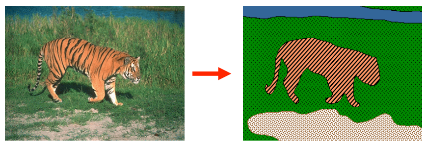
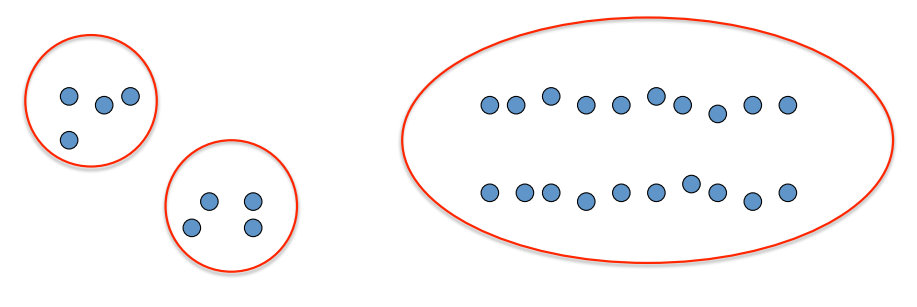
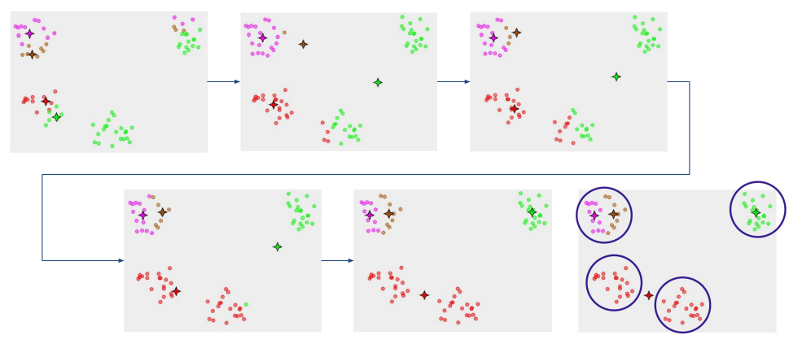
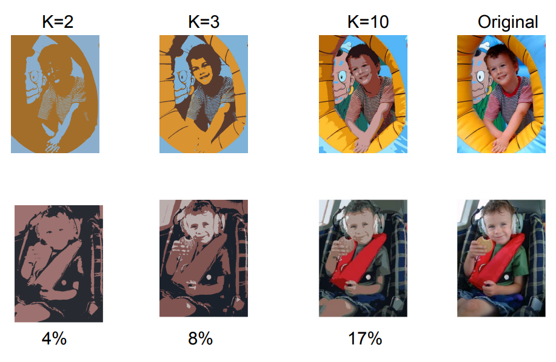
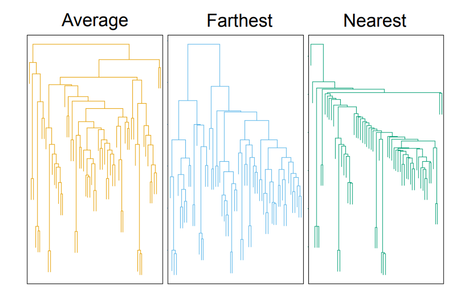
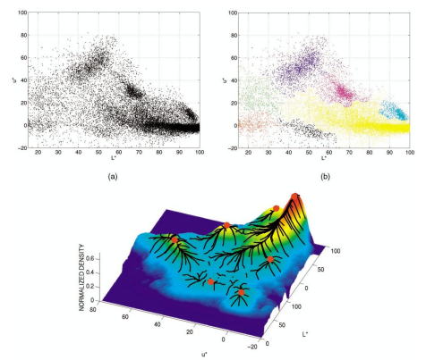

# ΗΥ371 - Ψηφιακή Επεξεργασία Εικόνων

## Τμηματοποίηση (Clustering)
Η τμηματοποίηση είναι η διαδικασία διαχωρισμού μιας εικόνας σε περιοχές με συνοχή, οι οποίες αντιστοιχούν σε "αντικείμενα" ή μέρη της εικόνας που έχουν παρόμοια οπτικά χαρακτηριστικά.

  

Πιο συγκεκριμμένα οι στόχοι είναι:
- Να διαχωρίσουμε μία εικόνα σε συνεκτικά αντικείμενα
- Να ομαδοποιήσουμε παρόμοια pixel για πιο αποδοτική επεξεργασία
- Να συμπιέσουμε την αναπαράσταση δεδομένων της εικόνας

  

## Ο αλγόριθμος K-Means
Ο αλγόριθμος K-Means είναι ένας επαναληπτικός αλγόριθμος που χωρίζει τα δεδομένα σε $K$ ομάδες (clusters). Η Διαδικασία που λειτουργεί είναι:
1. Αρχικοποιεί $K$ τυχαία σημεία ώς κέντρα των ομάδων
2. Αναθέτει κάθε σημείο στο πλησιέστερο κέντρο
3. Ενημερώνει το κέντρο κάθε ομάδας σαν τον μέσο όρο των σημείων που ανήκουν σε αυτή
4. Επαναλαμβάνει τα βήματα 2 και 3 μέχρι να μην υπάρχουν άλλες αλλαγές

  

Ο αλγόριθμος είναι πάρα πολύ ευαίσθητος στην αρχικοποίηση, τα αρχικά σημεία που θα επηλέξει κανένας για να ξεκινήσει παίζουν δηλαδή μεγάλο ρόλο στο αποτέλεσμα που θα έχει. Υπάρχουν δύο τρόποι για να είμαστε πιο σίγουροι ότι θα έχουμε καλά αποτελέσματα:
- βρίσκουμε $K$ που είναι πιο διάσπαρτα (k-means++)
- τρέχουμε τον αλγόριθμο πολλαπλές φορές και επιλέγουμε τον καλύτερο

  
  <i>
Παράδειγμα κακής αρχικοποίηση
</i>

**Πλεονεκτήματα**: Είναι απλός, γρήγορος και εύκολος στην υλοποίηση
**Μειωνεκτήματα**: Πρέπει να οριστεί το $K$ εκ των προτέρων, είναι ευαίσθητος σε outliers και στην αρχικοποίηση

### K-Means++
Όμοια σαν τον κανονικό αλγόριθμο K-Means, αυτή την φορά τα βήματα είναι:
1. Ορίζουμε τυχαία το πρώτο κέντρο
2. Για κάθε καινούργιο κέντρο που θέλουμε να φτιάξουμε υπολογίζουμε την πιο κοντινή απόσταση από ένα ήδη υπάρχον κέντρο
3. Υπολογίζουμε την πιθανότητα να επιλέξουμε ένα συγκεκριμμένο κέντρο και μετά επιλέγουμε με βάση τις πιθανότητες αυτές πιο θα φτιάξουμε
4. Επαναλαμβάνουμε μέχρι να φτιάξουμε $K$ κέντρα
5. Συνέχεια κανονικού K-Means αλγόριθμου

### Επιλογή $K$
Ένας τρόπος για να επιλέξουμε πόσα σημεία θα έχουμε, δηλαδή την τιμή $K$ είναι να δοκιμάσουμε διάφορα, να δούμε το αποτέλεσμα του κάθε ένα

## Segmentation as Clustering
Η τμηματοποίηση όπως έιμαπε είναι η διαδικασία όπου ομαδοποιούμε pixels που ανήκουν μαζί. Στόχος μας είναι ο διαχωρισμός της εικόνας σε περιοχές που έχουν λογικά ομοιγενή οπτική εμφάνιση. Ο τρόπος ομαδοποίησης εξαρτάται από τα χαρακτηριστικά που επιλέγουμε για κάθε pixel.

Ανάλογα με το τί θέλουμε να πετύχουμε χρησιμοποιούμε διαφορετικά δεδομένα (feature space) και ομαδοποιούμε τα pixels με διαφορετικό τρόπο:
- την ένταση
- το χρώμα
- την υφή
- την ένταση + θέση

  

### Εφαρμογές K-Means στην τμηματοποίηση
Ο αλγόριθμος K-Means χρησιμοποιείται συχνά για αυτόν τον σκοπό:
- Vector Quantization: Ο K-Means χρησιμοποιείται για την συμπίεση εικόνων, όπου πολλά pixels αντικαθιστάνται από έναν αντιπροσωπευτικό κώδικα

### Superpixels
Τα Superpixels είναι ένας δημοφιλές τρόπος για να επεξεργαζόμαστε εικόνες, αντί να πρέπει να δουλέυουμε με μεμονωμένα pixels τα ομαδοποιούμε σε μεγαλύτερες περιοχές. Ο πιο γνωστός αλγόριθμος για να καταφέρουμε την ομαδοποίηση αυτή είναι ο SLIC, βασίζεται στην ίδια λογική με το k-means αλλά έχει μία τροποποίηση που τον κάνει πιο αποδοτικό. Δουλεύει βασισμένος σε 5 διαστάσεις για κάθε pixel:
- Χρώμα (L,a,b) Cielab colour space
- Θέση (x,y)

Και τα βήματα της διαδικασίας είναι:
1. Αρχικοποιηση: χωρίζουμε την εικόνα σε ένα πλέγμα και στο κέντρο κάθε block τοποθετούμε ένα *κέντρο*.
2. Τοπική Αναζήτηση: Αντί να συγκρίνουμε κάθε pixel με όλα τα κέντρα κάθε pixel κοιτάζει μόνο τα κέντρα που βρίσκονται σε μία περιοχή $2S \times 2S$ γύρω του
3. Υπολογισμός απόστασης: Χρησιμοποιείται μια συνδυαστική μαθηματική απόσταση που λαμβάνει υπόψη τόσο το χρώμα όσο και τη γεωμετρική εγγύτητα
  $$ 
  \begin{align*}
  d_c& = &\sqrt{(l_j - l_i)^2 + (a_j - a_i)^2 + (b_j - b_i)^2} \\
  d_s& = &\sqrt{(x_j - x_i)^2 + (y_j - y_i)^2} \\
  D'& = &\sqrt{\biggl(\frac{d_c}{N_c}\biggl)^2 + \biggl(\frac{d_s}{N_s}\biggl)^2}
  \end{align*}
  $$
  Όπου:
     - $d_c$: Απόσταση χρώματος
     - $d_s$: Χωρική απόσταση
4. Επανάληψη: Τα κέντρα μετακινούνται στο μέσο όρο των pixel που ανατέθηκαν μέχρι το σχήμα να σταθεροποιηθεί

## Agglomerative Clustering
Η Συσσωρευτική Ομαδοποίηση είνια μία ιεραρχική μέθοδο που ξεκινά από τα κάτω προς τα πάνω, λειτουργεί ώς εξής:
- Αρχίκα κάθε σημείο/παράδειγμα θεωρείται ένα ξεχωριστό cluster
- Επιλέγουμε τα δύο πιο κοοντινά clusters και συγχωνέυονται σε ένα νέο
- Η παραπάνω διαδικασία επαναλαμβάνεται μέχρι να υπάρχει μόνο ένα μεγάλο cluster που περιέχει τα πάντα
- Αφού τελειώσει ο αλγόριθμος αναπαρηστούμε το αποτέλεσμα με ένα δενδρόγραμμα

Πλεονεκτήματα:
- Απλή υλοποίηση
- Προσαρμόσιμα σχήματα
Μειωνεκτήματα:
- Πιθανότητα δημιουργίας μη ισορροπημένων clusters
- Ανάγκη επιλογής κατωφλίου για τον τελικό αριθμό clusters

### Πιο κοντινό
Τώρα δημιουργήτε το ερώτημα, όταν έχουμε ήδη δύο ομάδες που έχουν ήδη περισσότερο από ένα σημείο; έχουμε τρείς τρόπους:
1. το πιο κοντινό: τα δύο πιο κοντινά σημεία της κάθε ομάδας
2. το πιο μακρινό: τα δύο πιο απομακρισμένα σημεία της κάθε ομάδας
3. Ο μέσος όρος: Ο μέσος όρος των σημειών της κάθε ομάδας

Κάθε τεχνική προφανώς θα έχει διαφορετικά αποτελέσματα, όπως φαίνεται στην παρακάτω φωτογραφία με το δενδρόγραμμα του αποτελέσματος:

  

Έχουμε επίσης μερικές τακτικές για να υπολογίσουμε τις αποστάσεις, συγκεκριμμένα:
1. Ευκλείδια απόσταση
  Ο κλασσικός τρόπος υπολογισμός απόστασης:
  $$ d = \sqrt{(x_2-x_1)^2 + (y_2-y_1)^2} $$
2. Απόσταση Manhattan
  οριζόντια/κάθετη απόσταση
  $$ d = |x_2 - x_1| + |y_2-y_1| $$
3. Απόσταση Mahalanobis
  $$ d = \sqrt{\frac{(x_1-y_1)^2 + (x_2-y_2)^2}{σ_i^2}} $$  

Όμοιοι τύποι ισχύουν και για πολυδιάστατους χώρους

## Αλγόριθμος Mean-Shift
Ένας άλλος αλγόριθμος ομαδοποίησης που βασίζεται στην πυκνότητα των δεδομένων. Σε αντίθεση με τον K-Means, δεν χρειάζεται να του πείς από πριν πόσα clusters ψάχνουμε. Η βασική ιδέα είναι:
- Βλέπουμε τα δεδομένα σαν τοπογραφικό χάρτη, εκεί που είναι πολλά μαζεμένα είναι πιο ψηλά και εκεί που είναι πιο αραιά είναι πιο χαμηλά.
- Ο αλγόριθμος προσπαθεί να βρεί τις κορυφές 
- Κάθε σημείο δεδομένων σκαρφαλώνει προς την πλησιέστερη κορυφή, όλα τα σημεία που καταλήγουν στην ίδια κορυφή ανήκουν στο ίδιο cluster.

Και η υλοποίηση λριτουργεί ώς εξής:
1. Τοποθέτηση παρθύρου: ξεκινάμε με ένα κυκλικό παράθυρο γύρω από ένα σημείο
2. Υπολογισμός κέντρου μάζας: βρίσκουμε τον μέσο όρο όλων των σημείων που βρίσκονται μέσα σε αυτό το παράθυρο
3. Μετατόπιση: Μετακινούμε το κέντρο του παραθύρου στη θέση αυτή
4. Επανάληψη: Επαναλαμβάνουμε τα βήματα 2 και 3 μέχρι το παράθυρο να σταματήσει να κινείται. Τότε έχουμε βρεί μία κορυφή

Οι βασικές παραμέτροι που μπορούμε να θέσουμε είναι:
- Kernel: Μία συνάρτηση που δίνει βάρη στα σημεία. Συνήθως τα σημεία που είναι πιο κοντά στο κέντρο του παραθύρου έχουν μεγαλύτερη βαρύτητα
- Bandwidth ($h$): Είναι το μέγεθς του παραθύρου
  - Μικρό bandwidth: πολλές μιρκές κορυφές
  - Μεγάλο bandwidth: λίγες μεγάλες κορυφές
- Attraction Basin: Η περιοχή του χώρου όπου όλα τα σημεία της, αν ξεκινήσουν τη διαδικασία θα καταλήξουν στην ίδια συγκεκριμμένη κορυφή.

  

Πλεονεκτήματα:
- Αυτονομία: βρίσκει μόνο του τον αριθμό από clusters
- Ευελιξία: Μπορεί να βρει clusters με οποιοδήποτε σχήμα
- Ανθεκτικότητα: Δεν επηρεάζεται έυκολα από μεμονωμένα outliers 
Μειωνεκτήματα:
- Υπολογιστικά ακριβό
- Εξαρτάτε πολύ από το $h$
- Δεν αποδίδει καλά όταν έχουμε πάρα πολλές μεταβλητές

