# ΗΥ371 - Ψηφιακή Επεξεργασία Εικόνων
## Γεωμετρικοί μετασχηματισμοί
Οι γεωμετρικοί μετασχηματισμοί μεταβάλουν τη χωρική διάταξη (spatial arrangement) των pixels μιας εικόνας, χωρίς να αλλάζουν τις τιμές φωτεινότητας (intensity values).
Κάθε μετασχηματισμός περιγράφεται ως συνάρτηση:
$$ (x',y') = T(x,y) $$

	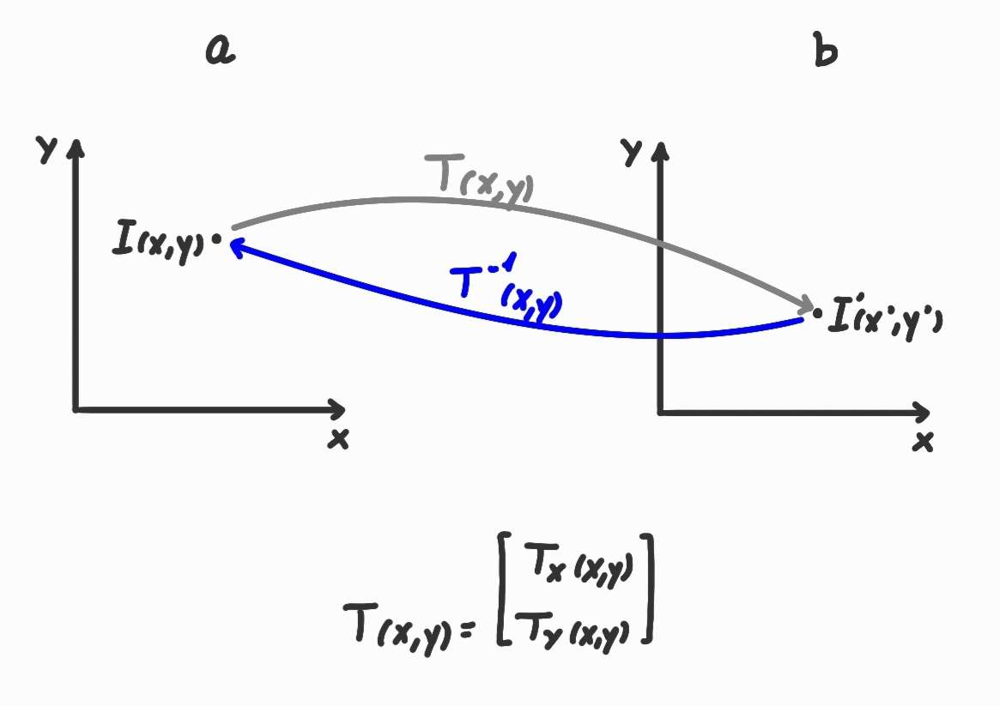

#### **Παραδείγματα:**
**Μετατόπιση**: μετακινέι κατά $(t_x,t_y)$
$$ \begin{bmatrix}  a_x \\ a_y \end{bmatrix} = \begin{bmatrix}  b_x \\ b_y \end{bmatrix} + \begin{bmatrix}  t_x \\ t_y \end{bmatrix} $$
**Κλιμάκωση**: μεγενθύνει κατά $(s_x,s_y)$
$$  \begin{bmatrix}  a_x \\ a_y \end{bmatrix} = \begin{bmatrix}  s_x & 0 \\ 0 & s_y \end{bmatrix} \cdot \begin{bmatrix}  b_x \\ b_y \end{bmatrix}  $$
#### Αφίνικοι Μετασχηματισμοί (affine transformation)
$$ \begin{bmatrix}  a_x \\ b_y \end{bmatrix} = \begin{bmatrix}  l_11 & l_12 \\ l_21 & l_22 \end{bmatrix} \cdot \begin{bmatrix}  b_x \\ b_y \end{bmatrix} + \begin{bmatrix}  t_x \\ t_y \end{bmatrix} $$

	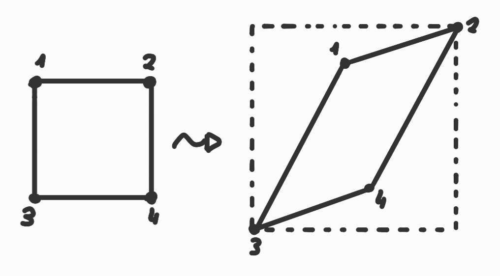

## Δειγματοληψία
Η δειγματοληψία είναι η διαδικασία με την οποία μια συνεχή εικόνα μετατρέπεται σε διακρική.
**Παράδειγμα 1D**, συνεχές αναλογικό σήμα:

	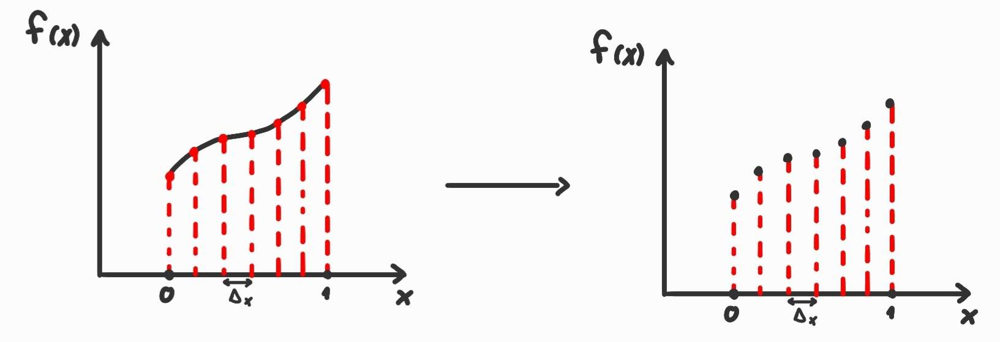

$$ \{f(x) \in \mathbb{R},~\forall x \in [0,1] \} \xrightarrow{\text{δειγματοληψία}} \{ f'(mΔx),~ m \in \{0,1,...,M\} \} $$
**Παράδειγμα 2D**, εικόνα:

	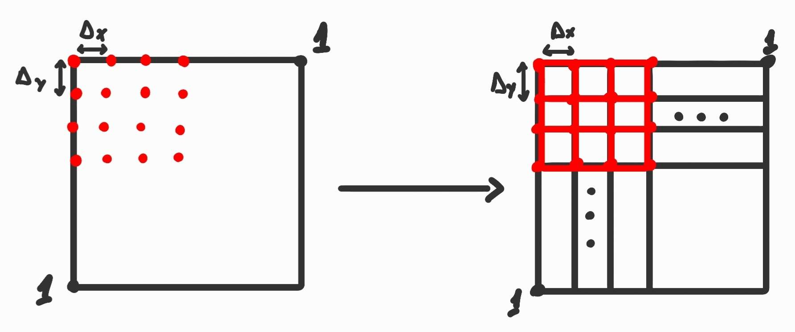

	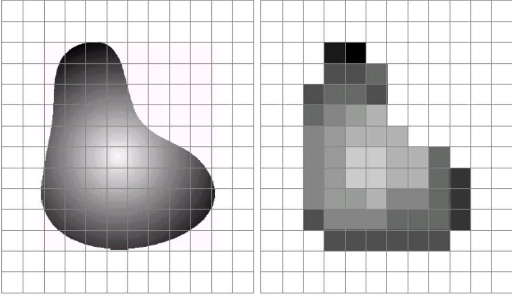

 $$ \{f(x,y),~\forall x,y \in [0,1] \} \xrightarrow{\text{δειγματοληψία}} \{ f'(mΔx,nΔy),~ m \in \{0,1,...,M\},~ n \in \{0,1,...,N\} \}  $$
#### Πυκνότητα Δειγματοληψίας
Πόσα δείγματα (pixels) παίρνουμε ανά μονάδα μήκους/επιφάνειας της συνεχούς εικόνας
Εξαρτάται από τις "λεπτομέριες" του σήματος:

	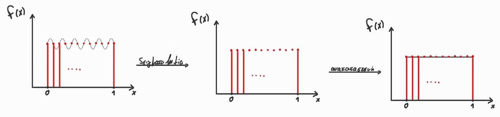

Όπως βλέπουμε στο παραπάνω σχήμα, σε περίπτωση που έχουμε δείγμα με πολλές λεπτομέριες και μικρή ανάληση δειγματοληψίας υπάρχει η περίτπωση η ανακατασκευή μας να είναι πολύ λανθασμένη. 
Σε εικόνες χρησιμοποιούμε γενικά την μονάδα μέτρησης *ppi (pixels per inch)*, όσο πιο ψηλό είναι αυτό, τοσο πιο πολλές λεπτομέρειες μπορούμε να εξάγουμε από μία εικόνα:

	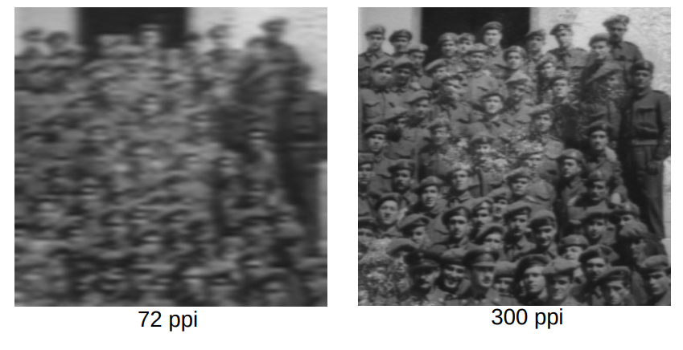

### Υποδειγματοληψία (Subsampling/Downsampling)
Μειώνω το πλήθος των δειγμάτων $\to$ μειώνω την ανάλυση
**Παράδειγμα 1D:**

	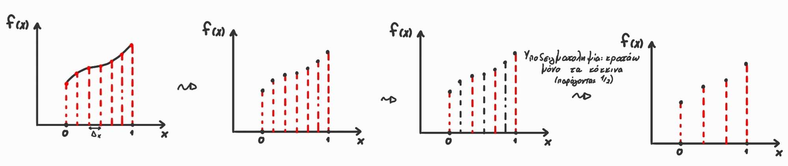

**Παράδειγμα 2D:**

	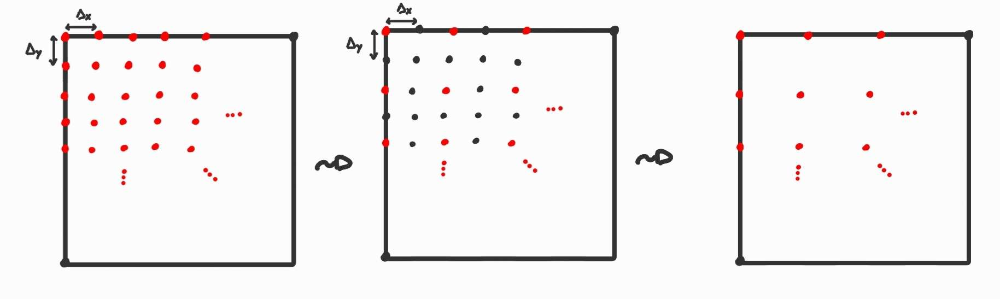

	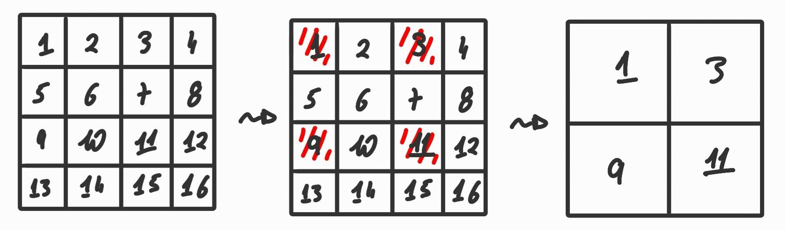

## Παρεμβολή (Interpolation)
Η διαδικασία υπολογισμού **ενδιάμεσων** τιμών για σημεία εικόνας που αντιστοιχούν σε υπάρχοντα δείγματα. Εφαρμόζεται σε περιπτώσεις μετασχηματισμού ή αλλαγή ανάλυσης που χρειαζόμαστε τιμές για **μη ακέραιες** συντεταγμένες.
**Παράδειγμα 1D:**

	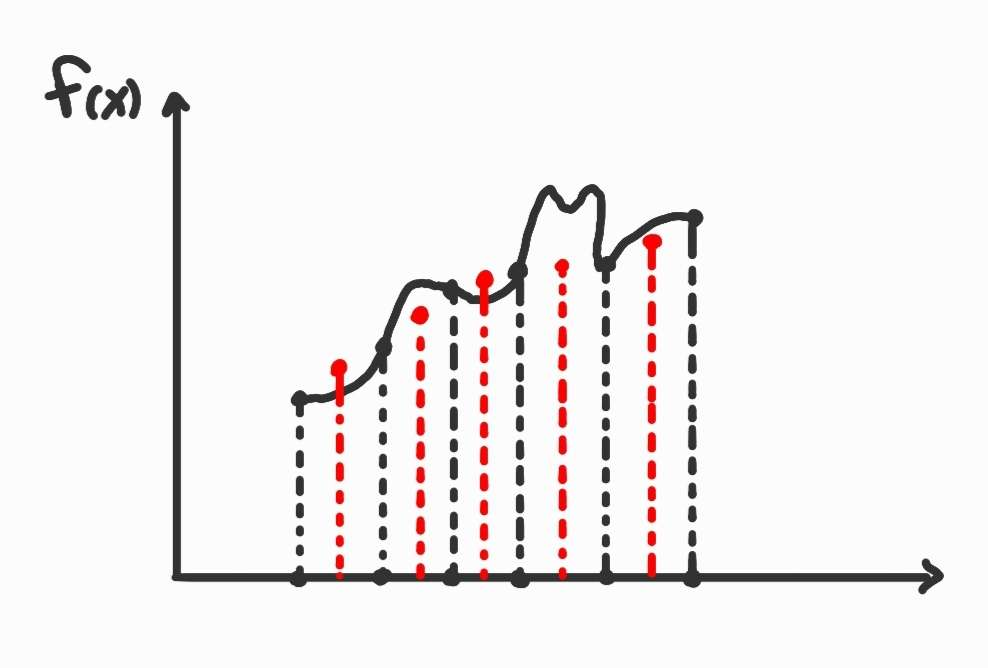

**Παράδειγμα 2D:**

	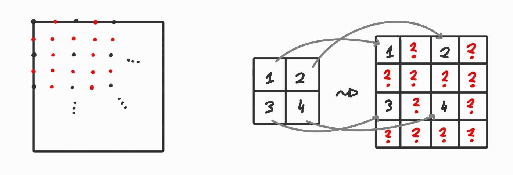

## Επαναδειγματοληψία (Resampling)
#### Υλοποίηση γεωμετρικού μεασχηματισμόυ μέσω **ευθή (forward) warping**
  Παιρνουμε κάθε pixel της αρχικής ιεκόνας και το προβάλλουμε στη νέα θέση στην έξοδο εφαρμόσοντας **ευθέως** τον μετασχηματισμό

	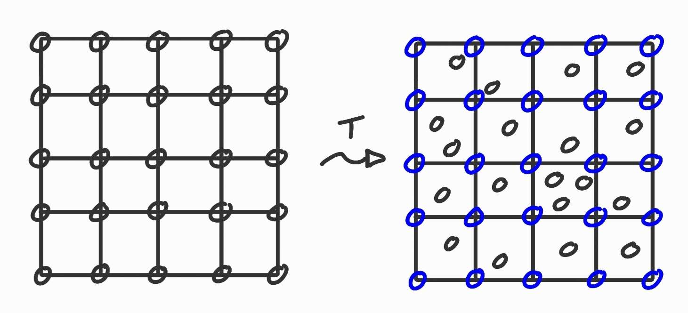

**Δεν** γεμίζει τέλει την έξοδο:
- Κάποια pixels μένουν κενά ("holes") επειδή δεν αντιστοιχεί ακριβως σε κάποιο pixel εισόδου εκεί
- Άλλα μπορούν να καλυφθούν δυο φορές (overlapping) αν διαφορετικά input pixels προβάλονται στο ίδιο output pixel

Για αυτόν τον λόγο χρησιμοποιείτε και το **αντίστροφο (backwards) warping**:
- Για κάθε pixel εξόδου $(x',y')$ υπολογίζουμε απο πια είσοδο προέρχεται:
$$ (x,y) = T^{-1}(x',y') $$
- Παίρνουμε την τιμή $I(x,y)$ από την είσοδο (με παρεμβολή) και την βάζουμε στο $(x',y')$

	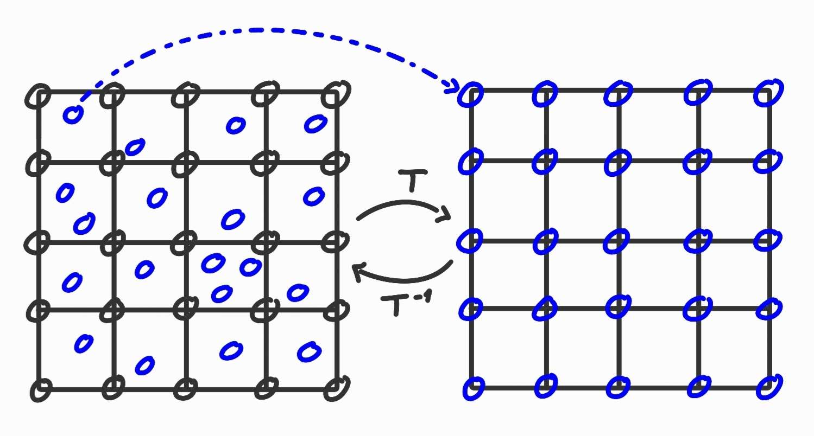

## Πώς κάνουμε υποδειγματοληψία σε εικόνες;
- Εφαρμόζουμε ένα φίλτρο για να απομακρύνουμε τις υψηλές συχνότητες.
- Εφαρμόζουμε τα παρακάτω βήματα:

	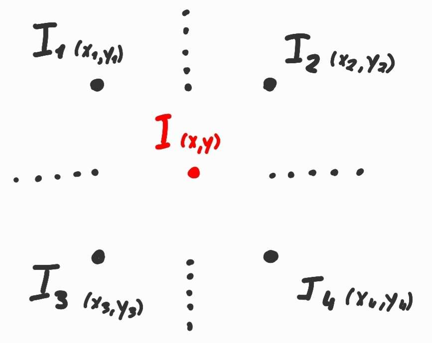

Ψάχνουμε την τιμή του $Ι$ 
Η ιδέα:
-  Σπάω το πεδίο ορισμού σε πολλες μικρές περιοχές
-  Σε κάθε μικρή περιοχή κατασκευάζω ένα μοντέλο ($f_{local}(x,y)$) που προβλέπει τις τιμές στη τοπική περιοχή
### 1. Παρεμβολή με το πλησιέστερο γείτονα
**1D:**

	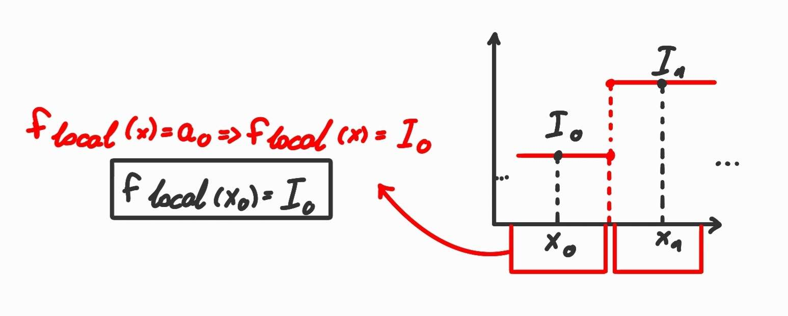

**2D:**

	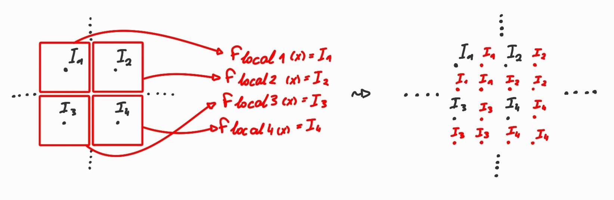

### 2. Διγραμμική παρεμβολή (Bilinear interpolation)
**1D:**

	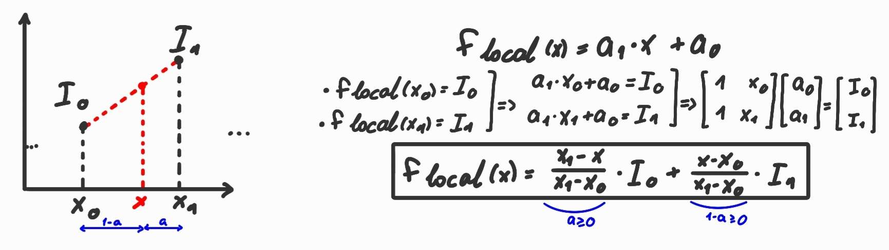

**2D:**

	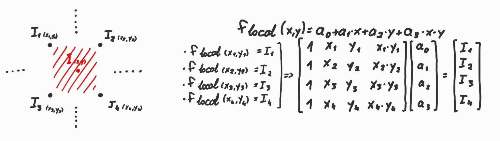

	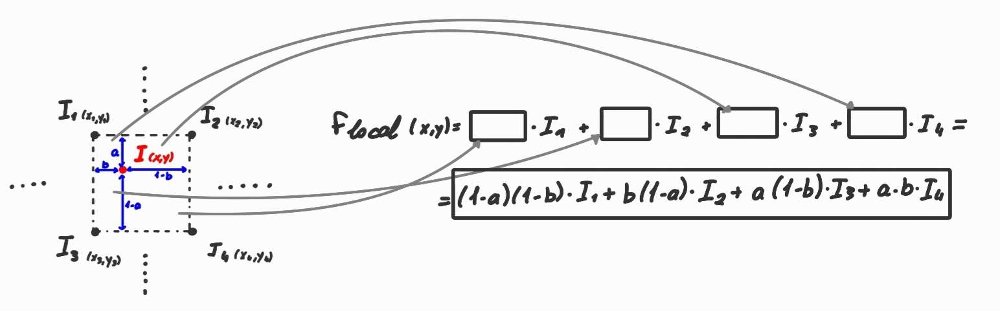

	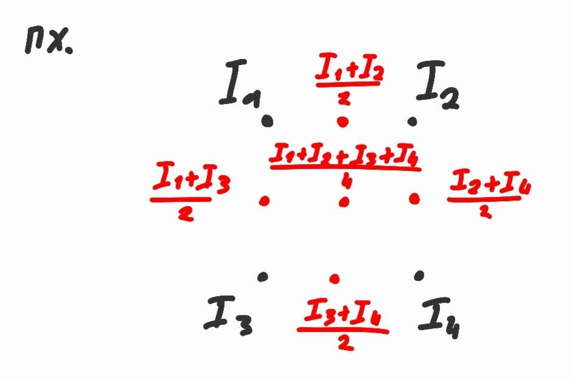

### 3. Δικυβική παρεμβολή (Bicubic)
**1D:**

	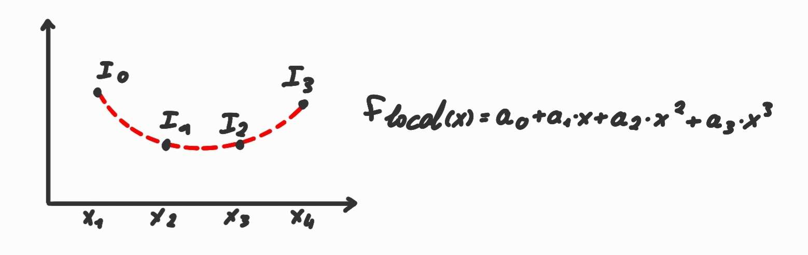

	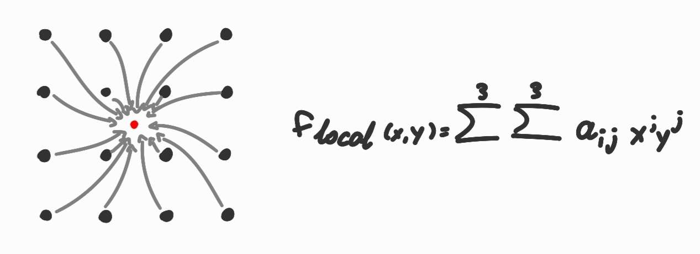

**Συνταγή:** 
τοπικό μοντέλο πρόβλεψης: πολυώνυμο χαμηλού βαθμού ως προς τα x, y
τοπική περιοχή: αυξάνω τα γνωστά δείγματα που καλύπτει
### 4. Το τέλειο μοντέλο
Υπάρχει τρόπος να έχω κάποιο μοντέλο παρεμβολής που εγγυημένα να μου δίνει σωστά αποτέλεσματα;
- Πυκνότητα-Δειγματοληψίας πρέπει να είναι αρκετά μεγάλη
- Ιδανική παρεμβολή: numerical
### 5. Νευρωνικά δίκτυα
$f_{flocal}$ : νευρωνικό δίκτυο
- ισχυρά μη γραμμικές συναρτήσεις
- εκκατομύρια παραμέτρους
τοπική περιοχή -> πολύ μεγαλύτερη