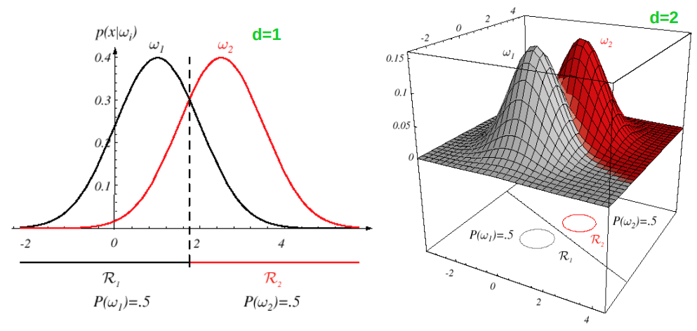
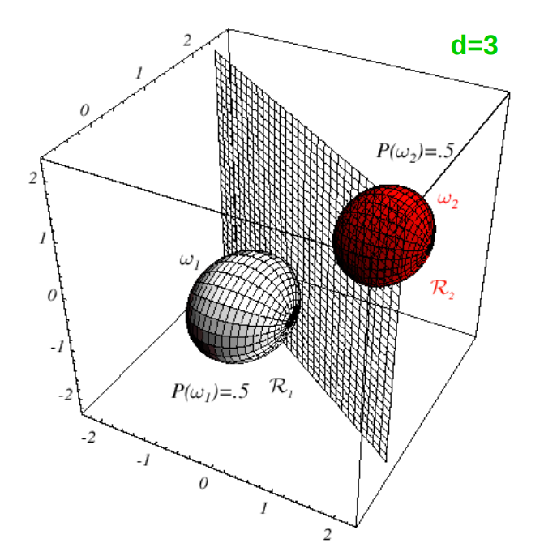
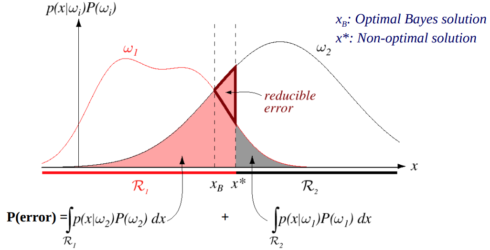

# HY473 - Αναγώριση Προτύπων
## Μπεϋζιανή Θεωρία Αποφάσεων

## Βασικά
Η Μπεϋζιανή Θεωρία Αποφάσεων (Baysian Decision Theory) είναι μια μέθοδος λήψης αποφάσεων που βασίζεται στην πιθανότητα και στο κόστος/όφελος των αποτελεσμάτων. Χρησιμοποιεί πιθανότητες πριν και μετά την επεξεργασία των δεδομένων για να αποφασίσει με ποιον τρόπο θα ελαχιστοποιηθεί το αναμενόμενο κόστος.

Ο γενικός στόχος είναι να επιλέξουμε ένα μοντέλο που μειώνει το συνολικό ρίσκο, λαμβάνοντας όμως υπόψη τα λάθη και τα αντίστοιχα κόστη τους.
Θεωρεί δεδομένα ότι:
- Τα προβλήματα διαχωρισμού μπορούν να εκφραστούν με πιθανότητες.
- Οι πιθανότητες και οι συναρτήσεις πιθανότητας είναι γνωστές.

Στην πράξη, αυτά τα δεδομένα σπάνια είναι πλήρως γνωστά.

### Πιθανότητες
Ας ξανα δούμε λίγο τους βασικούς συμβολισμούς από τις πιθανότητες

**1. $P(x)$: πιθανότητα ενός γεγονόντος / probability of an event**
  Στην Διακριτή περίπτωση: $$P(X=x)$$
  Δείχνει γενικά πόσο συχνά εμφανίζονται αυτά τα δεδομένα/ποια είναι η πιθανότητα η μεταβλητή $X$ να πάρει την τιμή $x$
**2. $p(x)$: συνάρτηση πυκνότητας πιθανότητας / Probability Density Function (PDF)**
  Χρησιμοποιείτε σε συνεχές τυχαίες μεταβλητές δηλώνει την συνάρτηση πυκνότητας πιθανότητας, δεν είναι από μόνο του πιθανότητα αλλά πυκνότητα, για να υπολογίσουμε την **πιθανότητα ($P(x)$)** λύνουμε:
  $$ P(a \leq X \leq b) = \int^a_b p(x) dx $$
**3. $P(x|C_k)$: Πιθανότητα δεδομένης της κλάσης / Likelihood**
  Η πιθανότητα να παρατηρήσουμε τα δεδομένα $x$ αν γνωρίζουμε ότι ανήκουν στην κλάση $C_k$
**4. $P(C_k|x)$: Posterior πιθανότητα**
  Η πιθανότητα η κλάση να είναι η $C_k$ δεδομένου ότι παρατηρήσαμε τα δεδομένα $x$. Το υπολογίζουμε με τον κανόνα Bayes όπως θα δούμε σε λίγο

## Μπεϋζιανός Κανόνας
Η πιθανότητα ενα δείγμα να ανοίκει σε μία κλάση αφού παρατηρήσουμε τα δεδομένα ονομάζεται μεταγενέστερη πιθανότητα (posterior probability) το συμβολίζουμε με:
$$ P(\omega_j~|~x) $$

Ο κανόνας bayes χρησιμοποιήτε για να υπολογίσουμε την πιθανότητα αυτή και συγκεκριμμένα με τον τύπο:

$$ P(\omega_j~|~x) = \frac{p(x~|~\omega_j) \cdot P(\omega_j)}{\sum_{i}p(x~|~\omega_i) \cdot P(\omega_i)} = \frac{p(x~|~\omega_j) \cdot P(\omega_j)}{p(x)} $$

Όπου:
- $P(\omega_j)$: Prior (Εκ των προτέρων πιθανότητα)
- $P(\omega_j~|~x)$: Posterior (Εκ των υστέρων πιθανότητα)
- $p(x~|~\omega_j)$: Likelihood (Πιθανοφάνεια)
- $\sum_{x \in X}p(x~|~\omega_j) \cdot P(\omega_j) = p(x)$: Evidence

Ο κανόνας Bayes διευκολύνει την εκτίμηση/υπολογισμό μεταγενέστερων πιθανοτήτων (αλλιώς δύσκολο να υπολογιστούν), δεδομένων προηγούμενων πιθανοτήτων, πιθανοφάνειας και αποδεικτικών στοιχείων.

## Κανόνας Απόφασης Bayes
Ο κανόνας ελαχιστοποίησης σφάλματος λέει:
$$ \text{Επέλεξε } ω_i \text{ αν: } P(ω_i | x) > P(ω_i|x),~\forall j \neq i $$
Που με απλά λόγια απλά σημαίνει: _Επέλεξε την κλάση με την μεγαλύτερη posterior πιθανότητα_ άρα την κλάση που είναι πιο πιθανή ισχύει δεδομένου ότι παρατηρήσαμε τα δεδομένα $x$

## Κόστος
Στην πράξη όλα τα λάθη έχουν διαφορετικά κόστη, για παράδειγμα το να κατηγορήσεις έναν ασθενή που έχει μία αρώστια με το να **μήν** έχει είναι πολύ χειρότερο από το αντίστροφο. 
Για αυτό έχουμε και έναν τρόπο που το αποτέλεσμα επηρεάζεται και από τα κόστη των λαθώς εκτός από απλά την πιθανότητα, συγκεκριμμένα:
- $\{ ω_1,ω_2,...,ω_c \}$: σύνολο κλάσεων
- $x = [x_1,x_2,...,x_d]^T$: διάνυσμα χαρακτηριστικών
- $\{a_1,a_2,...,a_k\}$: σύνολο ενεργειών (ο αριθμός ενεργειών $k$ δεν πρέπει να είναι ο ίδιος με τον αριθμός κλάσεων $c$)
- $\lambda(a_i|ω_j)$: κόστος της ενέργειας $a_i$ όταν η πραγματική κλάση είναι $ω_j$

Το κόστος $\lambda$ γενικά αναπαρηστάτε με έναν 2D πίνακα όπου οι γραμμές είναι οι ενέργειες και οι στήλες οι κλάσσεις, πχ:

$$ \lambda = \begin{bmatrix} 0 & 3 \\ 1 & 0 \end{bmatrix} $$

σημαίνει:
- $\lambda_{1,1} = 0$: το κόστος να επηλέξουμε την ενέργεια 1 αν έχουμε την κλάση 1 είναι 0
- $\lambda_{1,2} = 3$: το κόστος να επηλέξουμε την ενέργεια 1 αν έχουμε την κλάση 2 είναι 3
- $\lambda_{2,1} = 1$: το κόστος να επηλέξουμε την ενέργεια 2 αν έχουμε την κλάση 1 είναι 1
- $\lambda_{2,2} = 0$: το κόστος να επηλέξουμε την ενέργεια 2 αν έχουμε την κλάση 2 είναι 0

Δεσμευμένος κίνδυνος:
$$ R(a_i | x) = \sum^c_{j=1} \lambda (a_i | ω_j) \cdot P(ω_j | x) $$

Ο δεσμευμένος κίνδυνος λοιπόν είναι _η αναμενόμενη ζημιά για ένα συγκεκριμμένο $x$ αν επιλέξω την ενέργεια $a_i$_

Ο κανόνας Bayes θέτει να επιλέξουμε την ενέργεια που **ελαχιστοποιεί** τον δεσμευμένο κίνδυνο

Ολικός κίνδυνος:
$$ R = \int_{x \in X} R(a_k|x) \cdot p(x) dx $$
Ο ολικός κίνδυνος μετά είναι ο μέσος κίνδυνος πάνω σε όλα τα πιθανά δείγματα

Για να βρούμε τον τύπο της ταξινόμησης σε 2 κλάσεις, επιλέγουμε $ω_1$ αν
$R(a_1|x) < R(a_2|x)$, δηλαδή:

$$ \lambda_{11}P(ω_1|x) + \lambda_{12}P(ω_2|x) < \lambda_{21}P(ω_1|x) + \lambda_{22}P(ω_2|x) $$

Αναδιατάσσοντας και αντικαθιστώντας τα posteriors με τον κανόνα Bayes
(το $p(x)$ απαλείφεται), καταλήγουμε στο **likelihood ratio test**:

$$ \frac{p(x \mid \omega_1)}{p(x \mid \omega_2)} \underset{\omega_2}{\overset{\omega_1}{\gtrless}} \frac{\lambda_{12} - \lambda_{22}}{\lambda_{21} - \lambda_{11}} \cdot \frac{P(\omega_2)}{P(\omega_1)} $$

Το δεξί μέρος είναι ένας σταθερός **threshold** — αν το likelihood ratio
τον ξεπεράσει, επιλέγουμε $ω_1$, αλλιώς $ω_2$.

## Ταξινόμηση Ελαχίστου Σφάλματος (0-1 Loss)

Ειδική περίπτωση όπου όλα τα λάθη κοστίζουν το ίδιο:

$$ \lambda(a_i | ω_j) = \begin{cases} 0 & \text{αν } i = j \quad \text{(σωστή ταξινόμηση)} \\ 1 & \text{αν } i \neq j \quad \text{(λάθος ταξινόμηση)} \end{cases} $$

Τότε ο δεσμευμένος κίνδυνος γίνεται:

$$ R(a_i | x) = \sum_{j \neq i} P(ω_j | x) = 1 - P(ω_i | x) $$

Δηλαδή: ο κίνδυνος να επιλέξω την κλάση $i$ είναι ακριβώς η πιθανότητα
να κάνω λάθος — όλες οι άλλες κλάσεις εκτός της $i$.

Για να ελαχιστοποιήσω τον κίνδυνο, θέλω να ελαχιστοποιήσω το
$1 - P(ω_i | x)$, δηλαδή να **μεγιστοποιήσω** το $P(ω_i | x)$.

## Κατηγοριοποίηση Βάσει Συναρτήσεων Διαχωρισμού (Discriminant Functions)

Η συνάρτηση διαχωρισμού $g_i(x)$ δεν είναι παρά μία αντιστοίχιση μίας εισόδου $x$ σε μία κλάση, αποθηκέυει δηλαδή απλά την κλάση που επέλεξε ο Baeysian κανόνας:
$$ g_i(x) = P(\omega _i | x) = \frac{p(x~|~\omega_j) \cdot P(\omega_j)}{p(x)} $$

και επιλέγουμε πάντα το $i$ έτσι ώστε η posterior πιθανότητα να είναι μέγιστη:

$$ \text{Επέλεξε } g_i(x) \text{ αν } g_i(x) > g_j(x) ~\forall j \neq i,~j \in [1,c] $$

Αφού όμως το $p(x)$ είναι κοινό για όλες τις κλάσσεις $i$ δεν επηρεάζει ποια κλάση θα διαλέξουμε οπότε μπορούμε να το αφαιρέσουμε και να το απλοποιήσουμε:

$$ g_i(x) = p(x|\omega_i) \cdot P(\omega_i) $$

> Αν το $p(x|\omega_i)$ είναι Γκαουσιανό και έχει μορφή:
> $$ p(x|\omega_i) = \frac{1}{2\pi^{d/2}|\Sigma|^{1/2}} e^{\frac{1}{2}(x-μ_i)^T\Sigma^{-1}(x-μ_i)} $$
> Μπορεί να πάρει τιμές πολύ μικρούς αριθμός και να προκαλέσει *numerical underflow* όπου στρογγυλοποιήτε σε 0 εφόσον οι υπολλογιστές είναι πεπερασμένης μνήμης. Με την χρήση όμως του $\ln$ που είναι 1-1 και γνησίος αύξουσα συνάρτηση δεν αλλάζουμε το αποτέλεσμα και το $e^{.}$ φέυγει αφήνοντας μόνο τον εκθέτη και έτσι αποφέυγουμε τους πολύ μικρούς αριθμούς.
> $$ \boxed{g_i(x) = \ln p(x|\omega_i) + \ln P(\omega_i)} $$

Τα όρια μεταξύ των περιοχών είναι οι **επιφάνειες απόφασης** — το σύνολο των σημείων $\mathbf{x}$ όπου δύο συναρτήσεις δίνουν ίδια τιμή:

$$ g_i(\mathbf{x}) = g_j(\mathbf{x}) $$

Οι επιφάνειες αυτές δεν υπολογίζονται άμεσα, αλλά προκύπτουν γεωμετρικά από τις $g_i$ — είναι απλώς μια οπτική αναπαράσταση του κανόνα απόφασης στον χώρο.

## Gaussian likelihood
Άν το likelihood function ($P(x|C_k)$) ακολουθάει πολυδιάστατη Γκαουσιανή κατανομή

$$  p(x) \sim \mathcal{N}(μ, \Sigma) : p(x) = \frac{1}{2\pi^{d/2}|\Sigma|^{1/2}} e^{\frac{1}{2}(x-μ)^T\Sigma^{-1}(x-μ)} $$

Tότε η συνάρτηση διαχωρισμού θα έχει την μορφή:

$$ g_i(x) = -\frac{1}{2}\Bigl[ (x-μ_i)^T \Sigma_i^{-1} (x-μ_i) \Bigl] - \frac{d}{2} \ln 2\pi -\frac{1}{2} \ln |\Sigma_i| + \ln P(\omega_i) $$

Από αυτήν την γενική συνάρτηση μετά μπορούμε να έχουμε 3 διαφορετικές περιτπώσεις που εξαρτούνται από την μορφή που έχει ο $\Sigma_i$, συγκεκριμμένα:

### 1. $\Sigma_i = \sigma^2I$
Ο πίνακας συνδιακύμανσης $\boldsymbol{\Sigma}_i$ περιγράφει το σχήμα του σύννεφου δεδομένων της κλάσης $\omega_i$. Στην κύρια διαγώνιο βρίσκονται οι διακυμάνσεις $\sigma_j^2$ κάθε feature (πόσο "απλώνεται" το κάθε feature ξεχωριστά), και εκτός διαγωνίου οι συνδιακυμάνσεις $\sigma_{jk}$ (πόσο συσχετίζονται δύο features μεταξύ τους). Στην Περίπτωση 1 όπου $\boldsymbol{\Sigma}_i = \sigma^2\mathbf{I}$, ο πίνακας έχει $\sigma^2$ παντού στη διαγώνιο και 0 αλλού — άρα τα features είναι ανεξάρτητα μεταξύ τους και απλώνονται το ίδιο σε όλες τις διευθύνσεις, με αποτέλεσμα το σύννεφο δεδομένων να σχηματίζει τέλεια σφαίρα.

Τα χαρακτηριστικά είναι στατιστικά ανεξάρτητα και έχουν ίδια διακύμανση $σ^2$ σε όλες τις κλάσσεις. Τα δείγματα σχηματίζουν υπερσφαίρες ίσου μεγέθους.
Απλοποιημένη συνάρτηση διαχωρισμού:
$$ g_i(\mathbf{x}) = -\frac{1}{2\sigma^2}\left[\mathbf{x}^T\mathbf{x} - 2\boldsymbol{\mu}_i^T\mathbf{x} + \boldsymbol{\mu}_i^T\boldsymbol{\mu}_i\right] + \ln P(\omega_i) $$

Αλλά αφού ο όρος $\mathbf{x}^T\mathbf{x}$ είναι κοινός, η τελική μορφή θα είναι γραμμική:

$$ \boxed{g_i(\mathbf{x}) = \mathbf{w_i}^T \mathbf{x} + w_{i0}} $$

Όπου:

$$ \mathbf{w_i} = \frac{1}{\sigma^2}\boldsymbol{\mu}_i, \qquad w_{i0} = -\frac{1}{2\sigma^2}\boldsymbol{\mu}_i^T\boldsymbol{\mu}_i + \ln P(\omega_i) $$
 

Η επιφάνεια απόφασης θα είναι $\mathbf{w}^T(\mathbf{x}-\mathbf{x_0})=0$, όπου:

$$ \mathbf{w} = \boldsymbol{\mu}_i - \boldsymbol{\mu}_j, \qquad \mathbf{x_0} = \frac{1}{2}(\boldsymbol{\mu}_i + \boldsymbol{\mu}_j) - \frac{\sigma^2}{\|\boldsymbol{\mu}_i - \boldsymbol{\mu}_j\|^2} \ln\!\frac{P(\omega_i)}{P(\omega_j)}(\boldsymbol{\mu}_i - \boldsymbol{\mu}_j) $$

### 2. $\Sigma_i = \Sigma$
Στην Περίπτωση 2, ο πίνακας συνδιακύμανσης είναι ίδιος για όλες τις κλάσεις ($\boldsymbol{\Sigma}_i = \boldsymbol{\Sigma}$), οπότε όλα τα σύννεφα δεδομένων έχουν το ίδιο σχήμα και προσανατολισμό — διαφέρουν μόνο ως προς το κέντρο $\boldsymbol{\mu}_i$.

Οι πίνακες συνδιακύμανσης είναι αυθαίρετοι αλλά κοινοί για όλες τις κλάσεις. Τα δείγματα σχηματίζουν υπερελλειψοειδή ίδιου μεγέθους και σχήματος.
Η συνάρτηση διαχωρισμού παίρνει μορφή:

$$ g_i(\mathbf{x}) = -\frac{1}{2}\underbrace{(\mathbf{x}-μ_i)^T \Sigma^{-1}(\mathbf{x}-μ_i)}_{\text{Mahalanobis distance}} + \ln P(\omega_i) $$

\*Αφαιρούμε το $-\frac{1}{2}\ln|\Sigma_i|$ εφόσον είναι ίδιο για όλες τις κλάσεις

Όπως βλέπουμε ένα κομμάτι της καινούργιας μας συνάρτησης είναι η τετραγωνισμένη απόσταση *Mahalanobis*. Είναι ένας τύπος με τον οποίο υπολογίζουμε την απόσταση δύο σημείων που λαμβάνει και υπόψη την συσχέτιση των μεταβλητών. Άρα στην 2η περίπτωση επιλέγουμε την κλάση της οποίας το κέντρο είναι πιο κοντά στο $\mathbf{x}$ με βάση την απόσταση *Mahalanobis*.

Και η γραμμική μορφή:
$$ \boxed{g_i(x) = \mathbf{w_i}^Tx +w_{i0}} $$

Όπου:

$$ \mathbf{w_i} = \boldsymbol{\Sigma}^{-1}\boldsymbol{\mu}_i, \qquad w_{i0} = -\frac{1}{2}\boldsymbol{\mu}_i^T \boldsymbol{\Sigma}^{-1} \boldsymbol{\mu}_i + \ln P(\omega_i) $$

Η επιφάνεια απόστασης θα είναι όταν $\mathbf{w}^T(\mathbf{x} - \mathbf{x_0}) = 0$, όπου:
$$\mathbf{w} = \boldsymbol{\Sigma}^{-1}(\boldsymbol{\mu}_i - \boldsymbol{\mu}_j)$$

Η διαφορά με την πρώτη περίπτωση είναι ότι το $\mathbf{w} = \Sigma^{-1}(μ_i-μ_j)$, το υπερεπίπεδο ΔΕΝ είναι κάθετο στο διάνυσμα που συνδέει τα $μ_i$ και $μ_j$ (εκτός προφανός άμα ισχύει ταυτόχρονα και η πρώτη περίπτωση, δηλαδή $\Sigma = \sigma^2 I$)

### 3. όλες οι άλλες περιπτώσεις (διαφορετική για κάθε κλάση)
Κάθε κλάση έχει δικό της πίνακα συνδιακύμανσης
Τετραγωνική συνάρτηση διαχωρισμού:

$$g_i(\mathbf{x}) = \mathbf{x}^T \mathbf{w_i} \mathbf{x} + \mathbf{w_i}^T \mathbf{x} + w_{i0}$$
 
$$\mathbf{w_i} = -\frac{1}{2}\boldsymbol{\Sigma}_i^{-1}, \quad \mathbf{w_i} = \boldsymbol{\Sigma}_i^{-1}\boldsymbol{\mu}_i$$
 
$$w_{i0} = -\frac{1}{2}\boldsymbol{\mu}_i^T \boldsymbol{\Sigma}_i^{-1} \boldsymbol{\mu}_i - \frac{1}{2}\ln|\boldsymbol{\Sigma}_i| + \ln P(\omega_i)$$

## Πιθανότητες Σφάλματος
Όταν έχουμε δυο κλάσεις είναι πρωφανός ότι μπορούμε να κάνουμε δύο πιθανά σφάλματα:
1. το $\mathbf{x}$ ανήκει στο $R_1$ ενώ η αληθινή κλάση είναι $\omega_2$
2. το $\mathbf{x}$ ανήκει στο $R_2$ ενώ η αληθινή κλάση είναι $\omega_1$

$$ P(\text{error}) = \int_{R_1} p(\mathbf{x}|\omega_2)P(\omega_2)d\mathbf{x} + \int_{R_2} p(\mathbf{x}|\omega_1)P(\omega_1)d\mathbf{x} $$

