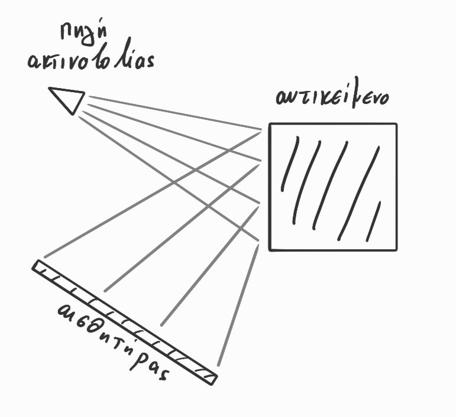
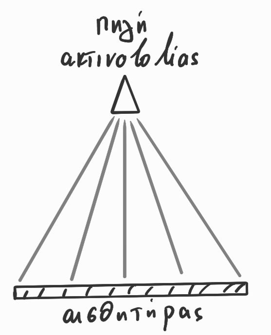

# ΗΥ371 - Ψηφιακή Επεξεργασία Εικόνων

- Εικόνα
  - Αναπαριστά την πραγματικότητα μέσω καταγραφής ακτινοβολίας
- Επεξεργασία Εικόνας
  - Βελτίωση της ποιότητας της εικόνας
  - Μετάδοση
  - Ανάλυση/ερμηνεία των εικόνων
- Τί είναι ψηφιακή εικόνα;
  - Πίνακας 2D 
    - τιμές φωτεινότητας
    - τιμές έντασης
  - Ανάλυση/resolution της εικόνας
    - μέγεθος του 2D πίνακα
  - Τιμές της έντασης/φωτεινότητας ενός pixel
    - bits/pixel, πχ:
      - 8 bits -> 0,1,...,7
      - 16 bits -> 0,1,...,15
  - Συιστώσες/κανάλια
    - κάθε κανάλι <-> ένας ξεχωριστός 2D πίνακας
    - πχ. σε RGB εικόνες έχουμε ένα κανάλι (άρα και πίνακα) ανα χρώμα (red, green, blue)
  - Αριθμός διαστάσεων εικόνας
    - εικόνα: 2D (πλάτος, ύψος)
    - video: 3D (πλάτος, ύψος, χρόνος)
- Σχηματισμός εικόνων
  - Εικόνες ανάκλασης
    - Πληροφορία για το χρώμα, υφή, σχήμα του αντικειμένου
      

        
      

    - πχ. φωτογριαφία φαγητού
  - Εικόνες εκπομπής
    - Πληροφορία για τη δομή ενός αντικειμένου
      

        
      

    - πχ. Αστρονομία
  - Εικόνες απορρόφησης
    - Πληροφορίες που αφορά την εσωτερική δομή του αντικειμένου
      

        
      

    - πχ. Φωτογρφία οστών με X-Ray
- Βασικοί αλγόριθμοι επεξεργασίας εικόνων
  - Σημειακούς μετασχηματισμούς έντασης
  - Χωρικούς μετασχηματισμούς έντασης
- Χώρος Συχνοτήτων
  - 2D μετασχχηματισμός fourier
  - φιλτράρισμα
  - Συμπίεση
- Πίο προχωρημένες τεχνικές επεξεργασίας
  - Μη-γραμμικοί αλγόριθμοι
  - Αλγόριθμος αφαίρεσης θορύβου
  - Αλγόριθμος αποκατάστασης εικόνων